# 🤖 AI内容自动化完整指南

## 📋 目录

1. [重新翻译已有新闻](#1-重新翻译已有新闻)
2. [获取中文AI教程](#2-获取中文ai教程)
3. [配置说明](#3-配置说明)
4. [常见问题](#4-常见问题)

---

## 1️⃣ 重新翻译已有新闻

### 问题
之前抓取的新闻都是英文，配置好Gemini API后想重新翻译。

### 解决方案

#### 步骤1：确认API密钥已配置
检查 `.env` 文件：
```bash
GEMINI_API_KEY_1="你的密钥1"
GEMINI_API_KEY_2="你的密钥2"  # 可选
GEMINI_API_KEY_3="你的密钥3"  # 可选
```

#### 步骤2：运行重新翻译脚本
```bash
npm run retranslate:news
```

#### 预期效果
```bash
🔄 Starting news retranslation...
📁 Found 41 news files

🤖 Retranslating: 2025-04-11-gpt-5ai.md
   Original title: GPT-5 AI...
✅ Translated: GPT-5 AI模型发布...
   Summary length: 85 chars
   Key points: 4

📊 Retranslation Summary:
   ✅ Translated: 25
   ⏭️  Skipped: 16 (已有翻译)
   ❌ Failed: 0
   📝 Total: 41

🔨 Rebuilding JSON index...
🎉 All done! Your news translations are updated.
```

### 功能特点

✅ **智能检测**：自动跳过已翻译的文章  
✅ **批量处理**：一次处理所有文章  
✅ **频率控制**：每次翻译间隔3秒，避免API限制  
✅ **自动构建**：完成后自动更新JSON索引  

### 翻译效果对比

**翻译前：**
```yaml
title: "It's not too late for Apple to get AI right"
title_zh: ""
summary_zh: ""
key_points: []
```

**翻译后：**
```yaml
title: "It's not too late for Apple to get AI right"
title_zh: "苹果在AI领域还来得及：Siri和深度生态仍有机会领先"
summary_zh: "尽管OpenAI推出ChatGPT应用平台，但苹果凭借更智能的Siri和深厚的生态系统优势，仍有机会在AI驱动的应用时代保持领先地位。文章分析了苹果的独特优势和潜在挑战。"
key_points: [
  "OpenAI发布ChatGPT应用平台挑战苹果",
  "Siri升级和生态整合是关键优势",
  "深度系统集成可创造独特体验",
  "时间窗口仍在但需加快行动"
]
```

---

## 2️⃣ 获取中文AI教程

### 新增功能
自动从中文科技媒体抓取AI教程、工具评测、行业动态等内容。

### 配置的中文源

#### AI教程类
- 📚 **机器之心**：AI领域专业媒体
- 🔬 **量子位**：人工智能科技媒体
- 💻 **AI科技大本营**：CSDN AI技术
- 📰 **InfoQ AI**：技术专题

#### AI工具类
- 🛠️ **少数派**：工具使用教程
- 📱 **爱范儿**：产品评测

#### AI行业类
- 💼 **36氪**：行业资讯
- 🚀 **极客公园**：创新报道

### 使用方法

#### 快速开始
```bash
npm run fetch:tutorials
```

#### 自定义配置
编辑 `config/ai-tutorial-sources.json`：

```json
{
  "sources": [
    {
      "name": "机器之心",
      "url": "https://rsshub.app/jiqizhixin/topic/ai",
      "category": "ai-tutorial",
      "language": "zh",
      "enabled": true
    }
  ],
  "settings": {
    "maxArticlesPerSource": 5,
    "daysToLookBack": 14
  }
}
```

### 输出结果

教程文件保存在 `content/ai-tutorials/` 目录：

```markdown
---
title: "ChatGPT实战：从入门到精通"
description: "详细介绍ChatGPT的使用技巧和实战案例..."
category: ai-tutorial
category_name: "AI教程"
tags: ["AI", "ChatGPT", "教程", "实战"]
language: zh
source: "机器之心"
---

## ChatGPT实战：从入门到精通

详细介绍ChatGPT的使用技巧和实战案例...

### 📖 内容概览
...

### 🔗 相关链接
- **来源**: 机器之心
- **原文链接**: [点击查看](...)
```

### 分类说明

| 分类 | 中文名 | 说明 |
|------|--------|------|
| `ai-tutorial` | AI教程 | 技术教程和指南 |
| `ai-tools` | AI工具 | 工具评测和使用 |
| `ai-industry` | AI行业 | 行业动态和资讯 |
| `ai-research` | AI研究 | 学术研究和论文 |

---

## 3️⃣ 配置说明

### Gemini API密钥获取

1. **访问Google AI Studio**
   ```
   https://aistudio.google.com/apikey
   ```

2. **创建API密钥**
   - 登录Google账号
   - 点击 "Create API Key"
   - 复制生成的密钥

3. **配置到 `.env`**
   ```bash
   GEMINI_API_KEY_1="AIzaSy..."
   GEMINI_API_KEY_2="AIzaSy..."  # 可选
   GEMINI_API_KEY_3="AIzaSy..."  # 可选
   ```

### 为什么需要多个密钥？

- 🔄 **轮流使用**：自动切换密钥
- ⚡ **避免限制**：免费版60次/分钟
- 🚀 **提高效率**：并发处理更快

### RSSHub说明

中文教程源使用RSSHub服务聚合内容。

**公共实例**（可能不稳定）：
- `https://rsshub.app`
- `https://rsshub.rssforever.com`

**自建实例**（推荐）：
```bash
# Docker方式
docker run -d --name rsshub -p 1200:1200 diygod/rsshub

# 然后修改配置中的URL
"url": "http://localhost:1200/jiqizhixin/topic/ai"
```

详见：https://docs.rsshub.app

---

## 4️⃣ 常见问题

### Q1: 重新翻译时提示API错误？

**A:** 检查以下几点：
1. `.env` 文件中API密钥是否正确
2. API密钥是否有效（访问https://aistudio.google.com 检查）
3. 是否触及频率限制（配置多个密钥）

### Q2: 中文教程获取失败？

**A:** RSSHub公共实例可能不稳定：
```bash
❌ Error fetching from 机器之心: timeout
   💡 Tip: RSSHub可能需要自建或使用其他实例
```

**解决方案**：
1. 尝试其他RSSHub实例
2. 自建RSSHub服务
3. 调整 `config/ai-tutorial-sources.json` 禁用有问题的源

### Q3: 翻译结果不满意？

**A:** 可以调整提示词：
编辑 `scripts/ai-service.js` 的新闻提示词部分：
```javascript
2. summary_zh: 用60-100字详细概括...
3. key_points: 提取3-5个关键要点...
```

修改字数要求或要点数量即可。

### Q4: 如何只翻译特定文章？

**A:** 修改 `scripts/retranslate-news.js`：
```javascript
// 在main函数中添加过滤
const files = fs.readdirSync(newsDir)
  .filter(f => f.endsWith('.md'))
  .filter(f => f.includes('2025-04'))  // 只处理4月的
  .map(f => path.join(newsDir, f));
```

### Q5: 教程内容如何显示在AI页面？

**A:** 需要集成到现有的AI sections：

1. 创建构建脚本 `scripts/build-ai-tutorials.js`
2. 在 `build:content` 中添加该脚本
3. 或直接合并到 `ai-news` 分类显示

---

## 📊 完整工作流程

### 新闻自动化流程

```mermaid
graph LR
    A[配置RSS源] --> B[运行fetch:news]
    B --> C[获取英文新闻]
    C --> D[Gemini翻译]
    D --> E[生成Markdown]
    E --> F[构建JSON]
    F --> G[网站显示]
```



### 教程自动化流程

```mermaid
graph LR
    A[配置中文源] --> B[运行fetch:tutorials]
    B --> C[获取中文内容]
    C --> D[生成Markdown]
    D --> E[分类保存]
    E --> F[集成显示]
```



---

## 🎯 最佳实践

### 定时任务
使用GitHub Actions或cron定时运行：

```yaml
# .github/workflows/fetch-news.yml
name: Fetch AI News
on:
  schedule:
    - cron: '0 2 * * *'  # 每天凌晨2点
jobs:
  fetch:
    runs-on: ubuntu-latest
    steps:
      - uses: actions/checkout@v2
      - run: npm install
      - run: npm run fetch:news
      - run: npm run fetch:tutorials
```

### 内容质量控制

1. **定期检查**：每周查看翻译质量
2. **手动润色**：重要文章人工审核
3. **删除重复**：去除低质量内容
4. **更新配置**：调整抓取源和参数

### 存储优化

```bash
# 定期清理旧内容
find content/ai-news -name "*.md" -mtime +90 -delete

# 或归档到历史目录
mkdir -p content/archive/2024
mv content/ai-news/2024-*.md content/archive/2024/
```

---

## 📚 相关文档

- [AI新闻自动化系统.md](./AI新闻自动化系统.md) - 原始文档
- [SETUP_GUIDE.md](./SETUP_GUIDE.md) - 功能配置指南
- [NEW_FEATURES.md](./NEW_FEATURES.md) - 新功能说明

---

## 🆘 获取帮助

遇到问题？
- 📖 查看本文档
- 💬 提交GitHub Issue
- 📧 联系技术支持

---

**最后更新**: 2025-01-12  
**版本**: v1.0.0
