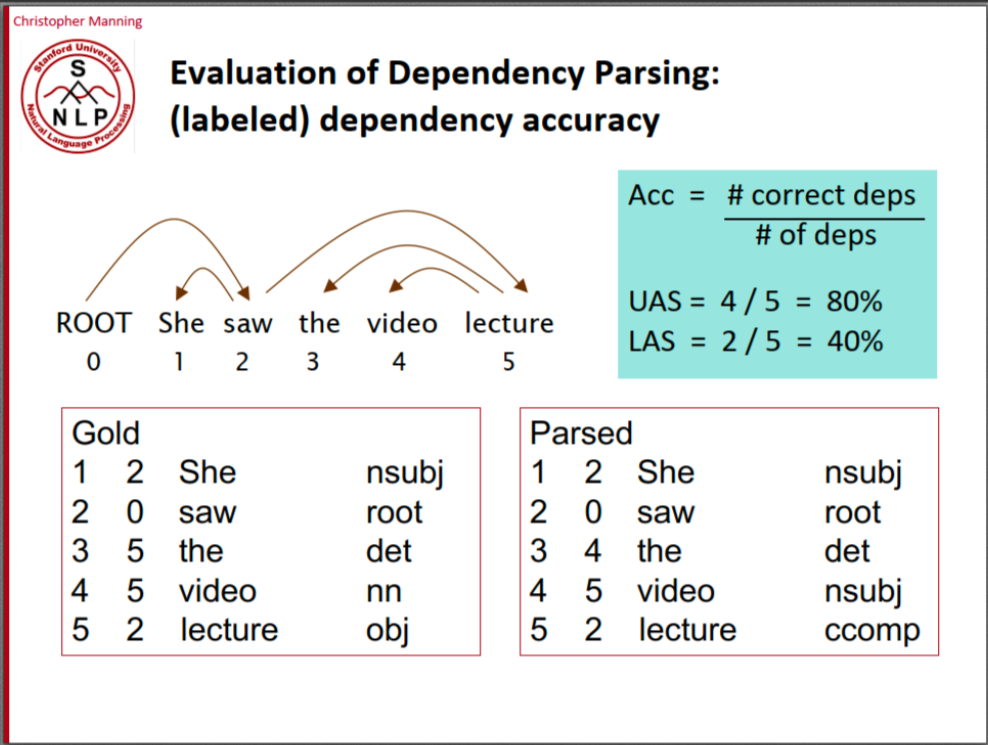
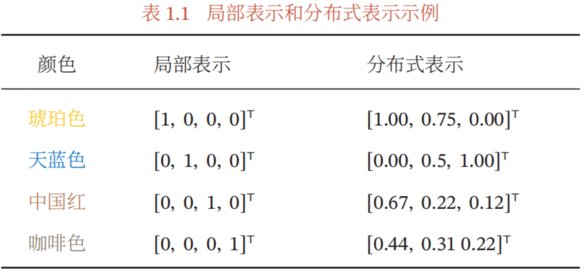
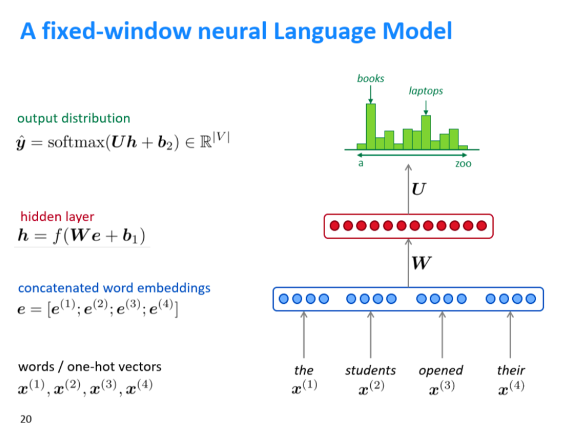

# LLM 学习笔记

# 自然语言处理与语言模型 NLP & Language Model，LLM

## 为什么机器这么难理解人类语言？​

可以去回想 2.1.1 中我们提到过的语义鸿沟的概念。

人类自然语言的多样性、灵活性、歧义性、上下文依赖性、语言的变化以及世界知识和常识的应用等因素都使得让机器难以理解人的自然语言：​

<mark style="background-color: #C7D5F6">1.多样性和灵活性：包括语法、词汇、语义、上下文等方面。</mark>同一个词汇在不同语境中可能有不同的含义，例如“他被杀死了”的“死”和“笑死我了”的死完全是两个含义。人们还经常使用讽刺、隐喻、比喻、口语和俚语等非字面意义的表达方式，比如“潘帕斯雄鹰真是这场盛典中的一匹黑马”，潘帕斯雄鹰指的是阿根廷队而不是一个动物，盛典指的是世界杯，黑马是比喻阿根廷队取得了超乎我们预期的表现。人是可以理解这些语言的，但机器想理解这些就非常困难。

<mark style="background-color: #C7D5F6">2.语言的歧义性：自然语言中存在丰富的歧义现象，包括词义歧义、语法歧义、指代歧义等。</mark>例如，英语中的词汇"bank"可以表示银行，也可以表示河岸，其含义取决于上下文，这是词语歧义；The animal didn't cross the street because it was too tired，对于机器来说，这里的 it 可以指代 animal，也可以指代 street。这是一种指代歧义。这种歧义性对于机器来说是一个挑战，因为需要具有推理和语境理解能力才能够正确解析歧义。

<mark style="background-color: #C7D5F6">3.上下文依赖性：人类自然语言中的表达通常依赖于上下文信息。</mark>例如，尽管大多数时候 terribly 的意思是负面的，但 The movie is terribly exciting 中，terribly 的意义就是积极的。

<mark style="background-color: #C7D5F6">4.世界知识和常识：人类在语言交流中经常依赖于世界知识和常识，即我们对世界的认知和经验。</mark>当我们说"我要花 30 元去伦敦看电影"时，我们知道电影是什么，知道伦敦是个地名，知道 30 是个数字而元是货币单位。这种世界知识和常识对于理解自然语言是至关重要的，但对于机器来说，获取和应用这些知识是一项复杂的任务。

## NLP 的基本任务

### 文本分类 Text Classification

将文本分为不同的预定义类别，例如情感分类（积极情感还是消极情感，是否具有攻击性和恶意）、主题分类、垃圾邮件分类等。

### 命名实体识别 Named Entity Recognition, NER 

命名实体识别（Named Entity Recognition, NER）是自然语言处理（NLP）中的一种任务，旨在识别文本中具有特定命名实体的片段，如人名、地名、组织名、时间、日期、货币、数量等。（陈先生和陈醋和陈仓里的陈是不一样的，我们希望机器能知道陈先生是人名，陈醋是个物品，陈仓是个地名，这样模型去做自然语言任务的性能才会提高）<mark style="background-color: #FBBFBC">NER是许多NLP应用中的重要预处理步骤</mark>。

NER通常可以分为以下几种类型：​

1.人名（Person）：识别文本中的人物名称，如"John Smith"、"张三"等。

2.地名（Location）：识别文本中的地理位置名称，如"New York"、"北京市"等。

3.组织名（Organization）：识别文本中的组织、公司、机构名称，如"Microsoft"、"中国科学院"等。

4.时间（Time）：识别文本中的时间信息，包括日期、时间、季节等，如"2021年10月1日"、"下午3点"等。

5.日期（Date）：识别文本中的日期信息，如"2021-10-01"、"10/01/2021"等。

6.货币（Currency）：识别文本中的货币信息，如"100美元"、"500元人民币"等。

7.数量（Quantity）：识别文本中的数量信息，如"3个苹果"、"10米长"等。

<mark style="background-color: #FAF390">NER任务通常采用监督学习方法，其中标注了已知命名实体类型的大规模标注数据用于训练模型。</mark>

### 句法分析  Dependency Parsing

Dependency Parsing是指对句子进行语法分析并画出句子成分的依赖关系，比如对于句子“She saw the video lecture”，首先可以分析出主语、谓语、宾语等句子成分；其次可以分析出依赖关系，比如saw依赖于She等。这就是句法分析。

### 语言生成 Language Generation

* <mark style="background-color: #C7D5F6">语言生成（Language Generation）是自然语言处理（NLP）领域中的一种任务，指的是使用计算机生成自然语言文本的过程。</mark>
* 语言生成可以应用于多种应用场景，如机器翻译、文本摘要、对话系统、自动生成文章、生成代码、音乐和艺术创作等。

*语言生成方法可以分为以下几种（*<mark style="background-color: #FBBFBC">*我们主要涉及到3和5*</mark>*）*：​

1. 基于规则（Rule-based）生成：通过预定义的规则和模板来生成文本。这种方法通常适用于生成简单的文本，如问候语、固定格式的消息等，但对于复杂的文本生成任务来说，Rule-based 方法的扩展性有限。
2. 基于统计（Statistical-based）生成：使用统计模型来生成文本，如n-gram语言模型、隐马尔可夫模型（HMM）等。这种方法通过统计文本数据中的频率和概率信息，生成文本序列，但可能会受限于数据的数量和质量。
3. 基于机器学习（Machine Learning-based）生成：使用机器学习算法来生成文本。例如，循环神经网络（Recurrent Neural Networks, RNNs）和变种（如长短时记忆网络，LSTM）被广泛用于生成文本，因为它们能够处理序列数据和捕捉上下文信息。
4. 基于深度学习（Deep Learning-based）生成：使用深度学习模型来生成文本，如变种的生成对抗网络（Generative Adversarial Networks, GANs）和变分自编码器（Variational Autoencoders, VAEs）。这些模型通常能够生成更复杂和高质量的文本，但需要大量的训练数据和计算资源。
5. 基于预训练模型（Pre-trained Model-based）生成：利用预训练的模型，如GPT-3、BERT等，来生成文本。这些模型通过大量的无监督训练从大规模文本数据中学习到了丰富的语言知识，可以生成高质量且多样性的文本。

## 语言模型 Language Model 定义

在不同的文章和材料中会看到对语言模型的不同定义，这可能会让人有些疑惑，不过下面我们都会讲清楚的。

### 估计一个给定词序列在语言上的合理性或者说概率

首先，对于任意的词序列，语言模型能够用计算出这个词序列是一句话的概率。

这其实是语言模型最早的功能，它的起源其实是 Speech Recognition，即语音转文字！从音频转到文字的时候，会有很多个句子作为候选。那么哪个句子更合理？这种时候我们就可以用语言模型，对这些句子 Make Sense 的概率做一个排序。这时候，对于语言模型的定义为：语言模型（Language Model）是一种用于生成自然语言文本的概率模型。它可以估计一个给定文本序列（通常是一个句子或者一个短语）在语言上的合理性或者说概率：​

给定一个词典$V$，可以计算对于任意单词$ω_1\in V$，词序列$\omega_1,\omega_2,\omega_3,……，\omega_n$是一句 Make Sense 的句子的概率：​

$P(S)=P(\omega_1,\omega_2,\omega_3,……，\omega_n)$

6.3.2根据先前的文本序列预测下一个词，从而实现文本生成

当然，现在我们知道语言模型真正在做的事情是下一个词的预测和输出了。

最常见的的语言模型大概就是手机输入法，它能根据你当前输入的内容提示下一个字或者词。

不过这其实和上面的定义是一脉相承的。如果我们能预测词序列$\omega_1,\omega_2,\omega_3,……，\omega_n$是一句 Make Sense 的句子的概率，那么我们自然也可以去预测词序列$\omega_1,\omega_2,\omega_3,……，\omega_n,\omega_{n+1}$是一句 Make Sense 的话的概率。这样的话，已知$\omega_1,\omega_2,\omega_3,……，\omega_n$，不就可以去选择一个$\omega_{n+1}$了吗？​

**我们这么补充语言模型的定义：**语言模型可以根据先前的文本序列预测下一个可能出现的词或者字符，从而生成新的文本。如果是以已有的全部词序列为预测依据，那么，语言模型就是在求：$P(\omega_i|\omega_1,\omega_2,……，\omega_{i-1};\theta)$

那么，语言模型的目标函数（损失函数）就变成了一个我们非常熟悉的东西<mark style="background-color: #FBBFBC">（2.2.2.1）</mark>：​

<mark style="background-color: #F2F3F5">还记得交叉熵损失函数吗？它就是模型理应输出 1 的那一维向量的元素的负对数。</mark>

其中，$\large u$是巨大无比的语料库（Corpus），$\omega$是一个个的词语，$\theta$是模型的参数。我们训练语言模型的目的，就是在于调整参数，让模型接受这段话前面的词语们，尽量根据语料库，输出下一个词语. 

<mark style="background-color: #FBBFBC">所以，本质上语言模型就是一个基于概率的自回归填字游戏。</mark>

6.3.3我们期待语言模型能有怎样的表现？​

现在我们用$V$表示一个词典：$V=[猫\  狗\  在\ 卧室\ 书房\ 吃\ 肉\ 鱼\ 黑\ 白\ 黄\ 紫]$，那么：​

例如，对于： $\begin{cases} 
s_1:{猫 | 在 | 卧室 | 吃 | 鱼 }  \\ 
s_2:{狗 | 在|书房 | 吃| 肉} 
\end{cases}$，应该要有： $P(s_1)\approx P(s_2)$，因为猫和狗是相似的，卧室和书房是相似的，鱼和肉也是相似的。

我们希望语言模型有足够的泛化能力。

对于：$\begin{cases} 
s_1:{猫 | 在 | 卧室 | 吃 | 鱼 }  \\ 
s_2:{猫 | 在|书房 | 吃| 肉} 
\end{cases}$ ，我们当然还是希望： $P(s_1)\approx P(s_2)$，因为没人规定猫只能在卧室，不能在书房。

对于：$\begin{cases} 
s_1:{黑 | 猫 }  \\ 
s_2:{白 | 猫} 
\end{cases}$ ，我们自然也希望： $P(s_1)\approx P(s_2)$，因为猫确实可以有很多颜色。

但是我们也不希望语言模型太过于“灵活”发散：​

对于：$\begin{cases} 
s_1:{猫 | 在 | 卧室 | 吃 | 鱼 }  \\ 
s_2:{狗 | 在|书房 | 吃| 鱼} 
\end{cases}$，我们就不希望： $P(s_1)\approx P(s_2)$了！！因为狗真的不至于吃鱼！（有人跟我说他们家的狗就是爱吃鱼，但是无所谓了！！) ​

对于：$\begin{cases} 
s_1:{黑 | 猫 }  \\ 
s_2:{紫 | 猫} 
\end{cases}$  我们就不希望： $P(s_1)\approx P(s_2)$了！！因为猫真的不大可能是紫色！​

我们希望语言模型可以根据上下文发现词汇之间是相似的。

* 如果“NLP”和“自然语言处理”在语料中的上下文很像，那么语言模型就应该能发现，NLP 和自然语言处理是一个意思。人类很容易就可以理解 NLP 就是自然语言处理，但是对于机器来说，这必须得学习自他们相似的上下文。
* 同样的，如果我们已知了 NLP 和自然语言处理这两个词是一样的，那么它们的上下文应该也是相似的。

我们还可以做一些有意思的类比实验来测试语言模型的能力。

词嵌入 Word Embedding

这里可以回想1.4.1.2中我们提到的特征，还有1.5.1～1.5.3中我们提到的表征、局部表征和分布式表征。

还记得这张图吗？颜色用RGB来表示很天经地义，让这个例子很好理解。其实对于词语来说，也一样的！​

6.4.1One-hot向量

早期的NLP常用one-hot编码来表示词向量，假如词典中共有10000个词，则这个one-hot向量长度就是10000，该词在词典中所处位置对应的值为1，其他值为0。

<mark style="background-color: #C7D5F6">在自然语言处理中，Token（词元）通常指的是将句子或文本拆分成单个独立的单词或标点符号。这个过程称为分词或标记化，它是自然语言处理中的一项重要预处理任务。</mark>

猫｜在｜卧室｜吃｜鱼 就是一个拆分成词元的过程。

<mark style="background-color: #FAF390">在表示英文的时候，Token（词元）和单词不一样，Token是一个比单词更小的分割单位。</mark>

例如，如Her words interested me a lot，这里的word加了一个s就可以衍生出一个words，interest这个单词也可以变成过去式interested（这也可以是个形容词，of course），加了ing也可以变成进行时或者另一个形容词。如果给每一种衍生方式都单独编码，增加one-hot向量的维数，那么就太麻烦了。相比之下，不如只记录word，interest，s，ed，ing这几个Token。

具体可以参考：[CS224N(2.14)Subword Models | bitJoy](https://bitjoy.net/2020/02/17/cs224n%ef%bc%882-14%ef%bc%89subword-models/)。Subword Model是一个挺有意思的NLP研究方向，不过我们这里不打算详细介绍，我们只要懂它的思想原理就行。

one-hot表示方法虽然简单，但其有诸多缺点：​

1. 词典中的词是不断增多的，比如英语，通过对原有的词增加前缀和后缀，可以变换出很多不同的词，one-hot编码会导致向量维度非常大，且每个向量是稀疏的；​
2. 不同词的one-hot编码向量是正交的，在向量空间中无法表示近似关系，即使两个含义相近的词，它们的词向量点积也为0。

6.4.2词嵌入 Embedding

词嵌入就和用RGB表示颜色一样，用维度有限的稠密的向量来表示所有的词汇。不过词嵌入一般不会只用3维向量。传统的Transformer中，词嵌入有512维；BERT中，词嵌入有768维和1024维两个版本。

此外，词嵌入中的向量的元素数字好像会更加意义不明。RGB我们知道代表三种颜色各自的灰度，但是词向量中的数字，恐怕除了计算机外就没有人能看懂了。

<mark style="background-color: #FAF390">我们通过把One-hot向量通过一个权重矩阵投射到词嵌入里。</mark>

例如，对于一个有3000个词汇量的词典$V$，每一个词都是3000维的一个稀疏向量。对于每一个词，我们给他乘一个3000*512的权重矩阵，最终就得到一个512维的向量了。

> ***Hey ChatGPT,一个3000维的one-hot向量，我们乘以一个3000*512的稠密的权重矩阵，会得到一个怎样的结果？​***
> **ChatGPT:**如果将一个3000维的one-hot向量乘以一个3000×512的稠密权重矩阵，得到的结果将是一个512维的向量。具体地说，one-hot向量是一个在3000维中只有一个元素为1，其余元素为0的向量。假设这个one-hot向量的第i维为1，<mark style="background-color: #FBBFBC">**那么乘以权重矩阵的结果将是该权重矩阵的第i列**</mark>。"因此，乘法的结果将是权重矩阵中的第i列，是一个512维的向量。"
> 这样的操作通常被用于将离散的one-hot编码表示转换为连续的稠密向量表示，从而可以输入到深度学习模型等需要连续向量输入的场景中。这种转换可以帮助模型更好地学习特征和模式，并在许多自然语言处理（NLP）任务中得到广泛应用，例如词嵌入（word embeddings）、文本分类、语言生成等。" 

<好啦，ChatGPT其实讲的很清楚了！权重矩阵本身是一个可以供One-hot向量查询的表，3000维的one-hot向量，每一个词对应3000行权重矩阵的一列，而权重矩阵的一列就是一个512维的列向量了～>

下面这段文字可以让我们更好的理解这件事。以后我们经常会碰到几个Embedding相加的事情（BERT：谁cue我？），如果好奇为什么词嵌入可以相加，那就回来看看这里吧！​

> <mark style="background-color: #FAF390">“Embedding的数学本质，就是以one hot为输入的单层全连接。世界上本没什么Embedding，有的只是one hot。”​</mark>
> [词向量与Embedding究竟是怎么回事? - 科学空间|Scientific Spaces](https://kexue.fm/archives/4122)

6.4.3Word2vec及其训练方式

<mark style="background-color: #C7D5F6">Word2vec是2013年发表的一项可以实现从One-hot到词嵌入的自然语言处理技术，它使用一个两层的神经网络模型，从大型的文本语料库中学习单词关联，将自然语言中的单词转换为数学向量。</mark>它可以将单词之间的关系表示为向量空间中的距离和方向，从而使得单词的语义信息可以用数学方式表示和处理。

还记得6.3.3里，我们提到的对语言模型所有的期待吗？Word2Vec模型就是实现我们的期待的一种方式！Word2Vec能用向量来表示各种词元，可以用余弦相似度表明这些向量所代表的单词之间的语义相似程度、检测出同义词；可以为部分句子建议额外的词、捕捉到单词的语义和句法质量。

Word2vec的应用非常广泛，它获得单词级别的向量表示可以用于各种下游任务，例如用于语义分析、文本分类、机器翻译等NLP任务中。<mark style="background-color: #FAF390">显然，单词级别的向量表示这件事情在各种NLP任务中都具有极高的通用性，训练出来的一个性能足够好的Word2vec并将其开源的话，大家就可以不用重复造轮子，而是一起用这个好用的模型了。</mark>

<mark style="background-color: #FBBFBC">后面（8.1.5）会提到，word2vec可以说是NLP中的迁移学习的祖师爷</mark>！不过目前我们还没必要去管迁移学习这个名词，只要知道这是一个通用性非常强的工作，为各种NLP任务都提供了很好的帮助，就可以了！​

> Word2vec的作者Tomas Mikolov在Google工作期间，将word2vec的代码公开发布在了Google Code上。随着时间的推移，word2vec代码也逐渐迁移至GitHub上，并成为了开源社区中的一个重要项目。现在，大部分深度学习框架都提供了对word2vec模型的支持，因此使用和实现word2vec已经变得非常方便。

<mark style="background-color: #FBBFBC">***Word2vec的训练方法有两种：CBOW和Skip-gram。***</mark>

> 前文提到：​
> * <mark style="background-color: #C0ECBC">如果“NLP”和“自然语言处理”在语料中的上下文很像，那么就可以推理出，NLP和自然语言处理是相似的。</mark>
> * 同样的，如果我们已知了NLP和自然语言处理这两个词是一样的，那么它们的上下文应该也是相似的。
> * 这两种思维分别对应了CBOW和Skip-gram。

**连续词袋 CBOW Continuous Bag of Words：**CBOW模型根据上下文单词的平均向量来预测中心单词。不展开。

**Skip-gram：**Skip-gram模型会根据一个中心单词来预测它周围的上下文单词。不展开。

根据论文的作者（[proceedings.neurips.cc](https://proceedings.neurips.cc/paper/2013/file/9aa42b31882ec039965f3c4923ce901b-Paper.pdf)、[arxiv.org](https://arxiv.org/pdf/1301.3781.pdf%C3%AC%E2%80%94%20%C3%AC%E2%80%9E%C5%93)），CBOW训练速度更快，而Skip-gram在出现频率更少的单词上的预测上表现更好。

<mark style="background-color: #F9D8B1">在Tomas Mikolov的工作下，从16亿个单词的数据集中学习高质量的单词向量只需要不到一天的时间。COOL！​</mark>

6.5基于统计方法的语言生成：N-gram模型

6.5.1条件概率的链式展开

前面提到，语言模型要做到预测下一个词的生成概率$P(\omega_i|\omega_1,\omega_2,……，\omega_{i-1})$。这无疑是一个可以用链式展开的条件概率去求的东西：​

$P(S)=P(\omega_1,\omega_2,……，\omega_{i})=P(\omega_1)P(\omega_2|\omega_1)P(\omega_3|\omega_1，\omega_2)……P(\omega_i|\omega_1，\omega_2,……\omega_{i-1})$

而后，利用$P(\omega_1,\omega_2,……，\omega_{i})$和$P(\omega_1,\omega_2,……，\omega_{i-1})$，我们就可以求出$P(\omega_i|\omega_1，\omega_2,……\omega_{i-1})$了。好吧，这根本没法算！​

6.5.2马尔科夫假设

一个简化的思路是去假设<mark style="background-color: #C7D5F6">一个词的出现不依赖于前面的全部词，而是仅仅依赖它前面的几个词，我们称这样的假设为马尔科夫假设。以三元语言模型（Trigram）</mark>为例，如果一个词的出现仅依赖于它前面出现的两个词，那么我们就称之为三阶马尔科夫假设，对应的语言模型就是三元语言模型：​

$P(S)=P(\omega_1)P(\omega_2|\omega_1)P(\omega_3|\omega_1，\omega_2)……P(\omega_i|\omega_{i-2} ,\omega_{i-1})$

这样就好算很多了。实践中常用的是3、4元模型，因为n太大语言模型的效果提升不显著，可是模型的参数量却会指数暴增。

6.5.3n-gram语言模型的局限性

n-gram语言模型存在许多局限性：​

1. 只能提取将要生成的词语的前2～3个词的信息，做不到更多。然而，整个文本序列中，对于预测下一个词重要的信息绝对不只是这2～3个词，很多时候一个句子里面都存在长距离依赖关系。例如，The books of the famous writer的下一个词应该是“are”，但是如果只看前面3个词：the famous writer，机器就很可能生成一个is。那可真蠢！​
2. 本质上还是基于词语在语料库Corpus里出现的频率做概率的预测，无法解决相似性的问题。例如，如果语料库里面，出现了100次我爱北京和1000次我爱厦门，那么，P(我爱厦门)会远大于P（我爱北京）。但两个句子无疑同样Make Sense。
3. 稀疏问题。因为完全基于Corpus，而Corpus里非常见词汇的出现频率是非常有限甚至没有出现的，于是在计算条件概率时，会出现大量的分母为0的情况。稀疏问题指的是由于语料库中非常见词汇的出现频率较低，甚至没有出现，导致计算条件概率时分母为0或者极小的情况，从而影响模型的性能。
4. n-gram模型会非常的死板。根据语料库，n-gram模型会知道有黑车，白车，但预测不出来语料库里没有出现过的黄车。不过死板也未必是坏事，因为它不会去瞎编，只会根据语料库输出黑马，白马，而不说绿马。

基于前馈神经网络优化n-gram模型

通过词嵌入的方法，我们有了把文字转化为稠密的、维度有限的向量，从而输入给一个神经网络的能力。

根据MLP的万能逼近定理，我们知道，具有一个隐层的神经网络可以很好的逼近各种函数，非常适合用于拟合概率分布；而语言模型在做下一个词预测的时候，输出的其实也是一个概率分布。因此，神经网络非常适合用于语言模型。

现在我们用FFNN去优化一个5-gram模型，即以前4个单词为输入，预测下一个词的输出。假设词嵌入是512维，词典中有3000个Token。

图源CS224N，右图展示5-gram前馈神经语言模型。

1. Input Layer：输入的句子就是前五个词元构成的序列，每一个Token都对应一个稀疏的one-hot向量。
2. Projection Layer：我们把上一层输入每个one-hot向量通过乘一个权重矩阵$W_e$，映射到词嵌入$\overrightarrow{e}$，并且把这四个词嵌入给拼起来变成一个2048维的向量。
3. Hidden Layer：输入上一层拼出来的2048维向量，以一个权重矩阵$W$做一个全连接。
4. Output Layer: 是一个Softmax层，也是与上一个隐层的输出以矩阵$U$做全连接，输出一个3000维的、每个元素都为正值的、元素之和为1的向量，即下一个词的概率分布函数了。

<参数集 $\theta = (E,W,b_1,U,b_2)$>

但只用FFNN去升级n-gram模型还是太low了，并没有克服一个本质缺点：他的窗口数是固定的，每次预测新词都只依赖前n个词。

前面讲RNN的时候就天天拿语言模型来举例，所以接下来我们看看RNN模型怎么大展身手吧！​

6.7基于循环神经网络的语言模型



从现在开始，直到第10章——Transformer过，我们都要不断和RNN打交道！​

因为第四章其实对RNN的介绍已经比较详尽了·，所以这里不会再很详细地讲模型的结构/前向传播/损失函数等内容。如果学习过程中觉得自己对RNN的理解不够扎实的话，那就回去看第四章吧！​





<参数集







>



做语言生成（LM）时，一般采用自回归的形式，上一步的输出作为下一步的输入！​

RNN相比于固定窗口的神经网络，其优势是：​

1.

不受输入长度限制，可以处理任意长度的序列

2.

状态







可以感知很久以前的输入的信息，因此理论上可以解决长文本依赖问题。

3.

模型大小是固定的，因为不同时刻的参数







都是共享的，不受输入长度的影响。

然而其劣势也很明显：​

1.

虽然理论上t时刻可以感知很久以前的状态，但实际因为隐状态h的记忆力过强，存在梯度消失的问题，实际上效果远没有我们想的要好。“虽然RNN理论上能建立长距离依赖关系，但由于梯度爆炸或梯度消失问题，实际上学到的还是短期的依赖关系”（这个可以用LSTM、GRU比较好的缓解）​

2.

因为无法并行计算而是串行计算，所以训练起来特别慢（这个哪怕改用Fancy RNN也一样是个问题，解决不了）

