# 生成式 AI 导论-李宏毅

# 第一讲 什么是生成式 AI

<mark style="background-color: #FBBFBC">**机器产生复杂有结构的对象**</mark>

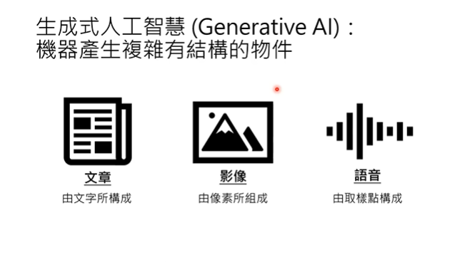

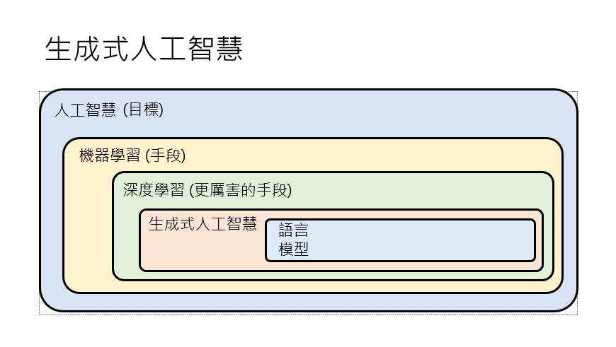

预置成千上万个参数——>称为类神经网络

其中一种：Transformer

机器需要模拟在训练时从来没有看过的东西——>需要有创造力

ChatGPT 背后的核心：<mark style="background-color: #FBBFBC">文字接龙</mark>

拆解成一连串文字接龙、文字分类（语言模型）

图片生成策略：根据一系列像素点生成

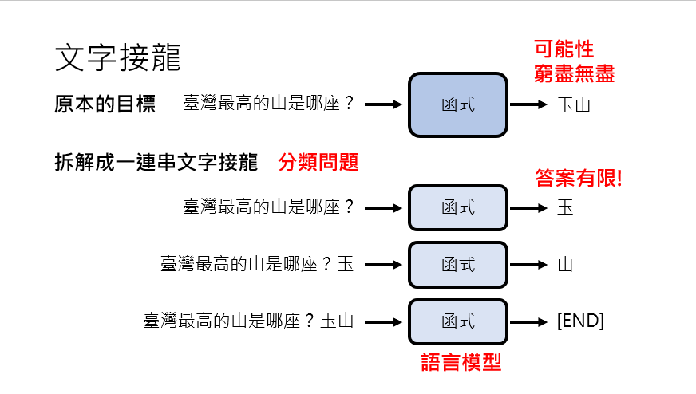

ChatGPT 的学习基本上就是三个步骤——先做预训练，再做监督学习，然后做强化学习

# 第二讲  今日的生成式人工智能厉害在哪里？

没有特定功能

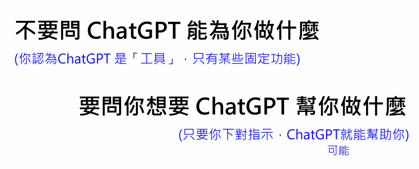

人工智慧在想什么？

如何评估模型？*功能

防止说出有害的内容，但还有可能预防过度

# 第三讲 训练不了人工智能？可以训练自己

**我们还能做什么？**

1. 改变自己，来强化模型：**Prompt Engineering**
2. 训练自己的模型：利用开源模型

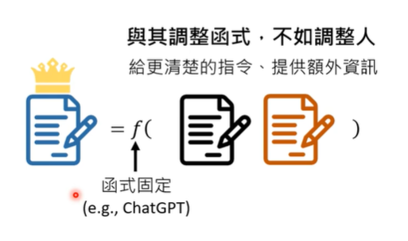

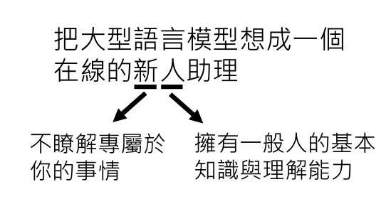

## 使用提示词（神奇咒语）

> 论文：https://arxiv.org/abs/2312.16171

* Chain of Thought:  *Let's think step by step.*
* Take a deep breath
* 先解释，再给出答案
* 情绪勒索：This is more important for me
* 其他
  * 有礼貌 ×
  * 说要做…… √  说不要做……×
  * 付小费   √
  * You will be penalized
**用 AI 找神奇咒语**

**利用增强式学习（Reinforce Learning）**

* 特殊咒语对于 Gpt3.5 以上的没有用
* 并不对所有模型有用

## 提供额外资料

* 讲清楚前提
* 提供 AI 并不了解的讯息、资料
* 提供范例
  > 干扰 prompt：这些类别可能与一般的定义不同

## 任务拆解

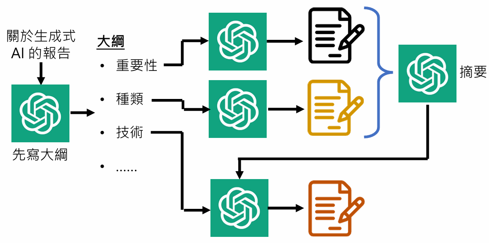

### 为什么让模型思考（Chain of Thought，CoT）或者解释会有用？

因为<mark style="background-color: #FBBFBC">**语言模型能够检查自己的错误（自我反省）**</mark>

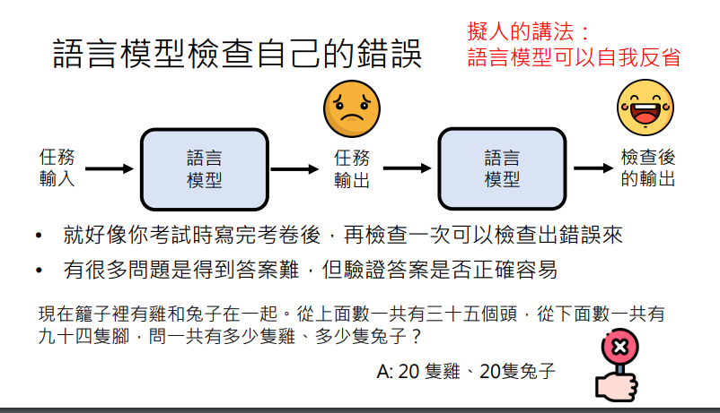

### 为什么同一个问题的答案不同？

* 内部的参数是一样的，但每次的答案是不一样的
* 输出的几率分布不同，根据几率大小进行接龙，得到第一个字
* 然后一路掷骰子

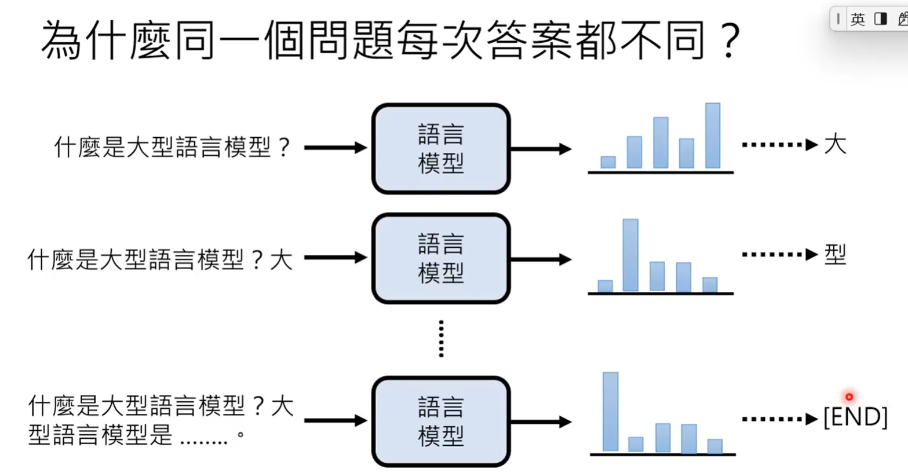

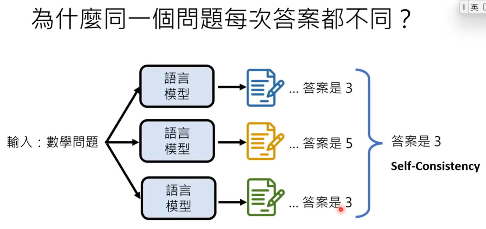

### 语言大模型组合  

**Tree of Thoughts (ToT)**

通过利用以下特点

* <mark style="background-color: #FAF390">任务拆解</mark>
* <mark style="background-color: #FAF390">自我检查</mark>
* <mark style="background-color: #FAF390">不同答案</mark>
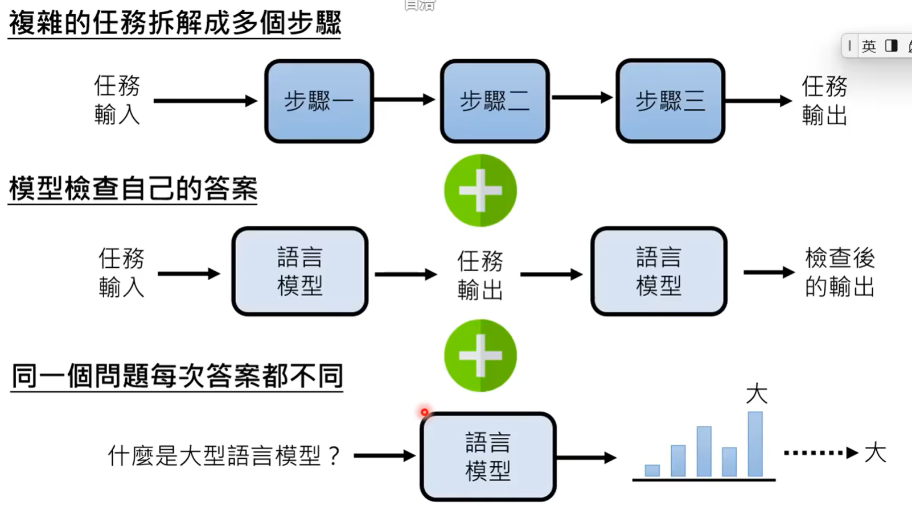

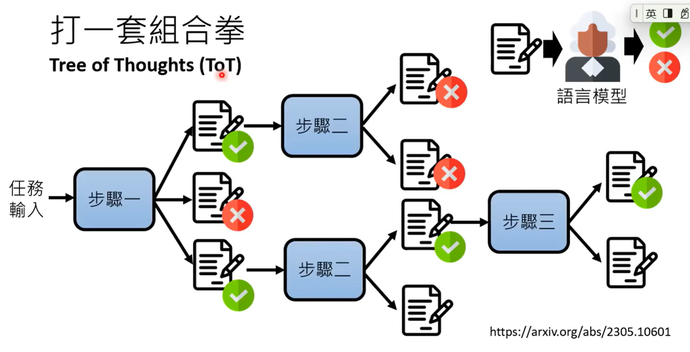

## 使用工具

### 使用工具—搜索引擎

在语言模型/资料库没有被训练的情况下，提供额外的的资料，得到更好的答案，也就是<mark style="background-color: #FBBFBC">**RAG 技术：**</mark>

<mark style="background-color: #FAF390">**Retrieval Augmented Generation**</mark>

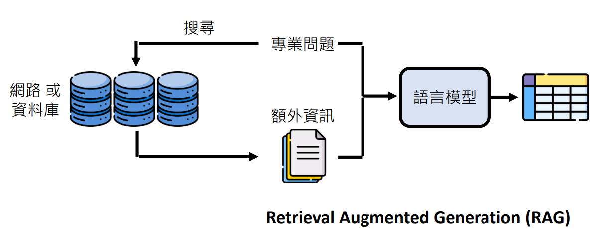

GPT-4 可以上网搜索，但需要给出指令：上网搜索回答（2024 上），至 2025 年 1 月，GPT 已经可以自动上网搜索

### 使用工具——写程序

利用 Python 程序来解数学题，而且能够自己执行程序得到结果

<mark style="background-color: #FAF390">**Program of Thought （PoT）**</mark>——> 能够得到一个比较正确的答案

Finished analyzing ——> 代表 GPT 写了一个简单的程序

### 使用工具——文字生图 AI（DELL-E）

GPT Plug-in

### 延伸阅读——能够使用工具的 AI

> 其实也是通过文字接龙来使用工具的
> 课程网址：https://youtu.be/ZID220t_Mpl?feature=shared

在适当的时机产生一个特殊符号：呼叫工具

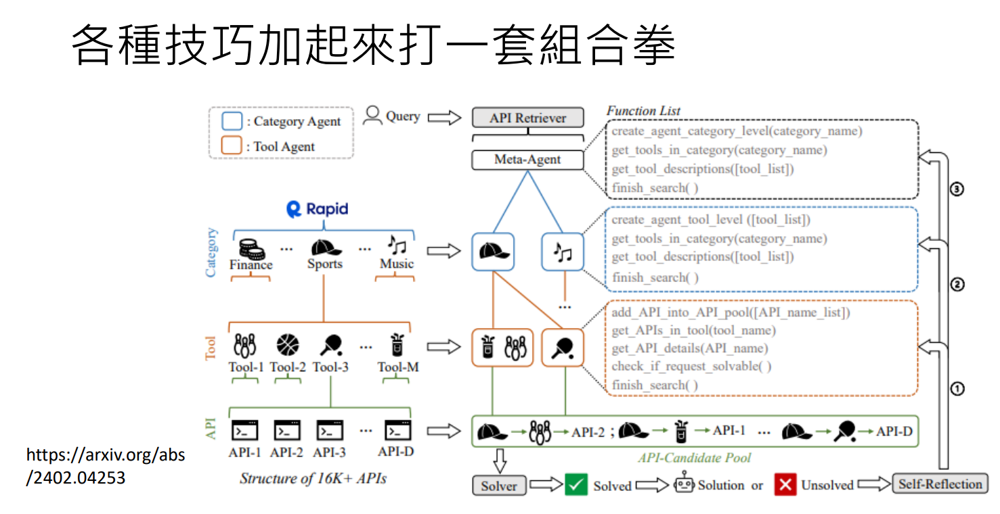

## 语言模型 Help 语言模型

### 方式一：让模型彼此讨论

<mark style="background-color: #FBBFBC">针对一个问题共同讨论得出结论</mark>

不同语言模型有不同的能力——>利用多个模型进行合作，完成任务

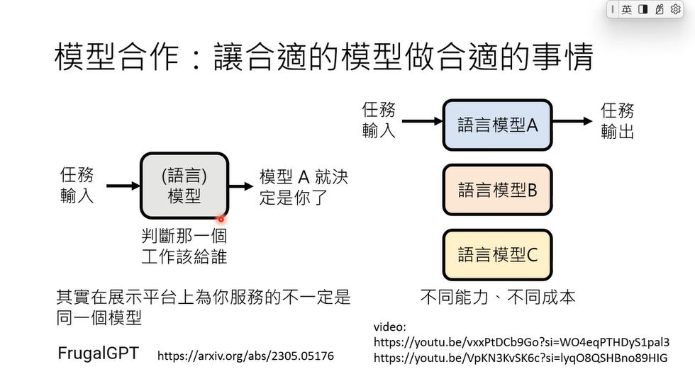

通过引入一个裁判模型，得出最后多个模型讨论的结论

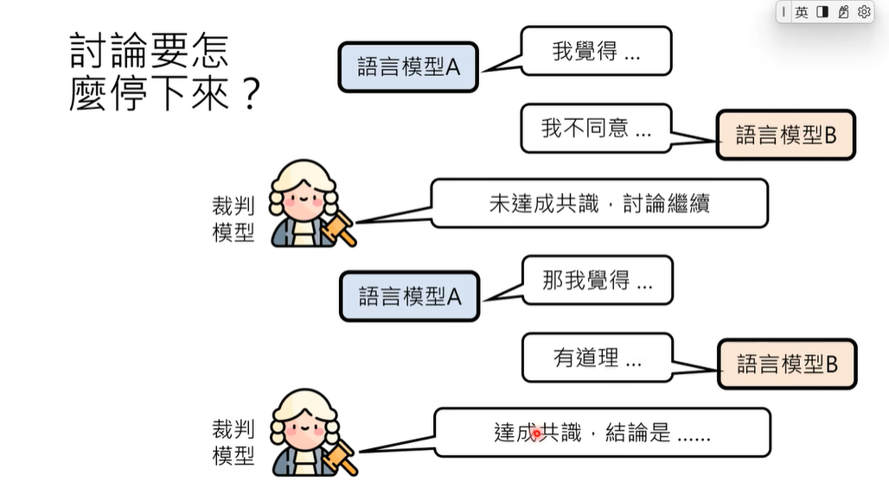

### 方式二：让合适的模型做合适的事情

<mark style="background-color: #FBBFBC">不同模型分工合作，完成各自的分任务</mark>

> 引用论文：[CAMEL: Communicative Agents for "Mind" Exploration of Large Language Model Society](http://arxiv.org/abs/2303.17760)
> Dynamic LLM Agent Network: https://arxiv.org/abs/2310.02170

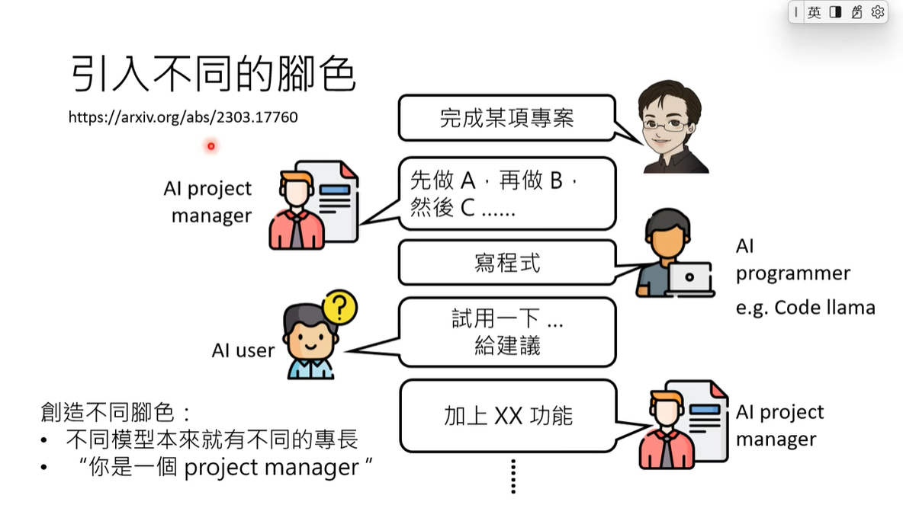

* <mark style="background-color: #FBBFBC">优化团队：为每一个模型打分</mark>

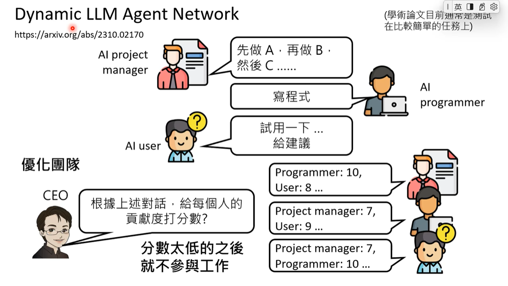

* 开源的方案：已经具备一些语言模型的员工
  * MeteGPT: https://arxiv.org/abs/2308.00352
  * ChatDev: https://github.com/OpenBMB/ChatDev

> 未來不需要打造全能的模型，語言模型可以專業分工，不同團隧可以專注於打造專業领域的語言模型

# 延伸示例  模拟 AI 村民组成虚拟村庄

AI 生成的一个社群示例：https://youtu.be/G44Lkj7XDsA

举例：某一个模型记忆

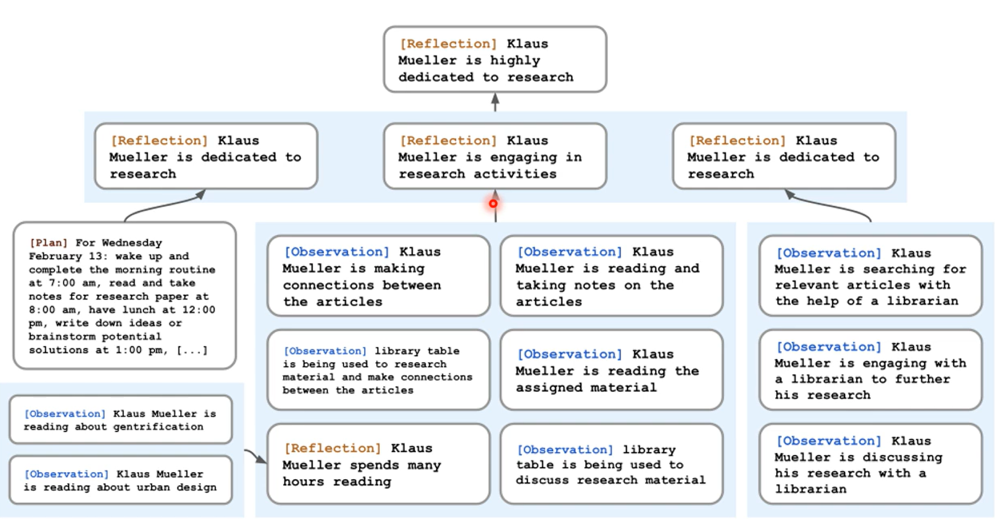

## 根据外界的刺激改变计划

每当机器看到一个东西 entity 时，ref：

执行新计划的时候还会产生一个新的摘要：根据脑中另外一个 Agent 有关的事情产生摘要，把相关的事情放在摘要里，然后产生一个问题。 

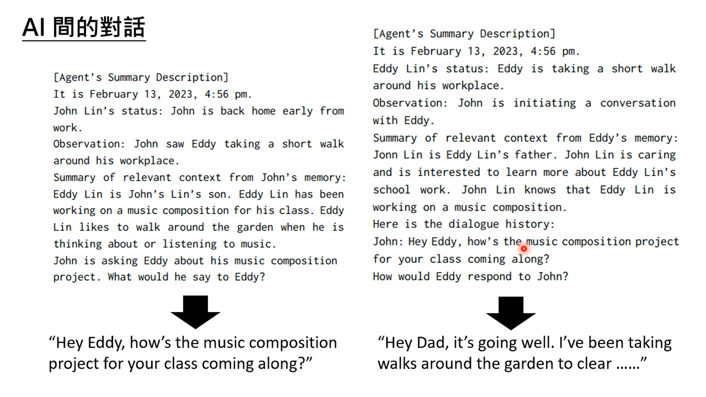

# 第四讲 大语言模型修炼史

## PPT资料

<mark style="background-color: #FBBFBC">**所有的学习都是在学文字接龙，只是训练的资料不一样**</mark>

---

* 第一阶段：**Pre-train——Foundation Model**
* 第二阶段：**Instruction Fine-tuning（Alignment）**
* 第三阶段：**RLHF（Alignment）**

---

## 前言——找参数

* 文字接龙的方式：$下一个Token=f(未完成的句子)=…a…b…c…d…$（这里是包含数十亿个未知参数的函数），称为<mark style="background-color: #FAF390">**模型**</mark>**。**语言模型需要通过<mark style="background-color: #FAF390">**训练/学习**</mark>来找出这些未知参数，之后才可以进行接龙。
* <mark style="background-color: #FAF390">**测试 Testing（推论 inference）：**</mark>找出参数后，使用这些参数进行文字接龙的过程。

找参数的过程称为**最佳化（Optimization）**<—— <u>*给一份训练资料，机器学习根据训练资料，找出符合训练资料的参数。*</u>

<mark style="background-color: #C0ECBC">可以把最佳化想象成一部机器，使用前需要设定一些机器的参数，设定的参数为</mark>**超参数（hyperparameter）**（不是训练得到的参数，而是模型内设定的参数）<mark style="background-color: #C7D5F6">设定</mark><mark style="background-color: #C7D5F6">**超参数**</mark><mark style="background-color: #C7D5F6">以后，就决定了最佳化的方法。</mark>

### **训练可能失败**

但是这个训练可能会失败，找到的参数没有符合的训练资料 ———方法———> 换一组超参数（调参数）

### **训练成功，但是测试失败**

如右图所示，称为：**Overfitting**

<mark style="background-color: #FBBFBC">**机器学习时只管找到的参数有没有**</mark><u><mark style="background-color: #FBBFBC">**符合**</mark></u><mark style="background-color: #FBBFBC">**训练资料，但是不会管有没有道理**</mark>

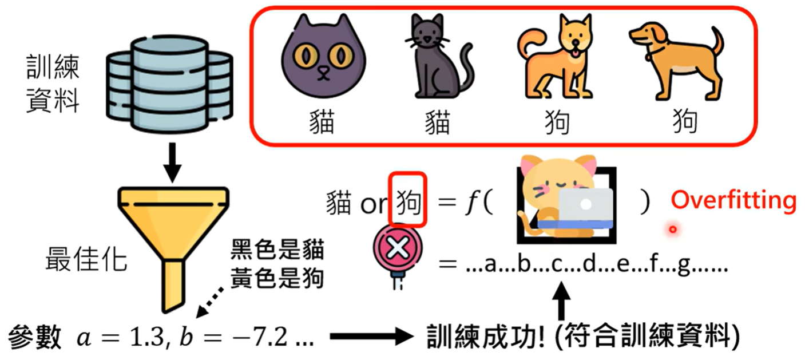

<mark style="background-color: #D4C1F3">**故事：**</mark>https://youtu.be/WQY85vaQfTl?si=DR8fnpmbvi7bmfsn&t=1535

### 如何让机器找到比较合理的参数？

* <mark style="background-color: #C7D5F6">**增加训练资料的多样性**</mark>
* **找到**<mark style="background-color: #C7D5F6">**”好“的初始化参数**</mark>

使用最佳化机器之前，还需要设置**初始参数**，最佳化会从初始参数开始找，最终找出来的参数会比较接近初始参数。通常是不知道如何设定初始参数，需要随机生成输入参数。———— **train from scratch**

找到<mark style="background-color: #C7D5F6">”好“的初始化参数</mark> ——> 可以想象成给模型（机器学习）的先验知识

如果是从<mark style="background-color: #C7D5F6">”好“的初始化参数</mark>开始最佳化，最后找出来的参数有可能是我们想要的

## 第一阶段 自我学习

<mark style="background-color: #F9D8B1">**需要多少文字才够学会文字接龙？**</mark>正确接出一个 token 需要以下两个知识：

* <mark style="background-color: #FAF390">**语言知识**</mark>**：**必须对语言的文法有了解
* <mark style="background-color: #FAF390">**世界知识**</mark> ：必须对世界（物理的或人类的）有了解

   但是世界知识是非常复杂且多层次的，需要大量的资料才能让语言模型学会

<mark style="background-color: #F9D8B1">**哪里找到大量的文字资料？**</mark>

**自督导式学习：Self-supervised Learning**

* 网络——>Python 爬取大量的文字资料 ——>整理成训练资料（人工的介入很少）
* 资料清洗：一开始就不让他接触有害内容

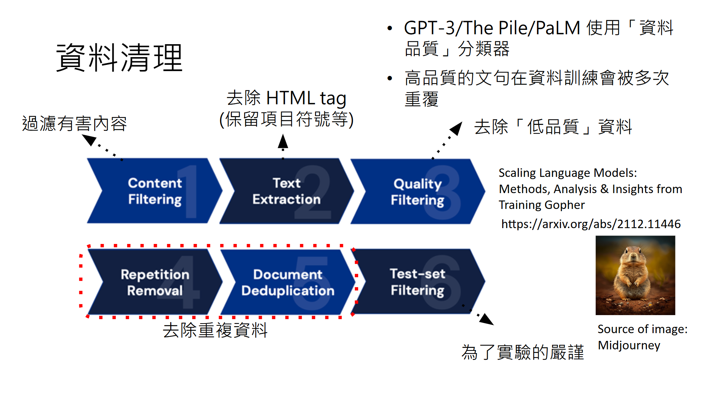

<mark style="background-color: #F9D8B1">**训练再大的模型也没有用，为什么语言模型不能好好回答问题？**</mark>

* 因为人类并没有教给语言模型怎么使用这些训练资料
* <mark style="background-color: #D4C1F3">语言模型不知道使用的方法</mark>

## 第二阶段 人类教导 发挥潜力

这一阶段称为：**Instruction Fine-tuning** （**微调**），<mark style="background-color: #FBBFBC">需要人类老师教导</mark>，但是会耗费人力——> 需要进行资料标注：称为**督导式学习（Supervised Learning）。**如果只靠人类老师教的话还远远不够，无法收集太多资料，只能输出通顺、像人类说的话，但不一定正确。

例如像之前的智能助理，说不要打开开关，但它只听到了打开开关，结果还是会打开。

* 今天大型语言能够成功的关键是<mark style="background-color: #FBBFBC">使用了第一阶段的参数作为初始参数</mark>。
* 可以把第一阶段从网络上学来的大量资料的参数作为初始参数。
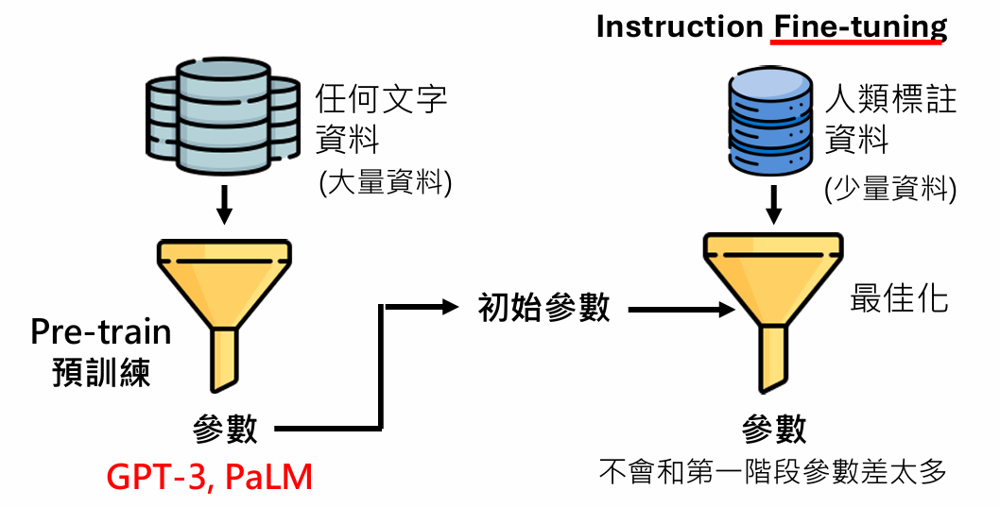

如果担心最佳化的过程生成的参数与初始参数不一样，可以使用一个技巧：**Adapter**<mark style="background-color: #FAF390">  e.g. LoRA，</mark>能够让参数接近初始参数。

**第一阶段的参数**：不会使用简单的规则作文字接龙，现在的语言模型（Pre-train）可能都学到了非常复杂的规则。

所以在模型进行了最佳化的过程之后，会有非常厉害的举一反三的能力。

### 举一反三的能力

* 举一反三的能力能够有多夸张？   只要教某一个语言的某一个任务，自动学会其他语言的同样任务（Bert）

### Fine-tuning的路线分成了两条

* 路线一：打造一堆专才  Bert

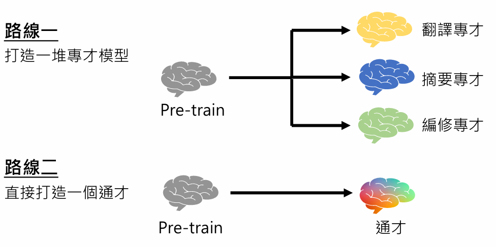

资料：[進擊的 BERT：NLP 界的巨人之力與遷移學習](https://leemeng.tw/attack_on_bert_transfer_learning_in_nlp.html)、https://youtu.be/gh0hewYkjgo

* 路线二：打造一个通才

资料：https://arxiv.org/abs/1909.03329v2、https://arxiv.org/abs/2109.01652、https://arxiv.org/abs/2110.08207

Instruction Fine-tuning 是画龙点睛

* 所以自己也能做Instruction Fine-tuning吗？
* 没有高品质的Instruction Fine-tuning资料——>可以对ChatGPT进行逆向工程

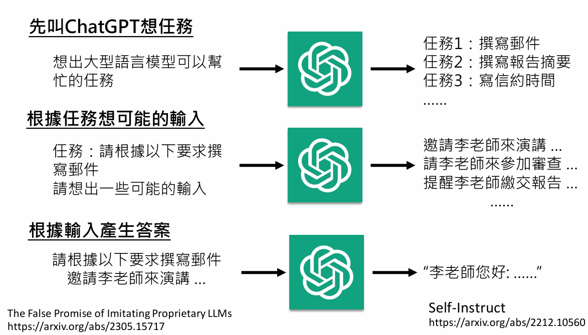

* 关键是使用Pre-train的参数初始化

Meta 开源了 LLaMA

* LLaMA1：https://arxiv.org/abs/2302.13971
* LLaMA2：https://arxiv.org/abs/2307.09288

## 第三阶段 参数实战 打磨技巧

<mark style="background-color: #FBBFBC">**Reinforcement Learning from Human Feedback ( RLHF )**</mark>

<mark style="background-color: #FBBFBC">**Reinforcement Learning，RL    增强式学习**</mark>

<mark style="background-color: #C7D5F6">**人觉得好的答案就提高几率，觉得不好的答案就降低几率**</mark>

### 参考课程

* https://www.youtube.com/watch?v=XWukX-ayIrs&list=PLJV_el3uVTsMhtt7_Y6sgTHGHp1Vb2P2J&index=29
* https://youtu.be/z95ZYgPgXOY?si=-E-1iE77qxsdNoGw

### RLHF vs Instruction Fine-tuning

|RLHF |Instruction Fine-tuning |
|---|---|
|人类比较轻松 |人类比较累 |
|有时候人类写出正确答案不容易，但容易判断好坏 | |
|* 模型进入新的思考模式
* 不管中间的每一步，只管最终的结果
* 对结果整体有通盘考量
 |* 模型要学习怎么接下一个字；
* 假设每次接龙都是对的，生成的结果就是好的；
* 对于生成的结果没有通盘考量
 |
|只问结果，不问过程 |只问过程；不问结果 |
第一阶段和第二阶段：和 AlphaGo 一样，人类老师说什么就接什么

透过 RL 学习，提交赢棋棋步的概率

### 如何有效利用人类的回馈？

<mark style="background-color: #FAF390">**回馈模型（Reward Model）**</mark>：模仿人类的喜好/向虚拟人类学习

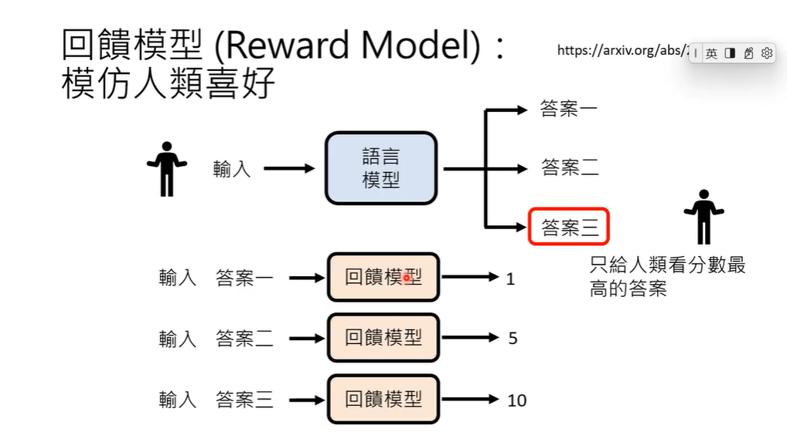

提供多个答案给回馈模型，返回评分较高的答案

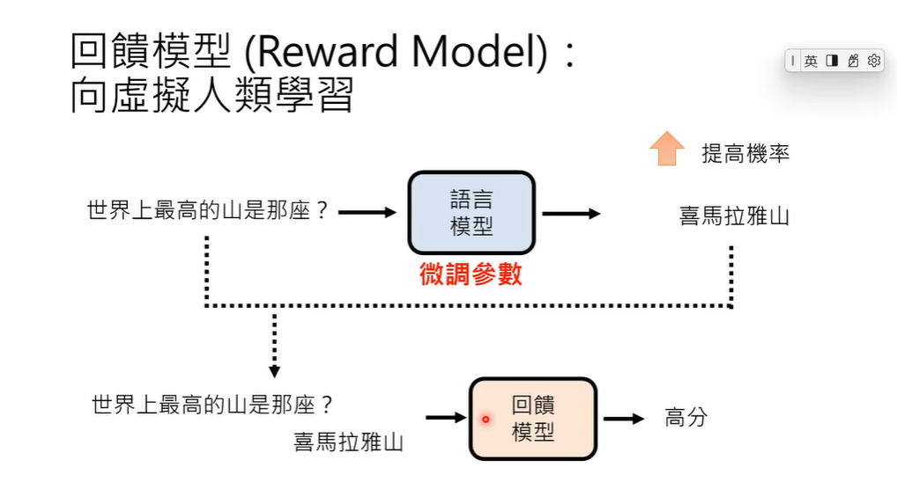

将问题和答案都提供给回馈模型

<mark style="background-color: #C7D5F6">**但是过度向虚拟人类学习是有害的**</mark>

也有其他不需要虚拟人类的训练方法

* **DPO**
* **KTO**

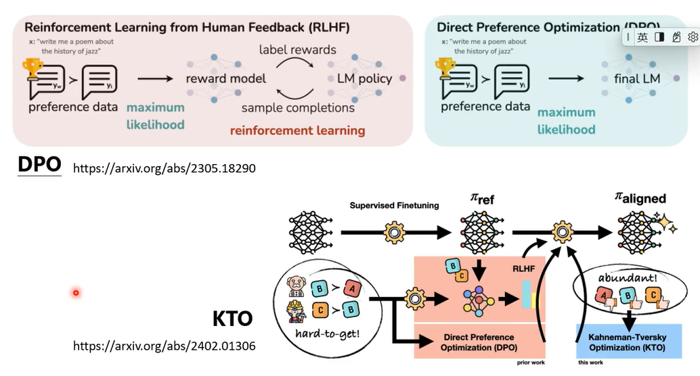

**RLHF——>RLAIF**

使用其他 AI 来给语言模型提供回馈，甚至是可以同一个语言模型

### 增强式学习的难题

* 什么叫做好？ **Helpfulness vs Safety**
* 假设语言模型厉害到 **人类都无法正确判断好坏** 的状况？
  * 考公 or 工作 or 考研

# 第五讲 以大型语言模型打造 AI Agent

PPT：https://speech.ee.ntu.edu.tw/~hylee/genai/2024-spring-course-data/0412/0412_agent.pdf

<mark style="background-color: #C7D5F6">AI Agent：能够让 AI 执行多步骤的复杂任务</mark>

## AI Agent 示例

* AutoGPT: https://github.com/Significant-Gravitas/Auto-GPT
* AgentGPT: https://agentgpt.reworkd.ai/
* BabyAGI: https://github.com/yoheinakajima/babyagi
* Godmode: https://godmode.space/?ref=futuretools.io

* 会自己玩我的世界的AI
* 由AI村民组成的虚拟村庄
* 由语言模型操控的机器人
* 用大型语言模型开自驾车

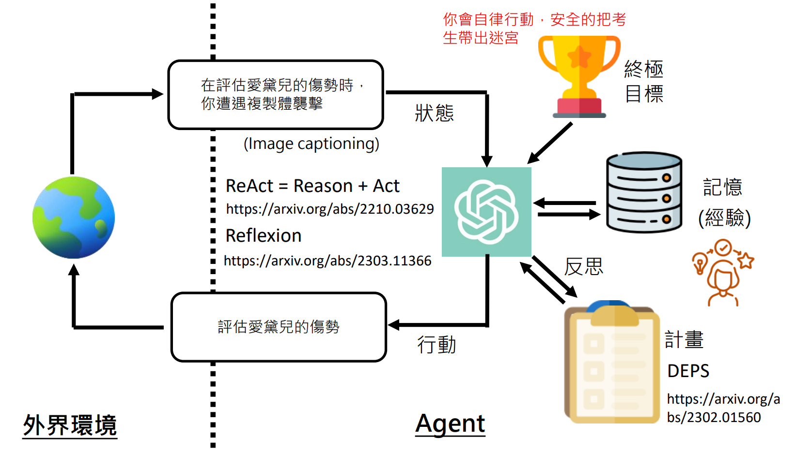

<mark style="background-color: #FBBFBC">**问题：如何将文字转为实际行动？**</mark>

参考论文：https://arxiv.org/abs/2402.19299

# 第六讲 今天的语言模型是如何做文字接龙的？

PPT：https://speech.ee.ntu.edu.tw/~hylee/genai/2024-spring-course-data/0503/0503_transformer.pdf

[0503_transformer.pptx](assets/R8B5b7A0FovP7uxqiwRc5Ddnn3c_0503_transformer.pptx)

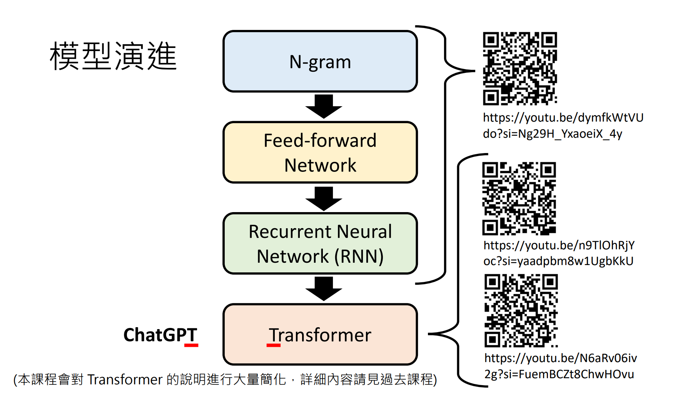

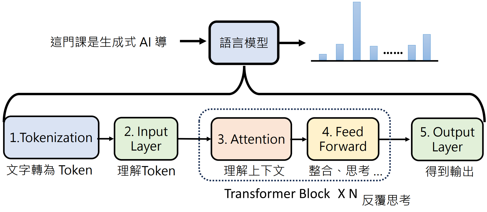

## Transformer 概述

<mark style="background-color: #FAF390">**Transformer 类神经网络**</mark>

1. **把文字变成 Token**：语言模型是以 Token 作为单位来对文字进行处理的
    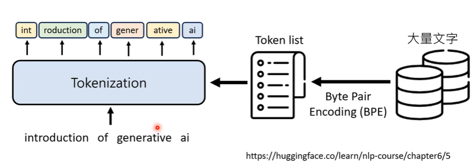

2. **理解每个 Token****—— 语意**
    * 将每一个 Token 表示成向量（<mark style="background-color: #FAF390">Embedding</mark>）
    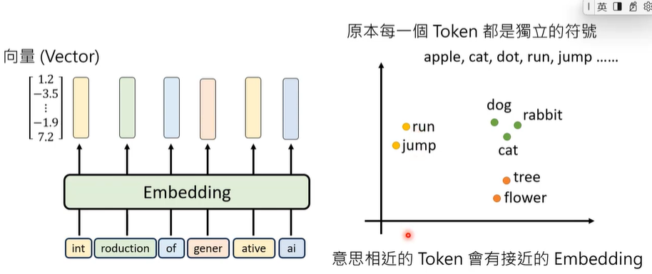

    * 每一个 Token 有对应的 Embedding，即**训练时的参数（最佳化得到的参数）**，但现在并没有考虑上下文

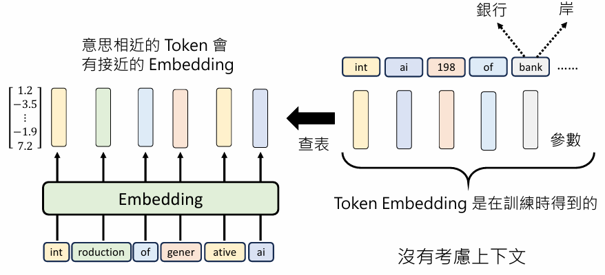

1. **理解每个 Token —— 位置**
    * 在向量中添加表示位置的参数
    * 每一个位置有一个独特的向量：<mark style="background-color: #FAF390">**Positional Embedding**</mark>，要把位置向量加在 Embedding 上
    * 可以由人来设计，也可以训练时得到
    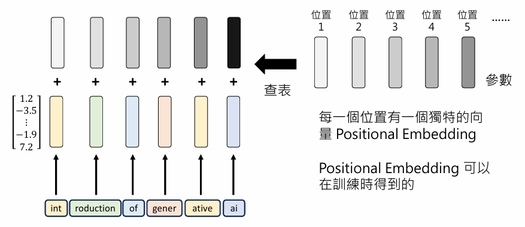

2. <mark style="background-color: #FAF390">**Attention：**</mark>**考虑上下文**
    * 经过 Attention 之后，Embedding 会进行改变，称为 <mark style="background-color: #FAF390">**Contextualized Token Embedding**</mark>
    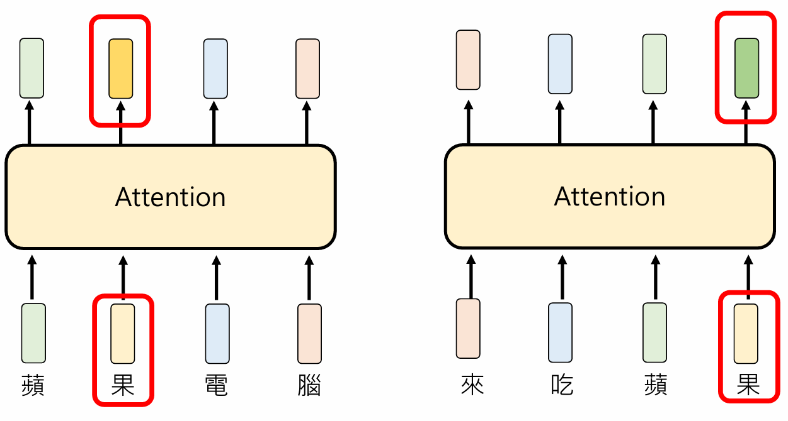

    * Attention（找出相关的Token）的步骤
      1. <mark style="background-color: #C7D5F6">先计算每组向量的相关性</mark>，需要计算所有 Token 两两间的相关性，叫做 <mark style="background-color: #FAF390">**Attention Weight；**</mark>
      1. 然后 Attention Weight 乘以向量并相加，得到Attention模组的输出。
    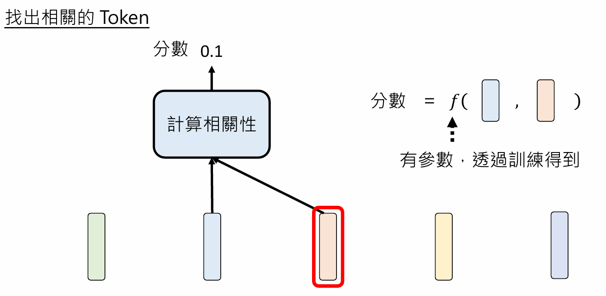

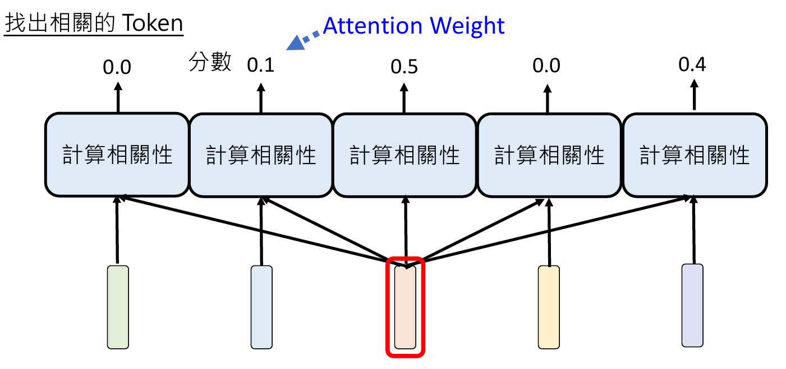

    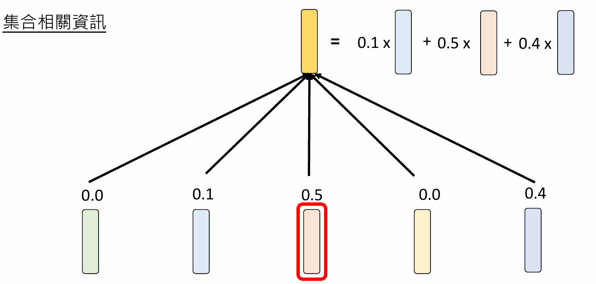

    * [实际上只会考虑左边（前面）的 token](https://n1ddxc0sfaq.feishu.cn/wiki/OEnQwbzpQi8kZRkV49zcQPZ9nzq#share-WhwJd9swsoJdTXxK4wucnyu2nDd):称为  <mark style="background-color: #FAF390">**Causal Attention**</mark>

* <mark style="background-color: #FAF390">**Multi-head Attention**</mark>：现在通常都用这种Attention，因为相关性不止一种，使用这种Attention可以计算多组关联性，通常有16组
  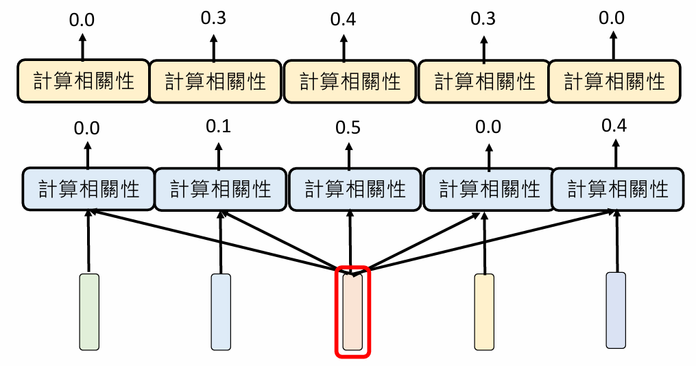

  * 通常会使用多组输出，再通过<mark style="background-color: #FAF390">**Feed Forward**</mark>模组将多种输出组合起来，最后得到考虑上下文的Embedding，这些合起来叫做 <mark style="background-color: #FAF390">**Transforme Block**</mark>

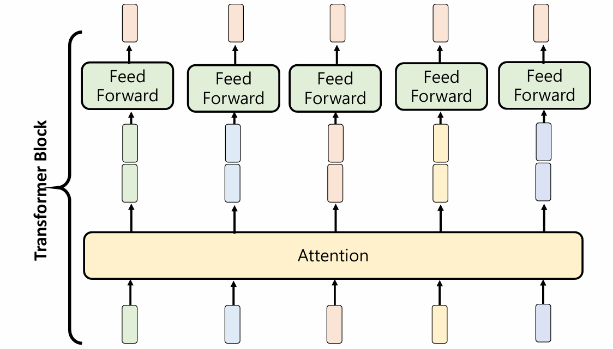

通常一个Transformer Block称为一个Layer，句尾的向量通过一个<mark style="background-color: #FAF390">Output Layer</mark>，里面有一个<mark style="background-color: #FAF390">Linear Transformer+Softmax</mark>，得到一个几率分布。

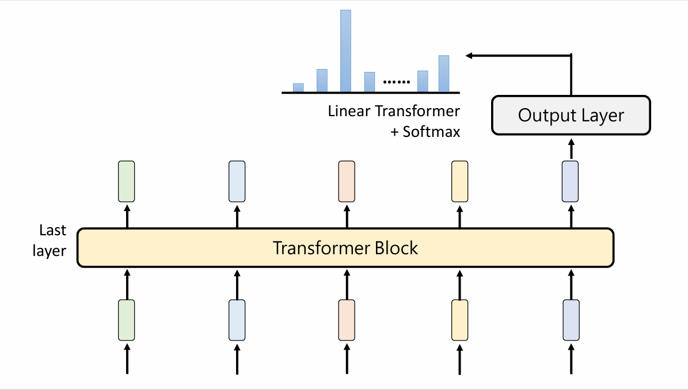

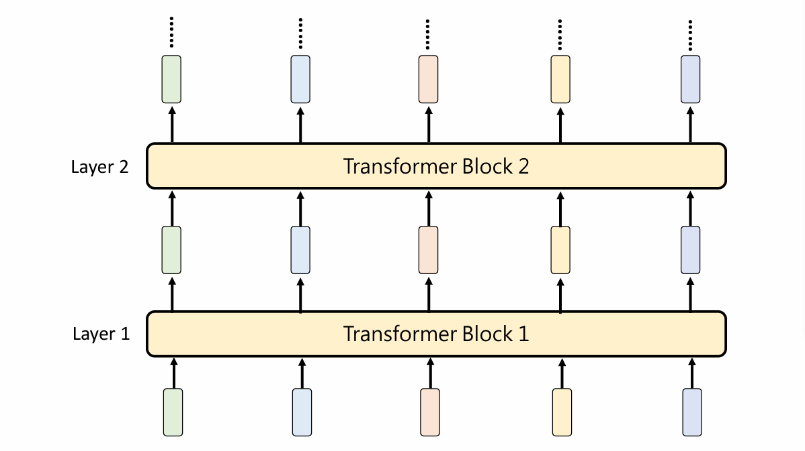

#### 为什么[只需要左边的 Token](https://n1ddxc0sfaq.feishu.cn/wiki/OEnQwbzpQi8kZRkV49zcQPZ9nzq#share-Cyf4dEqwNoDPbHxNii7cuWsvnBf)？

语言模型产生答案的过程：

根据输入，生成w1，再根据w1和输入文字接龙生成w2，根据w1、w2和输入生成w3……以此类推，直至生成结束。

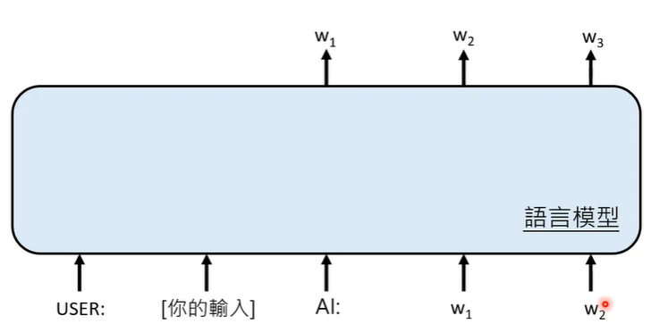

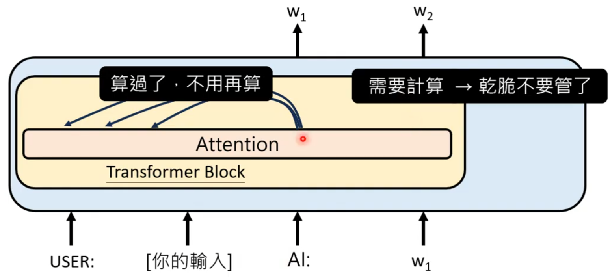

#### 为什么处理超长文本是一个挑战？

* 因为每次输入时，Token两两之间要进行向量运算
* 计算次数与输入文本长度的平方成正比，需要耗费大量算力

## 研究方向

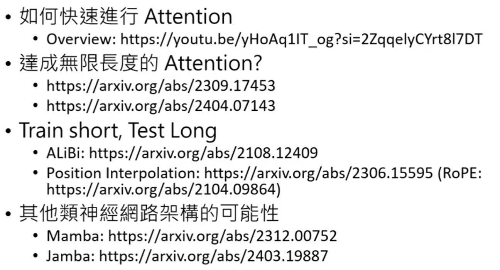

# 延伸——Transformer

Slides：https://speech.ee.ntu.edu.tw/~hylee/ml/ml2021-course-data/seq2seq_v9.pdf

## Sequence-to-sequence (Seq2seq)

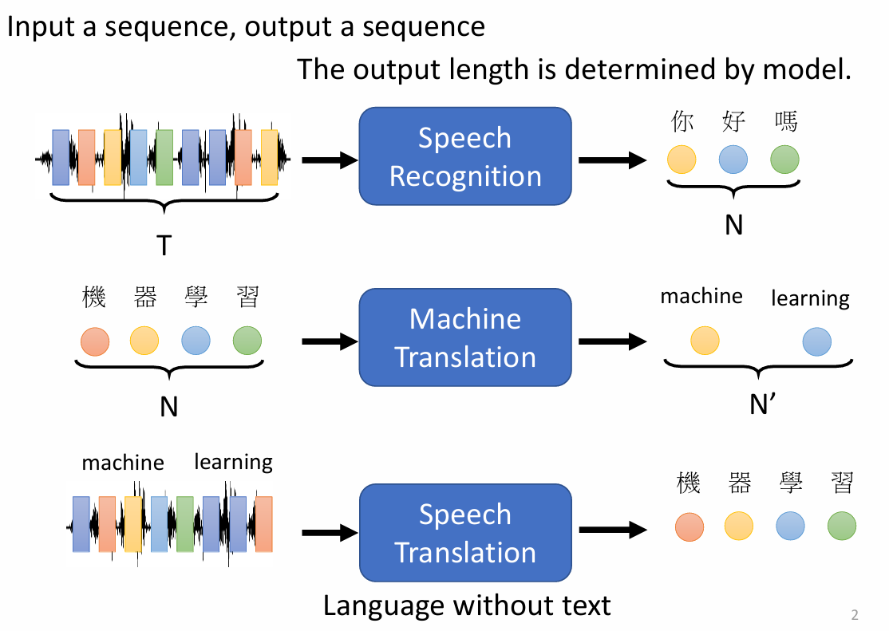

* 需要有语音资料和中文的对应关系资料
* 语言合成：Text-to-Speech  (TTS) Synthesis 
* Seq2seq for Chatbot

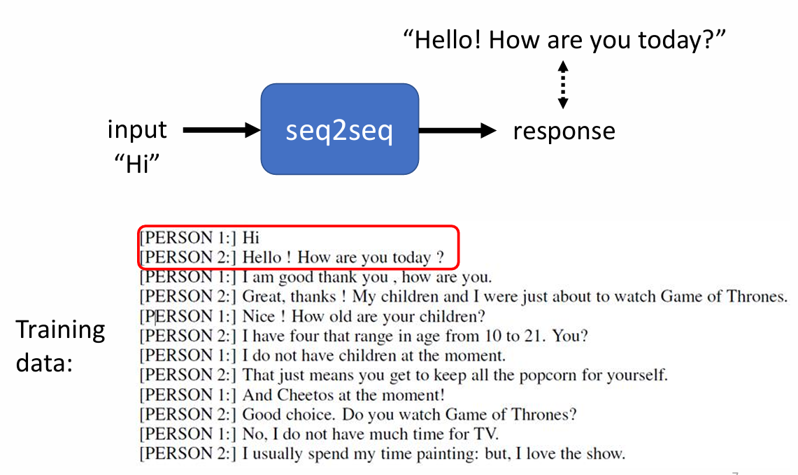

大部分自然语言处理都可以当成QA（Question Answering）问题处理，而 QA 的问题 可以使用 seq2seq 的模型来解。

举例：seq2seq文法剖析

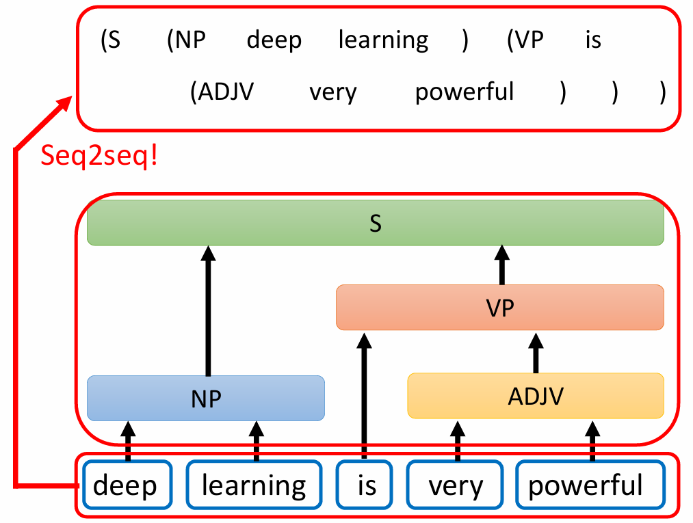

**Seq2seq for  Multi-label Classification**：同一个东西可以属于不止一个class。——> 机器决定可以属于哪个class

Multi-class Classification ：有不止一个class ，机器需要从数个class中选一个出来。

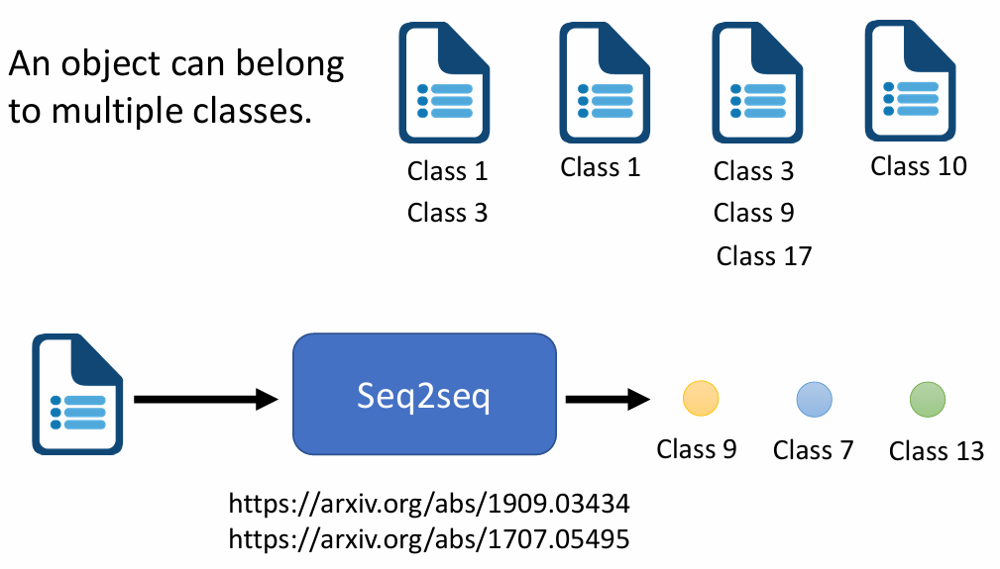

**Seq2seq for Object Detection**

## Seq2seq


### Encoder

提供一排向量，输出另一排向量


另一种network设计的架构：residual

1. 不止是输出vertor 还要加上 input （a+b）作为新的输出
2. Layer normalization：计算 mean和standard deviation，对同一个里面不同的计算
3. 作为 FC 的输入，最后得到输出


## Decoder

### Autoregressive

（Speech Recognition as example）

* Size V 列出能够输出的常见的字
* 进行softmax，输出分数最高的字


* 后面的输入是机器自己的输出，然后根据错误的输入计算，所以有可能产生错误

### Transformer Decoder

Self-attention ——> Mashked Self-attention：

输出时不考虑后面的输入，例如产生b2时不考虑 a3、a4的信息


**？** Decoder必须自己决定输出的长度——>

需要使用一个特殊的符号：END


### Non-autoregressive (NAT)

AT v.s. NAT

* NAT：一次产生一排Token
* 如何决定输出的长度？
  * 另外设置一个**Classification**，输出数字，代表Decoder输出的长度
  * 输出比较长的段落，识别输出 END 的位置
* 优点：并行化，且更稳定 (e.g., TTS)


NAT学习链接：https://youtu.be/jvyKmU4OM3c

### Transformer


## Training

等待补充……

https://speech.ee.ntu.edu.tw/~hylee/ml/ml2021-course-data/seq2seq_v9.pdf

# 第七讲 大型语言模型在想什么？

https://speech.ee.ntu.edu.tw/~hylee/genai/2024-spring-course-data/0503/0503_explain.pdf

* Transparency：不是开源的
* Interpretable：思维是透明的
* <mark style="background-color: #FBBFBC">Explainable</mark>：没有标准，not interpretable的模型有可能是可解释的

更多有關可解釋性人工智慧的知識：

* https://youtu.be/WQY85vaQfTI?si=kEZjRcG76cLMjJCf
* https://youtu.be/0ayIPqbdHYQ?si=IBh_fn9-XY_GiKOj

## 语言模型的可解释性

* 可以找出影响输出的关键输入
  * 隐藏部分输入
  * 分析Attention
  * In-context learning
    

* 可以找出影响输出的关键训练资料
* 分析Embedding中存在有什么样的信息


先做字面处理，再做文法处理，最后做语义处理


## 语言模型的“测谎器”


<mark style="background-color: #FBBFBC">語言模型會說話，所以「問」就完事了</mark>——> <mark style="background-color: #C7D5F6">DeepSeek的推理过程</mark>


<mark style="background-color: #FBBFBC">但是语言模型说出来的话也 不保证可信…</mark>

# 第八讲 语言模型能力鉴定

https://speech.ee.ntu.edu.tw/~hylee/genai/2024-spring-course-data/0510/0510_evaluation.pdf


* 考核选择题
* 考核没有标准答案的题目——>可能通过人类评比最准

语言模型排行榜：https://chat.lmsys.org/?leaderboard

* 或许还可以使用强大的语言模型来评估？


<mark style="background-color: #C7D5F6">**MT-Bench ：**</mark>通过ChatGPT来评比


* 语言模型也可能有偏见——>喜欢长的答案

通过考核复杂任务来评比语言模型

BIG-bench

* 通过Emoji来识别电影
* 提供西洋棋棋布，让语言模型推断下一步
* 提供ASCII码，让语言模型来识别答案
* 阅读长文的能力（Needle in a Haystack  大海捞针）
  * https://youtu.be/KwRRuiCCdmc?si=eRYBvVl2gTclSX1A
  * https://github.com/gkamradt/LLMTest_NeedleInAHaystack
  * 使用prompt会提高claude阅读长文的能力：Assistant: Here is the most relevant sentence in the context...
* 語言模型會不會為達目的不擇手段？
* 機器有沒有心智理論 (Theory of Mind)
  * 心智理论：揣摩他人想法的能力
  * **莎莉與小安測驗（Sally–Anne test）**
    莎莉和小安他們旁有個箱子和篮子：
莎莉把球放在子後，莎莉就離開了
小安在莎莉離開後，把球放到了箱子中
請問莎莉回來後她會去哪裡找球？


考虑其他面向：价格、速度……

AI 能力对比：https://artificialanalysis.ai/

https://artificialanalysis.ai/downloads/china-report/2025/Artificial-Analysis-State-of-AI-China-Q1-2025.pdf

# 第九讲 人工智能的安全性

https://speech.ee.ntu.edu.tw/~hylee/genai/2024-spring-course-data/0510/0510_ethical.pdf

## 大型语言模型还是会讲错话怎么办？


### **事实核对**

* Gemini 可以点击Google按钮将回答与网络上的信息进行验证


### **事实查核工具**

* Factscore：https://arxiv.org/abs/2305.14251
* FacTool：https://arxiv.org/abs/2307.13528
* 有可能回答中的每一句话都有事实验证，但合起来不一定是全对

## 大型语言模型会不会自带偏见？

<mark style="background-color: #FAF390">Holistic Evaluation of Language Models</mark>

https://arxiv.org/abs/2211.09110

* **置换描述**


* 现在语言模型已经变得更厉害，需要使用更高级的方法去评价
  * **使用红队语言模型**
  * https://arxiv.org/abs/2310.11079
  * https://arxiv.org/abs/2202.03286


* **用大型模型语言审查简历：可能本身也有一些问题**
  * **对于性别、姓名可能存在偏见**
  * https://www.bloomberg.com/graphics/2024-openai-gpt-hiring-racial-discrimination/
  

  

* 也存在**对于职业性别的刻板印象：**https://textio.com/blog/chatgpt-writes-performance-feedback


* **语言模型的政治倾向**：https://8values.github.io/
  * https://arxiv.org/abs/2402.01789 测试示例
  

### 如何减轻大模型自带的偏见？

https://arxiv.org/abs/2309.00770


## 如何测试一句话是不是人工智能生成的

* DetectGPT: https://arxiv.org/pdf/2301.11305
*  DNA-GPT: https://arxiv.org/abs/2305.17359
*  Intrinsic Dimension Estimation: https://arxiv.org/abs/2306.04723


---

# 作业

[作业](https://n1ddxc0sfaq.feishu.cn/wiki/ZYdOwJaIoiIhM1kiNWwcXGKEngf)

