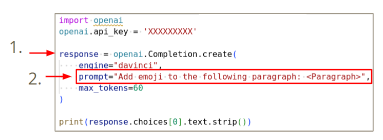
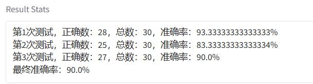
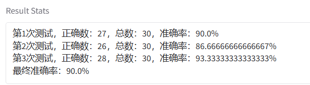
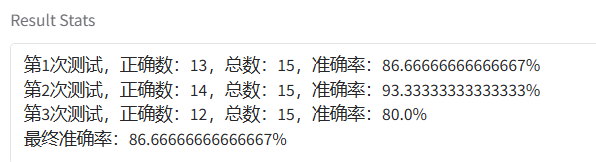
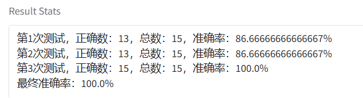
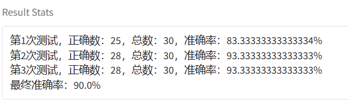

# 作业

# 中文镜像作业

# 作业 1

PPT：[docs.google.com](https://docs.google.com/presentation/d/1fAXUpvAxmTQEQrIhJxcPz4AlAhY5hLsC6b9p5TrMAIU/edit#slide=id.g2aefc017252_0_465)

Code：[colab.research.google.com](https://colab.research.google.com/drive/15jh4v_TBPsTyIBhi0Fz46gEkjvhzGaBR?usp=sharing)

* https://dvcbot.net/
* https://chat.openai.com/auth/login
* https://gemini.google.com/
---

使用ChatGPT

* 通过浏览器使用：需要复制粘贴
* 通过调用API：直接调用模型

## Colab and Gradio

# 作业2 Prompt

通义千问模型测试记录

Prompt没有用

<mark style="background-color: #D4C1F3">prompt：</mark>你是一位数学专家，掌握数学计算基本知识，十分擅长解数学题，帮我解答以下问题：{{question}}

你是一位数学专家，掌握数学计算基本知识，十分擅长解数学题，帮我解答以下问题：{{question}} 这个题对于我的学习生涯非常重要，请你一定认真回答

Q：{{question}} 

你是小学数学题的计算天才，现在你做对以下问题，就可以得到全国的数学竞赛一等奖。Q：{{question}} 

