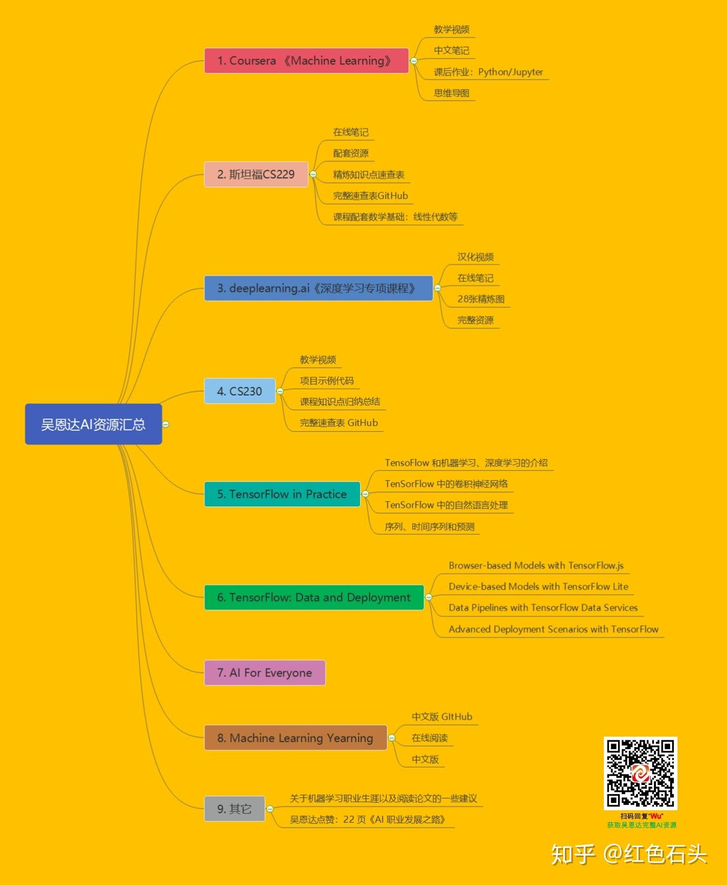

# 首页

# 学习路径

[AI产品经理行业资料库（持续更新）](https://gxvezr0dpem.feishu.cn/docx/BE1YdDKeOoNZcvxeidccwJ65nnc)

## 李宏毅

### 资料

### 笔记

[生成式AI导论-李宏毅](https://n1ddxc0sfaq.feishu.cn/wiki/OEnQwbzpQi8kZRkV49zcQPZ9nzq)

## 吴恩达

[GitHub - fengdu78/Coursera-ML-AndrewNg-Notes: 吴恩达老师的机器学习课程个人笔记](https://github.com/fengdu78/Coursera-ML-AndrewNg-Notes)

[Supervised Machine Learning: Regression and Classification](https://www.coursera.org/learn/machine-learning/)

# 人工智能基础

[Python Numpy 入门](https://v11enp9ok1h.feishu.cn/wiki/QxqIwO1e0ii5mDkIr57cpEmSnwg)

[PyTorch 快速入门](https://v11enp9ok1h.feishu.cn/wiki/UW5RwgTdDif0Tjkn9nvcwYPWnzg)

[PyTorch documentation](https://pytorch.org/docs/stable/index.html)

[Git 基础知识](https://v11enp9ok1h.feishu.cn/wiki/Tqtbw0LzgiXn8Jkz9GXcmb7pnmP)

# 深度学习基础

[从零学 LLM：LLM101N-中文版](https://v11enp9ok1h.feishu.cn/wiki/Xzm6wabBJisS2GkE196c0gevnKd)

[LLM](https://n1ddxc0sfaq.feishu.cn/wiki/BOswwzTyOiIlAJkGTsYcFGiynHd)

