# 基础知识

> 在虚幻编辑器中，你创建游戏体验所在的场景一般称之为 <u>[关卡](https://dev.epicgames.com/documentation/zh-cn/unreal-engine/levels?application_version=4.27)</u> 。你可以把关卡想象成为一个三维场景，在该场景中你可以放置一系列的对象和几何体来定义你的玩家将要体验的世界。你放置到世界中的任何对象都认为是Actor，无论该对象是一个光源、网格物体还是一个角色。从技术上讲， Actor是虚幻引擎中使用的一个编程类，用于定义一个具有三维位置、旋转度及缩放比例数据的对象。把Actor理解成任何可以被你放置到关卡中的对象。

# 软件界面

## 物体操作 (平移、旋转、缩放)

|操作切换 |平移（笛卡尔坐标） |旋转 |缩放 |复制物体 |
|---|---|---|---|---|
|快捷键 |W  |E |R |Alt+LMB拖动坐标轴 |
|操作 |视野聚焦于选中物体 |显示/隐藏游戏视图 |框选 |多选 |
|---|---|---|---|---|
|快捷键 |F |G |Ctrl+Alt+LMB |Ctrl+LMB |

## 视口中的操作

鼠标右键 ➕

* WASD 前后左右
* Q ：Z轴方向向下
* E ：Z轴方向向下
* Z ：视野缩小
* C ：视野放大
|Alt + LMB + 拖动 |将视口围绕一个枢轴或目标点翻转。 |
|---|---|
|Alt + RMB + 拖动 |用移动车将摄像机朝向或远离一个枢轴或目标点移动（缩放）。 |
|Alt + MMB + 拖动 |沿着鼠标移动的方向向左、向右、向上、向下追踪摄像机。 |
## 视图模式

[视图模式-官方介绍文档](https://dev.epicgames.com/documentation/zh-cn/unreal-engine/view-modes?application_version=4.27)

[视口功能按钮-官方说明文档](https://dev.epicgames.com/documentation/zh-cn/unreal-engine/viewport-controls#%E5%8F%98%E6%8D%A2%E5%8A%9F%E8%83%BD%E6%8C%89%E9%92%AE)

* 光照   Alt+4
* 无光照   Alt+3
* 线框   Alt+2

## 关卡编辑器模式

> **关卡编辑器（Level Editor）** 可以进入不同的编辑模式，以启用特定的编辑界面和工作流程，从而编辑特定类型的Actor或几何体。

为了显示可显示的模式，在关卡编辑器工具栏中，打开 **模式（Modes）** 下拉菜单。

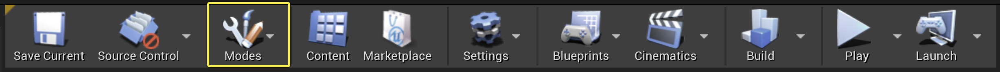

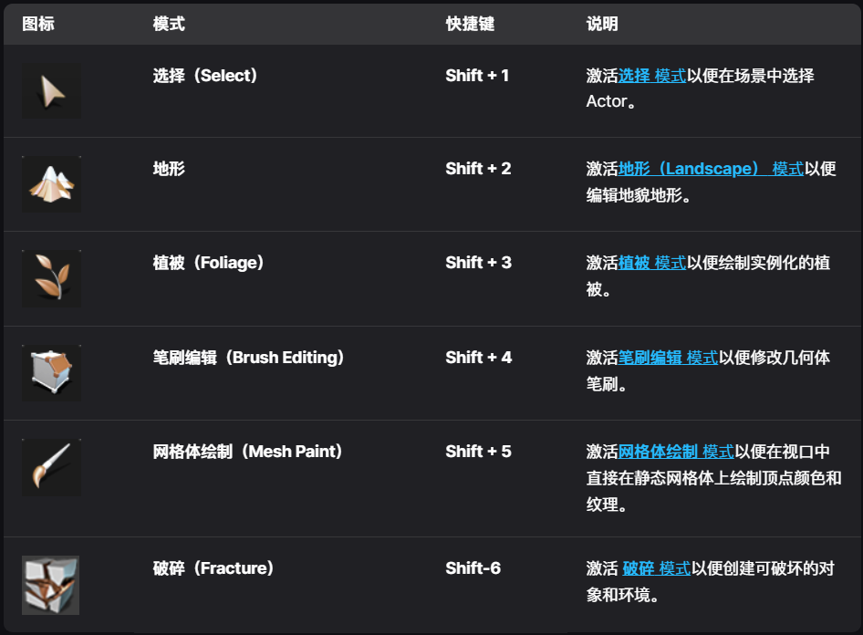

# Actor和几何体

创建关卡可以归结为在虚幻编辑器中向地图中放置对象。这些对象可能是世界几何体、以画刷形式出现的装饰物、静态网格物体、光源、玩家起点、武器或载具。什么时候添加哪些对象通常是由关卡设计团队使用的特定工作流程规定的。

> **Actor** 是一种可以放置在 **关卡（Level）** 中的对象，从游戏场景中的 **静态网格体（Static Meshes）**，到声音、摄像机、玩家角色等，都是Actor。

## 放置Actor

在关卡中放置Actor时，本质上是在关卡中创建了一个基于该Actor的 **实例（instance）** 对象。

1. 通过放置面板拖拽放置Actor
2. 通过内容浏览器放置Actor
3. 通过类查看器放置Actor

## 几何体笔刷工具

[几何体笔刷Actor-官网说明文档](https://dev.epicgames.com/documentation/zh-cn/unreal-engine/geometry-brush-actors?application_version=4.27)

> 尽管现在主要使用静态网格体来填充关卡，但几何体笔刷仍有用武之地。常用来规划关卡、简单填充几何体等

### 笔刷类型

* 添加
* 减去：使用该笔刷可在之前创建的叠加笔刷中删除实心控件，以创建门窗等项目。删减空间是玩家可自由移动的唯一区域。

若已加入几何体笔刷，但想更改笔刷类型，更改方法：

选择对应的笔刷——>找到画刷设置——>笔刷类型

* Additive：添加型
* Subtractive：减去型
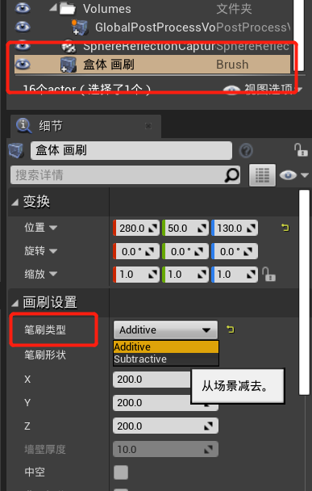

叠加或删减运算均按照笔刷的放置顺序进行，因此该顺序极为重要。

新的“添加”型 不能被旧的“减”型 减掉，即旧的不能影响新的BSP

笔刷顺序方法：

画刷设置——>排序

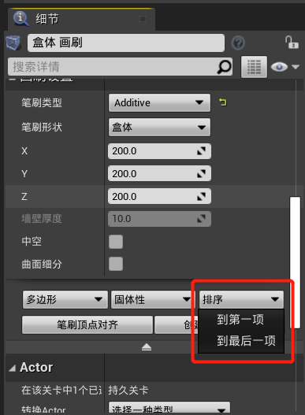

BSP的拉伸、缩放

如果使用[缩放控件](https://n1ddxc0sfaq.feishu.cn/wiki/DtWdwuP0Gi27uik1oHGc5Gu9nce#share-MDHMdlpJ1ogkyRxfgQEcHTc2nCh)缩放，材质会跟随缩放拉伸，使用细节面板中画刷设置改变X、Y、Z方向的长度，材质不会被拉伸

### BSP固体性

固体：可以阻挡角色（走路走过去会被挡住），可以是 添加型 或 挖空型
半固体：阻挡角色；只可以是添加型（之后的挖空型BSP对它无效）
非固体：不能阻挡角色；只可以是添加型（之后的挖空型BSP对它无效）

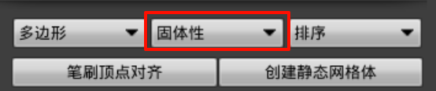

### 添加材质

先点BSP的任意一个面，点击右下角 几何体 -> 选择 -> 选择匹配的画刷，就可以快速选中此BSP所有面

可以修改表面属性，让材质更好贴合模型

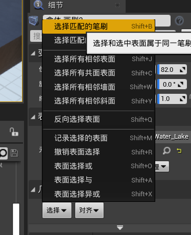

### BSP笔刷编辑

选择一个笔刷，点击笔刷编辑，可以根据点线面修改BSP。

编辑工具：

* **结合/焊接**（先选中不动的点，然后按住ctrl选择其他要结合的点，选完后点“结合”，最后只会留下第一个选中的点不动）
* **挤压**：选择一个面，挤压（拉伸），沿面的法线长出一块；
* **翻转**（选面）；**分割**（选边）；**三角剖分**（选面）；**优化**
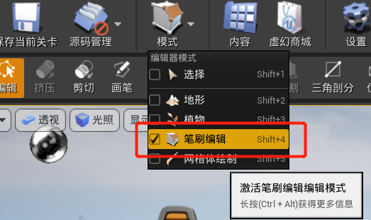

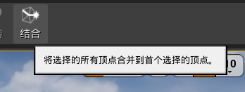

### BSP笔刷合并

在世界大纲中选中所有BSP笔刷，点击详情面板中的“合并为静态网格体”

## Actor变换

* 手动变换

输入数值

* 交互变换
  使用控件（gizmo）（widget），小工具由多个部分组成，这些部分根据所影响的轴进行颜色编码：
  * 红色表示X轴。
  * 绿色表示Y轴。
  * 蓝色表示Z轴。
  使用小工具时，通过 **网格对齐（grid snapping）** 进行精确定位。 

### 平移控件

点击箭头并拖动箭头以沿该轴移动所选Actor。

要沿两个轴同时移动Actor，请点击这两个轴的相交点，然后拖动以沿这两个轴定义的平面（XY、XZ或YZ）移动Actor。

要沿所有三个轴自由移动Actor，请在所有三个轴的相交点处点击并拖动白色球体。

### 缩放控件

将光标悬停在所有三个轴相交的立方体上，所有三个控点都会变为黄色。从这个中心立方体拖动会成比例缩放Actor。

### 世界和本地变换模式

使用交互变换法时，你可以选择在执行变换时要使用的参考坐标系。这意味着你可以根据以下任一项变换Actor：

* 世界空间 - 即，沿世界轴，或者
* Actor的本地空间 - 即，沿其本地轴。

### 调整Actor的枢轴点

变换Actor时，你通常会从Actor的基本枢轴点执行变换。如果你启用了变换小工具，则会在该小工具的三个轴相交处看到 **枢轴点**。

你可以临时调整Actor的枢轴点位置，方法是中键点击 **平移（Translation）** 小工具中心点的球体并拖动以移动枢轴点。然后，你可以绕新的枢轴点变换对象。

## 添加碰撞

1. 简单模型

双击静态网格图图标，跳转到属性界面

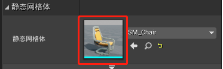

选择 碰撞 -> 碰撞复杂度 -> 将复杂碰撞用作简单碰撞，即可快速为物体设置碰撞

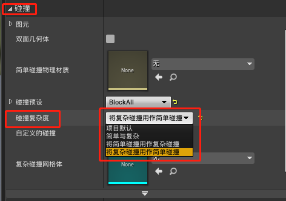

1. 复杂模型

## Actor（静态网格体）合并

在世界大纲地图中搜索：staticmesh，Ctrl+A全选

左上角——窗口——>开发者工具——>合并Actor

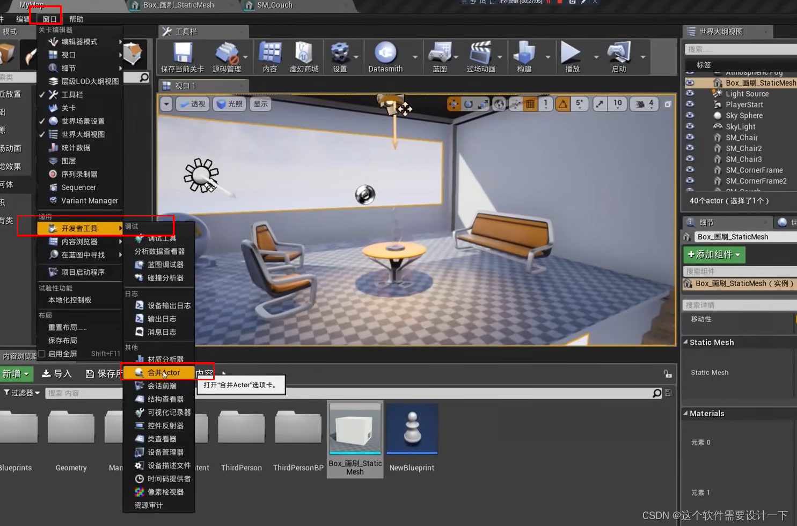

# 地形编辑

# 资产管理

[美术师快速入门 | 虚幻引擎 4.27 文档 | Epic Developer Community](https://dev.epicgames.com/documentation/zh-cn/unreal-engine/artist-quick-start?application_version=4.27)

[错误: 403 | Epic Developer Community](https://dev.epicgames.com/documentation/zh-cn/unreal-engine/assets-and-packages#%E8%B5%84%E4%BA%A7%E7%AE%A1%E7%90%86)

## 资源导入

点击导入

建模软件插件：Datesmith

## 项目迁移

选中要迁移的文件夹，右键——>迁移……——>选择目标项目的Content文件夹

注：要迁移的目标项目一定要有Content文件夹

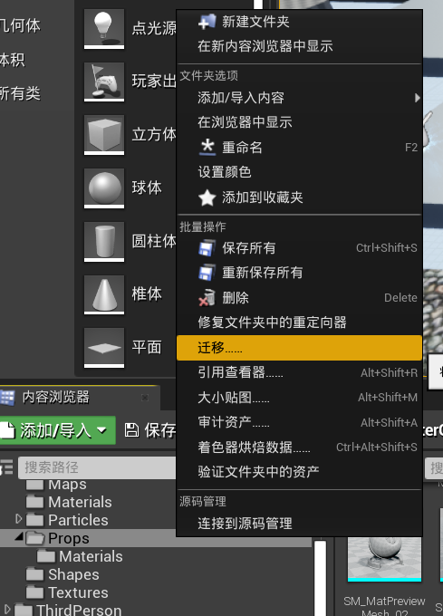

如果选择的不是文件夹，而是模型/蓝图类等，迁移……选项在资产操作中

4.24 版本资产可以批量迁移，文件夹不能批量选中迁移

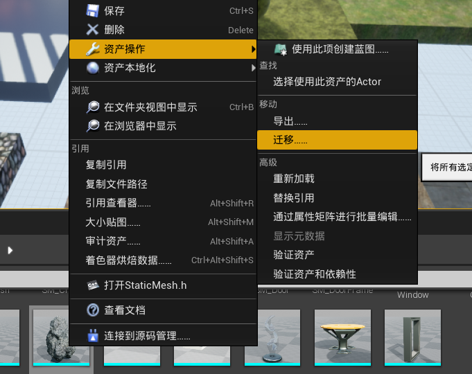

# 光照

[光照入门指南-官方说明文档](https://dev.epicgames.com/documentation/zh-cn/unreal-engine/lighting-quick-start-guide?application_version=4.27)

[光照基础-官方说明文档](https://dev.epicgames.com/documentation/zh-cn/unreal-engine/lighting-basics?application_version=4.27)

场景的光照效果通常由光源Actor实现。作为光源，光源Actor包含多种属性，可用于确定光照的各种效果，例如：

* 光照的亮度
* 光照的颜色

> 不同光源以不同方式发射光线。比如，普通的电灯泡会向四面八方发射光线。在虚幻引擎中，这类光源称为 <u>*点光源*</u>。在其他一些情况下，人们会用物理手段为光线增添一些限定，比如把灯泡的背面做成不透明材料，例如探照灯。这类光源就称之为 <u>*聚光源*</u>。 至于室外的日光，由于太阳十分遥远，因此感觉上日光更像是来自同一个方向，而非某个具体位置。要模拟这类光源，你可以使用<u> 定向光源</u>。

|静态 |每次调整灯光属性后，点击构建才开始计算色温/强度等显示效果、阴影效果 |
|---|---|
|固定 |每次调整物体/灯光属性后，会自动计算并显示色温/强度等效果，但阴影需要构建后才能重新计算 |
|可移动 |实时计算物体显示效果及阴影 |
## 自动曝光与固定曝光

在后处理期间激活曝光的情况下游戏时，您会注意到从较亮区域移至较暗区域（反之亦然）会导致摄像机临时进行调整，这类似于我们的眼睛在注视不同光线环境时发生的调整。在大多数情况下，这是期望的结果。但是，如果特定关卡中不断变化会分散玩家的注意力，那么您可将视图设置为采用固定曝光。这将锁定曝光，使其不再随着您从较亮区域移至较暗区域或者从较暗区域移至较亮区域而自动变化，但也意味着很容易产生光线对于您需要完成的工作而言过亮或过暗的情况。

# 材质

## 材质表达式节点与网络

关于材质，您需要知道的第一件也是最重要的事情就是，它们并非通过代码，而是通过材质编辑器中的可视化脚本节点（称为材质表达式）所组成的网络来构建。每一个节点都包含 <u>[HLSL 代码](http://en.wikipedia.org/wiki/High_Level_Shader_Language)</u> 片段，并用于执行特定的任务。这意味着当您构建材质时，您是在通过可视化脚本编程来创建 HLSL 代码。

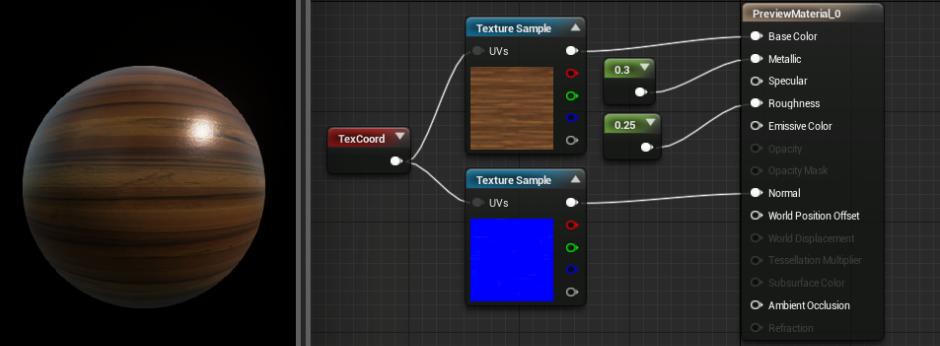

在这个例子中，我们有一个非常简单的网络，它用来定义硬木地板。然而，材质表达式网络并非如此简单。有些材质经常会包含数十个材质表达式节点。

您可以在 <u>[材质表达式参考](https://dev.epicgames.com/documentation/zh-cn/unreal-engine/material-expression-reference?application_version=4.27)</u> 中找到有关所有可用材质表达式的文档。

## 使用颜色和数字

# 蓝图 Blueprint

[蓝图--官方说明文档](https://dev.epicgames.com/documentation/zh-cn/unreal-engine/blueprint-visual-scripting?application_version=4.27)

## **蓝图的用法**

在其基本形式中，蓝图是游戏的可视化脚本附加。使用引线连接节点、实践、函数和变量后即可创建复杂的游戏性元素。

蓝图使用节点图表来达到蓝图每个实例特有的诸多目的（如目标构建、个体函数，以及通用gameplay事件），以便实现行为和其他功能。

## **常用蓝图类型**

最常使用的蓝图类型是 **关卡蓝图** 和 **蓝图类**。

它们仅是诸多[蓝图类型](https://dev.epicgames.com/documentation/zh-cn/unreal-engine/types-of-blueprints?application_version=4.27)中的两类，其他还有[蓝图宏](https://dev.epicgames.com/documentation/zh-cn/unreal-engine/blueprint-macro-library?application_version=4.27)及[蓝图界面](https://dev.epicgames.com/documentation/zh-cn/unreal-engine/blueprint-interface?application_version=4.27)。

## **关卡蓝图**

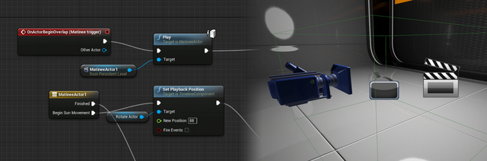

关卡蓝图的作用与虚幻引擎3中Kismet的相同，两者功能相同。每个关卡拥有各自的关卡蓝图，其可在关卡中引用并操作Actor、使用Matinee Actor控制过场动画，还能对关卡流送、检查点及其他关卡相关系统等事务进行管理。此外，关卡蓝图还能与关卡中放置的蓝图类（参见下一部分中的范例）进行交互，例如读取/设置其可能包含的变量，或触发其中的自定义事件。

## **蓝图类**

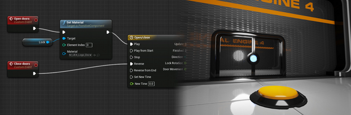

蓝图类是创建门、开关、可收集物品、可摧毁场景等交互资源的理想类型。在上图中，按钮和门组合为单独的不同蓝图，其中包含必需脚本，以响应玩家覆盖事件、使其拥有动画、播放音效，并改变材质（如按下按钮后其将变亮）。

在此情况中，按下按钮将触发门蓝图中的事件，门因此开启——但其他类型的蓝图或关卡蓝图序列同样可轻易触发门的事件。因蓝图的自含性质，将其拖入关卡中便可构建蓝图，进行最小设置后即能生效。这也意味着对项目中使用的蓝图进行编辑后，该项目的所有实例均会更新。

