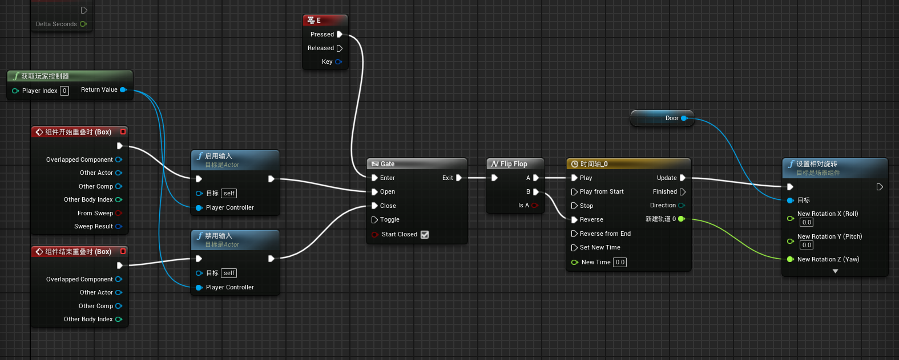
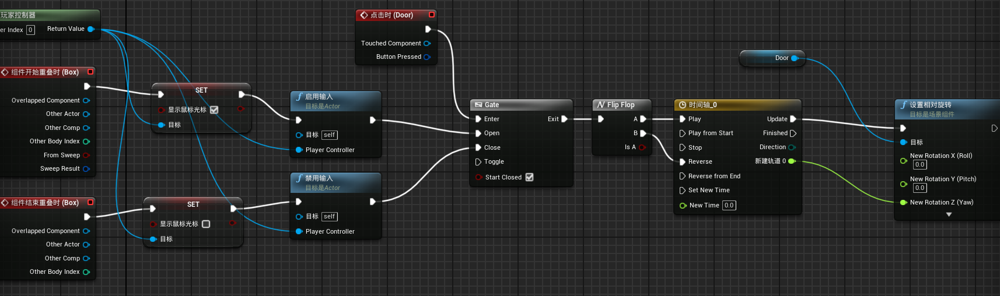
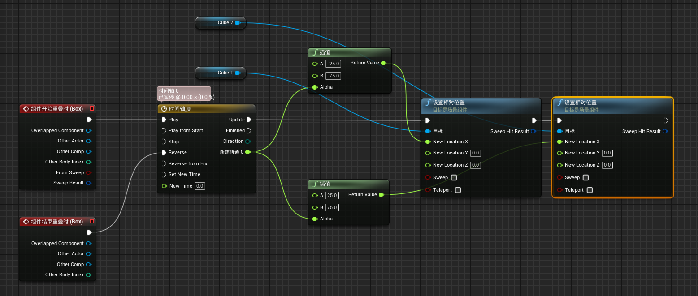
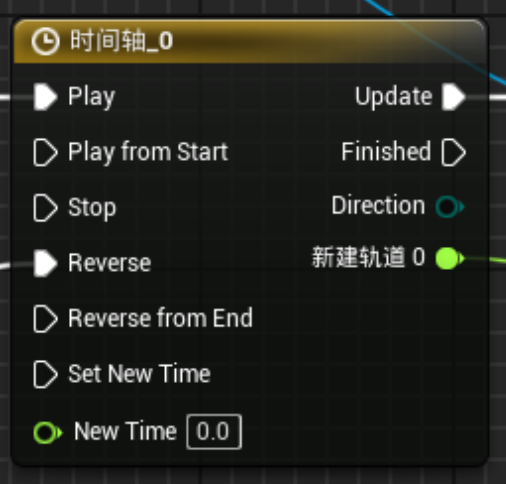
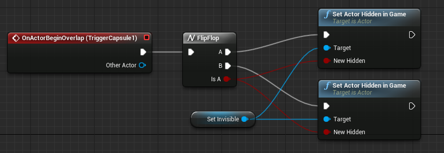
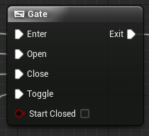

# 蓝图

[别人的笔记本](https://www.cnblogs.com/wjjgame/p/16816149.html)

# 案例

## 制作一个触发开关门

1. 首先给门加一个碰撞

## 拾取钥匙开门

## 分楼层电梯

# 节点总结

## 时间轴

* Play：正向播放时间轴
* Play from Start：从时间轴的第一个关键帧播放
* Stop：停止
* Reverse：反向播放
* Reverse from End：从最后一个关键帧开始反向播放
* Set New Time：设置新的开始播放时间（自定义的）
* Update：每帧每秒的更新（设置作用的对象）
* Finished：时间轴跑完了要触发什么
* Direction：方向的判定（判定时间轴是正向的还是反向的）（不太清楚）

## 流程控制节点

[虚幻引擎中的流程控制 | 虚幻引擎 5.5 文档 | Epic Developer Community](https://dev.epicgames.com/documentation/zh-cn/unreal-engine/flow-control-in-unreal-engine)

### **FlipFlop**

**FlipFlop** 节点取入执行输出并在两个执行输出间切换。 

其第一次被调用时，将会输出A。 第二次被调用时，将会输出B，然后再是A，然后又是B，循环往复。

该节点同时有布尔变量输出，使您可以追溯输出A何时被调用。

|输入引脚 | |
|---|---|
|(Unlabeled) |该执行输入会触发FlipFlop。 |
|**输出引脚** | |
|A |该输出引脚在首次及之后FlipFlop被触发的每个奇数次被调用。 |
|B |该输出引脚在第二次及之后FlipFlop被触发的每个偶数次被调用。 |
|Is A |输出布尔变量值，以表明输出A是否被触发。 这个函数生效后，将会在每次FlipFlop节点被触发后，在 `true` 和 `false` 间切换。 |

### **Gate**

**Gate（门）** 节点用来开启和关闭执行流。 Enter输入取入执行脉冲，同时门的当前状态（开启或关闭）将会决定这些脉冲是否从Exit输出中传出。

在此简单示例中，一条没有轨迹的时间轴， 同时启用了自动播放并激活了循环，将对门节点的Enter输入引脚进行更新。 关卡中有两个触发器。 一个触发器开门，另一个关门。如门为开启状态，执行脉冲会离开Exit引脚，此时Print String（输出字符串）被调用，它会登记一条信息到屏幕上。 当玩家触碰Close（关闭）触发器时，门会关闭并且信息会停止显示。 如果随后触碰Open（开启）触发器，该信息会再次出现。

|输入引脚 | |
|---|---|
|Enter |此执行输入表示任何由门控制的执行。 |
|Open |此执行引脚设置门的状态为 *open* （开启），使执行脉冲传送到Exit输出引脚。 |
|Close |此执行引脚设置门的状态为 *closed* （关闭），使执行脉冲停止传送到Exit输出引脚。 |
|Toggle |此执行引脚反向转换门的当前状态。 *Open* （开启）变成 *closed* （关闭），反之亦然。 |
|Start Closed |此布尔变量输入决定了门的起始状态。 如设置为 *true* ，则门的初始状态为关闭。 |
|**输出引脚** | |
|Exit |如果门的当前状态为 *open* （开启），则任何流入Enter输入引脚的执行脉冲将会离开Exit输出引脚。 如门为 *closed* （关闭）状态，则Exit引脚将无法产生作用。 |

