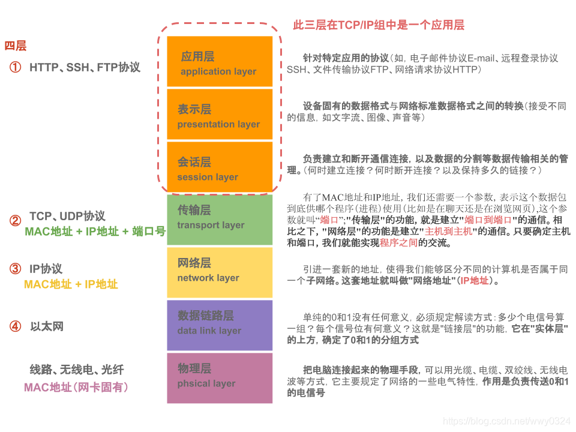

# 0 网络基础知识

OSI七层模型

## TCP/IP四层模型

> TCP/IP（Transmission Control Protocol/Internet Protocol，传输控制协议/网际协议）是指能够在多个不同网络间实现信息传输的协议簇。
> TCP/IP协议不仅仅指的是TCP 和IP两个协议，而是指一个由FTP、SMTP、TCP、UDP、IP等协议构成的协议簇， 只是因为在TCP/IP协议中TCP协议和IP协议最具代表性，所以被称为TCP/IP协议。

* TCP/IP是在网络的使用中的最基本的通信协议。
* TCP/IP传输协议对互联网中各部分进行通信的标准和方法进行了规定。
* TCP/IP传输协议是保证网络数据信息及时、完整传输的两个重要的协议。
* TCP/IP传输协议是严格来说是一个四层的体系结构，<mark style="background-color: #F2F3F5">应用层、传输层、网络层和数据链路层都</mark>包含其中。
* TCP/IP 层级模型结构，应用层之间的协议通过逐级调用传输层（Transport layer）、网络层（Network Layer）和物理数据链路层（Physical Data Link）而可以实现应用层的应用程序通信互联。

