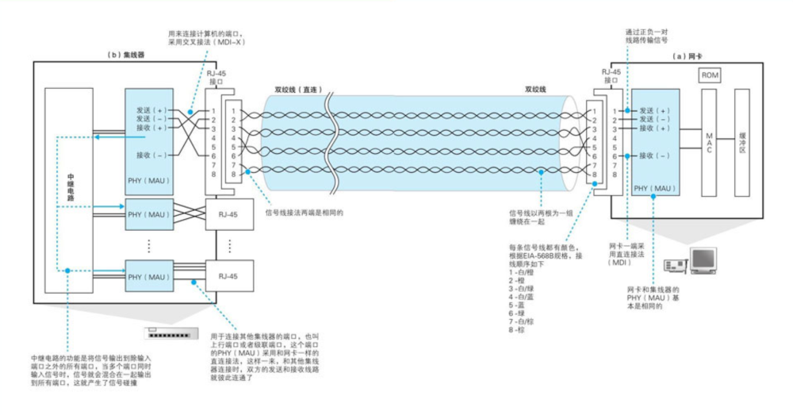
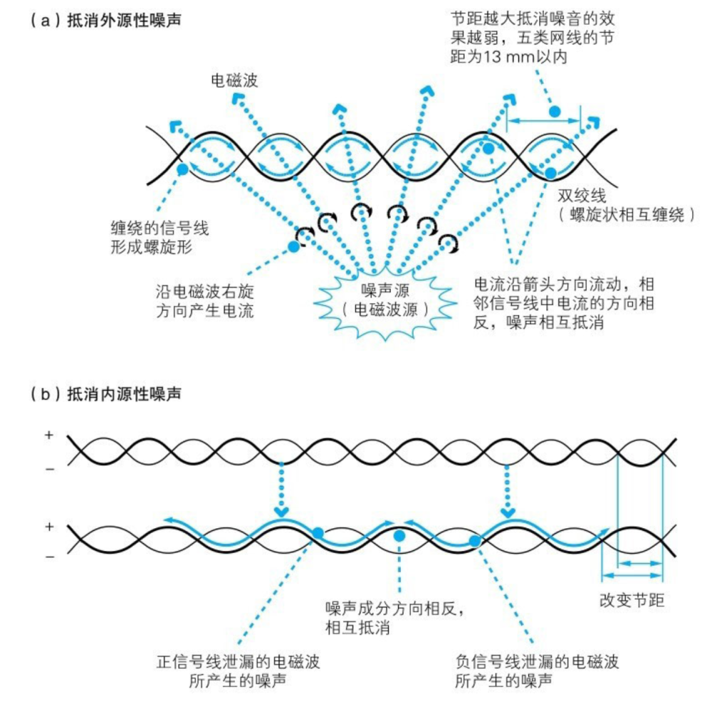
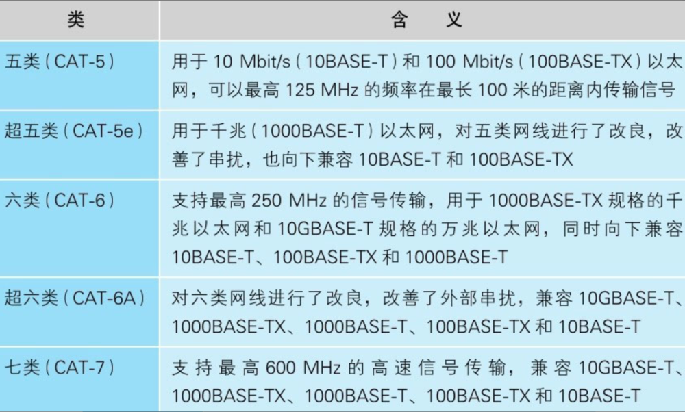
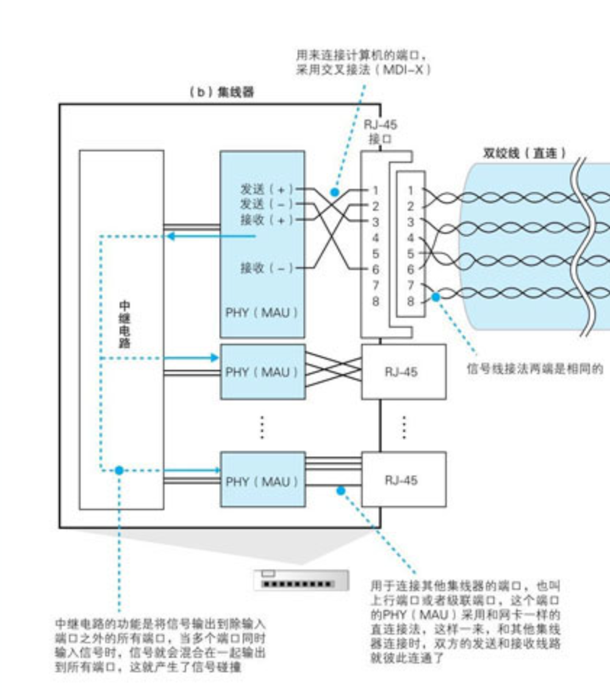

# 1 物理层

> 建立、维护、断开物理连接。（由底层网络定义协议）
> 机械、电子、定时接口通信信道上的原始比特流传输

# 知识点

|传输介质 |网线/光纤/空气 |
|---|---|
|单位 |比特bit    |
|换算 |8bit=1Byte 1024B=1KB 1024KB=1MB |
|信号 |模拟信号、数字信号、光信号  （利用放大器和中继器） |
|光纤类型 |单模光纤 黄色 |
| |多模光纤 橙色/蓝色 |
|网线/双绞线 |5类双绞线 |
| |超5类 |
| |6类 7类 |
|RJ45网线水晶头 |**线序标准：**T568A：白绿、绿、白橙、蓝、白蓝、橙、白棕、棕T568B：白橙、橙、白绿、蓝、白蓝、绿、白棕、棕 |
|网线用途分类 |1. **交叉线：**一个A一个B 同种设备间使用（三层以上的设备为同一种设备）
 |
| |1. **直通线：**两端都是A或都是B 不同种类设备间使用
 |
| |1. **全反线：**一端为A，另一端为反A，也称console线
 |
|传输速录 |**E**thernet 10Mb/s**F**astEthernet 100Mb/s**G**igabitEthernet 1000Mb/s**T**enGigabitEthernet 10000Mb/s |
|f 0/1 |模块编号/接口号 |
|接口速率自适应 |1000/100/10M自适应速率工作模式可以为10，100，1000任何一种状态 |
|端口状态 |up/down |
|down三种可能 |人工down掉 |
| |速率不匹配 |
| |**双工**模式不匹配 （duplex） |
|双工模式 |单工、半双工、全双工 |
|半双工 |能够双向通信，但不能同时通信 |
# 信号在网线中的传输

网卡中的PHY(MAU)模块负责将包转换成电信号，信号通过RJ-45接口进入双绞线。

电信号的频率越高，能量损失越大。方形的信号拐角会变圆

## 防止信号衰减的方法

### **噪声的产生**

网线周围有电磁波

电磁波接触金属等导体，就会产生电流

### **影响网线的电磁波**

电磁波接触到信号线时，会沿电磁波传播的右旋方向产生电流，这种电流会导致波形发生失真

由电机、荧光灯、CRT显示器等设备泄露出来的电磁波——使用双绞线

从网线相邻的信号线泄露出来的电磁波（串扰）——双绞线的缠绕方式

### **抑制噪声的原理**

**双绞线抑制：**将信号线缠绕在一起，信号线编程螺旋状，其中两根信号线中产生的噪声电流方向相反，使得噪声电流互相抵消，噪声得到抑制

在一根网线中，每一对信号线的扭绞间隔（节距）都有一定的差异，使得在某些地方正信号线距离近，另一些地方负信号线距离近

由于正负信号线产生的噪声影响是相反的，故两者就会相互抵消

## **双绞线的种类**

## 集线器

1. **作用：**负责按照以太网的基本架构将信号广播出去
2. **以太网的基本架构：**将包发到所有的设备，然后由设备根据接收方的MAC地址来判断应该接受哪个包
3. **内部结构：**

每个接口后面装有和网卡中的PHY功能相同的模块

“发送线路”和“接收线路”连接起来——交叉接线

MDI/MDI-X（Media Dependent Interface）MDI：直连接线；MDI-X：交叉接线

中继电路：将输入的信号广播到集线器的所有端口上

1. 接收信号的设备（交换机、路由器、服务器）会将接收到的信号转换成数字信息，然后通过FCS校验发现错误，并将出错的包丢弃。
