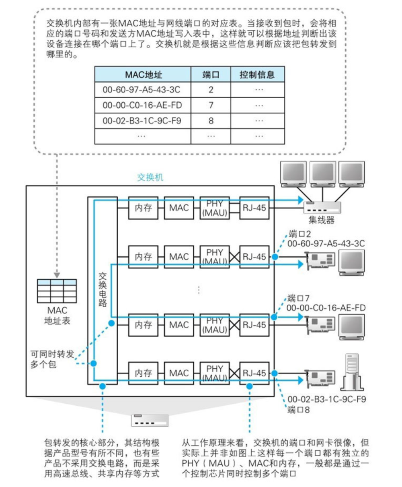

# 2 数据链路层

# 基本概念

> <mark style="background-color: #F2F3F5">建立逻辑连接、进行硬件地址寻址、差错校验 [3] 等功能。（由底层网络定义协议）将比特组合成字节进而组合成帧，用MAC地址访问介质，错误发现但不能纠正。物理寻址、同时将原始比特流转变为逻辑传输线路</mark><mark style="background-color: #F2F3F5">**地址解析协议**</mark><mark style="background-color: #F2F3F5">：ARP、PARP（反向地址转换协议）</mark>


2层 **Data Link Layer**

1. 传输单元：帧
2. 帧结构


1. 帧头：6+6+2=14 字节
2. MTU：1500字节
3. 帧尾：4字节
4. 帧头：目标mac 源MAC 类型
5. 类型的作用：识别上层协议
6. 0x0800：上层为IP协议
7. 0x0806：上层为ARP协议
8. 工作在数据链路层的设备：交换机/网卡
9. 交换机工作原理


1. 收到一个数据帧后，首先学习帧中的源MAC地址来形成MAC地址表
2. 然后检查帧中的目标MAC地址，并匹配MAC地址表
3. 如表中有匹配项，则单播转发
4. 如表中无匹配项，则除接收端口外广播转发
    1. MAC地址表的老化时间默认是300秒（可修改）

# 交换机基本工作模式及命令

### 交换机的内部结构



### 交换机相关命令

第一次配置网络设备，需要使用console线，在PC上需要使用“超级终端”或其他软件


```C
**//几种模式切换
1. enable              //进入特权模式
2. configure terminal  //进入全局配置模式
3. interface f0/1      //进入接口配置模式
4. line console 0      //进入console线控制台模式

//基本命令
1. end       //直接退到特权模式
2. exit      //退出一级
3. tab       //补全键
4. conf t 
         hostname sw1   //配置主机名
5. line co 0
   password 密码
         login 
   exit 

//快捷键
1. ctrl+u   //快速删除光标前所有字符
2. ctrl+a   //快速定位光标到行首
3. ctrl+e   //快速定位光标到行尾**
```

#### **用户模式**

1. switch> 可以查看交换机的基本简单信息，且不能做任何修改配置
2. **特权模式**
3. 进入特权模式： switch> enable
switch#
4. 可以查看所有配置，且不能修改配置，但可做测试、保存、初始化等操作

#### **全局配置模式**

1. 进入：switch# **configure terminal**
2. switch(config)#
3. 默认不能查看配置**，可以修改配置，且全局生效**
4. 接口配置模式
5. 进入：switch(config)# interface f0/1
6. switch(config-if)#
7. 默认不能查看配置**，可以修改配置，且对该端口生效**
8. console口/线/控制台模式
9. 进入：switch(config)# line console 0
10. 默认不能查看配置**，可以修改配置，且对console端口生效**
11. exit 退出一级
12. end直接退到特权模式
13. 支持命令缩写
14. ？的用法
15. 历史命令
16. tab补全键
17. 配置主机名
**conf t**
18. hostname sw1 交换机编号
19. 设置用户密码


```C++
**line co 0
password 密码
login
exit**
```

1. 在内存中存在一个文件：running-config 运行配置文件
第一次开机/被初始化之后的系统，系统会在内存中自动创建一个新的干净的running-config
2. 保存配置：


```
**en 
copy running-config startup-config
write （memoty）**
```

#### 交换机开机动作：

1. 先去硬盘中查找startup-config是否存在，若不存在，在内存中创建新的running-config文件 ；若存在，复制到内存中并改名为running-config
#### 查看running-config配置


```C
**//查看running-config配置
en
show running -config 
show run

//重启设备
en
reload**
```

#### 配置特权密码


```C
**conf t
enable  password 密码  //明文
enable  secret  密码  //密文**
```

1. 删除配置
1* 在哪配置的在哪删
2* 命令前加no空格
3* 原命令中有参数，并且参数具有唯一性，则删除时不需要加参数


```C
**en
erase startup-config  

no 命令   //删除命令
//命令在哪配在哪删

conf t 
hostname sw1
conf t
no hostname**
```

#### 查看MAC地址表


```C
**show mac-address-table   

show ip interface brief  //查看接口的简要信息
sh ip int b              //简写

int f0/x   
   shutdown                 //手工关闭接口
    exit 

   no shutdown              //手工开启接口

do sh run  //强制查看
do sh ip int b
do wr**
```

1. do的用法：其他模式加do空格可以强制使用特权模式的命令

#### 为3层端口配置IP


```C++
**int F0/1
ip add 10.1.1.1 255.255.255.0
no shutdown**
```

#### 开启远程控制


```C++
**//第一种
conf t
line vty 0 4
        transport input telnet/ssh/none/all
        password  密码
        login 
        exit

//第二种
conf t
hostname r1
ip domain-name r1.cs.com
crypto key generate rsa    //生成密钥对
line vty 0 4
        transport input telnet/ssh/none/all
        login local
        exit
username xx password 123.com
username sa password 234.com**
```

#### 为交换机配置管理IP


```C++
**conf t
int vlan 1
        ip add 10.1.1.253  255.255.255.0**
```

1. 为交换机配置默认网关
2. 目的：可被跨网段管理


```C++
**conf t 
ip default-gateway  10.1.1.254**
```

#### 关闭自动解析功能


```C++
**conf t
no ip domain-lookup**
```

练习：

1. 成功实现在PC上telnet或ssh远程连接到路由器上，其中只做login验证
2. 成功实现在PC上telnet或ssh远程连接到路由器上，其中做login local验证


