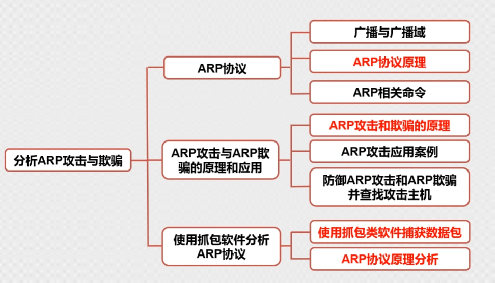

# ARP协议

# 概念

ARP协议作用：**在已知对方IP地址的情况下解析成MAC地址**

## 广播与广播域概述

广播：将广播地址作为目的地址的数据帧

广播域：网络中能接收到同一广播所有节点的集合

**MAC地址广播**广播地址：FF-FF-FF-FF-FF-FF

**IP地址广播****：**255.255.255.255
广播IP地址为IP地址网段的广播地址 如 192.168.1.255/24

# ARP协议

Address Resolution Protocol—**地址解析协议：将一个已知的IP地址解析成MAC地址**

**ARP请求报文 3层**

## 工作过程

假设主机A和主机B在同一网段，主机A要向主机B发送信息，具体的地址解析：

1. 主机A查看自己的ARP表，确定是否有主机B对应的ARP表项，若有，则直接利用表中的MAC地址，封装IP数据包并发送至主机B
2. 若没有，则缓存该数据报文，发送ARP广播请求：我是10.1.1.1 ，我的MAC是 AA，谁是10.1.1.3，你的MAC
<span style="color: #E0E1E4">注：arp请求报文：主机A IP地址 + MAC地址 + 主机B IP地址 + 全0的MAC地址</span>
3. 主机B比较目标IP，若与自己IP地址相同，则将ARP请求报文中的主机A的IP地址和MAC地址存入自己的ARP表中，以单播的方式发送ARP响应报文给主机A（包含了自己的MAC地址）
4. 主机A收到响应报文后，将主机B的MAC地址加入自己的ARP表中，同时将IP数据包封装后发送出去<span style="color: #F9D8B1"><mark style="background-color: #FAF390">（谁后到达学谁）</mark></span>

## ARP缓存查看


```C++
arp -a
```

## 动态ARP表

<span style="color: #E0E1E4">动态ARP表项由ARP协议通过ARP报文自动生成和维护，可以被老化，可以被新的ARP报文更新，可以被静态ARP表项覆盖。当到达老化时间、接口down时会删除相应的动态ARP表项。</span>

## 静态ARP表

<span style="color: #E0E1E4">静态ARP表项通过手工配置和维护，不会被老化，不会被动态ARP表项覆盖。</span>

<span style="color: #E0E1E4">配置静态ARP表项可以增加通信的安全性。静态ARP表项可以限制和指定IP地址的设备通信时只使用指定的MAC地址，此时攻击报文无法修改此表项的IP地址和MAC地址的映射关系，从而保护了本设备和指定设备间的正常通信。</span>

## 免费ARP

<span style="color: #E0E1E4">主机发送ARP查找自己的IP地址，通常发生在系统引导期间进行接口配置时。与标准ARP的区别就是免费ARP分组的目的IP地址字段封装的是自己的IP地址，即向所在网络请求自己的MAC地址。</span>

作用

* <span style="color: #E0E1E4">通过它来确定另一个主机是否设置了相同的 IP地址</span>
* <span style="color: #E0E1E4">更新其他主机高速缓存中旧的硬件地址信息</span>
* <span style="color: #E0E1E4">[网关](https://so.csdn.net/so/search?q=%E7%BD%91%E5%85%B3&spm=1001.2101.3001.7020)</span><span style="color: #E0E1E4">利用免费ARP防止ARP攻击</span>
* <span style="color: #E0E1E4">利用免费ARP进行ARP攻击</span>
## 内网攻击

1. 当发现目标IP地址在同一网段时，会直接发送ARP请求报文，请求目标MAC地址；
2. 若不在同一网段时，会发送ARP请求报文，但会寻找网关MAC地址，送到网关

# ARP攻击原理



# ARP欺骗原理

🙌🏻 通过发送伪造的虚假的ARP报文（广播或单播）实现攻击或欺骗 如虚假报文的MAC是伪造的不存在，实现的ARP攻击，结果为中断通信/断网 如虚假报文的MAC是攻击者自身的MAC，实现的ARP攻击，结果可以为监听、窃取、篡改、控制流量，但不中断通信

ARP协议没有验证机制

ARP攻击者通过发送虚假伪造的arp报文对受害者进行ARP缓存

<span style="color: #E0E1E4">长角牛网络监控机</span>

<span style="color: #E0E1E4">cain 欺骗</span>

# ARP攻击防御

1. **静态ARP绑定**
手工绑定/双向绑定
windows：
arp -s 10.1.1.254 00-3c-df-d3-d7-55
2. **ARP防火墙**
自动绑定静态ARP
主动防御
3. **硬件级ARP防御**交换机支持**端口**做动态ARP绑定（配合DHCP服务）
或做静态ARP绑定


```C++
conf t
ip dhcp snooping   //开启DHCP监听功能
int range  f0/1 - 48   //思科 锐捷
switch(config-if-range)
```


