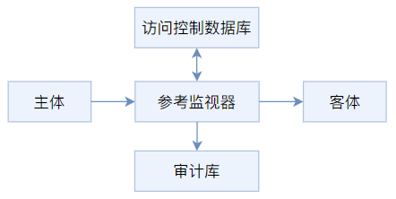

# 第七章 访问控制技术原理与应用

# 概述

## 访问控制概念

对网络上的资源进行授权和限制，只有经过授权的用户才能以合规的方式进行使用，避免未经授权使用

> 访问控制是指对资源对象的访问者授权、控制的方法及运行机制

### 访问控制目标

* 防止非法用户进入系统
* 阻止合法用户对系统资源的非法访问（越权访问）

### 访问控制模型

访问控制参考模型

### 组成要素

* 主体Subject：：操作实施者，人、进程或设备
* 参考监视器（Reference Monitor）：是访问控制的决策单元和执行单元的集合体，<u>监督主体和客体之间的授权访问行为</u>，并将重要的安全事件存入审计文件之中。
* 客体 Object：通常，对一个客体的访问隐含着对其信息的访问
* 访问控制数据库：记录主体访问客体的<u>权限及其访问方式</u>的信息，提供访问控制决策判断的依据，也称为访问控制策略库。该数据库随着主体和客体的产生、删除及其权限的修改而动态变化。
* 审计库：存储主体访问客体的<u>操作信息</u>，包括访问成功、访问失败以及访问操作信息。
# 访问控制类型

自主访问控制

自主访问控制（DiscretionaryAccessControl，DAC）是指<u>客体的所有者</u>按照自己的安全策略授予系统中的其他用户对其的访问权。

## **基于行的自主访问控制**

在每个<u><mark style="background-color: #F9D8B1">主体上都附加</mark></u>一个该主体可访问的客体的明细表，根据表中信息的不同又可分成三种形式，即<mark style="background-color: #D4C1F3">能力表（capabilitylist）、前缀表（profiles）和口令</mark>（password）

* **能力表**：决定用户能否对客体进行访问以及具有何种访问模式（读、写、执行）。
* **前缀表**：包括受保护客体名和主体对它的访问权
* **口令**：主体在对客体进行访问前，必须向系统提供该客体的口令。如果正确，它就可以访问该客体。
## **基于列的自主访问控制**

基于列的自主访问控制机制是在每个<u><mark style="background-color: #F9D8B1">客体上都附加</mark></u>一个可访问它的主体的明细表，它有两种形式，即<mark style="background-color: #D4C1F3">保护位（protectionbits）和访问控制表（AccessControlList，ACL）。</mark>

* 保护位：这种方法通过对所有主体、主体组以及客体的拥有者指明一个访问模式集合，通常以比特位来表示访问权限。UNIX/Linux使用
* 访问控制表：在每个客体上都附加一个主体明细表，表示访问控制矩阵

【参考阅读：[信息安全中的访问控制](https://zhuanlan.zhihu.com/p/151618654)】

