# 第三章 密码学概论

# 密码学概况

* 密码学由密码编码和密码分析两部分组成
* **密码编码学：**研究信息的变换处理以实现信息的安全保护
* **密码分析学：**研究通过密文获取对应的明文信息
## 基本概念

* 明文、密文；
* 加密、解密；
* 加密算法、解密算法；
* 加密密钥、解密密钥
## 密码系统分类

<span style="color: #C0ECBC">按照密码系统</span><u><span style="color: #C0ECBC">对明文的处理方法</span></u><span style="color: #C0ECBC">，密码系统可以分为</span><u><span style="color: #C0ECBC">分组密码系统</span></u><span style="color: #C0ECBC">和</span><u><span style="color: #C0ECBC">序列密码系统</span></u>

### 分组密码系统

1. <span style="color: #E0E1E4">**分组密码**</span><span style="color: #E0E1E4">是每次只能处理特定长度的一块数据的一类密码算法，这里的“一块”就称为</span><span style="color: #E0E1E4">**分组**</span><span style="color: #E0E1E4">。一个分组的比特数就称为</span><span style="color: #E0E1E4">**分组长度**</span>。最新一代分组密码长度为128位，加密128位明文产生128位密文。分组密码是可逆的，<span style="color: #C0ECBC">明文和密文的长度被称为分组长度</span>。
2. 可以把分组密码看作一个庞大的密钥映射表，对于任何固定的密钥，可以计算出一个查找表，用于明文到密文的映射，包含了所有可能的密文值一次。（置换）包括了所有元素的重新排列。一个分组长度为k位的分组密码对每一个密钥都对应一个k位值的置换。
3. 分组密码输出的密文一般不是明文字符串直接置换的值。例：010000选择不同密钥加密可得密文：11011110
4. <span style="color: #D4C1F3">**常用的工作模式包括：**</span>
    * ECB模式：Electronic CodeBook mode 电子密码本模式
    * CBC模式：Cipher Block Chaining mode 密码分组链接模式
    * CFB模式：Cipher FeedBack mode 密文反馈模式
    * OFB模式：Output FeedBack mode 输出反馈模式
    * <span style="color: #E0E1E4">CTR模式：CounTER mode 计数器模式</span>

<span style="color: #C7D5F6">【参考阅读：</span><span style="color: #C7D5F6">[分组密码的模式——ECB、CBC、CFB、OFB、CTR](https://blog.csdn.net/weixin_43946212/article/details/108116251)</span><span style="color: #C7D5F6">】</span>

#### ECB模式

特点：<span style="color: #C0ECBC">明文分组和密文分组一一对应</span>

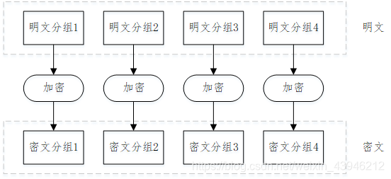

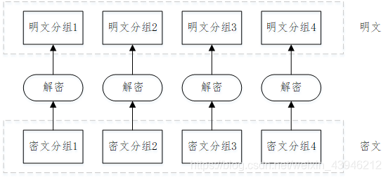

#### CBC模式

<span style="color: #E0E1E4">CBC模式中，</span><span style="color: #C0ECBC">首先将明文分组与</span><span style="color: #C0ECBC">**前一个密文分组**</span><u><span style="color: #C0ECBC">进行XOR运算</span></u><span style="color: #C0ECBC">，然后再进行加密。</span>

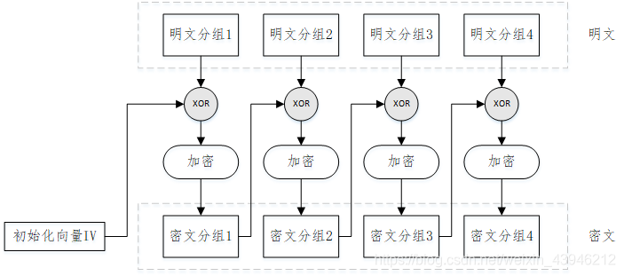

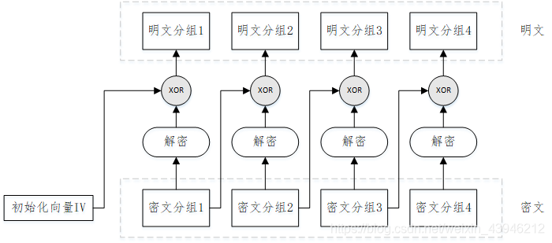

#### CFB模式

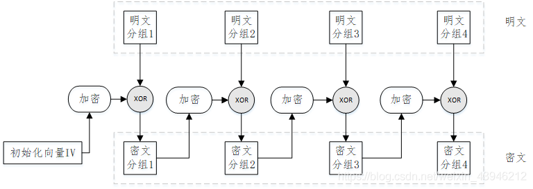

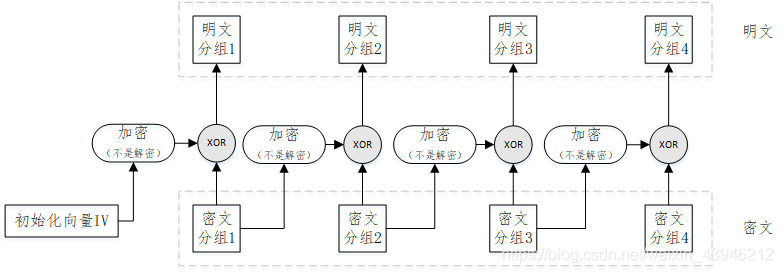

#### OFB模式

在OFB模式中，密码算法的输出会反馈到密码算法的输入中。

OFB模式并不是通过密码算法对明文直接进行加密的，而是通过<u><span style="color: #C0ECBC">将“明文分组”和“密码算法的输出”进行XOR来产生“密文分组”的</span></u>，这点与CFB模式相似。

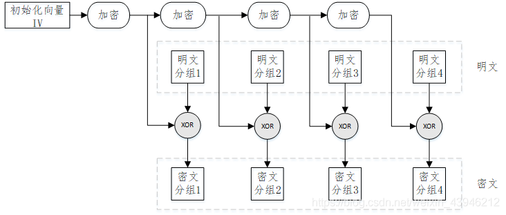

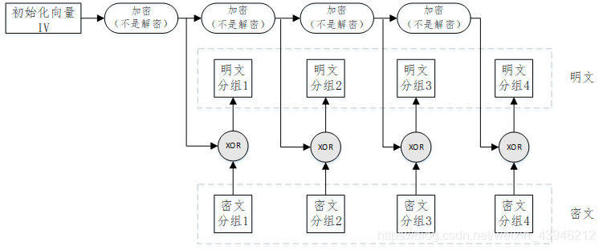


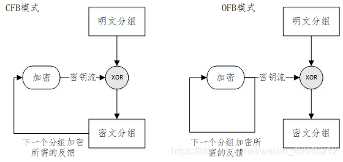

#### CTR模式

通过<u><span style="color: #C0ECBC">将逐次累加的计数器进行加密</span></u>来生成密钥流的流密码。最终的密文分组是通过将计数器加密的到的比特序列，与明文分组进行XOR而得到的。


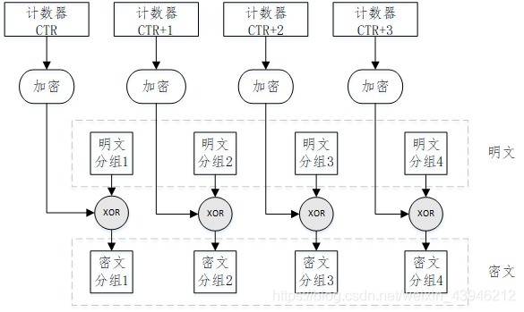

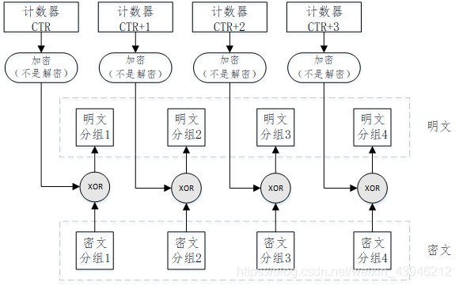

计数器的生成方法，前8个字节为<u>nonce</u>，这个值在每次加密时必须时不同的。后8个字节为分组序号，这个部分逐次累加。

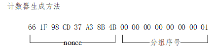

#### **OFB模式与CTR模式的对比**

* 两者都是流密码。
* OFB模式是将加密的输出反馈到输入，CTR模式是将计数器的值用作输入
* **CTR模式的特点：**CTR模式的加密华为解密使用了完全相同的结构；可以以任意顺序对分组进行加密和解密；可以实现并行计算；在支持并行计算的系统中，CTR模式速度非常快。

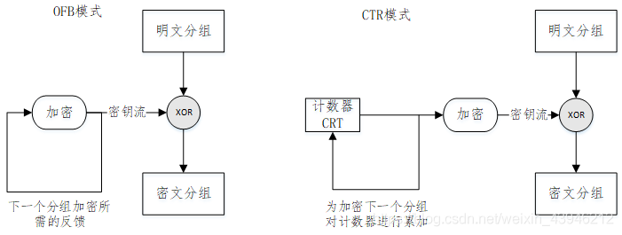

#### 分组密码系统对比表

加密方式：

数字签名

公钥加密

会话加密（对称加密）

链路加密

端对端加密

# 密码分析攻击类型

1. 唯密文攻击（ciphertext-only attack）密码分析者只拥有一个或多个用同一个密钥加密的密文，没有其他可利用的信息
2. 已知明文攻击（known-planintext attack）密码分析者仅知道当前密钥下的一些明文及所对应的密文
3. 选择明文攻击（chosen-plaintext attack）密码分析者能得到当前密钥下自己选定的明文对应的密文
4. 密文验证攻击（ciphertext verification attack）密码分析者对于任何选定的密文，能够得到该密文是否“合法” 的判断
5. 选择密文攻击（chosen-ciphertext attack）除了挑战密文外，密码分析者能得到任何选定的密文所对应的明文

# 密码体制分类

## 私钥密码体制（对称密码体制）

* 特点：**加密和解密使用相同的密钥**
* 当用户应用这种体制时，消息的发送者和接收者必须事先通过安全渠道交换密钥，以保证发送消息或接收消息时能够有供使用的密钥。
* 双方都需要安全保管密钥，防止非法用户读取
* 缺点：密钥分配问题（分别必须使用安全渠道）、密钥管理问题、无人认证源
* <mark style="background-color: #C0ECBC">常见：</mark><mark style="background-color: #C0ECBC">**DES（已被AES取代）、IDEA、AES**</mark>

## 公钥密码体制（非对称密码体制）

* 原理：在加密和解密的过程中使用不同的密钥处理方式，其中，加密密钥可以公开，而只需要把解密密钥安全存放即可。

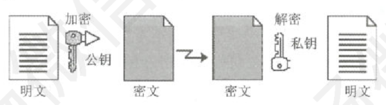

* 优点：
  * 钥分发方便，能以公开方式分配加密密钥
  * 密钥保管量少
  * 支持数字签名
* <mark style="background-color: #C0ECBC">常见：</mark><mark style="background-color: #C0ECBC">**RSA体制、ELGamal体制、椭圆曲线密码体制**</mark>

## 混合密码体制

* 制利用公钥密码体制分配私钥密码体制的密钥，消息的收发双方共用这个密钥，然后按照私钥密码体制的方式，进行加密和解密运算。

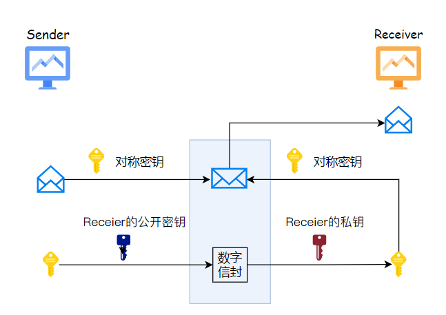

# 常见密码算法

## **DES（Data Encryption Standard）**

数据加密标准——分组加密算法

> <span style="color: #C0ECBC">分组长度/密钥长度：64bit</span>有效密钥长度：<span style="color: #C0ECBC">56bit(8bit奇偶校验位)</span>（第8、16、24、32、40、48、56、64位是校验位， 使得每个密钥都有奇数个1，在计算密钥时要忽略这8位）
迭代圈数：16圈
<span style="color: #C0ECBC">圈密钥长度：48bit(即16圈中每一圈所要用到的密钥位数(bit))</span>


### 特点

* 分组加密算法，以64位为分组
* 对称算法：加密解密使用同一密钥
* 代替和置换：DES算法是两种加密技术的组合：混乱和扩散，先替代后置换
* 易于实现
### 优缺点

* 优点：效率高、算法简单、系统开销小；适合加密大量数据；明文长度和密文长度相等
* 缺点：需要以安全方式进行密钥交换；密钥管理复杂
### 算法的入口参数

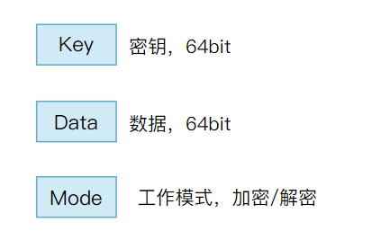

### 加密流程

<span style="color: #E0E1E4">（1）输入64位明文数据，并进行初始置换IP；</span>

<span style="color: #E0E1E4">（2）在初始置换IP后，明文数据再被分为左右两部分，每部分32位，以L0，R0表示；</span>

<span style="color: #E0E1E4">（3）在秘钥的控制下，经过16轮运算(f)；</span>

<span style="color: #E0E1E4">（4）16轮后，左、右两部分交换，并连接再一起，再进行逆置换；</span>

<span style="color: #E0E1E4">（5）输出64位密文</span>

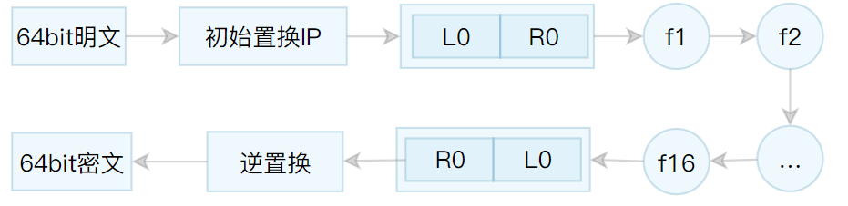

<span style="color: #E0E1E4">输入的64位明文的第1位置换到第40位，第2位置换到第8位，第3位置换到第48位。以此类推，最后一位是原来的第7位。置换规则是规定的。L0(Left)是置换后的数据的前32位，R0(Right)是置换后的数据的后32位</span>


```PlainText
58,50,42,34,26,18,10,2,
60,52,44,36,28,20,12,4,
62,54,46,38,30,22,14,6,
64,56,48,40,32,24,16,8,
57,49,41,33,25,17, 9,1,
59,51,43,35,27,19,11,3,
61,53,45,37,29,21,13,5,
63,55,47,39,31,23,15,7,
```

**每轮的迭代过程：**

<span style="color: #E0E1E4">Ln = R(n - 1)；</span>

<span style="color: #E0E1E4">Rn = L(n - 1)⊕f(Rn-1,kn-1)</span>

<span style="color: #E0E1E4">⊕:异或运算</span>

<span style="color: #E0E1E4">Kn是向第N层输入的48位的密钥，f是以Rn-1和Kn为变量的输出32位的函数</span>

<span style="color: #E0E1E4"><mark style="background-color: #C0ECBC">函数f由四步运算构成：</mark></span><span style="color: #E0E1E4"><mark style="background-color: #C0ECBC">**密钥置换(Kn的生成，n=0~16)；扩展置换；S-盒代替；P-盒置换**</mark></span><span style="color: #E0E1E4">。</span>

<span style="color: #C7D5F6">【过程参考：</span><span style="color: #C7D5F6">[DES加密算法原理-CSDN博客](https://blog.csdn.net/a745233700/article/details/102315531)</span><span style="color: #C7D5F6">、</span><span style="color: #C7D5F6">[信息安全密码学:DES算法的核心 E盒、S盒、P盒_s盒运算规则-CSDN博客](https://blog.csdn.net/qq_44131896/article/details/117573452)</span><span style="color: #C7D5F6">】</span>

* **密钥置换——子密钥生成**
DES算法由64位秘钥产生16轮的48位子秘钥。在每一轮的迭代过程中，使用不同的子秘钥。

（1）把密钥的奇偶校验位忽略不参与计算（即每个字节的第8位），将64位密钥降至56位，然后根据选择置换PC-1 将这56位分成两块C0(28位)和D0(28位)；

（2）将C0和D0进行循环左移变化（每轮循环左移的位数由轮数决定），变换后生成C1和D1，然后C1和D1合并，并通过选择置换PC-2 生成子密钥K1(48位)；

（3）C1和D1再次经过循环左移变换，生成C2和D2，然后C2和D2合并，通过 选择置换PC-2 生成密钥K2(48位)；

（4）以此类推，得到K16(48位)。但是最后一轮的左右两部分不交换，而是直接合并在一起R16L16，作为逆置换的输入块。其中循环左移的位数一共是循环左移16次，其中第一次、第二次、第九次、第十六次是循环左移一位，其他都是左移两位。

1. <span style="color: #E0E1E4">**密钥置换选择1--PC-1(子密钥的生成)**</span>
    * 原来64位的密钥K中的奇偶校验位将被<u>删去</u>
    * 剩余的56位打乱重排（按PC-1置换的置换表，同理）


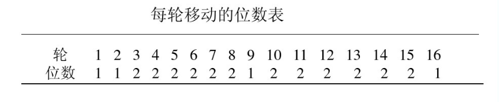

* **扩展置换**
* **S-盒代替**
* **P-盒置换**
<span style="color: #C7D5F6">**【参考阅读：**</span><span style="color: #C7D5F6">**[blog.csdn.net](https://blog.csdn.net/apr15/article/details/126680015)**</span><span style="color: #C7D5F6">**】**</span>

## **IDEA**

**International Data Encryption Algorithm      国际数据加密算法——分组加密处理算法**

<span style="color: #C0ECBC">其明文和密文分组都是64比特，密钥长度为128比特</span>

## **AES**

**Advanced Encryption Standard**

## **RSA**

密钥和私钥都可以用于加密消息，用于加密消息的密钥与用于解密消息的密钥相反。法。目前，SSH、OpenPGP、S/MIME和SSL/TLS都依赖于RSA进行加密和数字签名功能。

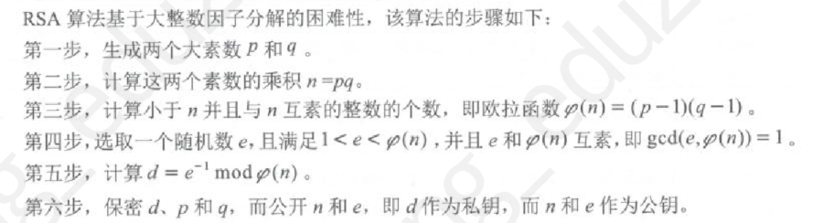

## 国产密码算法

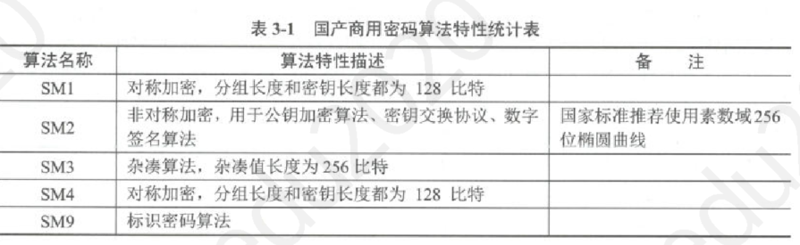

### SM1分组密码算法

### SM2椭圆曲线公钥密码算法

### SM3密码杂凑算法

### SM4分组算法

### SM9标识密码算法

在标识密码系统中，用户的私钥由密钥生成中心（KGC）根据主密钥和用户标识计算得出，用户的公钥由用户标识唯一确定。可支持实现公钥加密、密钥交换、数字签名等安全功能。


# Hash函数和数字签名

## Hash函数

Hash函数（杂凑函数）能将任意长度的信息转换成固定长度的哈希值（数字摘要/消息摘要），并且任意不同的消息或文件所生成的哈希值是不一样的。

<mark style="background-color: #F2F3F5">Hash算法，又称杂凑算法、散列算法、哈希算法或数据摘要算法</mark>

1. **MD5算法**。（Message Digest Algorithm——5）<span style="color: #C0ECBC">MD5以512位数据块</span>为单位来处理输入，产生128位的消息摘要，即<span style="color: #C0ECBC">MD5能产生128比特长度的哈希值</span>。常用在文件完整性检查。
2. **SHA**（Secure Hash Algorithm）以512位数据块为单位来处理输入，<span style="color: #C0ECBC">产生160位的哈希值</span>，具有比MD5更强的安全性。已发布的版本有SHA-2、SHA-3。SHA算法产生的哈希值长度有<u><span style="color: #C0ECBC">SHA-224、SHA-256、SHA-384、SHA-512等</span></u>。
3. **SM3**是国家密码管理局于2010年公布的商用密码杂凑算法标准。该算法消息<span style="color: #C0ECBC">分组长度为512比特，输出杂凑值长度为256比特</span>，采用Merkle-Damgard结构。


## **数字签名（Digital Signature）**

指签名者使用<u>私钥</u>对待签名数据的杂凑值做密码运算得到的结果。该结果只能用签名者的<u>公钥</u>进行验证，用于确认待签名数据的完整性、签名者身份的真实性和签名行为的抗抵赖性。

一般由签名算法和验证算法组成。签名算法密钥是秘密的，验证算法是公开的。

**典型方案：**<span style="color: #D4C1F3">RSA签名体制、Rabin签名体制、ElGamal签名体制、DSS（Data Signature Standard）标准</span>

数字签名应满足条件：

* 非否认。签名者事后不能否认自己的签名
* 真实性。接收者能验证签名，而其他任何人都不能伪造
* 可鉴别性。当双方关于签名的真伪发生争执时，第三方能解决双方之间发生的争执

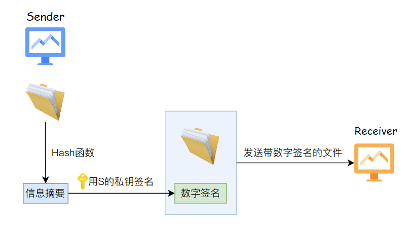

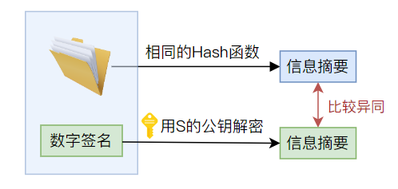

# 密码管理与数字证书

## 密码管理

1. 密钥生成。通常包括密码算法选择、密钥长度等。生成时要同步记录密钥的关联信息，如拥有者、密钥使用起始时间、密钥使用终止时间等。
2. 密钥存储。一般来说密钥不应以明文方式存储保管，应采取严格的安全防护措施，防止密钥被非授权的访问或篡改。
3. 密钥分发。密钥分发工作是指通过安全通道，把密钥安全地传递给相关接收者，防止密钥遭受截取、篡改、假冒等攻击，保证密钥机密性、完整性以及分发者、接收者身份的真实性。目前，密钥分发的方式主要有人工、自动化和半自动化。其中，自动化主要通过密钥交换协议进行。
4. 密钥使用。密钥使用要根据不同的用途而选择正确的使用方式。密钥使用和密码产品保持一致性，密码算法、密钥长度、密码产品都要符合相关管理政策，即安全合规。
- 使用密钥前，要验证密钥的有效性，如公钥证书是否有效。
- 密钥使用过程中要防止密钥的泄露和替换，按照密钥安全策略及时更换密钥。
- 建立密钥应急响应处理机制，以应对突发事件，如密钥丢失事件、密钥泄密事件、密钥算法缺陷公布等。
5. 密钥更新。当密钥超过使用期限、密钥信息泄露、密码算法存在安全缺陷等情况发生时，相关密钥应根据相应的安全策略进行更新操作，以保障密码系统的有效性。
6. 密钥撤销。当密钥到期、密钥长度增强或密码安全应急事件出现的时候，则需要进行撤销密钥，更换密码系统参数。撤销后的密钥一般不重复使用，以免密码系统的安全性受到损害。
7. 密钥备份。密钥备份应按照密钥安全策略，采用安全可靠的密钥备份机制对密钥进行备份。备份的密钥与密钥存储要求一致，其安全措施要求保障备份的密钥的机密性、完整性、可用性。
8. 密钥恢复。密钥恢复是在密钥丢失或损毁的情形下，通过密钥备份机制，能够恢复密码系统的正常运行。
9. 密钥销毁。根据密钥管理策略，可以对密钥进行销毁。一般来说销毁过程应不可逆，无法从销毁结果中恢复原密钥。特殊的情况下，密钥管理支持用户密钥恢复和司法密钥恢复。
10. 密钥审计。密钥审计是对密钥生命周期的相关活动进行记录，以确保密钥安全合规，违规情况可查可追溯。

### 密码管理政策

* 《商用密码管理条例》，内容主要有商用密码的科研生产管理、销售管理、使用管理、安全保密管理。
* 《中华人民共和国密码法》明确规定，密码分为核心密码、普通密码和商用密码，实行分类管理。
  * 核心密码、普通密码用于保护国家秘密信息，属于国家秘密，由密码管理部门依法实行严格统一管理。
  * 商用密码用于保护不属于国家秘密的信息，公民、法人和其他组织均可依法使用商用密码保护网络与信息安全。
* 商用密码：《电子政务电子认证服务管理办法》《电子政务电子认证服务业务规则规范》《密码模块安全检测要求》《安全数据库产品密码检测准则》《安全隔离与信息交换产品密码检测指南》《安全操作系统产品密码检测准则》《防火墙产品密码检测准则》等。
### 密码测评

商用密码检测中心，主要职责包括：商用密码产品密码检测、信息安全产品认证密码检测、含有密码技术的产品密码检测、信息安全等级保护商用密码测评、商用密码行政执法密码鉴定、国家电子认证根CA建设和运行维护、密码技术服务、商用密码检测标准规范制订等。

## 数字证书/公钥证书
Digital Certificate

由证书认证机构（CA）签名的包括公开密钥拥有者信息、公开密钥、签发者信息、有效期以及扩展信息的一种数据结构。<span style="color: #D4C1F3">一般基于</span><u><span style="color: #D4C1F3">PKI技术</span></u><span style="color: #D4C1F3">建立数字证书认证系统CA</span>

* 规范：《信息安全技术公钥基础设施数字证书格式》（征求意见稿）

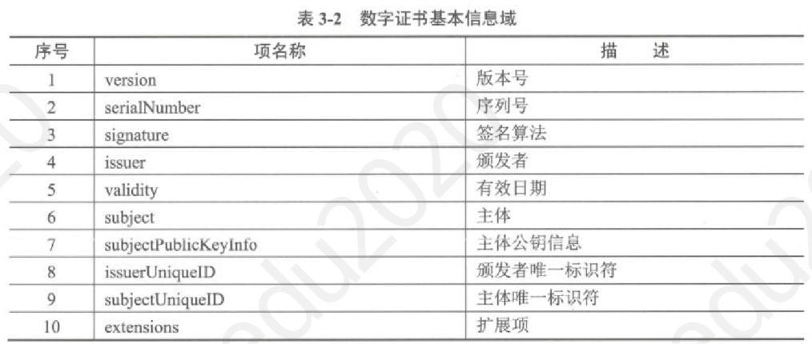

# 安全协议

## Diffie-Hellman密钥交换协议

## **SSH（Secure Shell）**

基于公钥的安全应用协议，由<u><span style="color: #C0ECBC">SSH传输层协议、SSH用户认证协议和SSH连接协议</span></u>三个子协议组成。

* SSH1（已停用）、SSH2

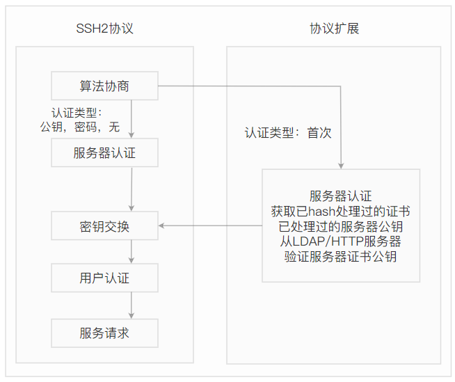

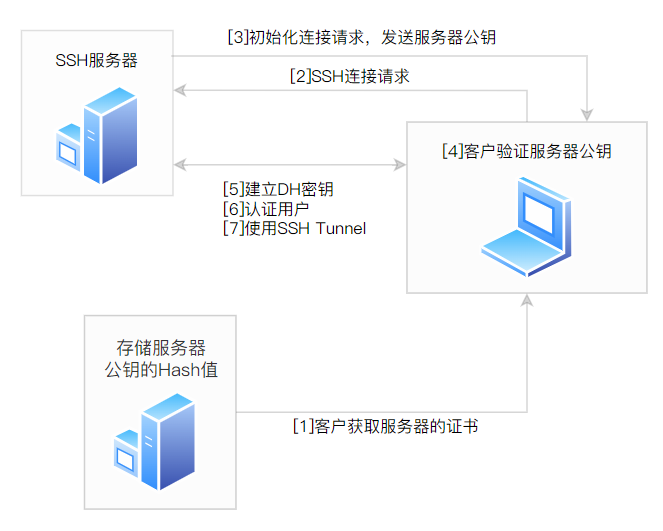

* SSH在端口转发技术（如图3-10所示）的基础上，能够支持远程登录（Telnet）、rsh、rlogin、文件传输（scp）等多种安全服务。Linux系统一般提供SSH服务，SSH的服务进程端口通常为22。
* 也可能受到中间人攻击和拒绝服务攻击

# 密码学网络安全应用

## 应用场景

* 网络用户安全
  * 用户实体信息与密码数据绑定，形成数字证书，标识网络身份用户，并提供身份鉴别服务
  * 使用加密技术，保护网络用户的个人敏感信息
* 物理和环境安全
  * 对物理区域访问者的身份进行鉴别，保证来访人员的身份真实性
  * 保护电子门禁系统进出记录的存储完整性和机密性
  * 保证视频监控音像记录的存储完整性和机密性
* 网络和通信安全
  * 对通信实体进行双向身份鉴别，保证证通信实体身份的真实性
  * 使用数字签名保证通信过程中数据的完整
  * 对通信过程中进出的敏感字段或<u>通信报文进行加密</u>
  * 使用密码安全认证协议对网络设备进行<u>接入认证</u>，确保接入的设备身份的真实性
* 设备和计算安全
  * 使用密码安全认证协议对登录设备用户的身份进行鉴别
  * 使用Hash函数及密码算法建立可信的计算环境
  * 使用数字签名验证重要可执行程序来源的真实性
  * 使用加密措施保护设备的重要信息资源，如口令文件：五是使用SSH及SSL等密码技术，建立设备远程管理安全信息传输通道。
* 应用和数据安全
  * 使用安全协议及数字证书对登录用户进行身份鉴别，保证应用系统用户身份的真实性
  * 加密应用系统访问控制信息
  * 应用SSH及SSL等密码技术，传输重要数据，保护重要数据的机密性和完整性
  * 加密存储重要数据，防止敏感数据泄密
  * 是使用Hash函数、数字签名等密码技术，保护应用系统的完整性，防止黑客攻击篡改。
* 业务应用创新
  * 利用数字证书和数字签名等密码技术，构建网络发票
  * 使用Hash函数等密码技术，构建区块链
  * 利用密码技术，建立电子证照

## 路由器安全应用参考

1. 路由器口令管理。路由器先用MD5对管理员口令信息进行Hash计算，然后再保存到路由器配置文件中。
2. 远程安全访问路由器。使用SSH替换Telnet。
3. 路由器信息交换认证。为了防止路由欺诈，路由器之间对路由更新包都进行完整性检查，以保证路由完整性。常用MD5-HMAC来实现。如果路由信息在传输过程中被篡改了，接收路由器通过重新计算收到路由信息的Hash值，然后与发送路由器的路由信息的Hash值进行比较，如果两个Hash值不相同，则接收路由器拒绝路由更新包。

## web网站安全应用参考

* Web用户身份认证
* Web服务信息加密处理
* Web信息完整性检查

## 电子邮件安全应用参考

* PGP是一种加密软件，目前最广泛地用于电子邮件安全。它能够防止非授权者阅读邮件，并能对用户的邮件加上数字签名，从而使收信人可以确信发信人的身份。
* 密钥管理算法选用RSA、数据加密算法IDEA、完整性检测和数字签名算法，采用了MD5和RSA以及随机数生成器
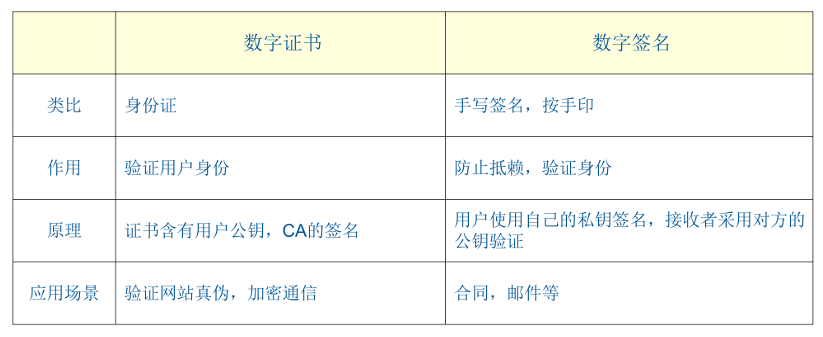

[01 密码学及应用专题.pdf](assets/Hnf2bjGxeovmjVxEmc6cVuZjn0d_01 密码学及应用专题.pdf)

[cryptology.xmind](assets/Bl20b5FZVoB85VxbAemcxEXqnbb_cryptology.xmind)

