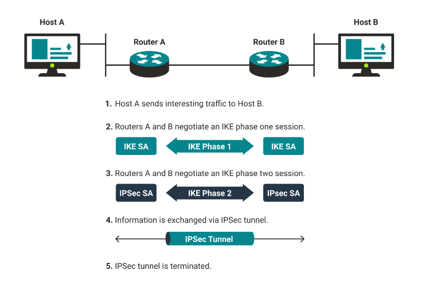
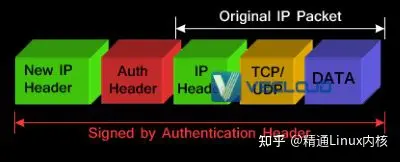
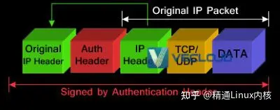
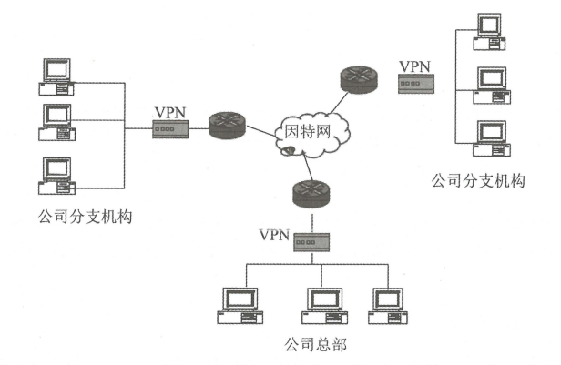

# 第九章 VPN技术原理及应用

# 概念

VPN**：Virtual Private Network 虚拟专用网络**

技术原理：把需要经过公共网传递的报文（packet）加密处理后，再由公共网络发送到目的地。

## 安全服务：

* 保密性服务：防止被监听
* 完整性服务：防止传输的信息被修改
* 认证服务：提供用户和设备的访问认证，防止非法接入

发展：客户端简化、网关一体化、可信网络产品、提供标准安全管理数据接口

## 技术风险：

* VPN 产品代码实现的安全缺陷。 VPN 产品的实现涉及多种协议、密码算法等，编程 处理不当，极易导致代码安全缺陷，从而使得 VPN 产品出现安全问题。例如， Open SSL Heartbleed 漏洞可以让远程攻击者暴露敏感数据。
* VPN 密码算法安全缺陷。 VPN 产品如果选择非安全的密码算法或者选择不好的密 码参数，都有可能导致 VPN 系统出现安全问题，不能起到安全保护的作用。例如，密钥长 度不够。
* VPN 管理不当引发的安全缺陷。 VPN 的管理不当导致密码泄露、非授权访问等问题。

# VPN类型和实现技术

## 类型

按照 VPN TCP/IP 协议层的实现方式，可以将其分为链路层 VPN 网络层 VPN 、传输层 VPN。

1. 远程访问VPN（Remote Access VPN）：
一般用在个人到安全连接企业内部；出差/在家办公，安全连接内网时使用；一般公司**部署VPN服务器**，员工在外拨号连接VPN即可
**常见RA-VPN协议：PPTP VPN、L2TP VPN、SSTP VPN、EZvpn/easyvpn、SSL VPN**
2. 点到点VPN：
一般用在企业对企业安全连接；需要在两个企业总出口设备之间建立VPN通道
常见点到点VPN：**IPsecVPN**

## 实现技术：

* 链路层 VPN ： ATM Frame Relay 、多协议标签交换 MPLS;
* 网络层 VPN ：受控路由过滤、隧道技术；
* 传输层 VPN ： SSL 

核心技术：密码算法（DES AES IDE RSA 、国产商用密码算法 SMl SM4 分组密码算法、 SM3 杂凑算法等）

## 密钥管理：

1. 使用手工配置（只适合简单网络）
2. 密钥交换协议动态分发（采用软件，自动协商生成密钥，可快速更新）

目前主要的密钥交换与管理标准： SKIP （互联网简单密钥管理协议）和 ISAK.MP/Oakley （互联网安全联盟和密钥管理协议）

## 认证访问控制：

1. 用户身份认证
2. 数据完整性和合法性认证

# 常用技术

## **IPSec****Internet Protocol Security**安全网络协议套件

IPSec是一个安全网络协议套件，用于保护互联网或公共网络传输的数据。AH协议、ESP协议和SA协议构成了IPSec套件。

IPsec VPN保护的是<u>点对点之间的通信</u>，通过IPsec VPN可以在主机和主机之间、主机和网络安全网关之间或网络安全网关（如路由器、防火墙）之间建立安全的隧道连接。

* 认证头（Authentication Header，AH）
* 封装安全有效载荷（Encapsulation Security Payload，ESP）
* SA协议：密钥交换协议（Internet Key Exchange，IKE）
### 工作原理

* **主机识别：**主机识别数据包是否需要保护，使用 IPSec 进行传输时，这些数据包流量会自己触发安全策略。主机还会检查传入的数据包是否正确加密。
* **IKE 阶段 1：**主机使用 IPSec 协商将用于安全通道的策略集，双方验证完成后，在它们之间建立一个安全通道，用于协商 IPSec 电路加密或验证通过它发送的数据的方式。
* **IKE 阶段 2：**通过安全通道进行，在该通道中，两台主机协商在会话中使用的加密算法类型，主机还同意并交换双方计划用于进出流量的加密和解密密钥。
* **IPSec 传输：**通过新创建的 IPSec 加密隧道交换数据，之前设置的 IPSec SA 用于加密和解密数据包。
* **IPSec 终止：**当主机之间的会话超时或通信完成时，通信双方之间的隧道在空闲时间达到一定值后会自动删除。

### 三个重要协议

#### **IP AH**

目的：是保证 IP 包的完整性、提供数据源认证证，为 IP 数据报文提供无连接的完整性、数据源鉴别和抗重放攻击服务。

方法：IP 包的部分内容用加密算法和 Hash 算法进行混合计算，生成一个完整性校验值，简称 ICV (Integrity Check Value) ，同时把 ICV 附加在 IP 包中

过程：TCP/IP 通信过程中，IP包发送之前都事先计算好每个IP包的ICV, 按照 IPAH 的协议规定重新构造包含ICV的新IP包，然后再发送到接收方。通信接收方在收到用IPAH方式处理过的IP包后，根据IP包的AH信息验证ICV，从而确认IP包的完整性和来源。

#### **IP ESP**

**基本方法：**将IP包做加密处理，对整个 IP 包或 IP 的数据域进行安全封装，并生成带有 ESP 协议信息的 IP 包，然后将新的 IP 包发送到通信的接收方。接收方收到后，对ESP 进行解密，去掉 ESP 再将原来的 IP 包或更高层协议的数据像普通的 IP 包那样进行处理。

IP AH和IP ESP都有两种工作模式：

**透明模式**：只保护IP包中的数据域

**隧道模式**：保护IP包的包头和数据域

#### **安全关联SA**

指用于协商加密密钥和算法的一些协议，提供AH、ESP操作所需的参数。

**密钥交换协议，**自动的配置方法就是双方的安全关联的各种参数由KDC (Key Distributed Center) 和通信双方共同商定，共同商定的过程就<u>必须遵循一个共同的协议</u>，这就是密钥管理协议。

目前， IPSec 的相关密钥管理协议主要有：
- 互联网密钥交换协议 IKE - 互联网安全关联与密钥管理协议 ISAK.MP - 密钥交换协议 Oakley

### 传输模式/隧道模式

参考文章：[网络协议——IPSEC隧道模式/传输模式有何区别？](https://news.kd010.com/yzx/3501.html)

#### IPSec隧道模式

IPSec隧道模式是默认模式。<mark style="background-color: #FAF390">在隧道模式下，整个原始IP数据包受IPSec保护。</mark>这意味着IPSec包装原始数据包，加密，添加新的IP标头，发送到隧道的另一端(IPSec对等方)。

隧道模式<mark style="background-color: #FAF390">最常用于网关之间</mark>(Cisco路由器或ASA防火墙)，或者网关在网关终端站作为其次主机的代理。

隧道模式用于加密安全IPSec网关(例如，通过IPSec通过互联网连接的两个Cisco路由器)之间的通信。

在隧道模式下，IPSec头(AH或ESP头)插入IP头和上层协议之间。ESP最常用于AH和ESP之间的IPSec隧道配置。当IPSec处于隧道模式时，AH可以单独应用，也可以和ESP一起应用。AH的工作是保护整个数据包。

1. IPSec传输模式

IPSec传输模式<mark style="background-color: #FAF390">用于端到端通信</mark>，如客户端与服务器或工作站与网关之间的通信(如果网关被视为主机)。

传输模式通过AH或ESP头提供对我们数据的保护，也称为<mark style="background-color: #D4C1F3">IP有效负载，由TCP/UDP头数据组成</mark>。有效负载包括IPSec头和尾部。<u>原始IP标头保持不变</u>，但IP协议字段改为<u>ESP(50)或AH(51)</u>，原始协议值保存在IPsec尾部，解密数据包时恢复。

原始IP标头已经移到了前面。将发送方的IP标头放在前面(稍微更改协议ID)，证明传输方式不能为原始IP标头提供保护或加密，ESP标头标注在IP协议ID为50的新IP标头中。

AH的工作是保护整个数据包。但是，传输模式下的IPSec不会在数据包前创建新的IP标头，而是放置原始协议的副本，并对协议ID进行一些细微的变更，因此不会为详细信息提供必要的保护，包括在IP标头(源IP、目标IP等)。).AH识别的新IP报头IP协议ID的51。

当ESP和AH具有IPSec传输模式时，IP标头将被公开。

## SSL
secure Sockets Layer安全套接层

应用于<u>传输层</u>的安全协议，用于构建客户端和服务端之间的安全通道

发展：SSL是从在线购物及发送付款信息时开始的，后来1994年引入了SSL，1996年发布SSL3.0，1999年引入了TLS

### 基本组成：

* <mark style="background-color: #C0ECBC">**握手协议：**</mark><mark style="background-color: #C0ECBC">用于身份鉴别和安全参数协商</mark>
* <mark style="background-color: #C0ECBC">**密码规格变更协议：**</mark><mark style="background-color: #C0ECBC">用于通知安全参数的变更</mark>
* <mark style="background-color: #C0ECBC">**报警协议：**</mark><mark style="background-color: #C0ECBC">用于关闭通知和对错误进行报警</mark>
* <mark style="background-color: #C0ECBC">**记录层协议：**</mark><mark style="background-color: #C0ECBC">用于</mark><mark style="background-color: #C0ECBC">传输数据的分段、压缩及解压缩、加密及解密、完整性校验</mark><mark style="background-color: #C0ECBC">等</mark>
SSL 协议是介于应用层和 TCP 层之间的安全通信协议。其主要目的在于两个应用层之间相互通信时，使被传送的信息具有保密性及可靠性。

工作原理：将应用层的信息加密或签证处理后经 TCP/IP 网络送至对方，收方经验证无误后解密还原信息。

SSL 协议提供三种安全通信服务：

(1) 保密性通信握手协议产生秘密密钥 (secret key) 后才开始加、解密数据。数据的加、 解密使用对称式密码算法，例如 DES AES 等。 

(2) 点对点之间的身份认证。采用非对称式密码算法，例如 RSA DSS 等。

(3) 可靠性通信。信息传送时包含信息完整性检查，使用有密钥保护的消息认证码 (Message Authentication Code, 简称 MAC) MAC 的计算采用安全杂凑函数，例如 SHA MD5

SSL 记录协议 (record protocol) 的<u>数据处理过程</u>如下：

(1) SSL 将数据 (data) 分割成可管理的区块长度。

(2) 选择是否要将已分割的数据压缩。

(3) 加上消息认证码 (MAC) 

(4) 将数据加密，生成即将发送的消息。

(5) 接收端将收到的消息解密、验证、解压缩，再重组后传送至较高层（例如应用层），即完成接收。

**PPTP：**Point to Point Tunneling Protocol 点到点安全隧道协议  第二层（必须要求TCP/IP支持）

**L2TP：**Layer 2 Tunneling Protocol ，用于保护设置 L2TP-enabled 的客户端和服务器的通信。该协议运行在 UDP 1701端口。

常见协议经SSL/TLS加密升级后的默认端口：

|协议 |默认端口 |安全协议 |TLS的默认端口 |
|---|---|---|---|
|HTTP |80 |HTTPS |443 |
|FTP |21 |FTPS |990 |
|SMTP |25 |SMTPS |465 |
|POP3 |110 |POP3S |995 |
|IMAP |143 |IMAPS |993 |
|协议 |TCP端口 |应用程序 |数据安全性 |
|---|---|---|---|
|FTP |21 |File Transfer |明文 |
|FTPS |990 |File Transfer |密文 |
|HTTP |80 |Worldwide Web |明文 |
|HTTPS |443 |Worldwide Web |密文 |
|IMAP |143 |Email (<u>MDA</u>) |明文 |
|IMAPS |993 |Email (<u>MDA</u>) |密文 |
|POP3 |110 |Email (<u>MDA</u>) |明文 |
|POP3S |995 |Email (<u>MDA</u>) |密文 |
|SFTP |22 |File Transfer |密文 |
|SSH |22 |Remote Access and File Transfer |密文 |
|SMTP |25 |Email (<u>MTA</u>) |明文 |
|SMTPS |465 |Email (<u>MTA</u>) |密文 |
|Telnet |23 |Remote Access |明文 |
<u>Hydra</u>命令选项

|Option |Explanation |
|---|---|
|`-l username` |提供登录用户名 |
|`-P WordList.txt` |指定使用的密码表 |
|`server service` |设置攻击的服务器地址和服务名 |
|`-s PORT` |非默认端口号时使用 |
|`-V` or `-vV` |显示正在尝试的用户名和密码组合 |
|`-d` |如果冗长的输出没有帮助，则显示调试输出 |

# 主要产品

商业产品：IPSec VPN网关、SSL VPN网关，或集成IPSec、SSL安全功能的防火墙和路由器

开源产品：Strong Swan、OpenSwan、OpenSSL

主要产品特征：

1. IPSec VPN ：工作模式应支待隧道模式和传输模式，其中隧道模式适用千主机和网关 实现，传输模式是可选功能，仅适用千主机实现。 
2. SSL VPN：工作模式分为客户端－服务端模式、网关－网关模式两种。

# 主要技术指标

1. 密码算法要求
    • 非对称密码算法使用 1024 比特 RSA 算法或 256 比特 SM2 椭圆曲线密码算法，用于实体验证、数字签名和数字信封等。
    • 对称密码算法使用 128 比特分组的 SM1 分组密码算法，用于密钥协商数据的加密保护和报文数据的加密保护。该算法的工作模式为 CBC 模式。
    • 密码杂凑算法使用 SHA-1 算法或 SM3 密码杂凑算法，用千对称密钥生成和完整性校验。其中， SM3 算法的输出为 256 比特。 
    • 随机数生成算法生成的随机数应能通过《随机性检测规范》规定的检测。

SSL VPN 算法及使用方法如下：

• 非对称密码算法包括 256 位群阶 ECC 椭圆曲线密码算法 SM2、IBC 标识密码算法 SM9和1024 位以上 RSA 算法。

• 分组密码算法为 SMl 算法，用于密钥协商数据的加密保护和报文数据的加密保护。该算法的工作模式为 CBC 模式。 

• 密码杂凑算法包括 SM3 算法和 SHA-1 算法，用于密钥生成和完整性校验。

1. VPN 产品功能要求

IPSec VPN 的主要功能包括：随机数生成、密钥协商、安全报文封装、 NAT 穿越、身份鉴别。身份认证数据应支持数字证书或公私密钥对方式， IP 协议版本应支持 1Pv4 协议或 1Pv6 协议。 

SSL VPN 的主要功能包括：随机数生成、密钥协商、安全报文传输、身份鉴别、访问控制、 密钥更新、客户端主机安全检查。

1.  VPN 产品性能要求

IPSec VPN 主要性能指标如下。

1. **加解密吞吐率：**<mark style="background-color: #FAF390">分别在 64 字节以太帧长和 1428 字节 CIPv6 1408 字节）</mark>以太帧长时， IPSec VPN 产品在丢包率为0的条件下内网口上达到的双向数据最大流量。
2. **加解密时延****：**分别在 64 字节以太帧长和 1428 字节 (1Pv6 1408 字节）以太帧长时， IPSec VPN 产品在丢包率为0的条件下，一个明文数据流经加密变为密文，再由密文解密还原为明文所消耗的平均时间。
3. **加解密丢包率：**分别在 64 字节以太帧长和 1428 字节 (1Pv6 1408 字节）以太帧长时， IPSec VPN 产品内网口处千线速情况下，单位时间内错误或丢失的数据包占总发数据包数量的百分比。 
4. **每秒新建连接数：** IPSec VPN 产品在一秒钟的时间单位内能够建立隧道数目的最大值。

**SSL VPN**主要性能指标如下。

1. 最大并发用户数
2. 最大并发连接数：产品能够同时处理的最大 SSL 连接数量。 
3. 每秒新建连接数每秒钟可以新建的最大 SSL 连接数目 
4. 吞吐率：在丢包率为0的条件下，服务端产品在内网口上达到的双向数据最大流量。

采用非对称加密算法ECC椭圆曲线密码算法

# VPN技术应用

## 应用场景

**远程访问虚拟网：**Access VPN 一般包含两部分，远程用户 VPN 客户端软件和 VPN 接入设备，

企业内部虚拟网：Intranet VPN是通过公用网络，如因特网，把分散在不同地理区域的企业办公点的局域网安全互联起来，实现企业内部信息的安全共享和企业办公自动化。

企业扩展虚拟网：Extranet VPN 则是利用 VPN 技术，在公共通信基础设施（如因特网）上把合作伙伴的网络或主机安全 接到企业内部网，以方便企业与合作伙伴共享信息和服务。 Extranet VPN 解决了企业外部机构 接入安全和通信安全的问题，同时也降低了网络建设成本。

