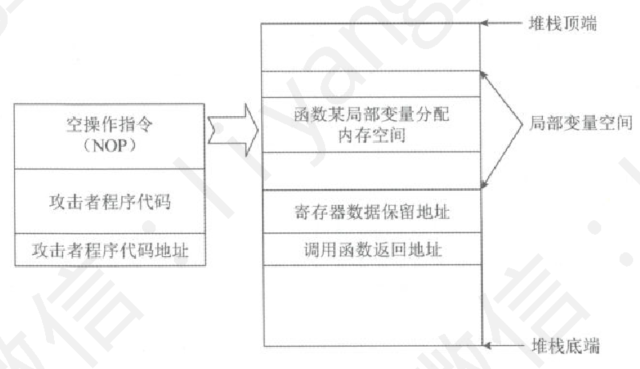
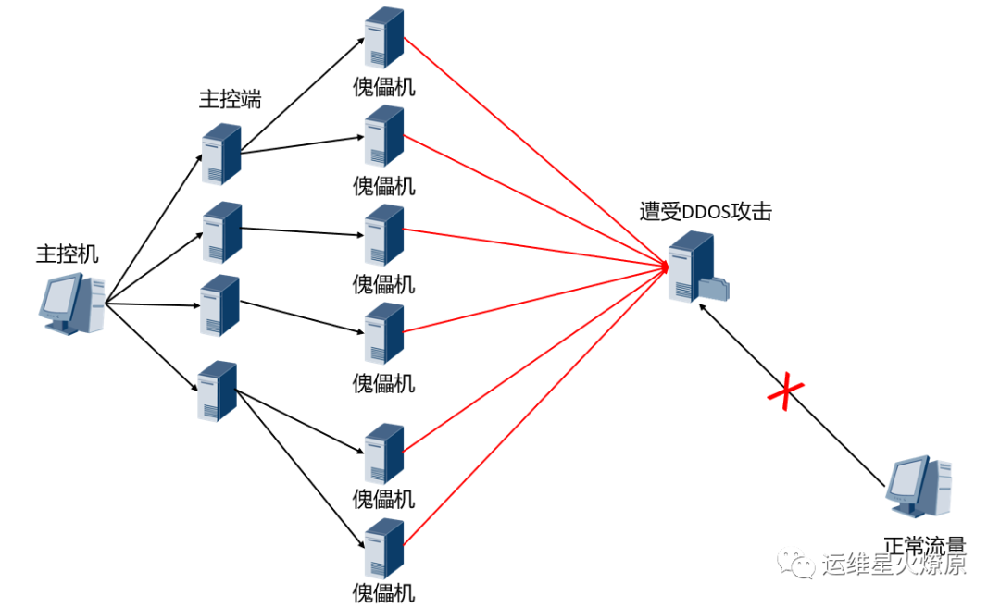
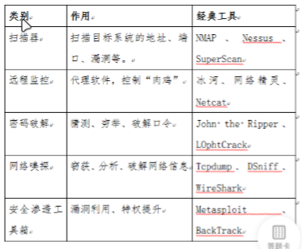

# 第二章 网络攻击

# 网络攻击模型

## 攻击树模型

用 AND-OR 形式的树结构对目标对象进行网络安全威胁分析

### **优点**

* 能够采取专家头脑风暴法，并将这些意见融合到攻击树中
* 能进行费效分析或概率分析
* 能够建模非常复杂的攻击场景
### **缺点**

* 由于树结构的内在限制，攻击树不能用来建模多重尝试攻击、时间依赖及访问控制等场景
* 不能用来建模循环事件
* 对于现实中的大规模网络，攻击树方法处理起来将会特别复杂
## MITER ATT&CK 模型

该模型把攻击活动抽象为初始访问（InitialAccess）、执行（Execution）、持久化（Persistence）特权提升（PrivilegeEscalation）、躲避防御（DefenseEvasion）、凭据访问（CredentialAccess）发现（Discovery）、横向移动（LateralMovement）、收集（Collection）、指挥和控制（CommandandControl）、外泄（Exfiltration）、影响（Impact），然后给出攻击活动的具体实现方式，详见 MITRE 官方地址链接。

### 常见的应用场景

* 网络红蓝对抗模拟
* 网络安全渗透测试
* 网络防御差距评估
* 网络威胁情报收集
## 网络杀伤链（Kill Chain）模型

该模型将网络攻击活动分成七个阶段：

1. **目标侦察。**研究、辨认和选择目标，通常利用爬虫获取网站信息，例如会议记录、电子邮件地址、社交关系或有关特定技术的信息。
1. **武器构造。**将远程访问的特洛伊木马程序与可利用的有效载荷结合在一起。例如，利用 AdobePDF 或 MicrosoftOffice 文档用作恶意代码载体。
1. **载荷投送。**把武器化有效载荷投送到目标环境，常见的投送方式包括利用电子邮件附件、网站和 USB 可移动介质。
1. **漏洞利用。**将攻击载荷投送到受害者主机后，漏洞利用通常针对应用程序或操作系统漏洞，会触发恶意代码功能。
1. **安装植入。**在受害目标系统上安装远程访问的特洛伊木马或后门程序，以持久性地控制目标系统。
1. **指挥与控制。**构建对目标系统的远程控制通道，实施远程指挥和操作。通常目标系统与互联网控制端服务器建立 C2 通道。
1. **目标行动。**采取行动执行攻击目标的任务，如从受害目标系统中收集、加密、提取信息并将其送到目标网络外；或者破坏数据完整性以危害目标系统；或者以目标系统为“跳板”进行横向扩展渗透内部网络。
# 网络攻击一般过程

1. **隐藏攻击源**。隐藏黑客主机位置使得系统管理无法追踪。
    隐藏真实 IP 地址或域名的技术：
    * 利用被侵入的主机作为跳板
    * 免费代理网关
    * 伪造 IP 地址
    * 假冒用户账号
2. **收集攻击目标信息**。确定攻击目标并收集目标系统的有关信息。
    * 目标系统的一般信息，包括 IP 地址、DNS 服务器、邮件服务器、网站服务器、操作系统软件类型及版本号、数据库软件类型及版本号、应用软件类型及版本号、系统开发商等
    * 目标系统配置信息，主要有系统是否禁止 root 远程登录、缺省用户名/默认口令等
    * 目标系统的安全漏洞信息，主要是目标系统有漏洞的软件及服务
    * 目标系统的安全措施信息，主要是目标系统的安全厂商、安全产品等
    * 目标系统的用户信息，主要是目标系统用户的邮件账号、社交网账号、手机号、固定电话号码、照片、爱好等个人信息。
3. **挖掘漏洞信息**。从收集到的目标信息中提取可使用的漏洞信息。
    <u>常用的漏洞挖掘技术</u>：
    * 系统或应用服务软件漏洞
    攻击者可以根据目标系统提供的不同服务，使用不同的方法以获取系统的访问权限。
    * 主机信任关系漏洞
    攻击者寻找那些被信任的主机，通常这些主机可能是管理员使用的机器，或是一台被认为很安全的服务器。比如，攻击者可以利 CGI 的漏洞，读取/etc/hosts.allow 文件等。通过这个文件，就可以大致了解主机间的信任关系。
    * 目标网络的使用者漏洞
      常见的攻击方法主要有网络邮件钓鱼、用户弱口令破解、U 盘摆渡攻击、网页恶意代码等。
    * 通信协议漏洞
    通过分析目标网络所采用的协议信息寻找漏洞，如 IP 协议中的地址伪造漏洞 Telnet/Http/Ftp/POP3/SMTP 等协议的明文传输信息漏洞。
    * 网络业务系统漏洞
4. **获取目标访问权限**。获取目标系统的普通或特权账户的权限。
    常见途径：
    * 获得系统管理员的口令，如专门针对 root 用户的口令攻击；
    * 利用系统管理上的漏洞，如错误的文件许可权，错误的系统配置，某些 SUID 程序中存在的缓冲区溢出问题等；
    * 让系统管理员运行一些特洛伊木马，如经篡改之后的 LOGIN 程序等；
    * 窃听管理员口令。
5. **隐蔽攻击行为**。隐蔽在目标系统中的操作，防止入侵行为被发现。

利用技术：

* 连接隐藏，如冒充其他用户、修改 LOGNAME 环境变量、修改 utmp 日志文件、使用 IPSPOOF 技术等。
* 进程隐藏，如使用重定向技术减少 ps 给出的信息量、用特洛伊木马代替 ps 程序等。
* 文件隐蔽，如利用字符串相似麻痹系统管理员，或修改文件属性使得普通显示方法无法看到：利用操作系统可加载模块特性，隐瞒攻击时所产生的信息。
1. **实施攻击**。进行破坏活动或者以目标系统为跳板向其他系统发起新的攻击。

一般来说，实施攻击的目标可归结为以下几种：

* 攻击其他被信任的主机和网络；
* 修改或删除重要数据：
* 窃听敏感数据；
* 停止网络服务；
* 下载敏感数据：
* 删除数据账号：
* 修改数据记录。
1. **开辟后门**。在目标系统中开辟后门，方便以后入侵。

攻击者设计后门时通常会考虑以下方法：

* 放宽文件许可权；
* 重新开放不安全的服务，如 REXD、TFTP 等；
* 修改系统的配置，如系统启动文件、网络服务配置文件等；
* 替换系统本身的共享库文件：
* 修改系统的源代码，安装各种特洛伊木马；
* 安装噢探器；
* 建立隐蔽信道。
1. **清除攻击痕迹**。避免安全管理员的发现、追踪以及法律部门取证。

常用方法：

* 篡改日志文件中的审计信息
* 改变系统时间造成日志文件数据素乱以迷惑系统管理员：
* 删除或停止审计服务进程；
* 干扰入侵检测系统的正常运行；
* 修改完整性检测标签。
# 网络攻击常见技术方法

网络攻击的方式：1. 信息泄露攻击 2. 完整性破坏攻击 3. 拒绝服务攻击 4. 非法使用攻击

完整性是指保护数据不被未经授权者修改、建立、嵌入、删除、重复传送或者由于其他原因使原始数据被更改。

1. 信息泄露攻击

**定义**：信息泄露攻击指攻击者通过各种手段和技术，未经授权地获取、暴露或窃取敏感信息。

**专业解释**：

* **社会工程学**：利用心理操纵手段欺骗用户泄露敏感信息，如钓鱼攻击、电话诈骗等。
* **网络窃听**：通过拦截和分析数据传输，获取未加密的敏感信息。中间人攻击（MITM）是一种常见的窃听方式，攻击者在通信双方之间拦截和可能篡改数据。
* **恶意软件**：使用键盘记录器、间谍软件等恶意程序监控用户活动，窃取机密数据。
* **数据库攻击**：通过SQL注入等手段获取数据库中的敏感信息。

2. 完整性破坏攻击

**定义**：完整性破坏攻击指攻击者未经授权修改、篡改或破坏系统或数据的完整性，导致数据不准确或系统无法正常工作。

**专业解释**：

* **数据篡改**：攻击者通过未授权访问修改数据内容，可能导致数据失真，如修改数据库记录、网页内容等。
* **文件篡改**：未授权更改系统或应用程序的文件，以实现恶意目的，如插入后门程序或篡改配置文件。
* **伪造数据**：攻击者创建或注入伪造数据，破坏系统的正常运行或误导决策。
* **代码注入**：通过注入恶意代码，如SQL注入、脚本注入（XSS），破坏数据的完整性和系统的正常操作。

3. 拒绝服务攻击（DoS/DDoS）

**定义**：拒绝服务攻击指攻击者通过发送大量请求或消耗系统资源，导致目标系统无法正常提供服务。

**专业解释**：

* **DoS攻击**：单一来源的攻击，通过发送大量请求或消耗系统资源，使目标服务器瘫痪，无法响应合法用户的请求。
* **DDoS攻击**：利用分布式网络（如僵尸网络）从多个来源同时发起大规模攻击，增加防御难度，使目标系统过载并拒绝服务。
* **资源耗尽攻击**：攻击者通过消耗目标系统的关键资源（如带宽、内存、CPU），使其无法处理正常业务请求。

4. 非法使用攻击

**定义**：非法使用攻击指攻击者未经授权利用系统或资源进行非法操作或活动。

**专业解释**：

* **未经授权访问**：攻击者获取系统管理员权限或用户账户，执行未经授权的操作，如访问机密数据、修改系统设置。
* **恶意使用资源**：利用被攻陷的系统资源进行非法活动，如加密货币挖矿、发送垃圾邮件、发动进一步的网络攻击。
* **身份盗用**：攻击者冒充合法用户进行操作，访问敏感信息或进行交易，以达到非法目的。
* **滥用功能**：攻击者利用系统或应用程序的合法功能进行恶意操作，如滥用API接口进行批量操作、利用系统漏洞进行资源消耗等。

## **端口扫描**

目的是找出目标系统上提供的服务列表。端口扫描程序挨个尝试与 TCP/UDP 端口连接，然后根据端口与服务的对应关系，结合服务器端的反应推断目标系统上是否运行了某项服务，攻击者通过这些服务可能获得关于目标系统的进一步的知识或通往目标系统的途径。

1. 完全连接扫描
完全连接扫描利用 TCP/IP 协议的三次握手连接机制，使源主机和目的主机的某个端口建立一次完整的连接。如果建立成功，则表明该端口开放。否则，表明该端口关闭。

1. 半连接扫描
半连接扫描是指在源主机和目的主机的三次握手连接过程中，只完成前两次握手，不建立一次完整的连接。

1. **SYN 扫描**
首先向目标主机发送连接请求，当目标主机返回响应后，立即切断连接过程，并查看响应情况。如果目标主机返回 ACK 信息，表示目标主机的该端口开放。如果目标主机返回 RESET 信息，表示该端口没有开放。

1. ID 头信息扫描
这种扫描方法需要用一台第三方机器配合扫描，并且这台机器的网络通信量要非常少，即 dumb 主机

首先由源主机 A 向 dumb 主机 B 发出连续的 PING 数据包，并且查看主机 B 返回的数据包的 ID 头信息。一般而言，每个顺序数据包的 ID 头的值会增加 1。然后由源主机 A 假冒主机 B 的地址向目的主机 C 的任意端口（1～65535）发送 SYN 数据包。这时，主机 C 向主机 B 发送的数据包有两种可能的结果：

* SYNIACK 表示该端口处于监听状态。
* RSTIACK 表示该端口处于非监听状态。
那么，由后续 PING 数据包的响应信息的 ID 头信息可以看出，如果主机 C 的某个端口是开放的，则主机 B 返回 A 的数据包中，ID 头的值不是递增 1，而是大于 1。如果主机 C 的某个端口是非开放的，则主机 B 返回 A 的数据包中，ID 头的值递增 1，非常规律。

1. 隐蔽扫描
隐蔽扫描是指能够成功地绕过 IDS、防火墙和监视系统等安全机制，取得目标主机端口信息的一种扫描方式。

1. **SYN|ACK 扫描**
由源主机向目标主机的某个端口直接发送 SYN|ACK 数据包，而不是先发送 SYN 数据包。由于这种方法不发送 SYN 数据包，目标主机会认为这是一次错误的连接，从而会报错。如果目标主机的该端口没有开放，则会返回 RST 信息。如果目标主机的该端口处于开放状态（LISTENING），则不会返回任何信息，而是直接将这个数据包抛弃掉。

1. FIN 扫描
源主机 A 向目标主机 B 发送<u> FIN 数据包</u>，然后查看反馈信息。

* 如果端口返回 RESET 信息，则说明该端口关闭。
* 如果端口没有返回任何信息，则说明该端口开放。
1. ACK 扫描
首先由主机 A 向目标主机 B 发送 FIN 数据包，然后查看反馈数据包的 TTL 值和 WIN 值。开放端口所返回的数据包的 TTL 值一般小于 64，而关闭端口的返回值一般大于 64。开放端口所返回的数据包的 WIN 值一般大于 0，而关闭端口的返回值一般等于 0。

1. NULL 扫描
将源主机发送的数据包中的 ACK、FIN、RST、SYN、URG、PSH 等标志位全部置空。

* 如果目标主机没有返回任何信息，则表明该端口是开放的。
* 如果返回 RST 信息，则表明该端口是关闭的。
1. XMAS 扫描
XMAS 扫描的原理和 NULL 扫描相同，只是将要发送的数据包中的 ACK、FIN、RST、SYN、URG、PSH 等头标志位<u>全部置成 1</u>。

* 如果目标主机没有返回任何信息，则表明该端口是开放的。
* 如果返回 RST 信息，则表明该端口是关闭的。
## 口令破解

> 第一步，建立与目标网络服务的网络连接：
第二步，选取一个用户列表文件及字典文件：
第三步，在用户列表文件及字典文件中，选取一组用户和口令，按网络服务协议规定，将用户名及口令发送给目标网络服务端口：
第四步，检测远程服务返回信息，确定口令尝试是否成功：
第五步，再取另一组用户和口令，重复循环试验，直至口令用户列表文件及字典文件选取完毕。

## 缓冲区溢出

缓冲区溢出攻击可使攻击者有机会获得一台主机的部分或全部的控制权。

## 恶意代码

常见的攻击手段。

## 拒绝服务

> 利用系统缺陷，执行恶意操作，使得合法的系统用户不能及时得到应得的服务或系统资源。
特点：
> * 难确认性
> * 隐蔽性
> * 资源有限性。由于计算机资源有限，容易实现拒绝服务攻击
> * 软件复杂性。由于软件固有的复杂性，难以确保没有缺陷

### 同步包风暴（SYN Flood）

攻击者假造源网址（SourceIP）发送多个同步数据包（SynPacket）给服务器（Server），服务器因无法收到确认数据包（AckPacket），使 TCP/IP 协议的三次握手（Three-WayHand-Shacking）无法顺利完成，因而无法建立连接。其原理是发送大量半连接状态的服务请求，使 Unix 等服务主机无法处理正常的连接请求，因而影响正常运作。

### UDP 洪水（UDP Flood）

利用简单的 TCP/IP 服务，如用 Chargen 和 Echo 传送毫无用处的占满带宽的数据。通过伪造与某一主机的 Chargen 服务之间的一次 UDP 连接，回复地址指向开放 Echo 服务的一台主机，生成在两台主机之间的足够多的无用数据流。

### Smurf 攻击

一种简单的 Smurf 攻击是将回复地址设置成目标网络广播地址的 ICMP 应答请求数据包，使该网络的所有主机都对此 ICMP 应答请求作出应答，导致网络阻塞，比 ping of death 洪水的流量高出一或两个数量级。更加复杂的 Smurf 攻击是将源地址改为第三方的目标网络，最终导致第三方网络阻塞。

### 垃圾邮件

攻击者利用邮件系统制造垃圾信息，甚至通过专门的邮件炸弹（mailbomb）程序给受害用户的信箱发送垃圾信息，耗尽用户信箱的磁盘空间，使用户无法应用这个信箱。

### 消耗 CPU 和内存资源的拒绝服务攻击

利用目标系统的计算算法漏洞，构造恶意输入数据集，导致目标系统的 CPU 或内存资源耗尽，从而使目标系统瘫痪，如 HashDoS。

### 死亡之 ping（ping of death）

#### PING的作用：

（1）根据域名得到服务器IP；

（2）用来检测网络的连通情况和分析网络速度；

（3）根据PIHG返回的TTL值来判断对方所使用的操作系统及数据包经过路由器数量。

---

> 一般，每次向目标主机发送Ping命令测试数据包时，目标主机都需要耗费一定的系统资源进行应答回复，Ping攻击就是不断向指定的IP地址发送不接收回复的数据包，这种攻击通过发送大于65536字节的ICMP包使操作系统崩溃；通常不可能发送大于65536个字节的ICMP包，但可以把报文分割成片段，然后在目标主机上重组；最终会导致被攻击目标[缓冲区溢出](https://link.zhihu.com/?target=https%3A//baike.baidu.com/item/%25E7%25BC%2593%25E5%2586%25B2%25E5%258C%25BA%25E6%25BA%25A2%25E5%2587%25BA/678453)，直至目标主机有限系统资源被消耗殆尽。

<mark style="background-color: #F2F3F5">`实现代码：ping -l size -a IP地址 -t`</mark>

#### 预防办法

* 用高级设置法预防Ping
默认情况下，所有Internet控制消息协议(ICMP)选项均被禁用。启用方法：在网络连接窗口中，选定已启用Internet连接防火墙的连接，打开其属性窗口，并切换到“高级”选项页，点击下方的“设置”，这样就出现了“高级设置”对话窗口，在“ICMP”选项卡上，勾选希望您的计算机响应的请求信息类型，旁边的复选框即表启用此类型请求，如要禁用请清除相应请求信息类型即可。

* 用网络防火墙阻隔Ping
* 启用IP安全策略防Ping
* 修改TTL值
【参考阅读：[死亡PING！可能让别人窒息，也可能让你“死亡”！](https://zhuanlan.zhihu.com/p/358402046)】

### 泪滴攻击（Teardrop Attack）

### 攻击原理

Teardrop攻击是一种拒绝服务攻击，是一种针对IP协议的攻击方法，顾名思义，Teardrop攻击是一种令人落泪的攻击手段，可见其破坏威力很强大。它利用<u>发送畸形数据包</u>的方式（除此之外针对IP协议攻击还有伪造IP地址的方式），实现原理是向目标主机发送异常的数据包碎片，使得IP数据包碎片在重组的过程中有重合的部分，从而导致目标系统无法对其进行重组，进一步导致系统崩溃而停止服务的恶性攻击。

【参考阅读：[Wireshark数据包分析——Teardrop泪滴攻击_teardrop攻击-CSDN博客](https://blog.csdn.net/Zhou_ZiZi/article/details/126474551)】

### 分布式拒绝服务攻击（Distributed Denial of Service Attack）

> 利用大量合法的分布式服务器对目标发送请求，从而导致正常合法用户无法获得服务。

特点：造成网络瘫痪、肉鸡攻击、网络层攻击、CC攻击

### 攻击原理

攻击者发起攻击并向代理机发送控制指令，代理机就会向被攻击目标主机发送大量的服务请求数据包，这些数据包经过伪装，无法识别它的来源，而且这些数据包所请求的服务往往要消耗大量的系统资源，造成被攻击目标主机无法为用户提供正常服务，甚至导致系统崩溃。

【参考阅读：[DDOS攻击原理](https://blog.csdn.net/leah126/article/details/135190729)】

### 常见形式

* **容量耗尽攻击**
  借助僵尸网络和放大技术，通过向终端资源注入大量流量来阻止正常用户对终端资源的访问。
  * UDP洪水攻击
  * ICMP洪水攻击
* **协议攻击**
  利用协议工作方式的漏洞发起攻击，这是第二大最常见的攻击媒介
  * **SYN洪水攻击**
  黑客利用了TCP三次握手机制的漏洞。客户端将SYN数据包发送到服务器，接收服务器返回的SYN-ACK数据包，但是永远不会将ACK数据包发送回服务器。因此，受害者的服务器留下了许多未完成的SYN-ACK请求，并最终导致崩溃。
  * **死亡之Ping攻击**
* **应用程序攻击**
  利用协议栈（六），协议栈（七）中的漏洞发起攻击，主要针对特定的应用程序而不是整个服务器。它们通常针对公共端口和服务，例如DNS或HTTP。
  * **HTTP洪水攻击**
  黑客利用大量的标准GET和POST请求淹没应用程序或Web服务器。由于这些请求通常显示为合法流量，因此检测HTTP洪水攻击是一个相当大的挑战。
  * **Slowloris**
  Slowloris攻击缓慢地使受害者的服务器崩溃。攻击者按一定时间间隔向受害者的服务器发送HTTP请求。服务器一直在等待这些请求完成，最终，这些未完成的请求耗尽了受害者的带宽，使合法用户无法访问服务器。
## 网络钓鱼

【参考阅读：[什么是网络钓鱼？网络钓鱼的常见类型有哪些？ - 华为](https://info.support.huawei.com/info-finder/encyclopedia/zh/%E7%BD%91%E7%BB%9C%E9%92%93%E9%B1%BC.html)、[什么是网络钓鱼?关于网络钓鱼，你需要了解的都在这](https://zhuanlan.zhihu.com/p/269762810)】

## 网络窃听

利用网络通信技术缺陷，使得攻击者能够获取到其他人的网络通信信息

* 常见手段：**网络嗅探、中间人攻击**
* 在完全的广播子网中，所有涉及局域网中任何一台主机的网络通信内容均可被局域网中所有的主机接收到，这就使得网络窃听变得十分容易。网络攻击者将主机网络接口的方式设成“杂乱”模式，就可以接收整个网络上的信息包，从而可以获取敏感的口令，甚至将其重组，还原为用户传递的文件。
## SQL 注入

在 Web 服务中，一般采用三层架构模式：浏览器+Web 服务器+数据库

由于 Web 脚本程序的编程漏洞，对来自浏览器端的信息缺少输入安全合法性检查，网络攻击者利用这种类型的漏洞，把 SQL 命令插入 Web 表单的输入域或页面的请求查找字符串，欺骗服务器执行恶意的 SQL 命令。

## 社交工程

网络攻击者通过一系列的社交活动，获取需要的信息。

## 电子监听

网络攻击者采用电子设备远距离地监视电磁波的传送过程。灵敏的无线电接收装置能够在远处看到计算机操作者输入的字符或屏幕显示的内容。

## 会话劫持

指攻击者在初始授权之后建立一个连接，在会话劫持以后，攻击者具有合法用户的特权权限。例如，一个合法用户登录一台主机，当工作完成后，没有切断主机。然后，攻击者乘机接管，因为主机并不知道合法用户的连接已经断开。于是，攻击者能够使用合法用户的所有权限。典型的实例是**“TCP 会话劫持”。**

## 漏洞扫描

漏洞扫描是一种自动检测远程或本地主机安全漏洞的软件，通过漏洞扫描器可以自动发现系统的安全漏洞。常见的漏洞扫描技术：CGI 漏洞扫描、弱口令扫描、操作系统漏洞扫描、数据库漏洞扫描等。

## 代理技术

网络攻击者通过免费代理服务器进行攻击，其目的是以代理服务器为“攻击跳板”，即使攻击目标的网络管理员发现了，也难以追踪到网络攻击者的真实身份或 IP 地址，如图 2-3 所示。为了增加追踪的难度，网络攻击者还会用多级代理服务器或者“跳板主机”来攻击目标。在黑客中，代理服务器被叫作“肉鸡”，黑客常利用所控制的机器进行攻击活动，例如 DDoS 攻击。

## 数据加密

采用数据加密技术来逃避网络安全管理人员的追踪

重放攻击

解决重放攻击的根本就是要保证消息的新鲜性，可以采用时间戳，序列号，挑战-应答机制等序列号机制是接收方通过比较消息中的序列号以判断消息是新产生的还是重放的。挑战-应答机制是消息的时间变量参数由接收方在该消息传递前明确地向消息发送方说明消息的新旧是由消息上盖的时戳决定的，只有当消息上的时戳与当前本地时间的差值在一定范围内，接收方才接收这个消息。

时钟未同步可能出现的攻击威胁：

1)如果验证者弄错了当前的时间，那么旧消息就能被很容易地重放

2)如果合法声称者弄错当前时间，有可能被利用在合理的时间点接收验证者重放产生的认证请求

3)如果双方的时钟都有较大的偏差，则双方都会被攻击者利用

在安全协议中，时钟同步是一个关键因素，因为许多安全机制依赖于时间戳来防止重放攻击、管理会话超时和验证证书有效期。如果双方时钟未同步，可能会导致以下攻击威胁：

### 1. 重放攻击

重放攻击是指攻击者捕获合法用户的通信数据包，然后在稍后重发这些数据包，试图冒充合法用户进行认证或执行某些操作。许多协议通过时间戳来检测重放攻击。如果双方时钟未同步，时间戳验证可能会失败，使得系统无法正确检测和防御重放攻击。

### 2. 会话劫持

会话劫持是指攻击者在合法用户会话中截获并插入恶意数据。会话管理通常依赖于会话超时机制，如果时钟未同步，会话超时机制可能会失效，使得攻击者有更长的时间窗口进行会话劫持。

### 3. 认证失败

认证协议通常依赖于时间戳和时钟同步来防止重放攻击和其他形式的欺骗。如果双方时钟未同步，认证请求可能会因为时间戳不匹配而被拒绝，从而导致合法用户无法进行认证。

### 4. 证书验证失败

数字证书有特定的有效期，证书的有效期是基于时钟时间的。如果双方时钟未同步，证书验证可能会失败，导致合法的证书被错误地标记为无效或过期。

### 5. 数据完整性和签名验证失败

数字签名和数据完整性验证可能依赖于时钟同步。如果时钟不同步，基于时间戳的签名验证可能会失败，导致数据完整性检查和签名验证失效。

### 6. 服务拒绝

服务拒绝（DoS）攻击可以利用时钟未同步的漏洞。例如，攻击者可以发送具有伪造时间戳的数据包，使得服务器处理错误的时间信息，从而导致服务中断或拒绝服务。

### 7. 密钥管理问题

在一些安全协议中，密钥的生成和分发可能依赖于时间同步。如果时钟未同步，密钥的有效期可能会不一致，导致密钥管理问题，如密钥过早过期或被认为是无效。

### 防御措施

为了防止上述攻击，以下是一些常见的防御措施：

1. **使用安全时间同步协议**：如网络时间协议（NTP）或更安全的版本（如NTPv4）来确保双方时钟的同步。
2. **引入时间容忍度**：在验证时间戳时引入一定的时间容忍度，允许小范围的时间差异，以防止因为时钟不同步导致的认证失败。
3. **双重验证**：在依赖时间戳的机制中，引入双重验证，如结合其他非时间相关的因素进行验证。
4. **定期检查和校准时钟**：确保系统时钟定期与可信时间源同步，以减少时钟漂移。
5. **使用非时间相关的随机数或挑战响应机制**：替代时间戳的方法来防止重放攻击，如随机数（nonce）或挑战响应机制。

通过这些防御措施，可以有效减轻由于时钟未同步带来的安全威胁，确保系统和协议的安全性。

# 常用工具

## 扫描器。

通过扫描程序，可以找到攻击目标的 IP 地址、开放的

* NMAP（NetworkMap）即网络地图，通过 NMap 可以检测网络上主机的开放端口号、主机的操作系统类型以及提供的网络服务。
* Nessus 早期是免费的、开放源代码的远程安全扫描器，可运行在 Linux 操作系统平台上，支持多线程和插件。目前，该工具已商业化。
* Super Scan 是一款具有 TCPconnect 端口扫描、Ping 和域名解析等功能的工具，能较容易地对指定范围内的 IP 地址进行 Ping 和端口扫描。
## 远程监控

是在受害机器上运行一个代理软件，而在黑客的电脑中运行管理软件，受害机器受控于黑客的管理端。

常见的远程监控工具：冰河、网络精灵、Netcat

## 密码破解

* 常见方式：口令猜测、穷举搜索、撞库
* 常见工具：
  * John the Ripper 用于检查 Unix/Linux 系统的弱口令，支持几乎所有 Unix 平台上经 crypt 函数加密后的口令哈希类型。
  * LOphtCrack，常用于破解 Windows 系统口令，含有词典攻击、组合攻击、强行攻击等多种口令猜解方法。
## 网络嗅探器。

通过网络噢探，黑客可以截获网络的信息包，之后对加密的信息包进行破解，进而分析包内的数据，获得有关系统的信息。

* **Tepdump/WireShark**. Tcpdump 是基于命令行的网络数据包分析软件，可以作为网络嗅探工具，能把匹配规则的数据包内容显示出来。而 WireShark 则提供图形化的网络数据包分析功能，可视化地展示网络数据包的内容。
* **DSniff**. 由 DugSong 开发的一套包含多个工具的软件套件，包括 dsniff、filesnarf、mailsnarf、msgsnarf、rlsnarf 和 webspy。使用 DSnif 可以获取口令、邮件、文件等信息。
## 安全渗透工具箱

* **Metasploit**是一个开源渗透测试工具，提供漏洞查找、漏洞利用、漏洞验证等服务功能。Metasploit 支持 1500 多个漏洞挖掘利用，提供 OWASPTOP10 漏洞测试。
* **BackTrack**集成了大量的安全工具软件，支持信息收集、漏洞评估、漏洞利用、特权提升、保持访问、逆向工程、压力测试。

