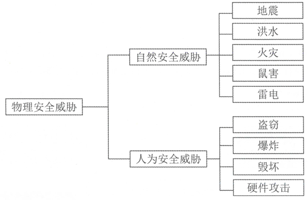
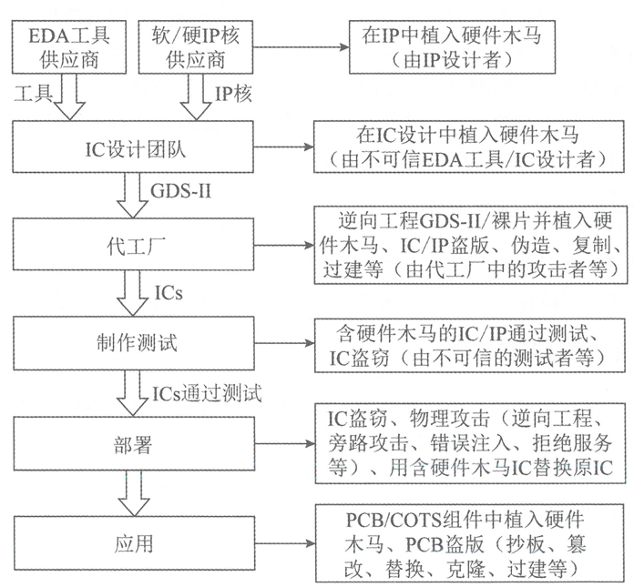
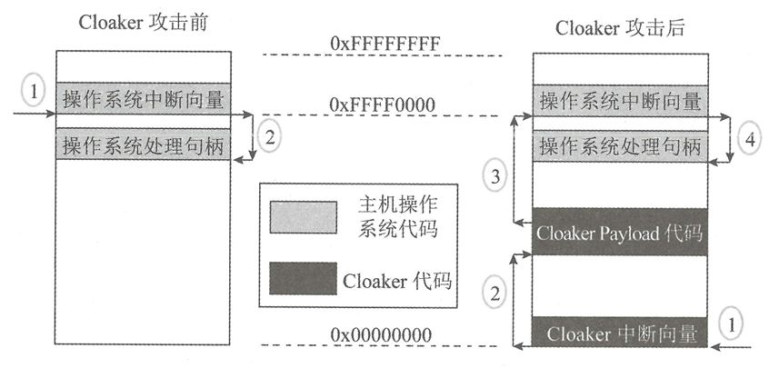
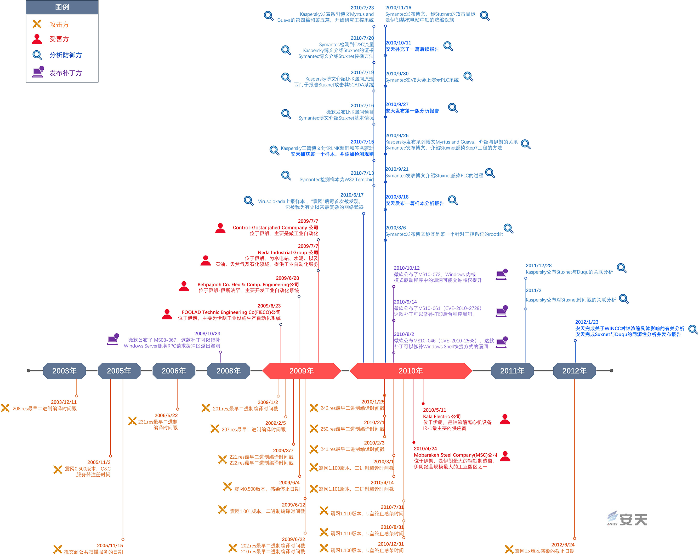
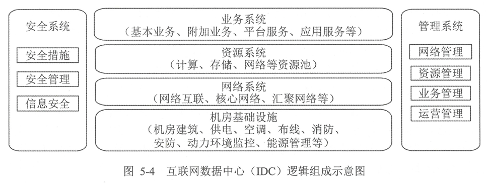
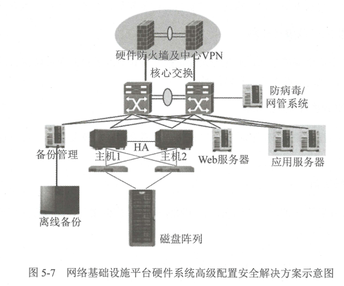

# 第五章 物理与环境安全技术

# 概念

> 物理安全指包括环境、设备和记录介质在内的所有支持网络信息系统运行的硬件的总体安全，是网络信息系统安全、可靠、不间断运行的基本保证，并且确保在信息进行加工处理、服务、决策支持的过程中，不致因设备、介质和环境条件受到人为和自然因素的危害，而引起信息丢失、泄露或破坏以及干扰网络服务的正常运行。

# 常见的硬件攻击技术与相关实例。

## 硬件木马

在集成电路芯片 (IC) 中被植入的恶意电路，当其被某种方式激活后， 会改变 IC 的原有功能和规格，导致信息泄露或失去控制。

## 硬件协同的恶意代码

2008年Samuel T.King等研究人员设计和实现了一个恶意的硬件，硬件可以使得非特权的软件访问特权的内存区域。Cloaker是硬件支待的Rootkit,如图。

## 硬件安全漏洞利用

比软件漏洞更具有持久性和破坏性

2018年1月发现的“熔断(Meltdown)"和“幽灵(Spectre) " CPU  漏洞.可被用千以侧信道方式获取指令预取、预执行对cache的影响等信息，通过cache与内存的关系，进而获取特定代码、数据在内存中的位置信息，从而利用其他漏洞对该内存进行读取或篡改，实现攻击目的。

1. 基千软件漏洞攻击硬件实体

利用控制系统的软件漏洞，修改物理实体的配置参数，使得物理实体处于非正常运行状态， 从而导致物理实体受到破坏。

* “震网”病毒：[震网事件的九年再复盘与思考-安天 智者安天下](https://www.antiy.cn/research/notice&report/research_report/20190930.html)

1. 基千环境攻击计算机实体

利用计算机系统所依赖的外部环境缺陷，恶意破坏或改变计算机系统的外部环境，如电磁波、磁场、温度、空气湿度等，导致计算机系统运行出现问题。

物理安全保护

1. 设备物理安全

安全技术要素：设备的标志和标记、防止电磁信息泄露、抗电磁干扰、 电源保护以及设备振动、碰撞、冲击适应性等方面

还要确保设备供应链的安全及产品的安全质量，防止设备其他相关方面存在硬件木马和硬件安全漏洞。智能设备还要确保嵌 入的软件是安全可信的。

1. 环境物理安全

安全技术要素：机房场地选择、机房屏蔽、防火、防水、防雷、防鼠、 防盗、防毁、供配电系统、空调系统、综合布线和区域防护等方面。

1.  系统物理安全

安全技术要素：存储介质安全、灾难备份与恢复、物理设备访问、设备管理和保护、资源利用等。

**物理安全保护方法：**安全合规、访问控制、安全屏蔽、故障容错、安全监测与预警、 供应链安全管理和容灾备份等

物理安全规范

* 《计算机场地通用规范 (GB/T2887—2011)》
*  《计算机场地安全要求 (GB/T9361—2011)》
* 《数据中心设计规范 (GB50174—2017)》
*  《数据中心基础设施施工及验收规范 (GB50462—2015)》
* 《互联网数据中心工程技术规范 (GB51195—2016)》  
* 《数据中心基础设施运行维护标准 (GB/151314—2018)》
* 《信息安全技术 信息系统物理安全技术要求 (GB/T21052—2007)》
  * 第一级物理安全平台为第一级用户自主保护级提供基本的物理安全保护；
  * 第二级物理安全平台为第二级系统审计保护级提供适当的物理安全保护；
  * 第三级物理安全平台为第三级安全标记保护级提供较高程度的物理安全保护；
  * 第四级物理安全平台为第四级结构化保护级提供更高程度的物理安全保护。
物理环境安全分析与防护

防火措施

* 消除火灾隐患。机房的构件，如墙壁、地板、屋顶、隔断、吸热、消音材料都应采用难燃或不燃材料。同时，安装保护装置避免电源及导线引起火灾，禁止在机房内放置易燃物品。
* 设置火灾报警系统。为了尽早发现火灾，必须在安全机房、媒体存放库内、活动地板下、吊顶里、空调管道内、易燃物附近部位以及其他人员不经常出入或视线达不到的地方，安装探测器等火灾报警系统。
* 配置灭火设备。在网络系统关键区域中安放灭火设备以备发生火灾时急用。。灭火剂有 四种类型：水、二氧化碳、固态化学品和<u>卤代烧1211 (Halonl211)或1301（</u>是灭火效率高，毒性小，不污染计算机设备和记录介质）。
* 加强防火管理和操作规范。为了确保防火，应加强防火管理，并经常对机房人员进行消防教育和训练，定期维护保养灭火装置和报警系统。

防水措施

* 机房内不得铺设水管和蒸汽管道。若非铺设不可，则必须采取防渗漏措施。 
* 机房墙壁、天花板、地面应有防水、防潮性能。
* 通有水管的地方应设置止水阀和排水沟。
* 不要把机房设置在楼房底层或地下室，以防水侵蚀或受潮。
* 如有通往机房的电缆沟，要防止下雨时电缆沟进水漫到机房。通往机房地沟的墙壁和地面应能防水渗透。
防震措施：

* 网络机房所在的建筑物应具有抗地震能力；
* 网络机柜和设备要固定牢靠，并安装防震装置；
* 加强安全操作管理，例如禁止搬动在线运行的网络设备。
防盗措施：

* 设置报警器：在网络系统周围放置报警器，
* 锁定装置：在网络系统中，特别是在个人计算机中设置锁定装置，以防犯罪盗窃；
* 摄像监控：在重要网络区域中，安装摄像头，实时监控重点区域的人员活动情况；
*  严格物理访问控制：划定安全区域，限制无关人员进入。例如通过刷卡才能进入安全区域；
* 安全监控：采用人脸识别技术，防止非授权人员进入重要的物理区域。
防鼠虫害措施：

* 尽量减少不必要的洞门或用后予以堵塞，封堵鼠虫出口洞口； 
* 在机房中可利用超声波驱鼠，或设置一些捕鼠器械；
* 投放杀鼠药物，或在电缆上涂上环已基类防鼠剂；
* 在电缆外施加毒饵，以消灭鼠虫，或利用搜鼠工具捕鼠。
防雷措施：

*  在网络设备所处的环境中安装避雷针；
* 网络设备安全接地，并将该“地线”连通机房的地线网，以确保其安全保护作用；
* 对重要网络设备安装专用防雷设施
防电磁措施：

* 采用接地的方法：防止外界电磁干扰和设备寄生耦合干扰；
* 采用屏蔽方法：对信号线、重要设备进行电磁屏蔽，减少外部电器设备的瞬间干扰以及防止电磁信号的泄漏；
* 选择合适的场地：远离电磁干扰源。
防静电措施：

* 人员服装采用不易产生静电的衣料，工作鞋选用低阻值材料制作；
* 控制机房温、湿度，使其保持在不易产生静电的范围内；
* 机房地板从地板表面到接地系统的阻值，应能保证防止人身触电和产生静电；
* 机房中使用的各种工作台、柜等，应选择产生静电小的材料；
* 在进行网络设备操作时，应戴防静电手套。
安全供电措施：

* 专用供电线路：重要的网络设备、服务器使用专用供电线路，避免干扰； 
* 不间断电源(UPS)：使用UPS为网络中的重要设备供电，不仅能解决停电问题，而 且能应对各种瞬变、噪声、电压下降。但是，UPS蓄电池的供电时间有限，不能长时间供电；
* 备用发电机：在发生长时间的断电，而网络必须运转时，启动备用发电机
机房安全分析与防护

机房功能区域组成《计算机场地通用规范 (GB/f2887-2011) 》

1. 主要工作房间：主机房、终端室等；
2. 第一类辅助房间：低压配电间、不间断电源室、蓄电池室、空调机室、发电机室、气体钢瓶室、监控室等； 
3. 第二类辅助房间：资料室、维修室、技术人员办公室；
4. 第三类辅助房间：储藏室、缓冲间、技术人员休息室、盟洗室等

机房安全等级划分《计算机场地安全要求 (GB/T9361—2011) 》

* A级：计算机系统运行中断后，会对国家安全、社会秩序、公共利益造成严重损害的； 对计算机机房的安全有严格的要求，有完善的计算机机房安全措施。 
* B 级：计算机系统运行中断后，会对国家安全、社会秩序、公共利益造成较大损害的； 对计算机机房的安全有较严格的要求，有较完善的计算机机房安全措施。 
* C 级：不属于 A、 B 级的情况；对计算机机房的安全有基本的要求，有基本的计算机机房安全措施。

计算机机房安全可按某一级执行，也可按某些级综合执行。

机房场地选择要求

1. 环境安全性
    1. 应避开危险来源区。为了防止计算机机房遭到周围不利环境的意外侵害，应尽量避免将机房建在易燃易爆的场所，如化工库、油料库、液化气站或煤气站等火源附近。
    2. 应避开环境污染区，如化工污染区和有毒气体、腐蚀性气体污染区及尘埃较多的区域， 如石灰厂、水泥厂和矿山等附近。
    3. 应避开盐雾区，如靠近海的区域或产盐区。
    4. 应避开落雷区域。
2. 地址可靠性
    1. 不要建在杂填土、淤泥、流砂层以及地层断裂的地质区域上。
    2.  建在山区的计算机房，应避开滑坡、泥石流、雪崩和溶洞等地质不牢靠的区域。
    3. 建在矿区的计算机房，应避开采矿崩落区地段，也应避开有开采价值的矿区。
    4. 应避开低洼、潮湿区域。
3. 场地抗电磁干扰性
    1. 应避开或远离无线电干扰源和微波线路的强电磁场干扰场所，如广播电视发射台、雷达站。
    2. 应避开强电流冲击和强电磁干扰的场所，如距离电气化铁路、高压传输线、高频炉、 大电机、大功率开关等设备200m 以上。
4. 应避开强振动源和强噪声源
    1. 应避开振动源，如冲床、锻床、爆炸成形的场所。
    2. 应避开机场、火车站和车辆往来比较频繁的区域以及建筑工地、影剧院及其他噪声区。
    3. 应远离主要通道，并避免机房窗户直接临街。
5. 应避免设在建筑物的高层以及用水设备的下层或隔壁

**数据中心建设与设计要求**

> 数据中心一般承载着大僵的计算机设备、服务器设备、网络设备、通信设备、存储设备等网络信息系统的关键设备。

按照规模大小可将数据中 心分为三类超大型数据中心、大型数据中心、中小型数据中心。

《数据中心设计规范 (GB 50174-2017) 》

* 8.4.4 数据中心内所有设备的金属外壳、各类金属管道、金属线槽、建筑物金属结构 必须进行等电位联结并接地；
* 13.2.1 数据中心的耐火等级不应低于二级； 
* 13.2.4 当数据中心与其他功能用房在同一个建筑内时，数据中心与建筑内其他功能用 房之间应采用耐火极限不低于 2.0h 的防火隔墙和 1.5h 的楼板隔开，隔墙上开门应采用甲级防火门；
*  13.3.1 采用管网式气体灭火系统或细水雾灭火系统的主机房，应同时设置两组独立的 火灾探测器，火灾报警系统应与灭火系统和视频监控系统联动；
* 13.4.1 设置气体灭火系统的主机房，应配置专用空气呼吸器或氧气呼吸器。

**互联网数据中心（简称IDC)** 是一类向用户提供资源出租基本业务和有关附加业务、在线 提供IT 应用平台能力租用服务和应用软件租用服务的数据中心

《互联网数据中心工程技术规范 (GB51195一2016) 》

* Rl 级  IDC机房的机房基础设施和网络系统的主要部分应具备一定的冗余能力，机房 基础设施和网络系统可支撑的IDC业务的可用性不应小于99.5%;  
* R2 级  IDC机房的机房基础设施和网络系统应具备冗余能力，机房基础设施和网络系统可支撑的IDC业务的可用性不应小于99.9%; 
* R3 级  IDC机房的机房基础设施和网络系统应具备容错能力，机房基础设施和网络系统可支撑的IDC业务的可用性不应小于99.99%

强制性条文内容：

* 1.0.4 在我国抗震设防烈度 7 度以上（含 7 度）地区 IDC 工程中使用的主要电信设备 必须经电信设备抗震性能检测合格。 
*  4.2.2 施工开始以前必须对机房的安全条件进行全面检查，应符合下列规定。 
  *  机房内必须配备有效的灭火消防器材，机房基础设施中的消防系统工程应 施工完毕，并应具备保持性能良好，满足 IT 设备系统安装、调测施工要求的使用条件。 
  * 楼板预留孔洞应配置非燃烧材料的安全盖板，已用的电缆走线孔洞应用非燃 烧材料封堵。 
  * 机房内严禁存放易燃、易爆等危险物品。
  * 机房内不同电压的电源设备、电源插座应有明显区别标志。

CA 机房物理安全

《电子政务电子认证服务业务规则规范》

网络通信线路安全分析与防护

网络通信线路安全威胁：

1. 网络通信线路被切断
2. 网络通信线路被电磁干扰
3. 网络通信线路泄露信息

网络通信线路安全防护

一般 从两个方面采取安全措施：一是网络通信设备（设备冗余）；二是网络通信线路（多路通信）。

设备实体安全分析与防护

设备实体安全分析

1. 设备实体环境关联安全威胁
2. 设备实体被盗取或损害
3. 设备实体受到电磁干扰
4. 设备供应链条中断或延缓
5. 设备实体的固件部分遭受攻击
6. 设备遭受硬件攻击
7. 设备实体的控制组件安全威胁
8. 设备非法外联

设备实体安全防护技术措施

1. 设备的标志和标记
    产品名称、型号或规定的代号，制造厂商的名称或商标、安 全符号，或国家规定的3C认证标志。
2. 设备电磁辐射防护

电磁辐射骚扰、电磁辐射抗扰、电源端口电磁传导骚扰、信号端口电 磁传导骚扰、电源端口电磁传导抗扰、信号端口电磁传导抗扰。

1. 设备静电及用电安全防护

静电放电抗扰、电源线浪涌（冲击）抗扰、信号线浪涌（冲 击）抗扰、电源端口电快速瞬变脉冲群抗扰、信号端口电快速瞬变脉冲群抗扰、电压暂降抗扰、 电压短时中断抗扰、抗电强度、泄漏电流、电源线、电源适应能力和绝缘电阻。

1. 设备磁场抗扰

工频磁场抗扰、脉冲磁场抗扰。

1. 设备环境安全保护
    防过热、阻燃、防爆裂。
2. 设备适应性与可靠性保护 

温度适应性、湿度适应性、冲击适应性、碰撞适应性、可 靠性

设备硬件攻击防护

1. 硬件木马检测
    1. **反向分析法：**通过逆向工程方法将封装（或管芯）的芯片电路打开，逐层扫描拍照电路，然后使用图形分析软件 和电路提取软件重建电路结构图，将恢复出的设计与原始设计进行对比分析，以检测硬件木马。
    2. 功耗分析法：通过获取芯片的功耗特征，通过K.L扩展分析法生成芯片指纹，再将待测芯片与“纯净芯片”的功耗特征进行比对，以判断芯片是否被篡改
    3. 侧信道分析法：通过比对电路中的物理特性和旁路信息的不同，发现电路的变化，其技术原理是任何硬件电路的改变都会反映在一 些电路参数上，如功率、时序、电磁、热等
2. 硬件漏洞处理

通常方法是破坏漏洞利用条件，防止漏洞被攻击者利用。

存储介质安全分析与防护

存储介质安全威胁：

1. 存储管理失控
    缺少必要的存储管理制度、流程和技术管理措施，使得存储介质及存储设备缺少安全保养 和维护，相关存储介质被随意保管、拷贝等。
2. 存储数据泄密
3. 存储介质及存储设备故障
4. 存储介质数据非安全删除

没有采取安全删除技术，使得攻击者利用数据恢复工具，还原存储介质上的 数据。

1. 恶意代码攻击
    被恶意代码攻击，如勒索病毒，使得相关存储操作无法进行。

存储介质安全防护

1. 强化存储安全管理

• 设有专门区域用千存放介质，并有专人负责保管维护； 

• 有关介质借用，必须办理审批和登记手续； 

• 介质分类存放，重要数据应进行复制备份两份以上，分开备份，以备不时之需；

 • 对敏感数据、重要数据和关键数据，应采取贴密封条或其他的安全有效措施，防止被 非法拷贝； 

• 报废的光盘、磁盘、磁带、硬盘、移动盘必须按规定程序完全消除敏感数据信息。 

1. 数据存储加密保存
2. 容错容灾存储技术

对千重要的系统及数据资源，采取磁盘阵列、双机在线备份、离线备份等综合安全措施， 保护存储数据及相关系统的正常运行。

媒介泄露

定义：媒介泄露是指通过各种物理媒介（如电子设备、纸质文件、通信工具等）导致的敏感信息的泄露

特点：

1. 物理媒介：涉及到实际的物理介质，如计算机、手机、USB驱动器、打印的文件等。
2. 人为因素：通常包括人为错误、设备丢失、设备被盗等。
3. 直接访问：泄露信息通常是通过直接访问存储在媒介上的数据

常见方式：

* 电子设备失窃或遗失。
* 未加密存储或传输。
* 未妥善销毁的纸质文件。
* 误发送的电子邮件或传真。
* 公共Wi-Fi上的数据拦截。
### 传导泄露

定义：传导泄露是指通过非物理媒介（如电磁波、声波等）导致的敏感信息的泄露，通常涉及信号传导和侧信道攻击。

特点：

1. **非物理媒介**：涉及到电磁波、声波、光波等无形的传导媒介。
2. 技术手段：泄露通常需要特定的技术手段和设备来捕捉和解码信息。
3. 侧信道攻击：常见于利用计算机和电子设备的物理泄漏信号进行攻击。

常见方式：

* 电磁辐射（TEMPEST攻击）：通过捕捉设备发出的电磁辐射来获取信息。
* 声波泄露：通过捕捉键盘或其他设备的声波来推断输入信息。
* 电源分析（如差分功耗分析）：通过分析设备的功耗模式来推断加密密钥或其他敏感信息。
* 光学泄露：通过观察设备指示灯的闪烁模式获取信息。

