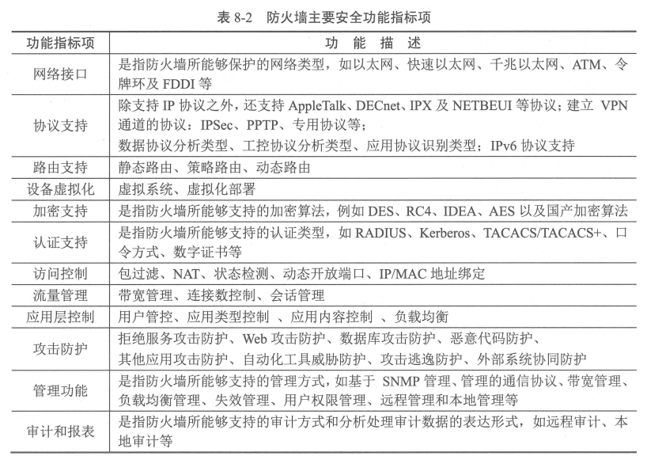
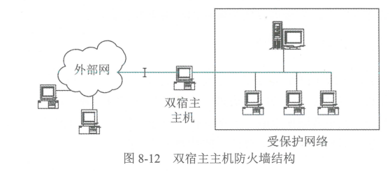
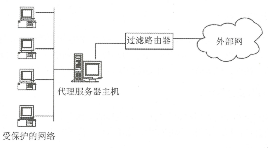
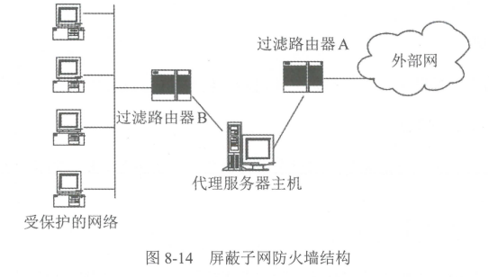

# 第八章 防火墙技术及原理

# **概念**

> 在安全区域划分的基础上，通过一种<u>网络安全设备（防火墙）</u>，控制**安全区域间**的通信，可以隔离有害通信，进而阻断网络攻击。

**安全区域有：**

* 公共外部网络，如 Internet； 
* 内联网 （lntranet） ，如某个公司或组织的专用网络，网络访问限制在组织内部；
* 外联网 （Extranet） ，内联网的扩展延伸，常用作组织与合作伙伴之间进行通信；
* 军事缓冲区域，简称 DMZ， 该区域是介千内部网络和外部网络之间的网络段，常放置公共服务设备，向外提供信息服务
# **防火墙工作原理**

## **安全策略**

防火墙根据网络包所提供的信息实现网络通信访问控制：如果网络通信包符合网络访问控制策略，就允许该网络通信包通过防火墙，否则不允许。防火墙的**安全策略**有两种类型：

* **白名单策略：**只允许符合安全规则的包通过防火墙，其他通信包禁止；
* **黑名单策略：**禁止与安全规则相冲突的包通过防火墙，其他通信包都允许。
## **访问控制功能**

**防火墙的访问控制主要功能：**（可以用于网络接口层、网络层、传输层、应用层，）

* 过滤非安全网络访问
* 限制网络访问。墙只允许外部网络访问受保护网络的指定主机或网络服务，通常受保护网络中的 Mail FTP WWW 服务器等可让外部网访问，而其他类型的访问则予以禁止。
* 网络访问审计。防火墙日志，记录所有通过它的访问；也可以用于入侵检测和网络攻击取证。
* 网络带宽控制。防火墙可以控制网络带宽的分配使用，实现部分网络质量服务 （QoS） 保障。 
* 协同防御。防火墙和入侵检测系统通过交换信息实现联动，根据网络的实际情况配置并修改安全策略，增强网络安全。
## **防火墙的安全风险**

* **网络安全旁路**。防火墙只能对通过它的网络通信包进行访问控制，而未经过它的网络通信就无能为力。
* **防火墙功能缺陷**，导致一些网络威胁无法阻断。主要安全缺陷如下。
  * 防火墙不能完全防止感染病毒的软件或文件传输。
  * 防火墙**不能防止基于数据驱动式的攻击**。
  【参考阅读：[什么是数据驱动攻击_数据驱动侵袭是什么-CSDN 博客](https://blog.csdn.net/dinofish/article/details/124013584)】
  * 防火墙不能完全防止后门攻击。防火墙是粗粒度的网络访问控制，某些基于网络隐蔽通道的后门能绕过防火墙的控制。例如 http、tunnel 等。
* 防火墙安全机制**形成单点故障和特权威胁**。
* 防火墙**无法有效防范内部威胁**。
* 防火墙效用**受限于安全规则**。一旦安全规则更新不及时，极易导致防火墙的保护功能失效。
## **未来发展**

1. 防火墙控制粒度不断细化。控制规则从以前的 IP 包地址信息<u>延伸到 IP 包的内容</u>。
1. 检查安全功能持续增强。检测 IP 包内容越来越细，<u> DPI （Deep Packet  Inspection） </u>应用于防火墙。
1. 产品分类更细化。出现<u>专用防火墙</u>：工控防火墙、 Web 防火墙、数据库／数据防火墙等。
1. 智能化增强。防火墙规则实现智能化更新
# **防火墙类型与实现技术**

## **防火墙类型**

### **包过滤——IP 层**

根据包的源 IP 地址、目的 IP 地址、源端口、 目的端口及包传递方向等包头信息判断是否允许包通过。

* **常用自由过滤软件**：ipf、ipfw、ipfwadm
* 一般规则条件描述：使用源 IP 地址、目的 IP 地址、源端口号、目的端口号、协议类型 （UDP TCP ICMP） 、通信方向、规则运算符
### **状态检查技术**

状态检测防火墙则是采用了一种基于连接的状态检测机制，将属于同一连接的所有数据包作为一个整体的数据流来看待，构成<u>连接</u>状态表，通过安全规则与状态表的共同配合来决定数据包的“去留”。

【参考阅读：[基于状态检测防火墙原理基础（上） - FreeBuf 网络安全行业门户](https://www.freebuf.com/articles/network/255486.html)、[状态检测技术原理说明](https://zhuanlan.zhihu.com/p/443207320)】

### **应用服务代理**

代理防火墙代替受保护网络的主机向外部网发送服务请求，并将外部服务请求响应的结果返回给受保护网络的主机

#### 分类

可以分为 FTP 代理、 Telnet 代理、 Http 代理、 Socket 代理、 邮件代理等

#### 优点

 • 不允许外部主机直接访问内部主机；

 • 支持多种用户认证方案；

 • 可以分析数据包内部的应用命令；

 • 可以提供详细的审计记录。 

#### 缺点 

• 速度比包过滤慢； 

• 对用户不透明； 

• 与特定应用协议相关联，代理服务器并不能支待所有的网络协议

## **实现技术**

### **网络地址转换技术**

基于 NAT 技术的防火墙上<u>配置有合法的公共 IP 地址集</u>，当内部某一用户访问外网时，防火墙动态地从地址集中选个未分配的地址分配给该用户，该用户即可使用这个合法地址进行通信 。

**实现方式**

* 静态 NAT（StaticNAT）：内部网络中的每个主机都被永久映射成外部网络中的某个合法的地址
* NAT 池（pooledNAT）：是在外部网络中配置合法地址集，采用动态分配的方法映射到内部网络
* 端口 NAT（PAT）：把内部地址映射到外部网络的一个 IP 地址的不同端口上
### Web 防火墙技术 <mark style="background-color: #C0ECBC">WAF</mark>

<u>根据预先定义的过滤规则和安全防护规则</u>，对所有访问 Web 服务器的 HTTP 请求和服务器响应， 进行 HTTP 协议和内容过滤，进而对 Web 服务器和 Web 应用提供安全防护功能。 

**常见功能：**允许／禁止 HTTP 请求类型、 HTTP 协议头各个字段的长 度限制、后缀名过滤、 URL 内容关键字过滤、 Web 服务器返回内容过滤。 

**可抵御的常见攻击：**<mark style="background-color: #C0ECBC">SQL 注入攻击、 XSS 跨站脚本攻击、 Web 应用扫描、 Webshell Cook 注入攻击、 CSRF 攻击等</mark>

**开源 Web 应用防火墙：** ModSecurity、WebKnight、Shadow Daemon 等

#### 部署方式

1. **透明代理模式**

WAF 代理了 WEB 客户端和服务器之间的会话，并对客户端和 server 端都透明。

**优点**：对网络的改动最小，通过 WAF 的硬件 Bypass 功能在设备出现故障或者掉电时可以不影响原有网络流量，只是 WAF 自身功能失效。

**缺点**：网络的所有流量都经过 WAF，对 WAF 的处理性能要求高。采用该工作模式无法实现负载均衡功能。

1. **反向代理模式**
    将真实服务器的地址映射到反向代理服务器上，此时代理服务器对外就表现为一个真实服务器。

**优点**：可以在 WAF 上实现负载均衡

**缺点**：需要对网络进行改动，配置相对复杂，除了要配置 WAF 设备自身的地址和路由外，还需要在 WAF 上配置后台真实 WEB 服务器的地址和虚地址的映射关系。

1. **路由代理模式**
    它与网桥透明代理的唯一区别就是该代理工作在路由转发模式而非网桥模式，其它工作原理都一样，需要为 WAF 的转发接口配置 IP 地址以及路由。
2. **WAF 安全模式**

WAF 可以采用白名单和黑名单两种安全模式，也可以两者相结合。

**rasp**

### **数据库防火墙技术**

数据库防火墙是一款抵御并消除由于应用程序业务逻辑漏洞或者缺陷所导致的数据（库）安全问题的安全设备或者产品。数据库防火墙一般情况下<u>部署在应用程序服务器和数据库服务器</u>之间，采用数据库协议解析的方式完成。

数据库防火墙是<u> SQL 注入防御的终极解决方案</u>

* **部署位置**：Web 防火墙作用在浏览器和应用程序之间，数据库防火墙作用在应用服务器和数据库服务器之间。
* **作用协议**：Web 防火墙作用在<u> Http 协议</u>上，<mark style="background-color: #FAF390">数据库防火墙一般作用在数据库协议上，比如 Oracle SQL*Net，MSSQL TDS 等</mark>
### **工控防火墙技术**

其技术原理主要是通过<u>工控协议深度分析</u>，对访问工控设备的请求和响应进行监控， 防止恶意攻击工控设备，实现工控网络的安全隔离和工控现场操作的安全保护。

<u>工控协议：</u>包括 Modbus TCP 议、 IEC 61850 协议、 OPC 协议、 Ethernet/IP 协议和 DNP3 协议等

### 下一代防火墙技术（NGFW）

下一代防火墙除了集成传统防火墙的包过滤、状态检测、地址转换等功能外，还具有应用识别和控制、可应对安全威胁演变、检测隐藏的网络活动、动态 快速响应攻击、支持统一安全策略部署、智能化安全管理等新功能。

**1.深度包检测：**传统防火墙主要关注数据包的源地址、目标地址和端口号等基本信息，而下一代防火墙则能深入检查数据包内容，识别并拦截恶意流量。
**2.应用识别与控制：**传统防火墙很难识别应用程序或其特定功能，而下一代防火墙通过应用签名、行为和上下文分析等技术实现了对各种应用的精确识别和控制。
**3.用户身份识别与控制：**传统防火墙只能基于 IP 地址进行访问控制，而下一代防火墙可以识别具体的用户信息并实现基于用户身份的访问控制，这使得安全策略更加灵活且易于管理。
**4.集成多种安全功能：**下一代防火墙整合了入侵防御系统（IDS）、入侵预防系统（IPS）、防病毒、反垃圾邮件、沙箱分析等多种安全功能，提供了更加全面的网络安全防护。
**5.统一管理与报告：**下一代防火墙通常提供集中化的管理界面，使得管理员能够更方便地配置策略、查看各种报告和监控网络状况。

【参考阅读：[什么是下一代防火墙-知识中心-深信服](https://www.sangfor.com.cn/knowledge/ngfw)】

### **防火墙共性关键技术**

#### 深度包检测 （Deep Packet Inspection， DPI） 

**工作原理**：使用 OSI 模型<u>应用层</u>来提取统计信息，能够查找、识别、分类和重新路由或阻止包含特定数据或代码有效负载的数据包。

**主要方法：**

* **匹配模式/签名**：有入侵检测系统（IDS）功能的防火墙对每个数据包针对已知网络攻击数据库进行匹配检查。IDS 搜索已知的恶意特定模式，并在发现恶意模式后禁用流量缺点：只适用于频繁更新的签名、只能抵抗已知的威胁攻击
* **协议异常**：采用默认的拒绝策略，根据协议定义，防火墙决定哪些流量应该被允许，保护网络免受不明威胁。
* **入侵防御系统（IDS）：**如果某个数据包代表已知的安全隐患，IDS 将根据定义的规则集主动阻止网络流量。缺点：需要定期更新有关新威胁详细信息的网络威胁数据库，还可能存在误报
解决方法：创建保守的策略和自定义阈值、为网络组件建立适当的基线行为，并定期评估警告和报告的事件以加强监控和警报来降低这种危险
**部署架构:**DPI 引擎通常与路由器、SDN 和数据包网关中的防火墙内联部署。非关键分析也可以进行离线数据包分析。专用路由器能够执行 DPI。带有程序字典的路由器有助于识别它们路由的 LAN 和 Internet 流量背后的目的，消除了来自已知病毒重复攻击的漏洞。

**优点**

* 保障网络安全的重要工具。扫描数据包
* 为控制网络流量提供了更多选择。DPI 使规则编程能够搜索特定数据类型，并区分高/低优先级数据包。
* 可以使用 DPI 来检查试图离开网络的传出流量。使用 DPI 可以找出数据包的传输位置，这意味着企业可以开发用于阻止数据泄漏的过滤器。
* DPI 对数据包的实时处理受预定规则的约束。根据团队实施的预编程规则，将检查并自动处理从包头到内容的所有数据包数据。系统自动对每个数据包进行排序、过滤和优先级，可以防止网络变慢。
* DPI 能够对匹配配置文件的流量做出反应。例如提醒用户丢弃数据包或减少该流量可访问的带宽。
**局限性**

* DPI 在阻止缓冲区溢出、DoS 攻击甚至某些恶意软件攻击等方面非常出色，但它也可能被用来开发类似的攻击。
* DPI 使现有的防火墙和其他与安全相关的技术变得更加复杂和繁琐。为了使 DPI 规则保持有效，必须确保经常更新和修改。
* DPI 会降低网络性能和速度，因为它会导致网络瓶颈，并对防火墙处理器提出更多要求，以进行在线检查和数据解密。
* 隐私问题。 DPI 可以访问关于信息来源和流向的特定信息。
**DPI 工具**

1.Wireshark：一种流行的免费开源数据包分析器，可以配置为用于入侵检测 （ ID ）。该实用程序允许从命令行 tshark 过滤文件的内容以研究网络活动。

2.Linux 中的 Netfilter：将数据包分类为 HTTP、Jabber、Citrix、Bittorrent、FTP 等，与端口无关。

3.来自 Cisco 的 Netflow ：在其路由器上引入，用于在流量进入/离开接口时收集 IP 网络流量信息并构建访问控制列表。它由流量收集器和分析器组成。

4.SolarWinds Netflow：网络带宽监控（收集和分析）工具，提供免费和付费版本。

5.来自 Plixer 的 Scrutinizer：可以处理 Cisco 和其他供应商的网络设备的网络流量分析。

#### **操作系统**

#### **网络协议分析**

### 主要产品及评价指标

#### 主要产品

网络防火墙、web 应用防火墙、数据库防火墙、主机防火墙、工控防火墙、下一代防火墙、家庭防火墙

**评价指标**：即安全功能要求、性能要求、安全保障要求、 环境适应性要求

#### 安全功能表

#### 性能要求

* **最大吞吐量：**检查防火墙在只有一条默认允许规则和不丢包的情况下达到的最大吞吐 速率，如网络层吞吐量、 HTTP 吞吐晕、 SQL 吞吐量；
* **最大连接速率：** TCP 新建连接速率、 HTTP 请求速率、 SQL 请求速率；
* **最大规则数**：检查在添加大数量访问规则的情况下，防火墙性能变化状况； 
* **并发连接数：**防火墙在单位时间内所能建立的最大 TCP 连接数，每秒的连接数。
#### 安全保障要求

主要包括开发、指导性文档、生命周期支持、测试、脆弱性评定。具体情况可参考 CC 标准及防火墙的安全标准规范。

#### 环境适应性指标 

环境适应性指标用于评估防火墙的部署和正常运行所需要的条件，主要包括网络环境、物 理环境。网络环境通常指 1Pv4/1Pv6 网络、云计算环境、工控网络等。物理环境通常包括气候、 电磁兼容、绝缘、接地、机械适应性、外壳防护等

#### 防火墙自身安全指标

由于防火墙在网络安全中所扮演的角色，防火墙的自身安全至关重要。评价防火墙的安全 功能指标主要有身份识别与鉴别、管理能力、管理审计、管理方式、异常处理机制、防火墙操 作系统安全等级、抗攻击能力等

# **防火墙防御体系结构类型**

## **基于双宿主主机防火墙**

## **基于代理型防火墙**

这种结构中，代理主机位于内部网络。一般情况下，过滤路由器可按如下规则进行配置。

• 允许其他内部主机为某些类型的服务请求与外部网络建立直接连接 

• 任何外部网（或 Internet） 的主机只能与内部网络的代理主机建立连接。 

• 任何外部系统对内部网络的操作都必须经过代理主机。同时，代理主机本身要有较全面的安全保护。

* **优点：**能比双宿主主机结构提供很好的保护
* **缺点：**只要攻破了代理主机，整个内部网络与代理主机之间就没有任何障碍了

## **基于屏蔽子网的防火墙**

### **特点：**

* 应用代理位千被屏蔽子网中，内部网络向外公开的服务器也放在被屏蔽子网中，外部网络只能访问被屏蔽子网，不能直接进入内部网络。
* 两个包过滤路由器的功能和配置是不同的。包过滤路由器 的作用是过滤外部网络对 被屏蔽子网的访问。包过滤路由器 的作用是过滤被屏蔽子网对内部网络的访问。所有外部网络经由被屏蔽子网对内部网络的访问，都必须经过应用代理服务器的检查和认证。 
* **优点：**<mark style="background-color: #FAF390">**安全级别最高。**</mark>
* **缺点：**成本高，配置复杂。

# **防火墙技术应用**

应用场景类型：上网保护、网站保护、数据保护、网络边界保护、终端保护、网络安全应急响应

## **部署基本方法**

> 第一步，根据组织或公司的安全策略要求，将网络划分成若干安全区域； 
> 第二步，在安全区域之间设置针对网络通信的访问控制点； 
> 第三步，针对不同访问控制点的通信业务需求，制定相应的边界安全策略； 
> 第四步，依据控制点的边界安全策略，采用合适的防火墙技术和防范结构； 
> 第五步，在防火墙上，配置实现对应的网络安全策略； 
> 第六步，测试验证边界安全策略是否正常执行； 
> 第七步，运行和维护防火墙。

