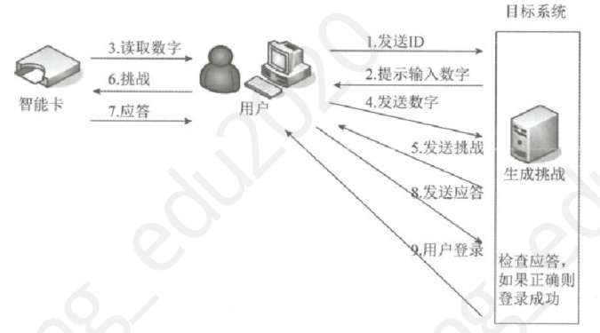
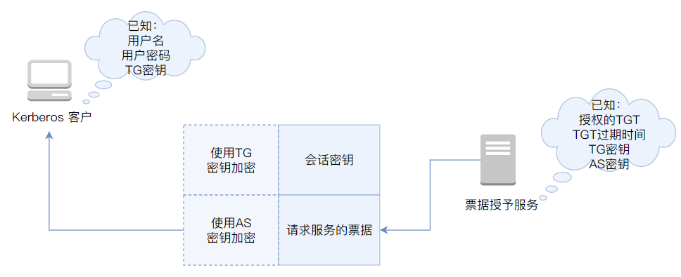
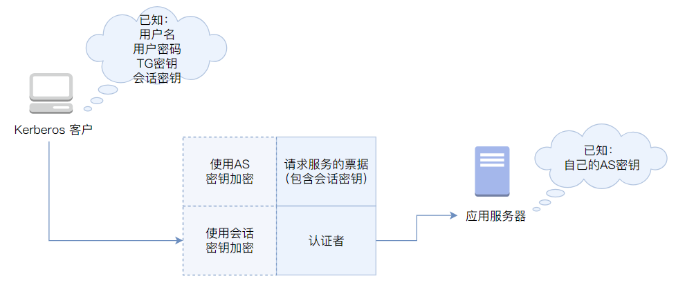

# 第六章 认证原理及技术

# 概述

认证体制是网络安全的基础性保护措施，是实施访问控制的前提。

## 认证概念

### 基本概念

* 认证是一个实体向另一个实体证明其声称的身份的过程
* 组成：标识（Identification）、鉴别（Authentication）
  * 标识一般用名称和标识符（ID）表示；确保实体的唯一性和可辨识性
  * 鉴别一般是利用口令、电子签名、数字签名、令牌、生物特征、行为表现等相关数字化凭证对实体所声称的属性进行识别验证

### **认证依据（鉴别信息）**

* 秘密信息（Something You Know）：实体所掌握的秘密信息，如用户口令、验证码……
* 实物凭证（Something You Have）：实体所持有的不可伪造的物理设备，如智能卡、U盾……
* 生物特征：指纹、声音、虹膜、人脸……
* 行为特征：鼠标使用习惯、键盘敲击力度、地理位置……

# 认证原理

> 认证机制由验证对象、认证协议、鉴别实体构成
> 验证对象：需要鉴别的实体
> 认证协议：进行认证信息交换所遵从的规则
> 鉴别实体：验证者

* 根据对验证对象要求提供的认证凭据的类型数量，可分为单因素认证、双因素认证、多因素认证
* 根据所利用的时间长度，可分为一次性口令（One Time Password）、持续认证（Continuous authentication）
  * 持续认证：连续监测验证用户特征行为；
    * 有利于防止假冒攻击、钓鱼攻击、身份窃取攻击、社会工程攻击、中间人攻击。
    * 使用的鉴定因素：
      * 认知因素 Cognitive factors：眼手协调、应用行为模式、使用偏好、设备交互模式
      * 物理因素 Physiological factors：左/右手、按压大小、手震、手臂大小和肌肉使用
      * 上下文因素 Contextual factors：事务、导航、设备、网络模式

## 发展

* 中：58家第三方CA机构（2024.04）基本建立了全国电子认证行业监管体系、电子认证运营服务体系
* 美：《网络空间可信身份国家战略）NSTIC
* 欧盟：电子身份标识 （eID）计划
## 我国相关法律：

* 《中华人民共和国电子签名法》：确立了电子签名人身份认证的法律地位
* 《中华人民共和国网络安全法》
* 《商用密码管理条例》
* 《电子认证服务密码管理办法》
* 《电子政务电子认证服务业务规则规范》
## 认证相关标准

* OpenID、SAML、OAuth、FIDO
# 认证类型与认证过程

> 按照认证过程中鉴别双方参与角色及所依赖的外部条件，认证类型可分成<mark style="background-color: #C0ECBC">**单向认证、双向认证和第三方认证**</mark>。

## 单向认证

> 单向认证是指在认证过程中，验证者对声称者进行单方面的鉴别，而声称者不需要识别验证者的身份

技术方法：

### 基于共享秘密

### 基于挑战响应

## 双向认证

> 双向认证是指在认证过程中，验证者对声称者进行单方面的鉴别，同时，声称者也对验证者的身份进行确认
> 

## 第三方认证

> 第三方认证是指两个实体在鉴别过程中通过可信的第三方来实现。可信的第三方简称TTP（Trusted Third Party）

第三方与每个认证的实体共享秘密，实体A和实体B分别与它共享秘密密钥$K_{PA}$、$K_{PB}$。当实体A发起认证请求时，实体A向可信第三方申请获取实体A和实体B的密钥$K_{AB}$，然后实体A和实体B使用$K_{AB}$加密保护双方的认证消息。

# 认证技术方法

## 口令认证技术

> 网络设备、操作系统和网络应用服务等都采用了口令认证技术。令认证一般要求参与认证的双方按照事先约定的规则，用户发起服务请求，然后用户被要求向服务实体提供用户标识和用户口令，服务实体验证其正确性，若验证通过，则允许用户访问。
> 目前，服务方实体B通常会存储用户A的口令信息。一般安全要求把口令进行加密变换后存储，口令非明文传输。

* 缺点：容易攻击，窃听、重放、中间人攻击、口令猜测等
* 实现口令认证安全，要满足的条件：
  * 口令信息要安全加密存储：
  * 口令信息要安全传输：
  * 口令认证协议要抵抗攻击，符合安全协议设计要求：
  * 口令选择要求做到避免弱口令

## 智能卡技术

> 智能卡是一种带有存储器和微处理器的集成电路卡，能够安全存储认证信息，并具有一定的计算能力。

在挑战/响应认证中，用户会提供一张智能卡，智能卡会一直显示一个随时间而变化的数字。假如用户试图登录目标系统，则系统首先将对用户进行认证，步骤如下：
（1）用户将自己的ID发送到目标系统；（2）系统提示用户输入数字；（3）用户从智能卡上读取数字：（4）用户将数字发送给系统；（5）系统用收到的数字对ID进行确认，如果ID有效，系统会生成一个数字并将其显示给用户，称为挑战；（6）用户将上面的挑战输入智能卡中；（7）智能卡用这个输入的值根据一定算法计算出一个新的数字并显示这个结果，该数字称为应答；（8）用户将应答输入系统；（9）系统验证应答是否正确，如果正确，用户通过验证并登录进入系统

## 基于生物特征认证技术

## Kerberos认证技术*

> Kerberos是一个网络认证协议，其目标是使用密钥加密为客户端/服务器应用程序提供<u>强身份认证</u>。其技术原理是利用<u>对称密码技术</u>，使用可信的第三方来为应用服务器提供认证服务，并在用户和服务器之间建立安全信道。

### 组成

* Kerberos客户机**：**用户用来访问服务器设备
* <mark style="background-color: #D4C1F3">AS（Authentication Server，认证服务器）</mark><mark style="background-color: #D4C1F3">**：**</mark><mark style="background-color: #D4C1F3">**识别用户身份并提供TGS会话密钥**</mark>
* <mark style="background-color: #D4C1F3">TGS（Ticket Granting Server，票据发放服务器）</mark><mark style="background-color: #D4C1F3">**：**</mark><mark style="background-color: #D4C1F3">**为申请服务的用户授予票据**</mark>
* <mark style="background-color: #D4C1F3">应用服务器（Application Server）</mark><mark style="background-color: #D4C1F3">**：**</mark><mark style="background-color: #D4C1F3">为用户提供服务的设备或系统</mark>

通常，AS和TGS统称为<mark style="background-color: #C0ECBC">KDC（Key Distribution Center）密钥分配中心</mark>

票据（Ticket）：用于安全的传递用户身份所需要的信息的集合，主要包括：

* Principal
* 目的服务方Principal
* 客户方IP地址
* 时间戳（分发该Ticket的时间）
* Ticket的生存期
* 会话密钥
### **KerberosV5认证协议流程**

1. 申请票据

1. AS收到消息后，AS在认证数据库检查确认kerberos客户，产生一个会话密钥，同时使用客户的秘密密钥对会话密钥进行加密，然后生成一个票据TGT，中TGT由Kerberos客户的实体名、地址、时间戳、限制时间、会话密钥组成。

1. 客户收到TGT后，用自己的秘密密钥解密得到会话密钥，然后利用解密的信息重新构造认证请求单，向TGS发送请求，申请访问应用服务器AP所需要的票据

1. TGS使用其秘密密钥对TGT解密，同时使用TGT中的会话密钥对客户的请求认证单进行解密，并将解密后的认证单信息和TGT中的信息进行比较。然后TGS生成新的会话密钥以供客户和服务器使用，并利用各自的秘密密钥加密会话密钥。最后，生成一个票据。

1. 客户收到TGS的响应后，获得与AP共享的会话密钥，同时，客户生成一个新的用于访问AP的认证单，并用该会话密钥加密，然后与TGS发来的票据一起发送到AP。

### 优点

* 可以显著减少用户密钥的密文的暴露次数，这样就可以减少攻击者对有关用户密钥的密文的积累。
* 具有单点登录（SingleSignOn，SSO）的优点

### 缺点

* <mark style="background-color: #C0ECBC">要求解决主机节点时间同步问题和抵御拒绝服务攻击</mark>

如果某台主机的时间被更改，那么这台主机就无法使用Kerberos认证协议，如果服务器的时间发生了错误，那么整个Kerberos认证系统将会瘫痪

## **PKI技术***

> CA负责颁发证书，证书中含有实体名、公钥以及实体的其他身份信息。而PKI（PublicKeyInfrastructure）就是有关创建、管理、存储、分发和撤销公钥证书所需要的硬件、软件、人员、策略和过程的安全服务设施。
> 基于PKI的主要安全服务有身份认证、完整性保护、数字签名、会话加密管理、密钥恢复。

PKI各实体的功能分别叙述如下：

* CA（Certification Authority）：证书授权机构，主要进行证书的颁发、废止和更新；认证机构负责签发、管理和撤销一组终端用户的证书。
* RA（Registration Authority）：证书登记权威机构，将公钥和对应的证书持有者的身份及其他属性联系起来，进行注册和担保：RA可以充当CA和它的终端用户之间的中间实体，辅助CA完成其他绝大部分的证书处理功能。
* 目录服务器：CA通常使用一个目录服务器，提供证书管理和分发的服务。
* 终端实体（EndEntity）：指需要认证的对象，例如服务器、打印机、E-mail地址、用户等。
* 客户端（Client）：指需要基于PKI安全服务的使用者，包括用户、服务进程等。

## 其他技术

### 单点登录

单点登录（SingleSignOn）是指用户访问使用不同的系统时，只需要进行一次身份认证，就可以根据这次登录的认证身份访问授权资源。单点登录解决了用户访问使用不同系统时，需要输入不同系统的口令以及保管口令问题，简化了认证管理工作。

### 基于人机识别认证技术

基于人机识别认证利用计算机求解问题的困难性以区分计算机和人的操作，防止计算机程序恶意操作，如恶意注册、暴力猜解口令等。

基于人机识别认证技术通常称为CAPTCHA（Completely Automated Public Turingtestto tell Computers and Humans Apart）技术。CAPTCHA技术主要包括文本CAPTCHA、图像CAPTCHA、语音CAPTCHA。

### 多因素认证技术

使用多种鉴别信息进行组合，以提升认证的安全强度。

### 基于行为的身份鉴别技术

基于行为的身份鉴别是根据用户的行为和风险大小而进行的身份鉴别技术

### 快速在线认证（FIDO）

Fast Identity Onlie使用标准公钥加密技术来提供强身份验证。

**目的：**保护用户隐私，不提供跟踪用户的信息，用户生物识别信息不离开用户的设备。

1. 登记注册

用户创建新的公私钥密钥对。其中，私钥保留在用户端设备中，只将公钥注册到在线服务。公钥将发送到在线服务并与用户账户关联。私钥和有关本地身份验证方法的任何信息（如生物识别测量或模板）永远不会离开本地设备。

1. 登录使用

用户登录时，在线服务提示要求用户使用以前注册的设备登录。然后，用户使用与注册时相同的方法解锁FIDO身份验证器。用户根据账户标识符选择正确的密钥响应在线服务的挑战，并发送签名的质询到在线服务。最后，在线服务使用存放的用户公钥和日志来验证用户响应是否正确。若正确，则通过用户认证，允许登录在线服务。

FIDO协议给了用户客户端身份验证方法的通用接口，<u>浏览器可以使用标准API调用FIDO进行身份验证</u>。FIDO支持客户端不同的身份验证方法，如安全PIN、生物识别（人脸、语音、虹膜、指纹识别）以及符合FIDO标准要求的认证设备等。

# 认证主要产品和技术指标

## 认证主要产品

### 系统安全增强

* 采用多因素认证技术：U盘+口令、智能卡+口令、生物信息+口令等
* 应用场景：U盘登录计算机、网银U盾认证、指纹登录计算机/网站/邮箱
### 生物认证

* 利用指纹、人脸、语音等生物信息
* 产品：有人证核验智能终端、指纹U盘、人脸识别门禁、指纹采集仪、指纹比对引擎、人脸自动识别平台
### 电子认证服务

* 电子认证服务机构采用PKI技术、密码算法等提供数字证书申请、颁发、存档、查询、废止等服务，以及基于数字证书为电子活动提供可信身份、可信时间和可信行为综合服务
* 产品：数字证书认证系统、证书管理服务器、可信网络身份认证、SSL证书、数字证书服务、时间戳公共服务平台、个人多源可信身份统一认证服务平台等
### 网络准入控制

* 特点：采用基于802.1X协议、Radius协议、VPN等的身份验证相关技术，与网络交换机、路由器、安全网关等设备联动，对入网设备（如主机、移动PC、智能手机等）进行身份认证和安全合规性验证
### 身份认证网关

* 是利用数字证书、数据同步、网络服务重定向等技术，提供集中、统一的认证服务，形成身份认证中心，具有单点登录、安全审计等安全服务功能。
## 主要评价指标

安全功能要求、性能要求和安全保障要求

认证技术产品的主要技术指标如下：

（1）密码算法支持：认证技术主要依赖于密码技术，因此，认证产品中的密码算法是安全性的重要因素。常见的密码算法类型有DES/3DES、AES、SHA-1、RSA、SM1/SM2/SM3/SM4。

（2）认证准确性：认证产品的认假率、拒真率。

（3）用户支持数量：认证产品最大承载的用户数量。

（4）安全保障级别：认证产品的安全保障措施、安全可靠程度、抵抗攻击能力等。

