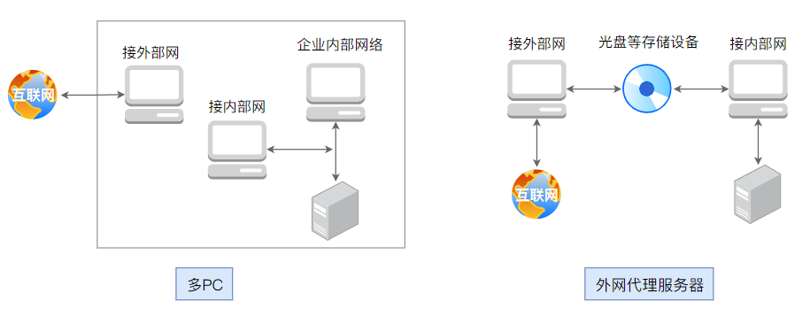
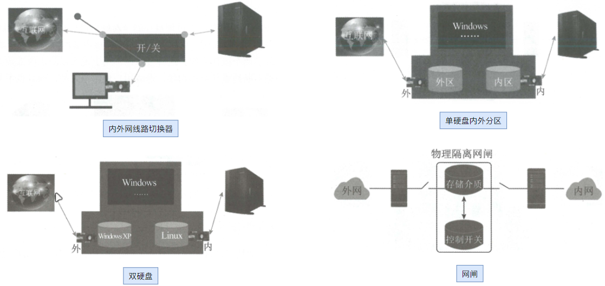
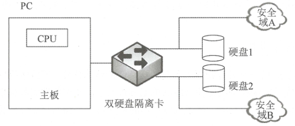
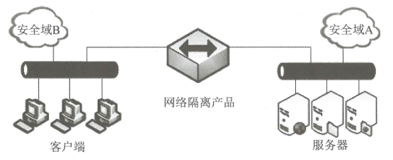
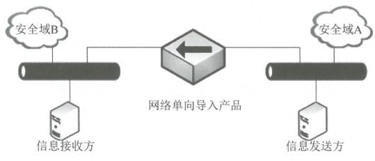

# 第十一章 网络隔离技术及应用

> 既能满足内外网信息及数据交换需求，又能防止网络安全事件出现的安全技术
> 基本原理：避免两台计算机之间直接的信息交换以及物理上的连通，以阻断两台计算机之间的直接在线网络攻击。

安全风险

1. 网络非法外联
2. U盘摆渡攻击：攻击程序将敏感数据拷贝到U盘中
3. 网络物理隔离产品安全隐患：安全漏洞导致Dos/DDoS攻击；构造恶意数据文档，绕过物理隔离措施
4. 针对物理隔离的攻击新方法：将被隔离计算机中的数据转换为声波、能量、电磁波等模拟信号发射出去，在接收端通过模数转换复原数据，从而达到窃取信息的目的。

网络物理隔离系统：指通过物理隔离技术，在不同的网络安全区域之间建立一个能够实现物理隔离、信息交换和可信控制的系统，以满足不同安全域的信息或数据交换。

网络物理隔离类型

* 按隔离的对象分：单点隔离系统（保护单独的计算机）、区域隔离系统（针对网络环境）
* 按信息传递方向：双向网络隔离系统、单向网络隔离系统

网络物理隔离机制

1. 专用计算机上网：内网指定一台计算机，机只与外部网相连，不与内部网相连。用户必须到指定的计算机才能上网，并要求用户离开自己的工作环境。
2. 多PC：在上外网的用户桌面上安放两台PC，一台连外网，一台连内网
3. 外网代理服务：指定一台或多台计算机充当服务器，负责专门搜集外部网的指定信息，然后把外网信息手工导入内部网
4. 内外网线路切换器：在内部网中，上外网的计算机上连接一个物理线路A/B交换盒，通过交换盒的开关设置控 制计算机的网络物理连接
5. 单硬盘内外分区：把单一硬盘分隔成不同的区域，在IDE总线物理层上，通过 一块IDE总线信号控制卡截取IDE总线信号，控制磁盘通道的访问。
    1. 优点：提供数据分类存放和加工处理；可有效防止外部窃走内部网数据；实现一台PC功能多用，节省资源开支
    2. 威胁来源：操作失误，如误将敏感数据存放在对外硬盘分区中；驱动程序软件bug；计算机病毒潜入；内部人员故意泄露数据；特洛伊木马程序。
6. 双硬盘：在一台机器上安装两个硬盘，通过硬盘控制卡对硬盘进行切换控制
7. 网闸：通过利用一种GAP技术（源于英文的AirGap) ，使两个或者两个以上的网络在不连通的情况下，实现安全数据交换和共享。
    1. 技术原理：使用一个具有控制功能的开关读写 存储安全设备，通过开关的设置来连接或切断两个独立主机系统的数据交换
    2. 安全风险：利用恶意数据驱动攻击，将恶意代码隐藏在电子文档中

实现技术

协议隔离技术

协议隔离指处千不同安全域的网络在物理上是有连线的，通过协议转换的手段保证受 保护信息在逻辑上是隔离的，只有被系统要求传输的、内容受限的信息可以通过。

单向传输部件

发送和接收部件只能以单工方式工作

信息摆渡技术

信息摆渡技术是信息交换的一种方式，物理传输信道只在传输进行时存在。

信息传输时， 信息先由信息源所在安全域一端传输至中间缓存区域，同时物理断开中间缓存区域与信息目的 所在安全域的连接；随后接通中间缓存区域与信息目的所在安全域的传输信道，将信息传输至 信息目的所在安全域，同时在信道上物理断开信息源所在安全域与中间缓存区域的连接。在任 何时刻，中间缓存区域只与一端安全域相连。

物理断开技术

处于不同安全域的网络之间不能以直接或间接的方式相连接。

主要产品

1. 终端隔离产品

终端隔离产品用于同时连接两个不同的安全域，采用物理断开技术在终端上实现安全域物理隔离的安全隔离卡或安全隔离计算机。

终端隔离产品一般以隔离卡的方式接入目标主机。隔离卡通过电子开关以互斥的形式同 时连通安全域A所连硬盘、安全域A或安全域B所连硬盘、安全域B,从而实现内外两个安 全域的物理隔离。

1. 网络隔离产品
    网络隔离产品用千连接两个不同的安全域，实现两个安全域之间的应用代理服务、协议转换、信息流访问控制、内容过滤和信息摆渡等功能。
    

2. 网络单向导入产品

网络单向导入产品位于两个不同的安全域之间，通过物理方式（可基于电信号传输或光信 号传输）构造信息单向传输的唯一通道，实现信息单向导入，并且保证只有安全策略允许传输 的信息可以通过，同时反方向无任何信息传输或反馈。

技术指标 

安全保障指标主要是关千产品的质量和服务保障要求，如配置管理、交付和运行、开发和 指导性文档、测试、脆弱性评定等。 

性能要求则是对网络和终端陲离产品应达到的性能指标做出规定，包括交换速率和硬件切 换时间

