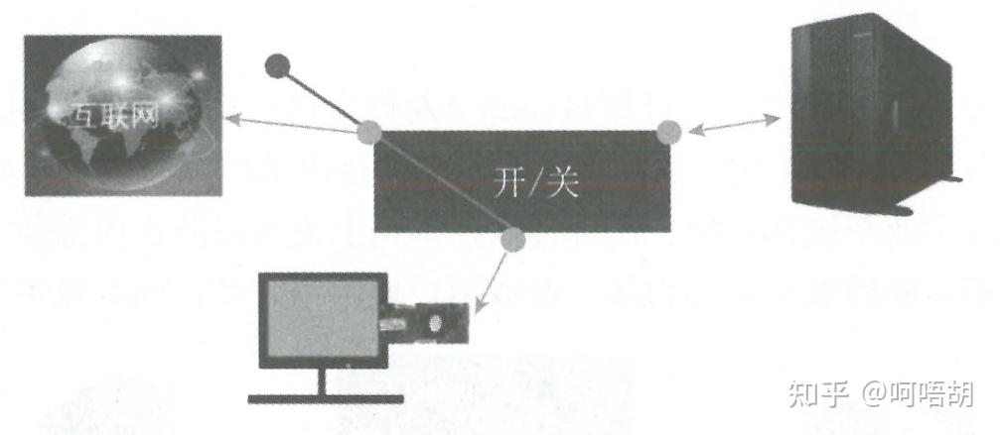
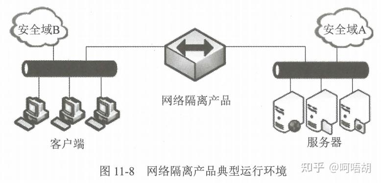
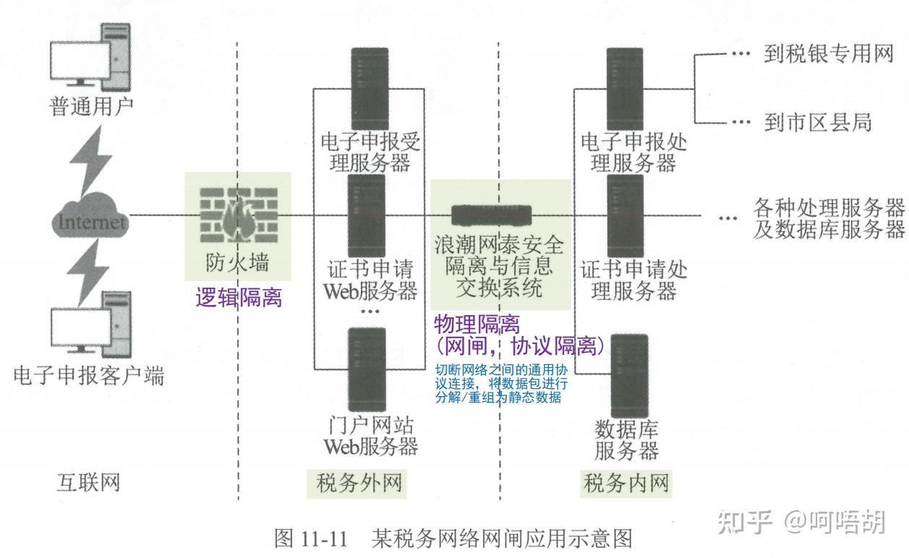

# 网络物理隔

## 一、网络物理隔离概述

### 1、网络物理隔离概念

物理隔离技术：既能满足内外网信息、数据交换需求，又能防止网络安全事件出现的安全技术

原理：避免两台计算机之间直接的信息交换及物理上的连通

目的：阻断直接网络攻击活动，避免敏感数据向外泄露

### 2、网络物理隔离安全风险

1、网络非法外联（用户私自连接）

2、U盘摆渡攻击

3、网络物理隔离产品安全隐患

4、针对物理隔离的攻击新方法：将隔离机的数据转换为声波、热量、电磁波等模拟信号后发射出去

## 二、网络物理隔离系统与类型

### 1、网络物理隔离系统

通过物理隔离技术，在不同网络安全区域之间建立一个能实现物理隔离、信息交换、可信控制的系统

类型：

* 按隔离对象分：单点隔离系统（保护单独的计算机系统）、区域隔离系统（针对网络环境，防止外部攻击内部）
* 按信息传递方向：双向网络物理隔离系统、单向网络物理隔离系统

## ☆三、网络物理隔离机制与实现技术

### 1、专用计算机上网

在内部网络中指定一台计算机，这台计算机只与外部网相连，不与内部网相连。用户必须到指定的计算机才能上网，并要求离开自己的工作环境（网吧形式）

### 2、多PC

在上外网的用户桌面上放两台PC，分别连接两个分离的物理网络，一台连外部网络，一台连内部网络

### 3、外网代理服务

在内部网指定1/多台计算机充当服务器，负责专门搜集外部网的指定信息，然后将信息手工导入内部网

### 4、内外网线路切换器

上外网的计算机上连一个物理线路A/B交换盒，通过交换盒的开关设置控制计算机的网络物理连接

"内外网线路切换器"物理隔离原理

### 5、单硬盘内外分区

把单一硬盘分隔成不同区域，控制磁盘通道的访问，在任一时间内，仅允许操作系统访问指定的分区。将单台物理PC虚拟城逻辑上的两台PC，使单台计算机在某一时刻只能连接到内部网/外部网

### 6、双硬盘

一台机器上安装两个硬盘，通过硬盘控制卡对硬盘进行切换控制。两个硬盘实际安装了两个操作系统。

缺点：不断重启系统，不便统一管理

### 7、网闸

利用一种GAP技术，使两/多个网络在不连通的情况下，实现安全数据交换、共享。

技术原理：使用一个具有控制功能的开关读写存储安全设备

安全风险：入侵者可利用恶意数据驱动攻击，将恶意代码隐藏在电子文档中

### 8、协议隔离技术

不同安全域的网络在物理上是有连线的，通过协议转换的手段保证受保护信息在逻辑上是隔离的。（只有被系统要求传输的、内容受限的信息可通过）

=协议的剥离+重建

### 9、单向传输部件

一对具有物理上单向传输特性的传输部件，该传输部件由一对独立的发送、接收部件构成，以单工方式工作（只能由A→B），构成可信通道，通道无任何反馈信息

### 10、信息摆渡技术

物理传输信道只在传输进行时存在

任何时刻，中间缓存区域只与一段安全域相连

### 11、物理断开技术

不同安全域的网络之间不能以直接/间接的方式相连接。确保信息在物理传导、存储上的断开（常用电子开关）

发展

第一代隔离技术——**完全的隔离**。此方法使得网络处于信息孤岛状态，做到了完全的[物理隔离](https://baike.baidu.com/item/%E7%89%A9%E7%90%86%E9%9A%94%E7%A6%BB/0?fromModule=lemma_inlink)，需要至少两套网络和系统，更重要的是信息交流的不便和成本的提高，这样给维护和使用带来了极大的不便。

第二代隔离技术——**硬件卡隔离**。在客户端增加一块硬件卡，客户端硬盘或其他存储设备首先连接到该卡，然后再转接到主板上，通过该卡能控制客户端硬盘或其他存储设备。而在选择不同的硬盘时，同时选择了该卡上不同的网络接口，连接到不同的网络。但是，这种隔离产品有的仍然需要网络布线为双网线结构，产品存在着较大的安全隐患。

第三代隔离技术—**数据转播隔离**。利用转播系统分时复制文件的途径来实现隔离，切换时间非常之久，甚至需要手工完成，不仅明显地减缓了访问速度，更不支持常见的网络应用，失去了网络存在的意义。

第四代隔离技术—**空气开关隔离**。它是通过使用<u>[单刀双掷开关](https://baike.baidu.com/item/%E5%8D%95%E5%88%80%E5%8F%8C%E6%8E%B7%E5%BC%80%E5%85%B3/10636859?fromModule=lemma_inlink)</u>，使得内外部网络分时访问临时缓存器来完成数据交换的，但在安全和性能上存在有许多问题。

第五代隔离技术—**安全通道隔离**。此技术<u>通过专用通信硬件和专有安全协议等安全机制</u>，来实现内外部网络的隔离和数据交换，不仅解决了以前隔离技术存在的问题，并有效地把内外部网络隔离开来，而且高效地实现了内外网数据的安全交换，透明支持多种网络应用，成为当前隔离技术的发展方向。

## 四、网络物理隔离主要产品与技术指标

### 1、网络物理隔离主要产品

1、终端隔离产品--双硬盘技术

一般以隔离卡方式接入目标主机，通过电子开关以互斥形式连通安全域

2、网络隔离产品

采用“2+1”功能：两台主机+专用隔离部件

3、网络单向导入产品

通过物理方式（基于电/光信号）构造信息单向传输的唯一通道

### 2、网络物理隔离技术指标

1、安全功能指标

2、安全保障指标：质量和服务保障

3、安全性能指标

## 五、网络物理隔离应用

### 1、工作机安全上网实例

在需上因特网的计算机安装一块物理隔离卡

### 2、电子政务中网闸应用实例

电子政务网络=政务内网+政务外网

电子政务两网之间物理隔离，政务外网与互联网之间逻辑隔离

