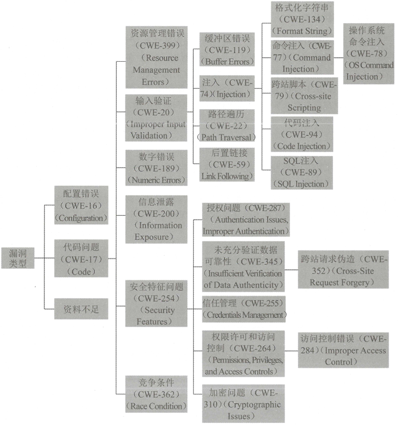
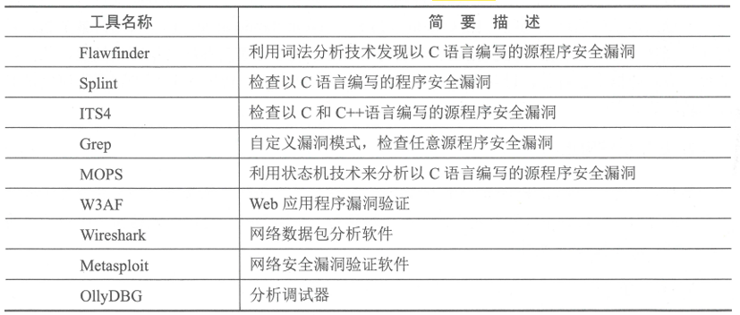
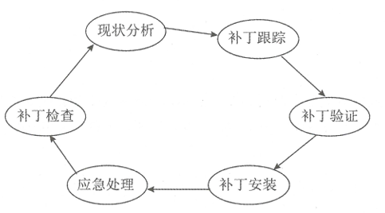

#  第十三章 网络安全漏洞防护技术原理与应用

概念

网络安全漏洞又称为脆弱性，简称漏洞。漏洞一般是致使网络信息系统安全策略相冲突的缺陷，这种缺陷通常称为安全隐患。

影响主要有机密性受损、完整性破坏、可用性降低、抗抵赖性缺失、可控制性下降、真实性不保等

[THM 漏洞](https://n1ddxc0sfaq.feishu.cn/wiki/XWJUwbVOTiBMCHkzZc6c2mO2nAh)

CPU漏洞： Meltdown （融化）和 Spectre （幽灵）

普通漏洞：相关漏洞信息已经广泛公开，安全厂商已经有了解决修补方案

零日漏洞 (zero-dayvulnerability) ：系统或软件中新发现的、尚未提供补丁的漏洞。零日漏洞通常被用来实施定向攻击 (Targeted  Attacks) 

攻击者基千漏洞对网络系统安全构成的安全威胁主要有：敏感信息泄露、非授权访问、 身份假冒、拒绝服务。

与漏洞相关的重大安全事件统计表

|时间 |网络安全事件 |所利用的漏洞 |
|---|---|---|
|1988年 |Internet蠕虫 |Sendmail及finger漏洞 |
|2000年 |分布式拒绝服务攻击 |TCP/IP协议漏洞 |
|2001年 |”红色代码”蠕虫 |微软Web服务器IIS 4.0 或 5.0 中index服务的安全漏洞 |
|2002年 |Slammer蠕虫 |微软MS SQL数据库系统漏洞 |
|2003年 |冲击波蠕虫 |微软操作系统DCOM RPC缓冲区溢出漏洞 |
|2010年 |震网病毒 |Windows操作系统、WinCC系统漏洞 |
|2017年 |Wannacry勒索病毒 |Windows系统的SMB漏洞 |
网络安全漏洞分类与管理

网络安全漏洞来源

1. 非技术性安全漏洞的主要来源
2. 技术性安全漏洞的主要来源
    1. 设计错误(Design Error)。TCP/IP协议设计错误导致的IP地址可以伪造。
    2. 输入验证错误(Input Validation Error)
    3. 缓冲区溢出(Buffer Overflow)：输入程序缓冲区的数据超过其规定长度，造成缓冲区 溢出，破坏程序正常的堆栈，使程序执行其他代码。
    4. 意外情况处置错误(Exceptional Condition Handling Error)。由千程序在实现逻辑中没 有考虑到一些意外情况，而导致运行出错。
    5. 访问验证错误(Access Validation Error)。由于程序的访问验证部分存在某些逻辑错误， 使攻击者可以绕过访问控制进入系统。
    6. 配置错误(Configuration Error)。由于系统和应用的配置有误，或配置参数、访问权限、策略安装位置有误。
    7. 竞争条件(Race Condition)。由于程序处理文件等实体在时序和同步方面存在问题， 存在一个短暂的时机使攻击者能够施以外来的影响。
    8. 环境错误(ConditionError)。由于一些环境变晕的错误或恶意设置造成的安全漏洞。

网络安全漏洞分类

1. **CVE 漏洞分类：**标识数字简称 CVE ID, 其格式由年份数字和其他数字组成，如 CVE-2019-1543 为一个 Open SSL 安全漏洞编号。
2. **CVSS：**一个通用漏洞计分系统分数计算依据由基本度量计分、时序度量计分、环境度量计分组成。

1.  我国信息安全漏洞分类
    1. 国家信息安全漏洞库 (CNNVD) 漏洞分类
    

    3. 国家信息安全漏洞共享平台(CNVI))漏洞分类
        * CNVD根据漏洞产生原因，将漏洞分为11种类型：输入验证错误、访问验证错误、意外 情况处理错误数目、边界条件错误数目、配置错误、竞争条件、环境错误、设计错误、缓冲区 错误、其他错误、未知错误。
        * CNVD依据行业划分安全漏洞，主要分为行业漏洞和应用漏洞。
          * 行业漏洞包括：电信、移动互联网、工控系统；
          * 应用漏洞包括Web应用、安全产品、应 用程序、操作系统、数据库、网络设备等。
        * 在漏洞分级方面，将网络安全漏洞划分为高、中、 低三种危害级别。 
2. **OWASP TOP 10 漏洞分类**

OW ASP (Open Web Application Security Program) 组织发布的有关 Web 应用程序的前十种安全漏洞

一些国内外厂商也会自行推出漏洞分类规范，如IBM、微软 (Microsoft) 、赛门铁克 (Symantec) 、思科 (Cisco) 、甲骨文 (Oracle) 等

网络安全漏洞信息获取

1. CERT ：(Computer Emergency Response Team)组织建立于1988年，是世界上第一个计算 机安全应急响应组织，其主要的工作任务是提供入侵事件响应与处理。目前，该组织也发布漏 洞信息。
2. Security Focus Vulnerability Database：由SecurityFocus公司开发维护的漏洞信息库， 它将许多原本零零散散的、与计算机安全相关的讨论结果加以结构化整理，组成了一个数 据库。
3. 国家信息安全漏洞库CNNVD
4. 国家信息安全漏洞共享平台CNVD
5. 厂商漏洞信息

网络安全漏洞管理过程

1. 网络信息系统资产确认：对网络信息系统中的资产进行摸底调查，建立信息资产档案。
2. 网络安全漏洞信息采集：利用安全漏洞工具或人工方法收集整理信息系统的资产安全漏洞相关信息，包括安全漏洞类型、当前补丁级别、所影响到的资产。 
3. 网络安全漏洞评估：对网络安全漏洞进行安全评估，如安全漏洞对组织业务的影响、安全漏洞被利用的可能性 （是否有公开工具、远程是否可利用等）、安全漏洞的修补级别，最后形成网络安全漏洞分析 报告，给出网络安全漏洞威胁排序和解决方案。量化方法：CVSS
4.  网络安全漏洞消除和控制：安装补丁包、升级系统、更新IPS或IDS 的特征库、变更管理流程。
5. 网络安全漏洞变化跟踪：

网络安全漏洞扫描技术

网络安全漏洞扫描（漏洞扫描器）

具体模块功能：

1. 用户界面：
2. 扫描引擎
3. 漏洞扫描结果分析
4. 漏洞信息及配置参数库

按照扫描器运行的环境及用途，漏洞扫描器主要分为 三种，即主机漏洞扫描器、网络漏洞扫描器、专用漏洞扫描器

1. 主机漏洞扫描器
    * COPS (Computer  Oracle and Password System) ：用来检查UNIX系统的常见安全配置问题和系统缺陷。
    * Tiger：基于shell语言脚本的漏洞检测程序，用于UNIX系统的配置漏洞检查。
    * MBSA：Windows 系统的安全基准分析工具。
2. 网络漏洞扫描器
    技术原理：通过与待扫描的目标机建立网络连接后，发送特定网络请求进行漏洞检查
    * Nmap 是国际上知名的端口扫描工具，常用于检测目标系统开启的服务端口。 
    * Nessus 是典型的网络漏洞扫描器，由客户端和服务端两部分组成，支持即插即用的漏洞检测脚本。 
    * X-scan 是由国内安全组织xfocus 开发的漏洞扫描工具，运行在Windows 环境中。
3. 专用漏洞扫描器

主要针对特定系统的安全漏洞检查工具，如数据库漏洞扫描器、网络设备漏洞扫描器、Web漏洞扫描器、工控漏洞扫描器。

网络安全漏洞扫描应用

网络安全漏洞扫描常用千网络信息系统安全检查和风险评估。通常利用漏洞扫描器检查发 现服务器、网站、网络设备、数据库等的安全隐患，以防止攻击者利用。同时，根据漏洞扫描 器的结果，对扫描对象及相关的业务开展网络安全风险评估。

网络安全漏洞发现技术

网络安全漏洞修补技术

补丁管理问题解决方案：CA公司的 eTrust Vulnerability Manager、微软的SoftwareUpdate Services (SUS)、PatchLink、LANDesk、 北信源内网安全管理及补丁分发系统(VRVEDP)等。

网络安全漏洞利用防范技术

1. 地址空间随机化技术

Address Space Layout Randomization, ASLR 就是通过对程序加载到内存的地址进行随机化处理，使得攻击者不能事先确定程序的返回地址值，从而降低攻击成功的概率。目前，针对Linux系统，通过ExecShield、Pax工具可以实现程序地址空间的随机化处理。

1. 数据执行阻止

Data Execution Prevention, DEP 是指操作系统通过对特定的内存区域标注为非执行，使得代码不能够在指定的内存区域运行。利用DEP,可以有效地保护应用程序的堆栈区域，防止被攻击者利用。

1. SEHOP

StructuredException Handler Overwrite Protection ，其原理是防止攻击者 利用StructuredException Handler (SEH)重写。

1. 堆栈保护

通过设置堆栈完整性标记以检测函数调用返回，地址是否被篡改，从而阻止攻击者利用缓冲区漏洞。

1. 虚拟补丁

对尚未进行漏洞永久补丁修复的目标系统程序，在不修改可执行程序的前提下，检测进入目标系统的网络流量而过滤掉漏洞攻击数据包，从而保护目标系统程序免受攻击

网络安全漏洞扫描器

国际商业产品有IBMRational AppScan、Qualys、 Shadow Security Scanner。国内商业产品有绿盟远程安全评估系统、天融信的脆弱性扫描与管理 系统、启明星辰的天镜脆弱性扫描与管理系统、安恒明鉴数据库漏洞扫描系统等。开源漏洞扫 描器有Nessus、 OpenVAS、 Nmap 等。

网络安全漏洞扫描产品常见的技术指标： 

(1) 漏洞扫描主机数量。产品扫描主机的数量，有无1P或域名限制。

(2) 漏洞扫描并发数。产品支持并发扫描任务的数量。

(3) 漏洞扫描速度。产品在单位时间内完成扫描漏洞任务的效率。

(4) 漏洞检测能力。产品检查漏洞的数量和类型，提供的漏洞知识库中是否覆盖主流操作 系统、数据库、网络设备。

(5) 数据库漏洞检查功能。对 Oracle、 MySQL、 MS SQL、 DB2、 Sybase、 PostgreSQL、 Mongo DB 等数据库漏洞检查的支持程度。

(6) Web 应用漏洞检查功能。 对 SQL 注入、跨站脚本、网站挂马、网页木马、 CGI 漏洞 等的检查能力。 

(7) 口令检查功能。

(8)标准兼容性。产品漏洞信息是否兼容CVE、CNNVD、CNVD、BugTraq等主流标准， 并提供CVE兼容(CVECompatible)证书。 

(9)部署环境难易程度。

