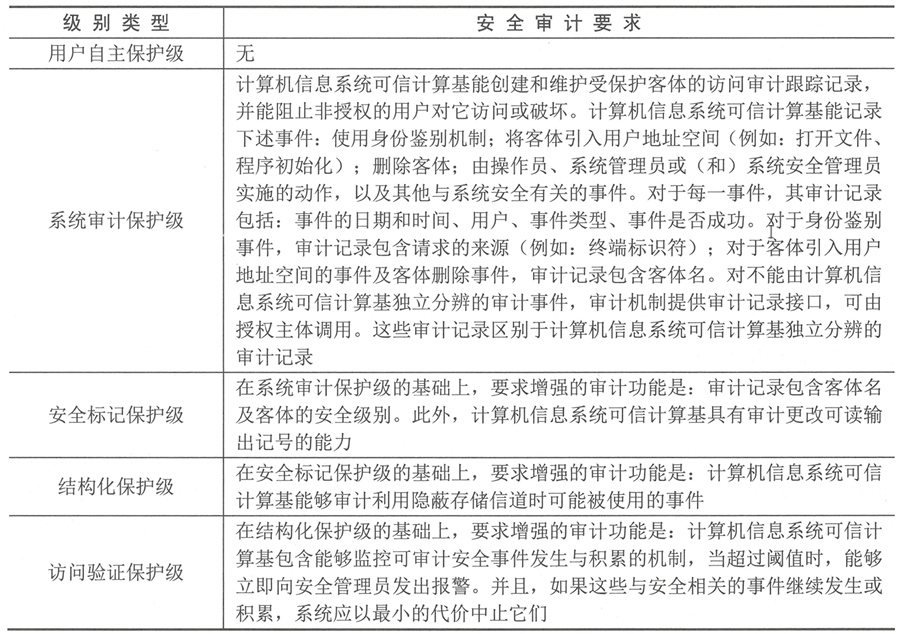
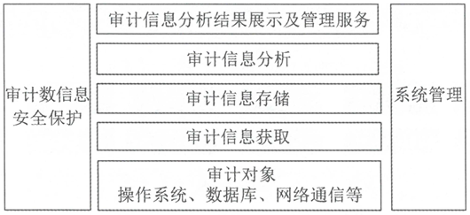
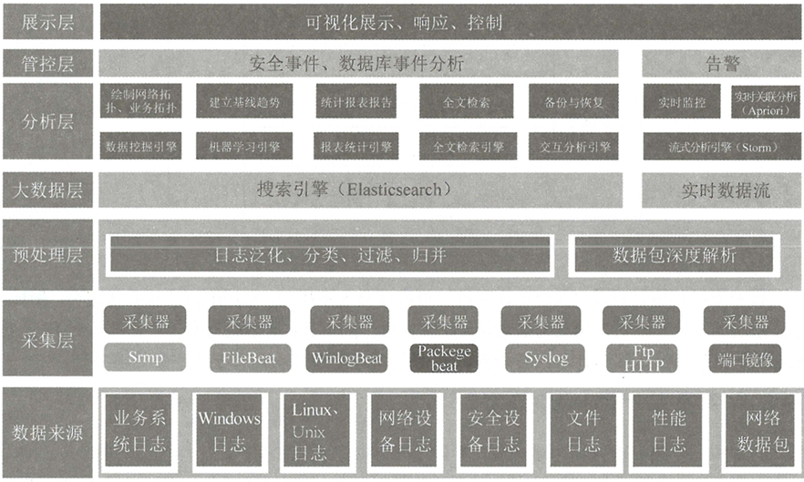
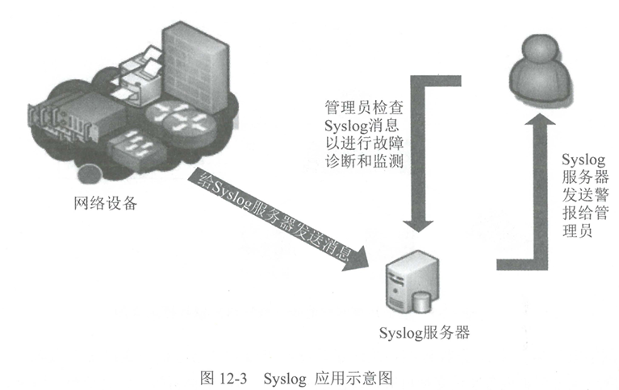
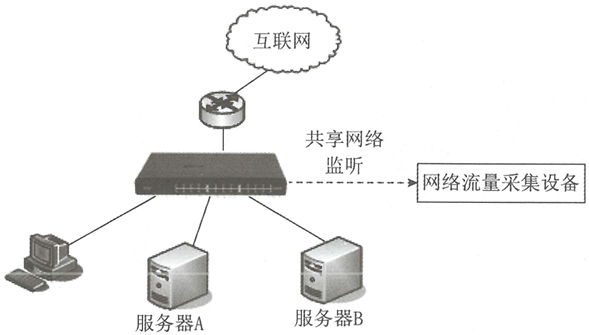
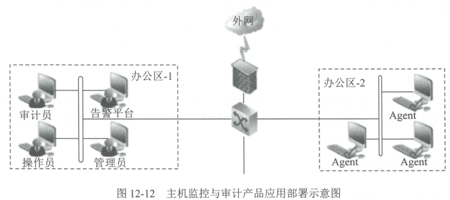

# 第十二章 网络审计原理及应用

> 网络安全审计是指对网络信息系统的安全相关活动信息进行获取、记录、存储、分析和利用的工作。网络安全审计的作用在千建立“事后“安全保障措施，保存网络安全事件及行为信息，为网络安全事件分析提供线索及证据，以便千发现潜在的网络安全威胁行为，开展网络安 全风险分析及管理。


相关标准

* 1985 美国国家标准局《可信计算机系统评估标准》 (Trusted Computer System  Evaluation Criteria,  TCSEC) 从C2级开始提出 了安全审计的要求，随着保护级别的增加而逐渐加强， B3 级以及之后更高的级别则不再变化。
* GB 17859《计算机信息系统安全保护等级划分准则》从第二级开始要求提供审计安全机制。其中，第二级为<span style="color: #C0ECBC">系统审计保护级</span>，该级要求计算机信息系统可信计算基实施了粒度更细的自主访问控制，它通过登录规程、审计安全性相关事件和隔离资源，使用户对自己的行为负责。 
* 其它
  * <span style="color: #E0E1E4">《信息安全技术 网络安全等级保护基本要求第 2 部分：云计算安全扩展要求 (GNT 1390.2-2017) 》</span>
  * <span style="color: #E0E1E4">《信息安全技术 网络安全等级保护基本要求第 3 部分：移动互联安 全扩展要求 (GNT1390.3—2017) 》</span>
  * <span style="color: #E0E1E4">《信息安全技术 网络安全等级保护基本要求第 5 部分： 工业控制系统安全扩展要求 (GNT1390.5—2017)》</span>

计算机信息系统安全保护能力的五个等级审计要求



相关法规政策

<span style="color: #FBBFBC">《中华人民共和国网络安全法》要求，采取监测、记录网络运行状态、网络安全事件技术措施，并按照规定留存相关的网络日志不少于</span><span style="color: #FBBFBC"><mark style="background-color: #FBBFBC">**六个月**</mark></span>。

网络安全审计系统组成



网络安全审计系统类型

* 按照审计对象类型分类：操作系统安全审计、数据库安全审计、网络通信安全审计、应用系统安全审计、网络安全设备审计、工控安全审计、移动安全审计、互联网安全审计、代码安全审计等。
  * 操作系统审计：
    * Windows 操作系统的基本审计信息有注册登录事件、目录服务访问、审计账户管理、 对象访问、审计策略变更、特权使用、进程跟踪、系统事件等；
    * Linux 操作系统的基本审计信息有系统开机自检日志 boot.log、用户命令操作日志 acct/pacct、最近登录日志 lastlog、使用 SU 命令日志 sulog、当前用户登录日志 utrnp、 用户登录和退出日志wtmp、系统接收和发送邮件日志maillog、系统消息 messages 等。
  * 数据库审计：监控并记录用户对数据库服务器的读、写、查询、添加、修改以及删除等操作，并可以对数据库操作命令进行回放。  Oracle 默认对特权操作进行审计，例如 ALTER ANY PROCEDURE、 CREATE ANY  LIBRARY、 DROPANY TABLE
  * 网络通信安全审计：采用专用的审计系统，通过专用设备获取网络流量，然后再进行存储和分析。
    * 审计的常见内容：IP源地址、 IP 目的地址、源端口号、目的端口号、 协议类型、传输内容等。
* 按照审计范围：综合审计系统、单个审计系统



网络安全审计机制

主要有基于主机的审计机制、基千网络通信的审计机制、基千应用的审计机制等

实现技术

1. 系统日志数据采集技术
    * 把操作系统、数据库、网络设备等系统中产生的事件信息汇聚到统一的服务器存储
    * 常见方式： SysLog、 SNMPTrap 



1. 网络流量数据获取技术
    常见技术方法：共享网络监听、交换机端口镜像 (PortMirroring) 、网络分流器 (NetworkTap) 

共享网络监听：利用 Hub 集线器构建共享式网络，网络流量采集设备接入集线器上，获取与集线器相连接的设备的网络流量数据

网络流量采集设备通过交换机端口镜像功能，获取流经交换机的网络通信包



对于不支持端口镜像功能的交换机，通常利用网络分流器(TAP)把网络流量导入网络流量采集设备


网络流量采集设备安装网络数据捕获软件，从网络上获取原始数据，然后再进行后续处理。

* 常见软件包：Libpcap (Library for Packet Capture)、 Winpcap、Tcpdump 
  Libpcap工作流程：
  1. 设置嗅探网络接口。在Linux操作系统中，大多数为ethO。
  1. 初始化Libpcap。设定过滤规则，明确获取网络数据包的类型。
  1. 运行Libpcap循环主体。Libpcap开始接收符合过滤规则的数据包。 
  Winpcap：基 千 Winpcap 的网络协议分析工具，可以采集网络数据包。

Tcpdump ：基千 Libpcap 的网络流量 数据采集工具，常常应用千 Linux 操作系统中

1. 网络审计数据安全分析技术
    1. 字符串匹配：通过模式匹配来查找相关审计数据，以便发现安全问题。常用工具：grep
        
```PlainText
grep [option] [regexp] [filename]    //regexp：正则表达式
```

    2. 全文搜索：利用搜索引擎技术来分析审计数据。常用工具：Elasticsearch
    3. 数据关联：指将网络安全威胁情报信息，如系统日志、全网流鼠、安全设备日志等多个数据来源进行综合分析，以发现网络中的异常流量，识别未知攻击手段
    4. 统计报表：对安全审计数据的特定事件、阙值、安全基线等进行统计分析，以生成告警信息，形成发送日报、周报、月报。 
    5. 可视化分析：将安全审计数据进行图表化处理，形成饼图、柱状图、折线图、地图等各种可视化效果， 以支持各种用户场景。
2. 网络审计数据存储技术
    * 由审计数据产生的系统自己分散存储，审计数据 保存在不同的系统中
    * 集中采集各种系统的审计数据，建立审计数据存储服务器，由专用的存储设备保 存，便于事后查询分析和电子取证。
3. 网络审计数据保护技术
    1. 系统用户分权管理：系统设置操作员、安全员和审计员三种类型的用户
    2. 审计数据强制访问：系统采取强制访问控制措施，对审计数据设置安全标记，防止非授权用户查询及修改审计 数据。
    3. 审计数据加密
    4. 审计数据隐私保护
    5. 审计数据完整性保护：使用Hash算法和数字签名

网络安全审计主要产品

1. 日志安全审计产品
    * 主要工作：日志信息采集、分析与管理
    * 基本原理：利用 Syslog、Srunptrap、NetFlow、Telnet、SSH、WMI、FTP、SFTP、SCP、JDBC、文件等技术， 对分散设备的异构系统日志进行分布采集、集中存储、统计分析、集中管理，
    * 主要功能：日志采集、日志存储、日志分析、日志查询、事件告警、统计报表、系统管理等
    * 相关产品：绿盟日志审计系统、天融信日志收集与分析系统、安恒明御＠综合日志审计平台、圣博润 LanSecS日志审计系统、ElasticStack（开源）
2. 主机监控与审计产品
    * 主要工作：有关主机行为信息的安全审查及管理
    * 基本原理：通过代理程序对主机的行为信息进行采集，然后基于采集到的信息进行分析，记录系统行为
    * 主要功能：系统用户监控、系统配置管理、补丁管理、准入控制、存储介质 (U盘）管理、非法外联管理等
    * 相关产品：北信源主机监控审计系统、天融信主机监控与审计系统、圣博润 LanSecS主机监控与审计系统等
    

3. 数据库审计产品
    > 基本原理：通过网络流量监 听、系统调用监控、数据库代理等技术手段对所有访问数据库系统的行为信息进行采集，然后 对采集的信息进行分析，形成数据库操作记录，保存和发现数据库各种违规的或敏感的操作信 息，为相应的数据库安全策略调整提供依据

    2. 网络监听审计
    优点：数据库网络审计不影响数据库服务器
    缺点：网络监听审计对加密的数据库网络流量难以审计，同时无法对数据库服务器的本地操作进行审计
    5. 自带审计
    优点：能够实现数据库网络操作和本地操作的审计
    缺点：是对数据库系统的性能有一些影响，在审计策略配置、记录的粒度、日志统一分析方面不够完善，日志本地存储容易被删除。
    8. 数据库Agent
    优点：能够实现数据库网络操作和本地操作的审计
    缺点：数据 库Agent需要安装数据库服务器，对数据库服务系统的性能、稳定性、可靠性有影响。
    主要产品：绿盟数据库审计系统、安华金和数据库监控与审计系统、天融信数据库审计系统、安恒明御数据库审计与风险控制系统等
4. 网络安全审计产品

> 有关网络通信活动的审计系统。
> 基本原理：通过网络流量信息 采集及数据包深度内容分析，提供网络通信及网络应用的活动信息记录。


常见功能

1. 网络流量采集
1. 网络流量数据挖掘分析
    1. 邮件收发协议(SMTP、POP3协议）审计
    2. 网页浏览(HTTP协议）审计
    3. 文件共享(NetBios协议）审计
    4. 文件传输(FTP协议）审计
    5. 远程访问(Telnet协议）审计
    6. DNS审计
相关产品：绿盟上网行为管理系统、科来网络全流量安 全分析系统 (TSA) 、天融信网络流量分析系统等

1. 工业控制系统网络审计产品

对工业控制网络中的协议、数据和行为等进行记录、分析， 并做出一定的响应措施的信息安全专用系统。

基本原理：利用网络流量采集及协议识别技术，对工业控制协议进行还原，形成工业控制系统的操作信息记录，然后进行保存和分析。

实现方式

* 一体化集中产品：将数据采集和分析功能集中在一台硬件中，统一完成审计分析功能
* 由采集端和分析端两部分组成：采集端主要提供数据采集的功能，将采集到的网络数据发送给分析端，由分析端进 一步处理和分析，并采取相应的响应措施。
1. 运维安全审计产品
    有关网络设备及服务器操作的审计系统。主要采集和记录IT 系统维护过程中相关人员”在什么终端、什么时间、登录什么设备（或系统）、做了什么操作、返回什么结果、什么时间登出”等行为信息，为管理人员及时发现权限滥用、违规操作等情况，准确定位身份，以便追查取证。
    基本原理：通过网络流量信息采集或服务代理等技术方式，记录 Telnet、FTP、SSH、tftp、HTTP等运维操作服务的活动信息

主要功能

(1)字符会话审计，审计SSH、Telnet等协议的操作行为，审计内容包括访问起始和终止 时间、用户名、用户IP、设备名称、设备IP、协议类型、危险等级和操作命令等。 

(2)图形操作审计，审计RDP、VNC等远程桌面以及HTTP/HTTPS协议的图形操作行为， 审计内容包括访问起始和终止时间、用户名、用户IP、设备名称、设备IP、协议类型、危险等 级和操作内容等。 

(3)数据库运维审计，审计Oracle、MSSQL Server、IBMDB2、PostgreSQL等各主流数 据库的操作行为，审计内容包括访问起始和终止时间、用户名、用户IP、设备名称、设备IP、 协议类型、危险等级和操作内容等。 

(4)文件传输审计，审计FTP、SFTP等协议的操作行为，审计内容包括访问起始和终止时 间、用户名、用户IP、设备名称、目标设备IP、协议类型、文件名称、危险等级和操作命令等。 

(5)合规审计，根据上述审计内容，参照相关的安全管理制度，对运维操作进行合规检查， 给出符合性审查。

相关产品：绿盟安全审计系统－堡垒机、思福迪LogBase 运维安全审计系统等

网络安全审计技术指标


