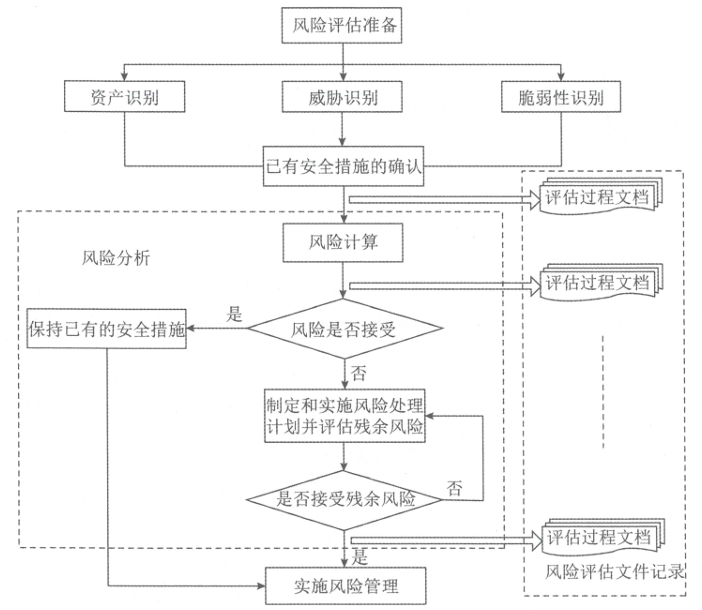

# 第十五章 网络风险评估

概念

网络风险评估就是评估威胁者利用网络资产的脆弱性，造成网络资产损失的严重程度。

评估模式

自评估：依靠自身力量，对自有的网络系统进行的风险评估活动。

检查评估：由网络安全主管机关或业务主管机关发起，旨在依据已经颁布的安全法规、安 全标准或安全管理规定等进行检查评估。

委托评估：网络系统使用单位委托具有风险评估能力的专业评估机构实施的评估活动。

评估过程

网络安全风险计算方法

1. 相乘法

是将安全事件发生的可能性与安全事件的损失进行相乘运算得到风险值

$z=f(x,y)=\sqrt{xy}$

1. 矩阵法

指通过构造一个二维矩阵，形成安全事件发生的可能性与安全事件的损失之间 的二维关系

网络安全渗透测试

主要工作：目标系统的安全漏洞发现、网络攻击路径构造、安全漏洞利用验证等。

* 常见的渗透测试集成工具箱有BackTrack5、 Metasploit、 Cobalt Strike等。

Cobalt Strike 是一个商业 化渗透平台，提供网络敌手仿真和渗透操作

* 口令破解工具有 John the Ripper、朔雪、 brutus-aet2、 Cain and Abel 等
* Web 应用系统安全分析工具，如 Webscarab、 AppScan 等。

入侵监测的工具和系统如下：

* 网络协议分析器，如Tcpdump、Wireshark;
* 入侵检测系统：开源入侵检测系统Snort、 Suricata、 Bro 
*  Windows 系统注册表监测，如 regedit;  
* Windows 系统安全状态分析，如 ProcessExplorer、 Autoruns、 Process Monitor 等
* 恶意代码检测：如RootkitRevealer、 ClamAV; 
* 文件完整性检查：如Tripwire、 MD5sum。

