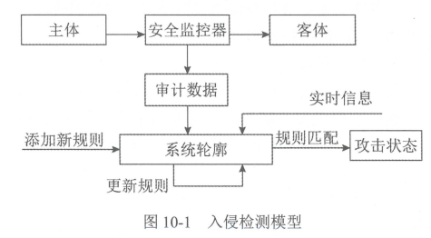
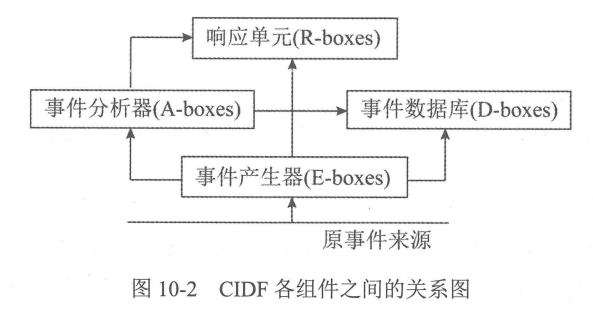
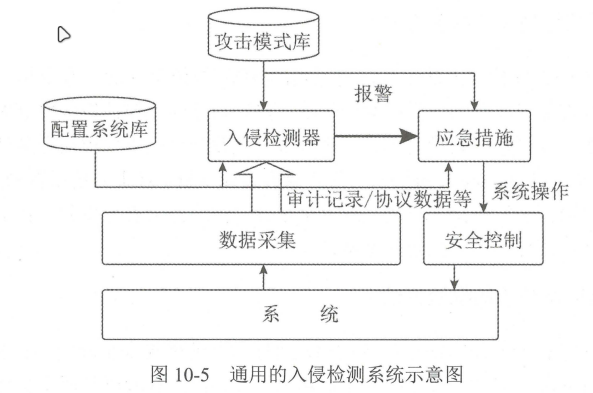
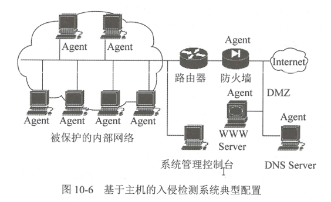
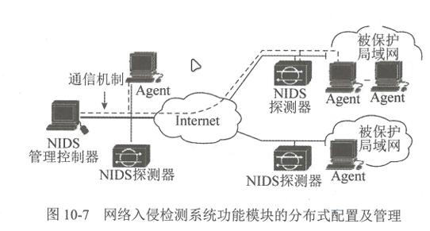
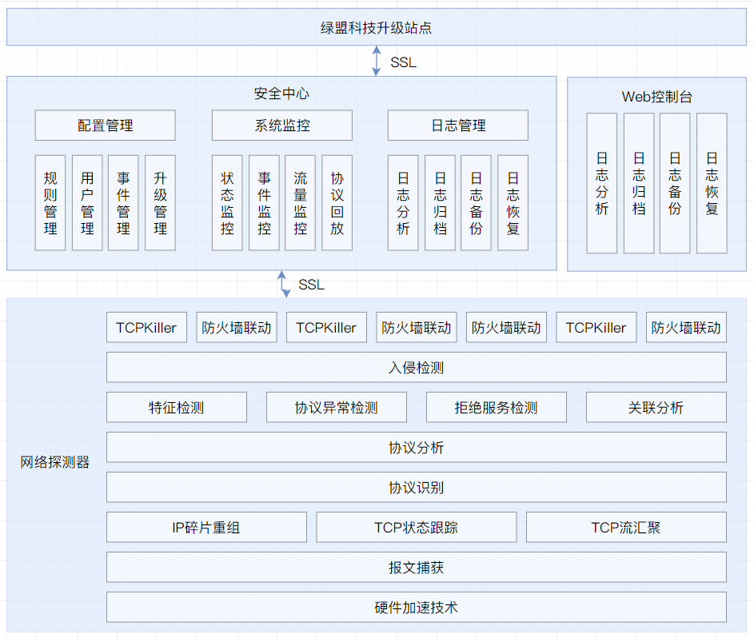
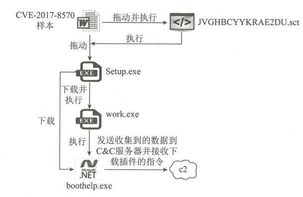
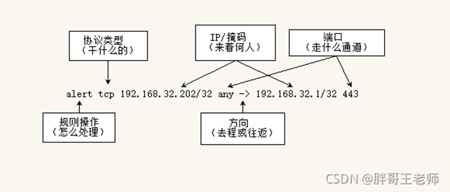
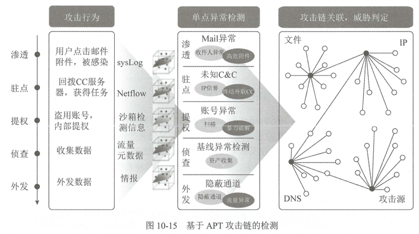
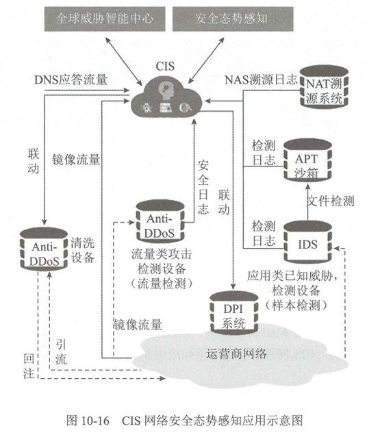

# 第十章 入侵检测技术原理及应用

# 概述

## 概念

入侵是指违背访问目标的安全策略的行为。入侵检测通过收集操作系统、系统程序、应用程序、网络包等信息，发现系统中违背安全策略或危及系统安全的行为。具有入侵检测功能的系统称为入侵检测系统，简称为 IDS  Intrusion detection technology。

## 入侵检测模型



* 事件产生器：从整个计算环境中获得事件，并向系统的其他部分提供事件。
* 事件分析器：分析所得到的数据，并产生分析结果。
* 响应单元：对分析结果做出反应，如切断网络连接、改变文件属性、简单报警等应急响应。
* 数据库：存放各种中间和最终数据，数据存放的形式既可以是复杂的数据库，也可以是简单的文本文件。



# 入侵检测技术

## 分类


* 基于误用的入侵检测技术
* 基于异常的入侵检测技术
* 其他技术（包括基于规范的检测方法、基于生物免疫的检测方法、基于攻击诱骗的检测方法、基于入侵报警的关联检测方法、基于沙箱动态分析的检测方法、基于大数据分析的检测方法）
【参考阅读：[入侵检测技术-CSDN博客](https://blog.csdn.net/JAVAYmm/article/details/122515242)】

|异常检测的方法 |特点 |
|---|---|
|基于统计的异常检测 |利用数学统计方法，得到用户或系统的正常行为并量化，超过设定的视为异常。统计的行为特征包含内存和CPU使用时间、登录时间、登录方式等。 |
|基于模式预测的异常检测 |该方法前提：事件的发生并不是随机的，事件之间是有时间联系的。通过归纳事件的时间关系，发现异常行为。TIM（Time-basedInductive Machine）规则表达举例如下：
表达式：（洗手！）（用纸擦干=50%，暖风吹干=50%）表达式含义是：整个事件顺序是洗手、用纸擦干、暖风吹干。其中，事件“用纸擦干”“暖风吹干”的概率各为50%。 |
|基于文本分类的异常检测 |该方法有两个基本概念：（1）“字”：程序的系统调用；（2）“文档”：进程运行产生的系统调用集合。该方法借助K-最近邻聚类文本分析算法，分析每个进程产生的“文档”，通过判断相似性，发现异常。 |
|基于贝叶斯推理的异常检测 |通过分析和测量，任一时刻的若干系统特征（如磁盘读/写操作数量、网络连接并发数），判断是否发生异常。 |
## 基于误用的入侵检测技术

### 误用检测方法

1. 条件概率预测法：是将入侵方式对应个事件序列，然后观测事件发生序列，应用贝叶斯定理进行推理，推测入侵行为
2. 状态迁移方法：利用状态图表示攻击特征，不同状态刻画了系统某一时刻的特征。通过检查系统的状态变化发现系统中的入侵行为。采用该方法的 IDS STAT （State Transition Analysis Technique） USTAT （State Transition Analysis Tool for UNIX）

### 基于键盘监控的误用检测方法

是假设入侵行为对应特定的击键序列模式，然后监测用户的击键模式，并将这一模式与入侵模式匹配，从而发现入侵行为。

**缺点：**也可能存在多种击键方式表示同一种攻击；如果没有击键语义分析，用户提供别名（例如 Korn shell） 很容易欺骗这种检测技术；该方法不能够检测恶意程序的自动攻击。

### 基于规则的误用检测方法

将攻击行为或入侵模式表示成一种规则，只要符合规则就认定它是一种入侵行为

**优点：**检测简单

**缺点：**检测受库限制，无法发现新的攻击，并易受干扰。目前，大部分 IDS 采用的是这种方法。 Snort 是典型的基于规则的误用检测方法的应用实例。


## 基于异常的入侵检测技术

异常检测方法是指通过计算机或网络资源统计分析，建立系统正常行为的轨迹，定义一组系统正常情况的数值，然后将系统运行时的数值与所定义的正常情况相比较，得出是否有被攻击的迹象。


## 基于统计的异常检测方法

<span style="color: #E0E1E4">利用数学统计理论技术，通过构建用户或系统正常行为的特征轮廓。特征轮廓通常由主体特征变量的频度、均值、方差、被监控行为的属性变量的统计概率分布以及偏差等统计量来描述。</span>

* <span style="color: #E0E1E4">典型的系统主体特征有：系统的登录与注销时间、资源被占用的时间以及处理机、内存和外设的使用情况等。</span>


## 基于模式预测的异常检测方法

<span style="color: #E0E1E4">前提条件：事件序列不是随机发生的而是服从某种可辨别的模式，其特点是考虑了事件序列之间的相互联系。</span>

<span style="color: #E0E1E4">利用时间规则识别用户正常行为模式的特征。</span>

<span style="color: #E0E1E4">优点：</span>

<span style="color: #E0E1E4">能较好地处理 变化多样的用户行为，并具有很强的时序模式； </span>

<span style="color: #E0E1E4">能够集中考察少数几个相关的安全事件，而不是关注可疑的整个登录会话过程；</span>

* <span style="color: #E0E1E4">容易发现针对检测系统的攻击</span>

### <span style="color: #E0E1E4">基于文本分类的异常检测方法</span>

<span style="color: #E0E1E4">利用 K－最近邻聚类 CK-Nearest Neighbor） 文本分类算法，分析文档的相似性，发现异常的系统调用，从而检测入侵行为。</span>

### <span style="color: #E0E1E4">基于贝叶斯推理的异常检测方法</span>

<span style="color: #E0E1E4">指在任意给定的时刻，测量 A1， A2， An 变量值， 推理判断系统是否发生入侵行为。其中，每个变量 A1 表示系统某一方面的特征，例如磁盘 1/0 的活动数量、 系统中页面出错的数目等。</span>


1. <span style="color: #E0E1E4">基于规范的检测方法：</span>

<span style="color: #E0E1E4">用一种策略描述语言 PE-grammars 事先定义系统特权程序有关安全的 操作执行序列，每个特权程序都有 组安全操作序列，这些操作序列构成特权程序的安全跟踪 策略 （trace policy） 。若特权程序的操作序列不符合已定义的操作序列 就进行入侵报警。</span>

<span style="color: #E0E1E4">优点：已知和未知的攻击都能发现</span>

1. <span style="color: #E0E1E4">基于生物免疫的检测方法</span>

指模仿生物有机体的免疫系统工作机制，使受保护的系统能够将“非自我 （non-self） "的攻击行为与“自我 （self） "的合法行为区分开来。

综合了异常检测和误用检测两种方法，关键技术：构造系统”自我”标志以及标志演变方法。

1. 基于攻击诱骗的检测方法

将一些虚假的系统或漏洞信息提供给入侵者，如果入侵者应用这些信息攻击系统，就可以推断系统正在遭受入侵，并且安全管理员还可以诱惑入侵者，跟踪攻击来源。

1. 基于入侵报警的关联检测方法

是通过对原始的 IDS 报警事件的分类及相关性分析来发现复杂攻击行为

* 基于报警数据的相似性进行报警关联分析；
* 通过人为设置参数或通过机器学习的方法进行报警关联分析；
* 根据某种攻击的前提条件与结果 （preconditions and consequences） 进行报警关联分析。

1. 基于沙箱动态分析的检测方法

指通过构建程序运行的受控安全环境，形成程序运行<span style="color: #D4C1F3">安全沙箱</span>，然后监测可疑恶意文件或程序在安全沙箱的运行状况，获取可疑恶意文件或可疑程序的动态信息，最后检测相关信息是否异常，从而发现入侵行为。

沙箱里的资源被虚拟化或被间接化，沙箱里的不可信程序的恶意行为往往会被限制在沙箱中

1. 基于大数据分析的检测方法

通过汇聚系统日志、 IDS 报警日志、防火墙日志、 DNS 志、网络威胁情报、全网流量等多种数据资源，形成网络安全大数据资源池，然后利用人工智 能技术，基于网络安全大数据进行机器学习，以发现入侵行为 常见的大数据分析检查技术有数据挖掘、深度学习、数据关联、数据可视化分析等

# 入侵系统的组成及分类



IDS 分类

* 基于主机的入侵检测系统 HIDS：分析主机信息
* 基于网络的入侵检测系统 NIDS：对网络中通信的数据包进行攻击特征扫描或异常建模
* 分布式入侵检测系统 DIDS：从多台主机、多个网段采集检测数据，或者收集单个 IDS 的报 警信息，根据收集到的信息进行综合分析，


## 基于主机的入侵检测系统 HIDS

HIDS 通过收集主机系统的日志文件、系统调用以及应用程序的使用、系统资源、网络通信和用户使用等信息，分析这些信息是否包含攻击特征或异常情况，并依此来判断该主机是否受到入侵。实际，CPU 利用率、内存利用率、磁盘空间大小、网络端口使用情况、注册表、文件的完整性、进程信息、系统调用等常作为识别入侵事件的依据。

适合检测以下入侵行为：

* 针对主机的端口或漏洞扫描；
* 重复失败的登入尝试；
* 远程口令破解；
* 主机系统的用户账号添加；
* 服务启动或停止；
* 系统重启动；
* 文件的完整性或许可权变化；
* 注册表修改；
* 重要系统启动文件变更；
* 程序的异常调用；
* 拒绝服务攻击。

HIDS 中的软件：

1. **SWATCH**（The Simple WATCHer and filer）：用于实时监视日志的 PERL 程序。SWATCH 利用指定的触发器监视日志记录，当日志记录符合触发器条件时， SWATCH 会按预先定义好的方式通知系统管理员。
2. **Tripwire：**一个文件和目录完整性检测工具软件包。根据系统文件的规则设置，将已破坏或被篡改的文件通知系统管理员，因而 常作为损害控制测量工具。
3. **网页防篡改系统：**在页面文件被篡改后，能够及时发现、产生报警、通知管理员、自动恢复。
     核心内嵌技术即密码水印技术。该技术将篡改检测模块内嵌在Web服务器软件里，它在每一个网页流出时都进行完整性检查，对于篡改网页进行实时访问阻断，并予以报警和恢复

优点：

* 可以检测基于网络的入侵检测系统不能检测的攻击；
* 基于主机的入侵检测系统可以运行在应用加密系统的网络上，只要加密信息在到达被监控的主机时或到达前解密；
* 基于主机的入侵检测系统可以运行在交换网络中。

缺点：

* 必须在每个被监控的主机上都安装和维护信息收集模块；
* 由于 HIDS 的一部分安装在被攻击的主机上，HIDS 可能受到攻击并被攻击者破坏；
* HIDS 占用受保护的主机系统的系统资源，降低了主机系统的性能；
* 不能有效地检测针对网络中所有主机的网络扫描：
* 不能有效地检测和处理拒绝服务攻击；
* 只能使用它所监控的主机的计算资源。


## NIDS

通过侦听网络系统，捕获网络数据包，并 依据网络包是否包含攻击特征，或者网络通信流是否异常来识别入侵行为。

包括探测器和管理控制器两部分。**探测器**分布在网络中的不同区域，通过侦听（嗅探）方式获取网络包，探测器将检测到攻击行为形成报警事件，向管理控制器发送报警信息，报告发生入侵行为。**管理控制器**可监控不同网络区域的探测器，接收来自探测器的报警信息。

能够检测到的入侵行为

* 同步风暴（SYN Flood） ；
* 分布式拒绝服务攻击（DDoS） ；
* 网络扫描；
* 缓冲区溢出；
* 协议攻击；
* 流量异常；
* 非法网络访问。

产品：

* 国外：SessionWall、ISSRealSecure、CiscoSecure IDS
* 国内：东软集团、北京天融信网络安全技术有限公司、绿盟科技集团股份有限公司、华为技术有限公司等
* 开源：Snort、 Suricata、 Bro、 Zeek、 OpenDLP、 Sagan

Snort， 轻量型的 NIDS，首先通过 libpcap 软件包监听（sniffer/logger）获得网络数据包，然后进行入侵检测分析。其主要方法是基于规则的审计分析，进行包的数据内容搜索／匹配。目前， Snort 能检测缓冲区溢出、端口扫描、CGI 攻击、SMB 探测等多种攻击，还具有实时报警功能。

优点：

* 适当的配置可以监控一个大型网络的安全状况；
* 对已有网络影响很小，通常属于被动型的设备，只监听网络而不干扰网络的正常运作；
* 可以很好地避免攻击，对于攻击者甚至是不可见的

缺点：

* 在高速网络中， NIDS 很难处理所有的网络包，可能出现漏检现象；
* 交换机可以将网络分为许多小单元 VLAN， 而多数交换机不提供统一的监测端口，这就减少了监测范围；
* 如果网络流量被加密， NIDS 中的探测器无法对数据包中的协议进行有效的分析；
* NIDS 仅依靠网络流量无法推知命令的执行结果，从而无法判断攻击是否成功。


## 分布式入侵检测系统

为解决以下新的入侵检测问题：

* 攻击者可能利用分布在多个主机上系统的漏洞攻击网络
* 相互协作的入侵行为
* 入侵检测所依靠的数据来源分散化，收集原始的检测数据变得困难
* 网络传输速度加快，网络的流量增大，集中处理原始数据的方式往往造成检测瓶颈，从而导致漏检。

### 基于主机检测的分布式入侵检测系统 HDIDS

结构组成：主机探测器和入侵管理控制器

HDIDS 将主机探测器按层次、分区域地配置、管理，把它们集成为一个可用于监控、保护分布在网络区域中的主机系统。

作用：用于保护网络的关键服务器或其他具有敏感信息的系统，利用主机的系统资源、系统调用、审计日志等信息，判断主机系统的运行是否遵循安全规则。

安装方式：多用安全代理（Agent）的形式直接安装在被保护的主机上，并通过网络中的系统管理控制台进行远程控制。




### 基于网络的分布式入侵检测系统 NDIDS

解决问题：当网络中需要保护的主机系统比较多时，安装配置 HDIDS 的工作量非常大

结构组成：：网络探测器和管理控制器。**网络探测器**部署在重要的网络区域，如服务器所在的网段，用于收集网络通信数据和业务数据流，通过采用异常和误用两种方法对收集到的信息进行分析，若出现攻击或异常网络行为，就向管理控制器发送报警信息。

一般适用于大规模网络或者是地理区域分散的网络，采用这种结构有利于实现网络的分布式安全管理。

优点：能够将基于主机和网络的系统结构结合起来，检测所用到的数据源丰富，可以克服前两者的弱点。

缺点：传输安全事件过程中增加了通信的安全问题处理，安全管理配置复杂度增加等




# 主要产品及技术指标


## 主机入侵检测系统

技术原理：根据主机活动信息及重要文件，采用特征匹配、系统文件监测、安全规则符合检查、文件数字指纹、大数据分析等综合技术方法发现入侵行为。

典型产品形态终端安全产品：北信源主机监控审计系统、360 安全卫士、 McAfeeMVISION Endpoint Detection and Response （EDR） 等。

## 网络入侵检测系统

产品技术原理是根据网络流量数据进行分析，利用特征检测、协议异常检测等技术方法发现入侵行为。以绿盟科技集团股份有限公司的 IDS 为例



## 统一威胁管理 UTM

统一威胁管理是由硬件、软件和网络技术组成的具有专门用途的设备，该设备主要提供一项或多项安全功能，同时将多种安全特性集成于一个硬件设备里，形成标准的统一威胁管理平台。UTM 通常部署在内部网络与外部网络的边 界，对流出和进入内部网络的数据进行保护和控制。UTM 在实际网络中的部署方式通常包括 透明网桥、路由转发和 NAT 网关

## 高级持续威胁检测

高级持续威胁（简称为 APT）是复杂性攻击技术，通常将恶意代码嵌入 Word 文档、Excel 文档、PPT 文档、PDF 文档或电子邮件中，以实现更隐蔽的网络攻击，以逃避普通的网络安全检查。肚脑虫（Donot）组织以“克什米尔问题”命名的诱饵漏洞文档，该文档利用了 CVE-2017-8570 漏洞，其主要的攻击流程如图所示。



## 其他

根据入侵检测应用对象，常见的产品类型有 WebIDS、数据库 IDS、工控 IDS 等

Web IDS：利用 Web 网络通信流量或 Web 访问日志等信息，检测常见的 Web 攻击，如 Webshell、SQL 注入、远程文件包含 （RFI） 、跨站点脚本 （XSS） 等攻击行为。

数据库 IDS ：利用数据库网络通信流量或数据库访问日志等信息，对常见的数据库攻击行为进行检测，如数据库系统口令攻击、 SQL 注入攻击、数据库漏洞利用攻击等；

工控 IDS ：通过获取工控设备、工控协议相关信息，根据工控漏洞攻击检测规则、异常报文特征和工控协议安全策略，检测工控系统的攻击行为。

入侵检测系统的主要指标有可靠性、可用性、可扩展性、时效性、准确性和安全性。

应用场景：上网保护、网站入侵检测与保护、网络攻击阻断、主机／终端恶意代码检测、网络安全监测预警与应急处置、网络安全等级保护

目前，入侵检测技术 常用于网络安全等级保护对象中，如在关键网络节点处监视网络攻击行为；检测虚拟机与宿主 机、虚拟机与虚拟机之间的异常流量；检测针对无线接入设备的网络扫描、 DDoS 攻击、密钥破解、中间人攻击和欺骗攻击。

# 部署方法

IDS 部署是指将 IDS 安装在网络系统区域中，使之能够检测到网络中的攻击行为。 IDS 部

署的基本过程包含以下几个步骤：

第一步，根据组织或公司的安全策略要求，确定 IDS 要监测的对象或保护网段；

第二步，在监测对象或保护网段，安装 IDS 探测器，采集网络入侵检测所需要的信息；

第三步，针对监测对象或保护网段的安全需求，制定相应的检测策略；

第四步，依据检测策略，选用合适的 IDS 结构类型；

第五步，在 IDS 上，配置入侵检测规则；

第六步，测试验证 IDS 的安全策略是否正常执行；

第七步，运行和维护 IDS


# 基于 HIDS 的主机威胁检测

HIDS 一般用于检测针对单台主机的入侵行为，其主要应用方式如下：

（1） 单机应用。 在这种应用方式下，把 HIDS 系统直接安装在受监测的主机上即可。

（2） 分布式应用。 这种应用方式需要安装管理器和多个主机探测器 （Sensor） 。管理器控制多个主机探测器 （Sensor） ，从而可以远程监控多台主机的安全状况。

# 基于 NIDS 的内网威胁检测

将网络 IDS 的探测器接在内部网的广播式 Hub 或交换机的 Probe 端口，如图 10-11 所示。 探测器通过采集内部网络流量数据，然后基于网络流量分析监测内部网的网络活动，从而可以发现内部网络的入侵行为。

# 基于 NIDS 的网络边界威胁检测

将 NIDS 的探测器接在网络边界处，采集与内部网进行通信的数据包，然后分析来自外部的入侵行为。

网络安全态势感知应用参考

网络安全态势感知通过汇聚 IDS 报警信息、系统日志，然后利用大数据分析技术对网络系统的安全状况进行分析，监测网络安全态势。

安全洋葱通过集成 Elasticsearch、 Logstash、 Kibana、 Snort、 Suricata、 Bro、Sguil、 Squert、 CyberChef、 NetworkMiner 等相关技术，提供入侵检测、企业安全监测和日志管理等安全服务。其中， Snort、 Suricata、 Bro、 OSSEC 为入侵检测系统。

[Security Onion Solutions 2.3.10 部署指南](https://zhuanlan.zhihu.com/p/302350720)


# 开源网络入侵检测系统

## SNORT

Snort 是应用较为普遍的网络入侵检测系统，其基本技术原理是通过获取网络数据包，然后基于安全规则进行入侵检测，最后形成报警信息。 Snort 规则由两部分组成，即规则头和规则选项。规则头包含规则操作 （action） 、协议 （protocol） 、源地址和目的 IP 地址及网络掩码、源地址和目的端口号信息。规则选项包含报警消息、被检查网络包的部分信息及规则应采取的动作。


```Shell
alert tcp any any ->192.168.1.0/24 111 (content:"|00 01 86 a5|";msg:"mouted access";)
```

规则头和规则选项通过“（）"来区分，规则选项内容用括号括起来

规则头常见的动作 有 alert、log、pass、activate、dynamic；

规则选项是 Snort 入侵检测的引擎核心，所有 Snort 规 则选项都用“；”隔开，规则选项关键词使用“:”和对应的参数区分，Snort 提供十五个规则选项关键词。

msg 用于显示报警信息

content 用于指定匹配网络数据包的内容

<span style="color: #D4C1F3">规则头：</span>



规则操作

协议类型：TCP、UDP、ICMP、IP

IP 地址

端口号

方向操作

<span style="color: #E0E1E4">规则的开启和关闭可以通过在前面加#来控制</span>

规则选项内容：[blog.csdn.net](https://blog.csdn.net/baidu_19348579/article/details/121261650)

用户手册：[Snort Setup Guides for Emerging Threats Prevention](https://www.snort.org/documents#OfficialDocumentation)


## 华为 CIS 网络安全智能系统

采用最新的大数据分析 和机器学习技术，用于抵御 APT 攻击。其产品技术原理是从海量数据中提取关键信息，通过多 维度风险评估，采用大数据分析方法关联单点异常行为，从而还原出 APT 攻击链，准确识别和 防御 APT 攻击，避免核心信息资产损失。


CIS 基千大数据平台，采用机器学习模式，针对 APT 攻击过程进行检测，如图 10-15 所示。 CIS 提供文件异常检测、 Mail 异常检测、 C&C 检测、 流最基线异常检测、 隐蔽通道检测、 攻击链关联等安全功能。 CIS 网络安全态势感知应用如图 10-16 所示。 






