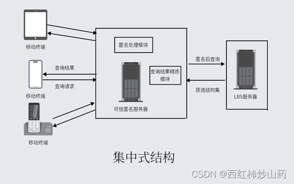
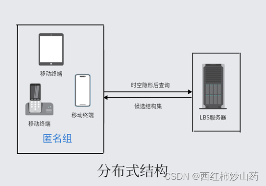
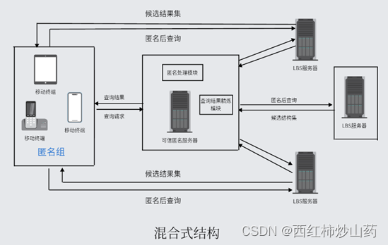
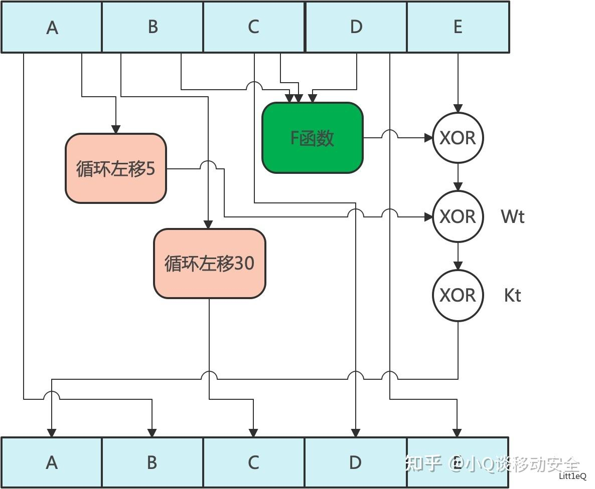
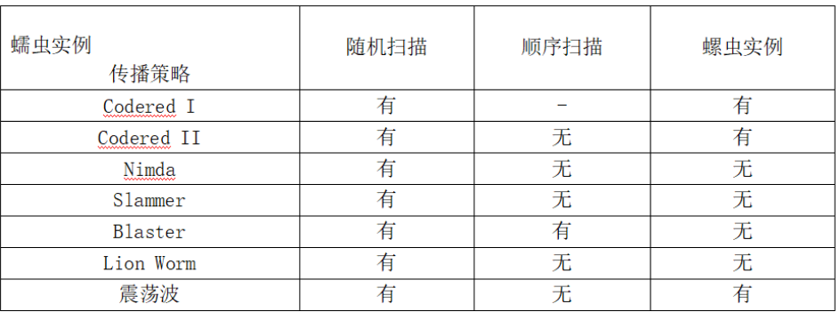
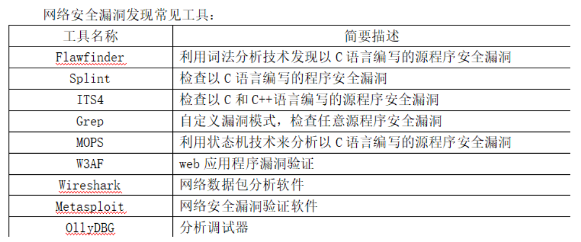
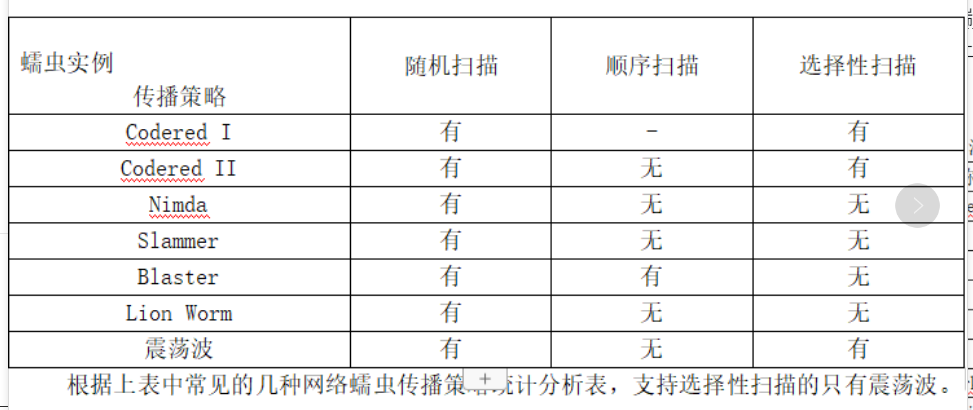

# 2 理论扩展

额外扩展

CA <span style="color: #E0E1E4">Certification Authority </span>数字证书认证中心

CA中心为每个使用公开密钥的用户发放一个数字证书，数字证书的作用是证明证书中列出的用户名称与证书中列出的公开密钥相对应。CA中心的数字签名使得攻击者不能伪造和篡改数字证书

负责证书的颁发和管理，并依靠证书证明一个用户的身份

RA <span style="color: #E0E1E4">Registration Authority 数字证书注册审批机构</span>

RA系统是CA的证书发放、管理的延伸。它负责证书申请者的信息录入、审核以及证书发放等工作；同时，对发放的证书完成相应的管理功能。


位置隐私保护体系结构可分为三种：集中式体系结构、客户/服务器体系结构、分布式

集中式

用户使用移动终端向LBS服务器发送LBS查询,并获得最终的查询结果.可信匿名服务器包含匿名处理模块和查询结果精炼模块:匿名处理模块把移动终端发送过来的精确位置模糊化,并转发给LBS服务器;查询结果精炼模块接收LBS服务器返回的结果集对其进行精炼,并将精炼后的最终结果返回给移动终端。




分布式



<span style="color: #E0E1E4">移动终端之间通过</span><span style="color: #FBBFBC">[P2P](https://so.csdn.net/so/search?q=P2P&spm=1001.2101.3001.7020)</span><span style="color: #E0E1E4">协议,利用单跳和多跳通信形成一个匿名组,查询用户模糊化其位置为包含组内所有用户的空间区域,并将其转发给服务器,LBS服务器返回包含正确结果的候选集,用户之间通过彼此协作完成隐私保护。</span>

混合式



移动终端通过可信匿名服务器请求服务,也可基于个性化的隐私、响应时间以及服务质量需求使用P2P协议完成隐私保护.匿名服务器拥有用户的身份、服务请求、位置等完全知识.混合式结构集成了集中式和分布式结构的优点,能够很好地平衡客户端和匿名服务器之间的负载减少了匿名服务器由大量移动终端位置更新导致的负荷。

[位置隐私保护方法的研究与应用_分布式结构隐私-CSDN博客](https://blog.csdn.net/m0_58519182/article/details/130701565#:~:text=%E4%B8%80%E3%80%81%E4%BD%8D%E7%BD%AE%E9%9A%90%E7%A7%81%E4%BF%9D%E6%8A%A4%E7%BB%93%E6%9E%84%201%201.1%20%E9%9B%86%E4%B8%AD%E5%BC%8F%E7%BB%93%E6%9E%84%20%E9%9B%86%E4%B8%AD%E5%BC%8F%E7%BB%93%E6%9E%84%E7%94%B1%E7%A7%BB%E5%8A%A8%E7%BB%88%E7%AB%AF%E3%80%81%E5%8F%AF%E4%BF%A1%E5%8C%BF%E5%90%8D%E6%9C%8D%E5%8A%A1%E5%99%A8%E3%80%81LBS%E6%9C%8D%E5%8A%A1%E5%99%A8%E7%BB%84%E6%88%90%EF%BC%8C%E5%A6%82%E5%9B%BE1-1%E6%89%80%E7%A4%BA%EF%BC%9A%20%E5%9B%BE1-1%20%E9%9B%86%E4%B8%AD%E5%BC%8F%E7%BB%93%E6%9E%84%20%E7%94%A8%E6%88%B7%E4%BD%BF%E7%94%A8%E7%A7%BB%E5%8A%A8%E7%BB%88%E7%AB%AF%E5%90%91LBS%E6%9C%8D%E5%8A%A1%E5%99%A8%E5%8F%91%E9%80%81LBS%E6%9F%A5%E8%AF%A2%2C%E5%B9%B6%E8%8E%B7%E5%BE%97%E6%9C%80%E7%BB%88%E7%9A%84%E6%9F%A5%E8%AF%A2%E7%BB%93%E6%9E%9C.%E5%8F%AF%E4%BF%A1%E5%8C%BF%E5%90%8D%E6%9C%8D%E5%8A%A1%E5%99%A8%E5%8C%85%E5%90%AB%E5%8C%BF%E5%90%8D%E5%A4%84%E7%90%86%E6%A8%A1%E5%9D%97%E5%92%8C%E6%9F%A5%E8%AF%A2%E7%BB%93%E6%9E%9C%E7%B2%BE%E7%82%BC%E6%A8%A1%E5%9D%97%3A%E5%8C%BF%E5%90%8D%E5%A4%84%E7%90%86%E6%A8%A1%E5%9D%97%E6%8A%8A%E7%A7%BB%E5%8A%A8%E7%BB%88%E7%AB%AF%E5%8F%91%E9%80%81%E8%BF%87%E6%9D%A5%E7%9A%84%E7%B2%BE%E7%A1%AE%E4%BD%8D%E7%BD%AE%E6%A8%A1%E7%B3%8A%E5%8C%96%2C%E5%B9%B6%E8%BD%AC%E5%8F%91%E7%BB%99LBS%E6%9C%8D%E5%8A%A1%E5%99%A8%3B%E6%9F%A5%E8%AF%A2%E7%BB%93%E6%9E%9C%E7%B2%BE%E7%82%BC%E6%A8%A1%E5%9D%97%E6%8E%A5%E6%94%B6LBS%E6%9C%8D%E5%8A%A1%E5%99%A8%E8%BF%94%E5%9B%9E%E7%9A%84%E7%BB%93%E6%9E%9C%E9%9B%86%E5%AF%B9%E5%85%B6%E8%BF%9B%E8%A1%8C%E7%B2%BE%E7%82%BC%2C%E5%B9%B6%E5%B0%86%E7%B2%BE%E7%82%BC%E5%90%8E%E7%9A%84%E6%9C%80%E7%BB%88%E7%BB%93%E6%9E%9C%E8%BF%94%E5%9B%9E%E7%BB%99%E7%A7%BB%E5%8A%A8%E7%BB%88%E7%AB%AF%E3%80%82,...%203%201.3%20%E6%B7%B7%E5%90%88%E5%BC%8F%E7%BB%93%E6%9E%84%20%E6%B7%B7%E5%90%88%E5%BC%8F%E7%BB%93%E6%9E%84%E7%94%B1%E7%A7%BB%E5%8A%A8%E7%BB%88%E7%AB%AF%E3%80%81%E5%8F%AF%E4%BF%A1%E5%8C%BF%E5%90%8D%E6%9C%8D%E5%8A%A1%E5%99%A8%E3%80%81LBS%E6%9C%8D%E5%8A%A1%E5%99%A8%E7%BB%84%E6%88%90%EF%BC%8C%E5%A6%82%E5%9B%BE1-3%E6%89%80%E7%A4%BA%EF%BC%9A%20%E5%9B%BE1-3%20%E6%B7%B7%E5%90%88%E5%BC%8F%E7%BB%93%E6%9E%84%20)


网络流量清洗系统的主要技术方法

1. 流量检测

利用分布式多核硬件技术，基于深度数据包检测技术（DPI）监测、分析网络流量，快速识别隐藏在背景流量中的攻击包，以实现精准的流量识别和清洗。恶意流量主要包括DoS/DDoS 攻击、同步风暴(SYN Flood) 、UDP 风暴(UDPFlood) 、ICMP 风暴CICMP Flood) 、DNS 查询请求风暴(DNSQuery Flood) 、HTTP Get 风暴(HTTPGet Flood) 、CC 攻击等网络攻击流量。

1. 流量牵引与清洗

当监测到网络攻击流量时，如大规模DDoS 攻击，流量牵引技术将目标系统的流量动态<u>转发到流量清洗中心</u>来进行清洗。其中，流量牵引方法主要有BGP 、DNS 。流量清洗即拒绝对指向目标系统的恶意流量进行路由转发，从而使得恶意流量无法影响到目标系统。

1. 流量回注

流量回注是指将清洗后的干净流量回送给目标系统，用户正常的网络流量不受清洗影响。


SHA-1

> `SHA-1`（Secure Hash Algorithm 1）是一种密码散列函数，美国国家安全局设计，并由美国国家标准技术研究所（NIST）发布为联邦资料处理标准（FIPS）。SHA-1可以生成一个被称为<mark style="background-color: #F9D8B1">消息摘要的160位（20字节）散列值</mark>，散列值通常的呈现形式为40个十六进制数。


SHA-1实现步骤

步骤一: 数据填充(Append Padding Bits)

`SHA-1`是按照分块进行处理的，分块长度为<mark style="background-color: #F9D8B1">`512bit`</mark>, 大多数情况下，数据的长度不会恰好满足是512的整数倍，因此需要进行「padding」到给定的长度。

「填充规则」: 原始明文消息的`b`位之后补`100...`, 直到满足`b + paddingLength % 512 = 448`, 那如果`b % 512`在`[448, 512(0)]`之间呢，则在增加一个分块，按照前面的规则填充即可。

步骤二: 长度填充

之前说了，需要满足`b + paddingLength % 512 = 448`， 那么对于最后一个分块，就还剩`512 - 448 = 64 bit` 这剩下的<mark style="background-color: #F9D8B1">`64bit`</mark><mark style="background-color: #F9D8B1">存放的是原始消息的长度</mark>，也就是`b`。「SHA-1」最多可以处理明文长度小于等于`2^64 bit`的数据。

经过上面两个步骤的处理，最终得到的处理后的数据如下图所示:





[一篇文章带您读懂公钥基础设施（PKI ）体系](https://zhuanlan.zhihu.com/p/377562137)

登录账号：H3F7292

[解读｜一文读懂CA数字证书](https://zhuanlan.zhihu.com/p/684201939)


RSA 密文=（明文^e) mod n


数字签名由CA的公钥认证

[一文搞定Kerberos](https://zhuanlan.zhihu.com/p/266491528)

* **认证服务器（Authentication Server，AS）**：在 Kerberos 系统中，有一个专门的服务器称为认证服务器（AS）。当用户想要访问网络资源时，首先需要向 AS 请求认证。用户会提供自己的身份信息（通常是用户名和密码）。
* **票据授予票据（Ticket-Granting Ticket，TGT）**：如果用户提供的身份信息是正确的，AS 将生成一个称为票据授予票据（TGT）的加密票据，并将其发送回用户。TGT 是一种特殊的票据，它允许用户向 Ticket Granting Server（TGS）请求访问票据，而无需再次提供密码。
* **票据授予服务器（Ticket Granting Server，TGS）**：TGT 是加密的，并且只能由 TGS 解密。一旦用户收到 TGT，他们可以向 TGS 发送请求，请求访问特定的服务。用户向 TGS 提供 TGT，并指定所需服务的标识符。
* **服务票据（Service Ticket）**：如果 TGT 是有效的，TGS 将生成一个称为服务票据的加密票据，并将其发送回给用户。服务票据允许用户访问所请求的服务，而无需再次提供密码。
* **访问服务**：用户现在拥有了服务票据，可以使用它来访问所请求的服务。用户将服务票据发送到所需的服务，该服务验证票据的有效性，并根据需要提供所请求的资源或服务。

## 4G LTE

4G：第四代移动通信及其技术（The 4th Generation Communication System）

任何达到或超过100Mbps的无线数据网络系统

LTE：一种基于OFDM（正交频分复用）调制方式的无线通信技术。LTE技术是基于3GPP标准制定的，LTE一开始是3G的“加强版”，在技术上被称为3.9G，随着后期的发展LTE逐渐接近真正的4G。


与漏洞相关的重大安全事件


网络蠕虫传播策略统计分析表




[《信息系统灾难恢复规范》 - 灾备建设国家标准解读-容灾-中存储网](https://www.chinastor.com/rongzai/121GRL2015.html#:~:text=%E3%80%8A%E4%BF%A1%E6%81%AF%E7%B3%BB%E7%BB%9F%E7%81%BE%E9%9A%BE%E6%81%A2%E5%A4%8D%E8%A7%84%E8%8C%83%E3%80%8B%20-%20%E7%81%BE%E5%A4%87%E5%BB%BA%E8%AE%BE%E5%9B%BD%E5%AE%B6%E6%A0%87%E5%87%86%E8%A7%A3%E8%AF%BB%201%201%E3%80%81%E4%B8%9A%E5%8A%A1%E5%8D%95%E4%BD%8D%E5%9C%A8%E9%80%89%E6%8B%A9%E5%90%88%E9%80%82%E7%9A%84%E7%81%BE%E5%A4%87%E7%AD%89%E7%BA%A7%E6%97%B6%EF%BC%8C%E9%9C%80%E8%A6%81%E8%80%83%E8%99%91%E6%8A%95%E8%B5%84%E5%9B%9E%E6%8A%A5%E7%8E%87%202,2%E3%80%81%E6%AF%8F%E4%B8%AA%E4%B8%9A%E5%8A%A1%E5%8D%95%E4%BD%8D%E4%B8%AD%E7%9A%84%E4%B8%8D%E5%90%8C%E4%B8%9A%E5%8A%A1%E7%B3%BB%E7%BB%9F%EF%BC%8C%E5%8F%AF%E9%87%87%E7%94%A8%E4%B8%8D%E5%90%8C%E7%9A%84%E7%81%BE%E9%9A%BE%E6%81%A2%E5%A4%8D%E7%AD%96%E7%95%A5%203%203.%20RTO%E5%92%8CRPO%E7%9B%AE%E6%A0%87%204%204.%20%E7%81%BE%E9%9A%BE%E6%81%A2%E5%A4%8D%E8%B5%84%E6%BA%90%E8%A6%81%E7%B4%A0)


无线局域网鉴别和保密体系

Wireless LAN Authentication and Privacy Infrastructure，WAPI

WAPI是一种安全协议，同时也是中国提出的无线局域网安全强制性标准。当前全球无线局域网仅有的两个标准，分别是<span style="color: #D4C1F3">IEEE802.11系列标准（俗称WiFi）、WAP标准</span>。

* WAPI从应用模式上分为单点式和集中式两种。WAPI的密钥管理方式包括基于证书和基于预共享密钥两种方式。
* WAPI分为WAI和WPI两部分，分别实现对用户身份的鉴别和对传输的业务数据加密。
  * 其中，WAI采用公开密钥体制，进行认证；
  * WPI采用对称密码体制，实现加、解密操作。
* WIFI单向加密；WAPI采用双向均认证


各种工具：

COPS：扫描UNIX系统漏洞及配置问题

Tiger：Shell脚本程序，检查UNIX系统配置

MBSA：提供基于Windows 的安全基准分析


Executor用80端口传递控制信息和数据：

BladeRunner、Doly Trojan、Fore、FTP Trojan、Larva、Ebex,WinCrash等木马复用21端口；（FTP）

Shtrilitz Stealth、Terminator、WinPC、WinSpy等木马复用25端口。（SMTP）

Web服务默认端口80；

局域网中的共享文件夹和打印机默认端口分别为445和139；

局域网内部Web服务默认端口8080；

SSL协议（安全套接层））默认端口443。


"Executor"木马是一种恶意软件，其名称可能来源于早期Windows系统中的一个系统进程"explorer.exe"，用于执行文件和管理用户界面。Executor木马通常会伪装成正常的系统进程或应用程序，并通过各种方式植入到受害者的计算机系统中，以获取未经授权的访问权限并执行恶意活动。


隐蔽通道技术能有效隐藏通信内容和通信状态，目前常见的能提供隐蔽通道方式进行通信的后门有<span style="color: #D4C1F3">BO2K、Code Red Ⅱ、Nimida、Covert TCP</span>等。


计算机病毒的生命周期一般包括潜伏阶段（休眠）、传播阶段、触发阶段、发作阶段四个阶段。


恶意代码检测技术：


syslog是Linux系统默认的日志守护进程。syslog可以记录系统事件，可以写到一个文件或设备，或给用户发送一个信息。它能记录本地事件或通过网络记录另一个主机上的事件


私有地址段：10.0.0.0～10255.255.255; 172.16.0.0~172.31.255.255; 192.168.0.0~192.168.255.255。


自动专用IP地址址（AutomaticPrivateIPAddress，APlPA）：169.254.X.X是保留地址。如果PC机上的IP地址设置自动获取，而PC机又没有找到相应的DHCP服务，那么最后PC机可能得到保留地址中的一个IP


邮件收发的协议是POP，POP3（第三代），IMAP，SMTP协议。


为了充分阻断正在发生的网络攻击行为，通常IPS以串接方式部署在防火墙后。但是这种部署方式会引发网络通信瓶颈和高可用性的问题。因此为了解决这个问题，可以采用旁路接入或SPS

IPS/SPS的主要安全功能如下：

* 屏蔽指定IP地址
* 屏蔽指定网络端口屏蔽指定域名；
* 封锁指定URL、阻断特定攻击类型
* 为零日漏洞（Zero-dayVulnerabilities）提供热补丁

IPS/SPS有利于增强对网络攻击的应对能力，可以部署在国家关键信息网络设施、运营商骨干网络节点、国家信息安全监管单位


高防IP服务是抵御DDos攻击的有效方法，为了避免直接攻击源站服务器，通常采用代理转发模式保护源站服务器。


在Microsoft Access数据库中，系统表（System Tables）是存储数据库内部结构和元数据的表。这些表通常对用户隐藏，但可以通过特定的设置进行查看和访问。这些表包含关于数据库对象的信息，例如表、查询、表单、报表和宏。了解系统表可以帮助开发人员更好地管理和维护Access数据库。


### 常见的Access系统表


1. **MSysObjects**：
    * **描述**：包含数据库中所有对象的信息，包括表、查询、表单、报表、宏等。
    * **关键字段**：
      * `Name`：对象名称
      * `Type`：对象类型（例如，表、查询）
      * `DateCreate`：创建日期
      * `DateUpdate`：最后更新日期


1. **MSysACEs**：
    * **描述**：存储关于对象的访问控制列表（ACL），包括用户和组的权限信息。
    * **关键字段**：
      * `ObjectID`：对象的ID
      * `UserID`：用户或组的ID
      * `Permissions`：权限设置


1. **MSysQueries**：
    * **描述**：包含关于所有查询的信息，包括查询的SQL语句和属性。
    * **关键字段**：
      * `Name`：查询名称
      * `SQL`：查询的SQL语句
      * `Attribute`：查询属性


1. **MSysRelationships**：
    * **描述**：存储关于表之间关系的信息。
    * **关键字段**：
      * `szObject`：关系的名称
      * `szColumn`：字段名称
      * `szReferencedObject`：引用的对象名称
      * `szReferencedColumn`：引用的字段名称


1. **MSysAccessObjects**：
    * **描述**：包含关于Access特定对象（如宏和模块）的信息。
    * **关键字段**：
      * `ID`：对象ID
      * `Name`：对象名称
      * `Type`：对象类型


### 查看系统表


默认情况下，Access隐藏系统表，但你可以通过以下步骤显示它们：


1. **Access 2007及以上版本**：
    * 打开数据库。
    * 单击“文件”菜单，然后选择“选项”。
    * 在Access选项对话框中，选择“当前数据库”。
    * 在“导航选项”下，选中“显示系统对象”复选框。
    * 单击“确定”。


1. **Access 2003及更早版本**：
    * 打开数据库。
    * 在菜单栏中，选择“工具” > “选项”。
    * 在“视图”选项卡中，选中“系统对象”复选框。
    * 单击“确定”。


### 注意事项


* **不要直接修改系统表**：直接修改系统表可能会破坏数据库的完整性和稳定性。任何对数据库对象的更改应通过Access提供的界面和工具进行。
* **备份数据库**：在查看和使用系统表之前，确保你已经备份了数据库，以防出现意外情况。


### 使用系统表的场景


* **数据库分析和文档化**：了解数据库结构和关系。
* **权限管理**：查看和管理用户权限。
* **问题排查**：识别和解决数据库对象的相关问题。


通过对Access系统表的了解，可以更有效地管理和维护数据库，提高工作效率和数据管理的安全性。


SQL Server系统表（System Tables）是存储数据库服务器和数据库内部结构及元数据的表。这些表包括关于数据库对象的信息，例如表、视图、存储过程、索引等。SQL Server提供了一组系统视图来替代旧的系统表，以提供一致的接口和更好的兼容性。以下是一些关键的SQL Server系统表和视图及其用途。


### 常见的系统视图


#### 数据库级系统视图

1. **sys.tables**
    * **描述**：存储数据库中所有用户表的信息。
    * **关键字段**：
      * `object_id`：对象的ID
      * `name`：表名
      * `schema_id`：架构ID
      * `create_date`：创建日期
      * `modify_date`：最后修改日期


1. **sys.columns**
    * **描述**：包含数据库中所有表和视图的列信息。
    * **关键字段**：
      * `object_id`：对象的ID
      * `name`：列名
      * `column_id`：列ID
      * `system_type_id`：系统类型ID
      * `max_length`：列的最大长度


1. **sys.indexes**
    * **描述**：存储所有表和视图的索引信息。
    * **关键字段**：
      * `object_id`：对象的ID
      * `index_id`：索引ID
      * `name`：索引名称
      * `type`：索引类型
      * `is_unique`：是否唯一索引


1. **sys.foreign_keys**
    * **描述**：存储所有外键约束的信息。
    * **关键字段**：
      * `object_id`：外键ID
      * `parent_object_id`：引用的父对象ID
      * `referenced_object_id`：引用的对象ID
      * `name`：外键名称


1. **sys.schemas**
    * **描述**：包含数据库中所有架构的信息。
    * **关键字段**：
      * `schema_id`：架构ID
      * `name`：架构名称
      * `principal_id`：与架构关联的主体ID


#### 服务器级系统视图

1. **sys.databases**
    * **描述**：存储服务器中所有数据库的信息。
    * **关键字段**：
      * `database_id`：数据库ID
      * `name`：数据库名称
      * `state_desc`：数据库状态描述
      * `create_date`：创建日期


1. **sys.server_principals**
    * **描述**：存储服务器级安全主体的信息，包括登录名和服务器角色。
    * **关键字段**：
      * `principal_id`：安全主体ID
      * `name`：安全主体名称
      * `type`：安全主体类型
      * `default_database_name`：默认数据库名称


1. **sys.sysprocesses**
    * **描述**：存储关于当前在服务器上运行的进程的信息。
    * **关键字段**：
      * `spid`：服务器进程ID
      * `kpid`：内核进程ID
      * `blocked`：阻塞进程的ID
      * `waittype`：等待类型


### 查看系统视图


你可以通过查询这些系统视图来获取数据库和服务器的元数据。例如：


```SQL
-- 查看数据库中所有用户表的信息
SELECT * FROM sys.tables;

-- 查看数据库中所有列的信息
SELECT * FROM sys.columns WHERE object_id = OBJECT_ID('YourTableName');

-- 查看数据库中所有索引的信息
SELECT * FROM sys.indexes WHERE object_id = OBJECT_ID('YourTableName');

-- 查看服务器中所有数据库的信息
SELECT * FROM sys.databases;
```


### 注意事项


* **只读访问**：系统视图通常是只读的，直接修改系统表可能会导致数据库的不稳定和损坏。
* **使用视图代替表**：尽量使用系统视图（如sys.tables, sys.columns等）而不是旧的系统表（如sysobjects, syscolumns等），以保持兼容性和一致性。
* **备份和恢复**：在执行涉及系统表的操作之前，确保备份数据库，以防止意外数据丢失。


### 使用系统视图的场景


* **数据库管理**：了解数据库中的表、列、索引和其他对象的详细信息，以便更好地管理和优化数据库。
* **安全管理**：查看服务器和数据库级的安全设置，包括登录名和权限。
* **性能监控**：监控当前正在运行的进程和会话，以检测和解决性能问题。


通过了解和使用SQL Server的系统视图，数据库管理员和开发人员可以更有效地管理和维护数据库，提高工作效率和系统安全性。


`sysobjects` 是 SQL Server 中的一个系统表（在 SQL Server 2005 及更高版本中已被系统视图所取代），用于存储有关数据库对象（如表、视图、存储过程、触发器等）的信息。在 SQL Server 2000 及更早版本中，`sysobjects` 是主要的元数据表之一，用于管理数据库对象。


虽然在现代 SQL Server 版本中建议使用系统视图（如 `sys.tables`、`sys.views` 等）来替代 `sysobjects`，但了解 `sysobjects` 对于维护旧版数据库系统或理解 SQL Server 的历史有时仍然是必要的。


### `sysobjects` 表的结构和字段


以下是 `sysobjects` 表的一些重要字段：


* **name**: 对象的名称。
* **id**: 对象的唯一标识符。
* **xtype**: 对象的类型。例如：
  * `U`: 用户表 (User table)
  * `V`: 视图 (View)
  * `P`: 存储过程 (Stored procedure)
  * `TR`: 触发器 (Trigger)
  * `FN`: 标量函数 (Scalar function)
  * `IF`: 内联表值函数 (Inline table-valued function)
  * `TF`: 表值函数 (Table-valued function)
* **uid**: 创建对象的用户 ID。
* **info**: 对象的状态信息。
* **status**: 对象的状态和属性。
* **crdate**: 对象的创建日期。


### 查询示例


以下是一些使用 `sysobjects` 的查询示例：


#### 获取数据库中的所有用户表


```SQL
SELECT name 
FROM sysobjects 
WHERE xtype = 'U';
```


#### 获取数据库中的所有视图


```SQL
SELECT name 
FROM sysobjects 
WHERE xtype = 'V';
```


#### 获取某个特定表的创建日期


```SQL
SELECT crdate 
FROM sysobjects 
WHERE xtype = 'U' 
  AND name = 'YourTableName';
```


### 替代系统视图


在 SQL Server 2005 及更高版本中，推荐使用系统视图来代替 `sysobjects`，以获得更详细和结构化的元数据信息。例如：


* **sys.objects**: 包含所有类型的数据库对象的信息，类似于 `sysobjects`。
* **sys.tables**: 仅包含用户表的信息。
* **sys.views**: 仅包含视图的信息。


#### 使用 `sys.objects` 进行相同的查询


##### 获取数据库中的所有用户表


```SQL
SELECT name 
FROM sys.objects 
WHERE type = 'U';
```


##### 获取数据库中的所有视图


```SQL
SELECT name 
FROM sys.objects 
WHERE type = 'V';
```


##### 获取某个特定表的创建日期


```SQL
SELECT create_date 
FROM sys.objects 
WHERE type = 'U' 
  AND name = 'YourTableName';
```


### 总结


`sysobjects` 是 SQL Server 中的一个旧系统表，用于存储有关数据库对象的信息。在现代 SQL Server 版本中，使用系统视图（如 `sys.objects`、`sys.tables` 等）来获取这些信息是更好的选择，因为它们提供了更详细和一致的元数据管理方法。不过，了解 `sysobjects` 对于维护和迁移旧版数据库系统仍然很有用。


Sniffer主要是捕获到达本机端口的报文。如果要想完成监听，即捕获网段上所有的报文，前提条件是：①网络必须是共享以太网。②把本机上的网卡设置为混杂模式。






Macro.前缀是宏病毒；Trojian.前缀是木马；Worm.前缀是蠕虫病毒；Backdoor.前缀是后门。

