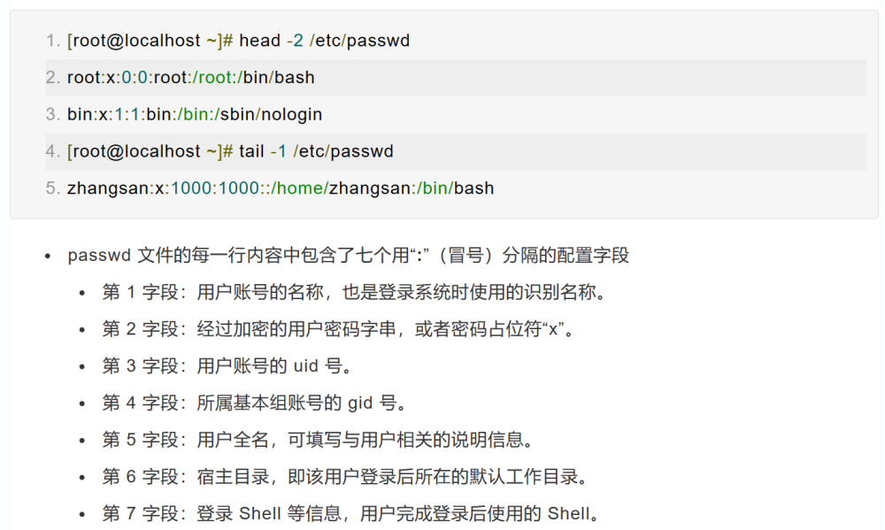
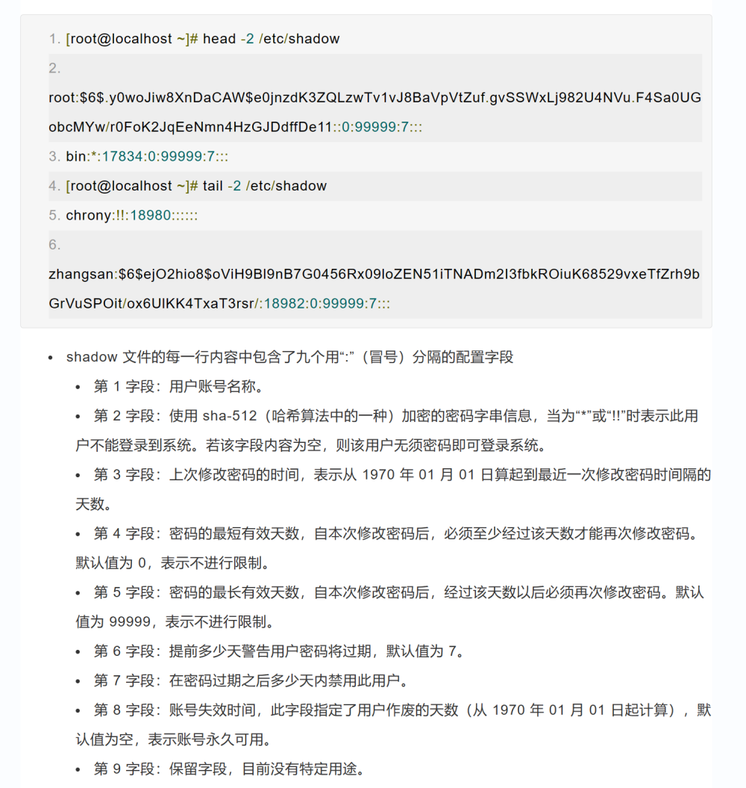

# 账号和权限

# 概述

## 用户账号

1. 超级用户：`root`
2. 普通用户：一般只在用户自己的宿主目录中拥有完整权限
3. 程序用户：特定的低权限用户账号，一般不允许登录到系统，只能用于维持系统或某个程序的正常运行，如`bin、daemon、ftp、mail`

## 组账号

基本组（私有组）

附加组（公共组）

## UID和GID

> UID：User identity
GID：Group Identity


* root uid号为固定值0；
* 程序用户账号的uid默认为1~499；
* 普通用户500~60000

# 用户账号管理

## 用户账号文件

文件位置：`etc/passwd`



## 用户密码文件

文件位置：`/etc/shadow`



## 添加/修改/删除

### Useradd


```Bash
-u：指定用户的uid号，要求该uid未被其他用户使用
-d：指定用户的宿主目录位置（当与-M一起使用时，不生效）
-e：指定用户的账户失效时间，可使用YYYY-MM-DD的格式
-g：指定用户的基本组名（或用gid号）
-G：指定用户的附加组名（或用gid号）
-M：不建立宿主目录，即使/etc/login.defs系统配置中已设定要建立宿主目录
-s：指定用户登陆的Shell
```

### Passwod


```Bash
-d：清空指定用户的密码，仅使用用户名即可登录系统
-I：锁定用户账户
-S：查看用户账户状态
-u：解锁用户账号
```

## Usermod

修改用户账号属性


```Bash
-u：修改用户的uid
-d：修改用户的宿主目录
-e：修改用户的账户失效时间
-g：修改用户的基本组名
-G：修改用户的附加组名
-s：指定用户的登录Shell
-I：更改用户账户的登录名称 login name
-L：锁定
-u：解锁
```

# 组账号管理

## 组账号文件

`etc/group`

`root:0`

`bin:1`

> 第一字段：用户组名称；第二字段：密码占位符；第三字段：gid 第四字段：组长包含的用户


## 添加/修改/删除


```Bash
groupadd -g xxx（gid） name  #添加组账号

'gpasswd 命令'
-a：添加组成员
-d：删除组成员
-M：指定组中的用户

gpasswd -a zhangsan root
gpassed -d zhangsan root
gpaddwd -M root,zhangsan root

'groupdel 命令' #删除
```

## 查询账号信息


```Bash
groups zhangsan #查询用户账号所属组
id root         #查询账号的身份标识
finger root     #查询用户账号的登陆属性
w               #查询当前主机的用户登录情况
```

## 管理目录和文件属性


```Bash
ls -ld /etc/padded
```

