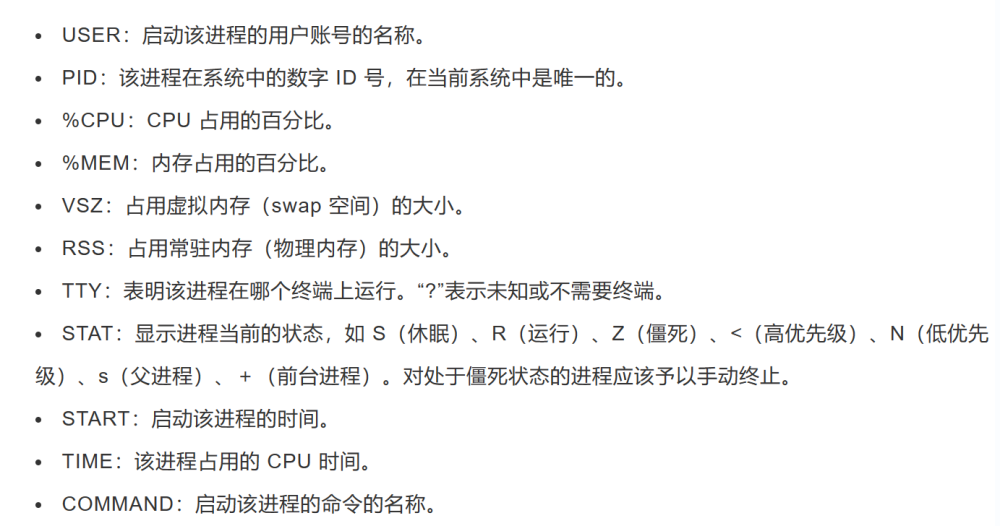
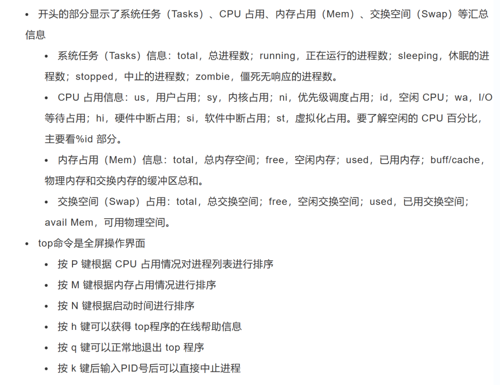

# 进程和服务控制

# 查看进程

## ps命令


```Bash
<mark style="background-color: #B898EE">**ps命令**</mark>（查看静态的进程统计信息）Processes Statistic
-a：all processes，cluding others 
-u：使用以用户为主的格式输出进程信息
-x：显示当前用户在所有终端下的进程信息
-ax：显示系统中的所有进程
-e：显示系统中的所有进程
-l：使用长（Long）格式显示进程信息
-f：使用完整的（Full）格式显示进程信息
```



## top命令

> 查看进程动态信息，默认每三秒刷新一次




## pgerp命令

> 查询进程信息


```Bash
-I:输出对应的进程名
-U:查询特定用户的进程
-t：查询在特定终端运行的进程
```

# 控制进程


```Bash
启动进程后台运行,后面加上'&'符号
cp /dev/cdrom mycd.iso $
ctrl+z    #挂起当前的进程

jobs -l   #查看后台进程
fg 2    #恢复后台进程

ctrl+c    #终止进程
#kill通过进程名称来终止进程
kill -9 uid  #-9选项强制终止
killall "xxx"
#pkill可以根据进程的名称、运行该进程的用户、进程所在的终端等多种属性终止特定的进程
pkill 
-U:指定用户
-t：指定终端
```

# 系统服务控制

## 语法


```Bash
#CentOS 7以后的版本
systemctl ctl_type ser_name
#其他分支及之前版本
service ser_name ctl_type
```

## 控制类型


```Bash
start 启动 ：运行指定的系统服务程序，实现服务功能
stop：终止指定的系统服务程序，关闭相应服务
restart：先退出，再重新运行指定的系统服务程序
reload：不退出服务程序，只是刷新配置，在某些服务中与restart的操作相同
status：查看指定的系统服务的运行状态及相关信息
enable：设置开机自启动
disable：设置开机自关闭
is-disabled：查看开机时的状态
```

