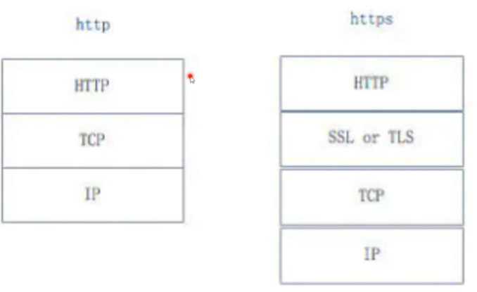
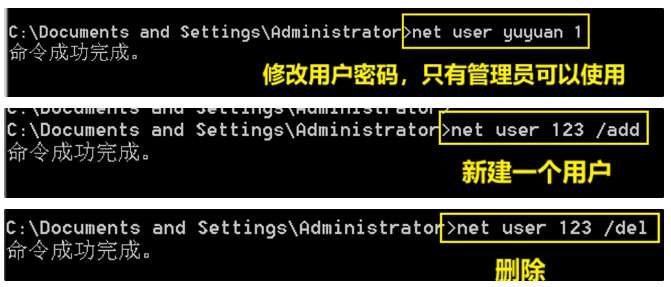
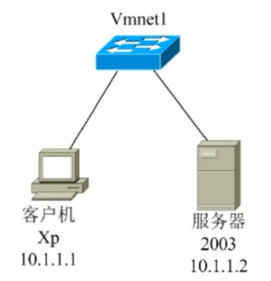
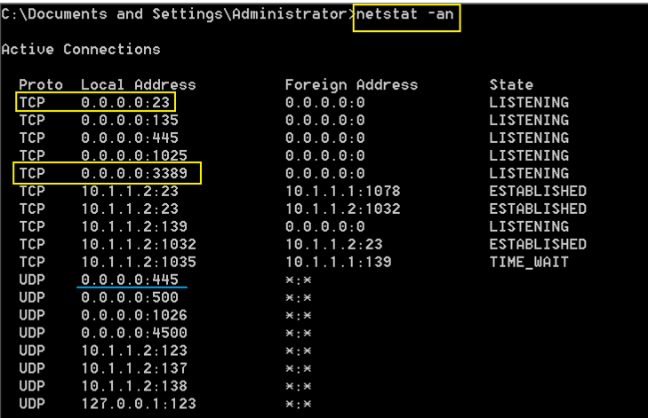
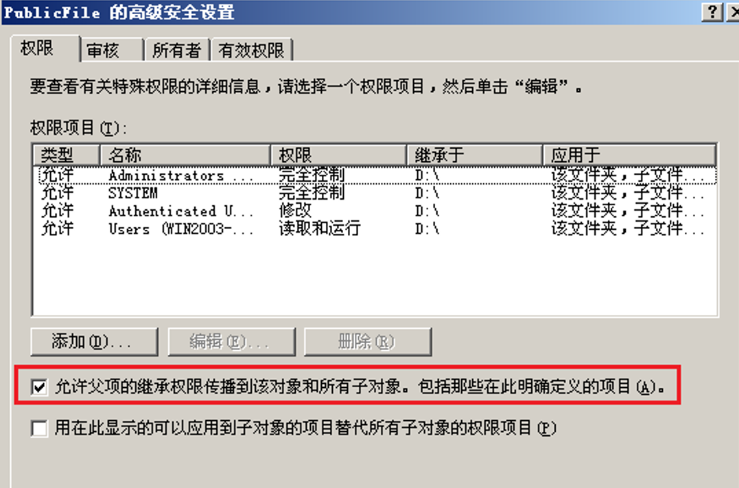
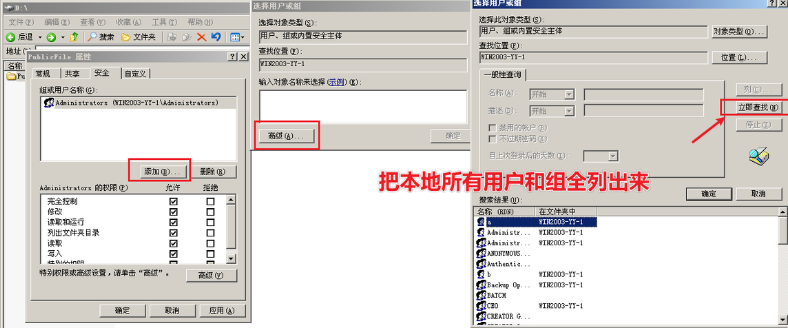
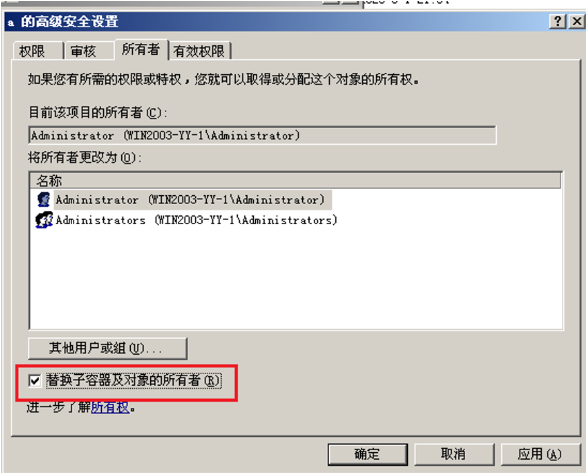
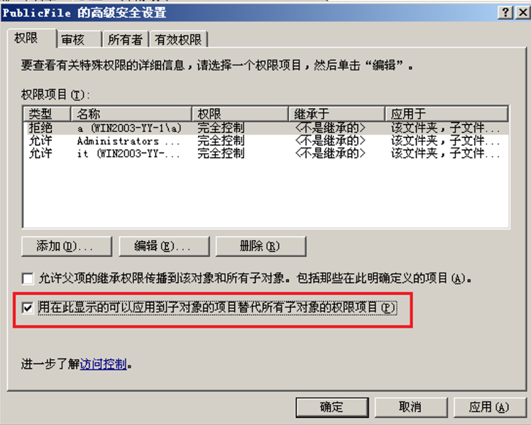

# Windows

https://cloud.tencent.com/developer/article/1937080

# 概念名词

1. **域名**   万网注册


```C++
1 什么是域名?
2 域名在哪里注册?
3 什么是二级域名 多级域名?  测试的时候多一种可能性
4 域名发现对于安全测试意义?
```

1. **DNS**


```C++
1 什么是DNS？
2 本地HOST与DNS的关系
3 CDN是什么？与DNS的关系？   //内容分布网络  缓存节点技术
  CDN主要看地点   与DNS更换无关
4 常见的DNS安全攻击有哪些？
```

1. **脚本语言**


```C++
1 常见的脚本语言类型有那些？

        asp php aspx jsp javaweb pl py cgi等
2 不同脚本类型与安全漏洞的关系？
3 漏洞挖掘代码审计与脚本类型的关系？
```

1. **后门**


```C++
1 什么是后门?有哪些后门?    //服务器后门…
2 后门在安全测试中的实际意义？  //下次方便进；管道
3 关于后门需要了解哪些？（玩法，免杀） 
```

1. **WEB**


```C++
1 WEB的组成架构模型？
        网站源码：分脚本类型，分应用方向
        操作系统： windows linux
        中间件（搭建平台）：apache iis tomcat nginx等

        数据库： access mysql oracle sybass db2 postsql等
2 架构漏洞安全测试简要介绍？
3 为什么要从WEB层面为主为首？
```

1. **WEB相关安全漏洞**


```C++
1 WEB源码类对应漏洞
        SQL注入，上传，xss，代码执行，变量覆盖，逻辑漏洞，反序列化等
2 WEB中间件对应漏洞
3 WEB数据库对应漏洞
4 WEB系统曾对应漏洞
5 其他第三方对应漏洞
6 APP或PC应用结合类  //逆向破解
```

1. 演示案例 
    1. 多级域名的枚举查找（原理、方式）
    2. 子域名挖掘器 域名查询-域名注册 域名查询A记录
    3. DNS解析修改后分析（本地或服务）
    4. EXE后门功能及危害及类似WEB后门
    5. APP类结合WEB协议，PC类结合WEB协议

# 数据包扩展

## **HTTP/S数据包**




1 HTTP/HTTPS的具体区别？
2 HTTP简要通信过程
3 建立连接——>发送请求数据包——>返回响应数据包——>关闭连接
        1.浏览器建立与web服务器之间的连接
        2.浏览器将请求数据打包（生成请求数据包）并发送到web服务器
        3.web服务器将处理结果打包（生成相应数据包）并发送给浏览器
        4.web服务器关闭连接
4 HTTPS简要通信过程

## **Request请求数据包数据格式**

1. 请求行：请求类型/请求资源路径、协议的版本和类型
请求头：一些键值对，浏览器与web服务器之间都可以发送，特定的某种含义
空行：请求头与请求体之间用一个空行隔开
请求体：要发送的数据（一般post提交会使用）例user=123&pass=123


```C++
//请求行
请求行由三个标记组成：请求方法、请求URL和HTTP版本，他们用空格分享
例如 GET /index.html HTTP/1.1
//HTTP 规划了8种可能的请求方法：
GET：检索URL中标识资源的一个简单请求
HEAD：与GET方法相同，服务器只返回状态行和头标，并不返回请求文档
POST:服务器接受被写入客户端输出流中的数据的请求
PUT：服务器保存请求数据作为指定URL新内容的请求
DELETE：服务器删除URL中命令的资源的请求
OPTIONS：关于服务器支持的请求方法信息的请求
TRACE：web服务器反馈Http请求和其头标的请求
CONNECT：已文档化，但当前未实现的一种方法，预留做隧道处理
```


```C++
//请求头
1 HOST：主机或域名地址
2 Accept：指浏览器或其他客户可以接受的MIME文件格式。Servlet可以根据它判断并返回适当的文件格式
3 User-Agent：是客户浏览器名称
4 Host：对应网址URL中的Web名称和端口号
5 Accept-Langeuage：指出浏览器可以接受的语言种类，如en或en-us，指英语
6 connnection：用来告诉服务器是否可以维持固定的HTTP连接。http是无连接的，
                                                 HTTP/1.1使用Keep-Alive为默认值，这样，当浏览器需要多个文件时（比如一个HTML文件和相关的图形文件），
                                                 不需要每次都建立连接
7 Cookie：浏览器可以用这个属性向服务器发送Cookie，Cookie是在浏览器中寄存的小型数据体，
                                它可以记载和服务器相关的用户信息，也可以用来实现会话功能。
8 Referer：它表示产生请求的网页URL。比如从网页/icconcept/index.jsp中点击一个链接到网页/icwork/search，在向服务器发送的GET/icwork/search中的请求中，
                                 Referer是http://hostname:8080/icconcept/index.jsp。这个属性可以用来跟踪WEB请求是从什么网站来的。
9 Conten-Type：用来表名request的内容类型，可以用HttpServletRequest的getContentType（）方法取得
10 Accept-Charset：指出浏览器可以接受的字符编码。英文浏览器的默认值是ISO-8859-1
11 Accept-Encoding：指出浏览器可以接受的编码方式。编码方式不同于文件格式，它是为了压缩文件并加速文件传递速度。浏览器在接收到web响应后先解码，然后再检查文件格式。
```


```C++
//空行
最后一个请求头标之后是空行，发送回车符和退行，通知服务器以下不再有头标
```


```C++
//请求数据
使用POST传送，最常使用的是Content-Type和Content-Length头标
```

## **Response返回数据包数据格式**


```C++
一个响应由四个部分组成：状态行、相应头标、空行、响应数据
1.状态行:协议版本、数字形式的状态代码和状态描述，个元素之间以空格分隔
2.响应头标:包含服务器类型、日期、长度、内容类型等
3.空行:响应头与响应体之间用空行隔开
4.响应数据:浏览器会将实体内容中的数据取出来，生成相应的页面
HTTP响应码:
1xx:信息，请求收到，继续处理
2xx:成功，行为被成功地接受、理解和采纳
3xx:重定向，为了完成请求，必须进一步执行的动作
4xx:客户端错误
5xx:服务器错误
200存在文件
403存在文件夹
3xx均可能存在
404不存在文件及文件夹
500均可能存在
//响应头标
像请求头标一样，它们指出服务器的功能，标识出响应数据的细节。
//空行
最后一个响应头标之后是一个空行，发送回车符和退行，表明服务器以下不再有头标。
//响应数据
HTML文档和图像等
```

> Burpsuite抓包修改测试
> 敏感文件扫描工具简要实现
> 第三方检测修改实现XSS攻击
> 数据包相关检验对比(APP与直接访问)
> CTF或实际应用中部分考题解析(mozhe)


# 搭建安全扩展

涉及知识：

1. 常见搭建平台脚本启用
2. 域名IP目录解析安全问题
3. 常见文件后缀解析对应安全
4. 常见安全测试中的安全防护
5. WEB后门与用户及文件权限

IIS

# IP地址

## **一、简单局域网的构成**


```C
路由器：内网和外网
简单局域网：交换机、网线、PC
交换机：用来组件内网的局域网的设备
```

## **二、 IP地址**

32位网络编码—点分十进制          0-255

## **三、子网掩码**

局域网通信规则：在同一个局域网中，所有的IP必须在同一网段中才可以互相通信

IP地址构成：网络位+主机位

子网掩码：用来确定IP地址的网络位

255.0.0.0 255.255.0.0 255.255.255.0

子网掩码如何确认网络位：与255对应的数字为网络位，与0对应的数字为主机位

## **四、IP地址详解**

地址分类：五大类(以IP地址的第一位进行区分的)

A类：1-126       默认子网掩码：255.0.0.0

B类：128-191    默认子网掩码：255.255.0.0

C类：192-223    默认子网掩码：255.255.255.0

D类：224-239    组播地址

E类：240-254     科研项目

只能使用A B C类   对应的子网掩码可以修改


```C
10.1.1.1
255.255.255.0
问：10.1.1.1 属于哪个网段？所在网段有多少个可用的IP地址？该网段的广播地址?
答：属于10.1.1.0   //主机位要置零
                254个可用的IP地址,可用地址范围：10.1.1.1-10.1.1.254    //主机位不能全为0，也不能全为255
                广播地址：10.1.1.255
```

## **五、网关**

**网关：一个网络的出口，Gate**

**路由器：**

# <span style="color: #FBBFBC"><mark style="background-color: #FBBFBC">DOS命令</mark></span>

1. **基本命令**


```C++
color f0    //命令
      color ?     //帮助
//改变背景及字体颜色 
cls         //清屏
ipconfig    //查看本机ip
ctrl+c      //终止一直在运行的命令
```

1. **目录相关命令**


```Shell
dir    //浏览当前文件夹的内容，带<dir>标识的为文件夹，否则为文件
      其他用法
md 目录名（文件夹）    //创建目录
rd 目录名（文件夹）    //删除目录
      rd  文件夹  /s /q      //无提示删除非空文件夹
相对路径：针对当前路径有效，如：..\\456
绝对路径：从根开始写路径，如：\\123\\456
```

1. **文件相关命令**


```Python
echo 字符串>>[路径\\]文件名.扩展名
//>>和>都可以将命令的输出内容输入到某文件中，若文件不存在，则同时创建该文件
type  文件名.扩展名             #浏览文件内容
type 文件名.扩展名  |more       #分页显示
copy  路径\\文件名  路径\\文件名   #拷贝文件
move  路径\\文件名  路径\\文件名   #移动文件
      del   文件名                     #删除文件（不能删除文件夹）
      del  *.txt
      del  *.*                       #删除所有文件
      del  *.*  /s  /q                #无提示删除所有文件
md                              #创建目录
      rd  /s /q 盘符名:\\文件夹名      #删除目录
      cd ..\\                          #跳转目录
fsutil file createnew c:\\windows\\system.ini 4096000  #快速生成一个空文件夹
assoc .txt=exefile              #修改关联
echo 字符串  >[路径\\]文件名.扩展名  #创建一句字符文件
      copy con 文件名.扩展名              #创建多句文件
ren  旧名 新名                  #修改文件名称
attrib 文件名 +s +h             #隐藏文件
```

1. **cd命令**


```Bash
D:      #进入D盘
cd /？  #获取使用帮助
cd \\    #跳转到硬盘的根目录
cd c:\\windows    #跳转到当前硬盘其他文件夹
cd /d e:\\software #跳转到其他硬盘的其他文件夹，必须加/d参数，否则无法跳转
cd..     #跳转到上一层目录
dir      #查看当前目录下的文件
```

1. **辅助符号或命令**


```Bash
重定向符号
     '1>'  正确输出
     '2>'  错误输出
     '>>'  追加
     '>'   覆盖
     例 echo hello >c:\\1.txt  #1.txt的文件内容先被清空，然后写入hello
              echo hello >>c:\\1.txt #在1.txt文件末尾加上hello
     '<'   #
     '<<'

     cmd << text     #从命令行读取输入，直到一个与text相同的行结束
'|'   #代表前一个的输出代表后一个的输入
      netstat  -ano|find "192.168.0.1"
```

1. **定时**


```Python
shutdown -s -f -t  秒 -c ""
shutdown -s -t 秒         #定时关机
shutdown -s -f -t 秒      #定时强制关机
shutdown -r -t 秒         #定时重启，同时加上
shutdown -a               #取消定时
shutdown -l               #注销，同logoff命令
```

# **快捷键**


```C
win+E                 打开文件管器
win+D                 显示桌面
win+L                 锁计算机
alt+F4                关闭当前程序
ctrl+shift+Esc        打开任务管理器（或者ctrl+alt+delete）
ctrl+F                在一个文本或者网页里面查找，相当实用（退出一般按ESC）
ctrl+A                选中所有文本
```

1. **批处理编写**

批处理作用：自上而下成批地处理每一条命令，直到执行最后一条

创建批处理：txt文件扩展名改为.bat

基本语法


```C
@echo off      //关闭回显
color 0a
title          //标题
pause          //暂停
：             //定义标签名
goto           //实现跳转
```


```Python
#set设置变量，常用于在脚本中的互动赋值
set /p time = 请输入时间：  #互动赋值
 %time%                     #引用变量
userprofile   #用户变量
用%userprofile%取值
```


```Python
#案例
@echo off
color ff
:menu
cls
echo ==================
echo        MENU
echo     1.TimedOver
echo     2.Cancel
echo     3.Esc
echo ==================
set /p num=your choose:
if "%num%"=="1" goto 1
if "%num%"=="2" goto 2
if "%num%"=="3" goto 3
echo only 1,2,3 can be put.
pause
goto menu
:1
set /p a=please put the time(s):
shutdown -s -f -t %a%
goto menu
:2
shutdown -a
:3
exit
```

1. **路径有特殊符号时，用双引号**


```C
ntsd  -c q -pn winlogon.exe       //强制杀死指定进程
                                  //针对xp或windows server 2003
taskkill /im explorer.exe /f 
```

# 用户和组

## **一、服务器系统版本介绍**

1. windows服务器系统：win2000 win2003 win2008 win2012
2. Linux服务器系统：Redhat Centos

## **二、用户管理**

### **用户概述**

* 每一个用户登录系统后，拥有不同的操作权限
* 每个账户有自己唯一的SID（安全标识符）
  S-1-5-21-426206823-2579496042-14852678-500 
  S-1-5-21-426206823-2579496042-14852678

用户UID：500       前面是系统ID 

windows系统管理员administrator的UID是500 

root的uid是0，普通用户从1000开始

* 不同的账户有不同的权限，赋权限是给不同用户的SID赋权限
* 查看SID值：**whoami/user**
* <span style="color: #C7D5F6"><mark style="background-color: #C7D5F6">**账户密码存储的位置：c:\windows\system32\config\SAM**</mark></span><span style="color: #C7D5F6"><mark style="background-color: #C7D5F6">   #暴力破解</mark></span>     hash算法（不可逆算法）
* **默认密码最长有效期42天**

### **内置账户**

* 给人使用的账户：
  administrator       #管理员账户
  guest                    #来宾账户
* 计算机服务组件相关的系统账号
  system                  #系统账户        ==权限至高无上
  local services        #本地服务账户 ==权限等于普通
  network services   #网络服务账户 ==权限等于普通
* 配置文件
* 每个用户都有自己的配置文件（家目录），在用户第一次登录时产生，路径：

win7/win2008    c:\用户

xp/win2003        c:\Documents and Settings\

* 用户配置命令



### **组管理**

1. 组概述
2. 组的作用：简化权限的赋予
3. 赋权限的方式：
4. 1）用户—组—赋权限
5. 2）用户—赋权限
6. 内置组：
7. 内置组的权限默认已经被系统赋予


```C
1  administrators       #管理员组
2  guests               #来宾组
3  users                #普通用户组，默认新成员
4  network              #网络配置组
5  print                #打印机
6  Remote Desktop       #远程桌面组
```

### **用户管理命令**


```C
net user                        #查看用户列表
net user 用户名 密码            #改密码
net user 用户名 密码  /add      #创建一个新用户
net user 用户名 密码  /del      #删除一个用户
net user 用户名 /active:yes/no  #激活或禁用账户
```

# 服务器远程管理

## **一、远程管理类型**

windows远程管理有两种类型：

1. 远程桌面（图形）
2. telnet（命令行）

## **二、远程桌面**

### **拓扑图**



### 步骤


```PlainText
首先将配置网络，并实现客户机与服务器可以互通。
服务器开启允许被远程控制：桌面右键属性——远程设置——选择允许——确定
客户机上：开始——运行——输入mstsc打开远程连接工具
在mstsc工具上输入服务器的IP并点击确定
输入服务器的账号及密码

注意：如使用非管理员账户登录远程，需要在服务器上将用户加入到远程桌面内置组Remote Desktop Users
```

## **三、telnet**


```C
services.msc
把Telnet设置为自动启动
netstat -an     //查看本机开放的所有端口
telnet：23
远程桌面协议RDP：3389
```



## 四、**破解系统密码**

### **连按五次shift**

### **利用PE**

* 工具：微型维修操作系统、U深度
* 步骤：
  1. 进BIOS —— BOOT
  1. F10 对BIOS保存
  1. 运行winPE系统维修

### **远程爆破**

<span style="color: #D4C1F3"><mark style="background-color: #D4C1F3">Nmap</mark></span><span style="color: #D4C1F3"><mark style="background-color: #D4C1F3">、</mark></span><span style="color: #D4C1F3"><mark style="background-color: #D4C1F3">NTscan、Hydra</mark></span>

### **本地破解**


```PlainText
<mark style="background-color: #D4C1F3">Getpass</mark>//**——win7 winxp，**从内存中提取密码
```

### **本地暴力破解**


```PlainText
**saminside****pwdump   //读取SAM中的哈希值**
```

管理员打开


目前使用最新的NT hash值，LM哈希值已被弃用

右键标记——复制hash值——新建hash.txt   （可以随便找个网站破解）

**SAM文件里用户的格式：**

用户名  用户RID LM哈希 NT哈希

# NTFS安全权限

## **一、NTFS权限概述**

---

1. 通过设置NTFS权限，实现不同用户(文件和文件夹)访问不同的权限
2. 分配了正确的访问权限后，用户才能访问其资源
3. 设置权限防止资源被篡改、删除

## **二、文件系统概述**

---

文件系统即在外部存储设备上组织文件的方法

常见的文件系统


```C
FAT  windows
NTFS windows
EXT  linux常见
```

## **三、NTFS文件系统特点**

---

1. 提高磁盘读写性能
2. 可靠性
    1. 加密文件系统
    2. 访问控制列表（ACL）（设置权限）
3. 磁盘利用率
    1. 压缩
    2. 磁盘配额
4. 支持单个文件大于4个G

## **四、修改NTFS权限**

---

### **取消权限继承**

作用：取消后可以任意修改权限列表

方法：文件夹右键属性——安全——高级——去掉第一个对勾——选择复制





### **文件权限**

**1）完全控制**：允许用户对文件夹、子文件夹、文件进行全权控制，例如修改资源、修改资源的所有者、删除资源、移动资源等操作，拥有完全控制就相当于拥有了其他全部权限。

**2）修改**：允许用户修改和删除资源，同时拥有写入和读取运行的权限。

**3）读取和运行**：允许用户读取文件夹和子文件夹内容并列出内容的权限。

**4）列出文件夹内容**：允许用户查看资源中的文件夹和子文件夹的内容。

**5）读取**：允许用户查看文件夹中的文件和子文件夹，并且能够查看属性、所有者等权限。

**6）写入**：允许用户在文件夹里创建子文件夹或新建文件，也可以改变文件夹属性等。

### **权限累加**

当用户同时属于多个组时，权限是累加的

### **拒绝最大**

只允许累加允许

### **取得所有权**



### **强制继承权**

作用：对于



1. **文件复制对权限的影响**

复制：文件复制后，文件权限会被目标文件权限覆盖

剪切：跨分区覆盖，同分区保留

# 文件共享服务器

## **一、共享服务器概述**

<span style="color: #C7D5F6">**cifs-微软：**</span>通过网络提供文件共享服务，提供文件下载和上传

## **二、创建共享**

本地登录：仅NTFS权限影响

远程登录：受到共享权限和本地NTFS权限共同影响，取交集

保证总文件夹可以进入

## **三、访问共享**


```C
在开始运行/我的电脑地址栏中，输入UNC地址：
\\\\文件共享服务器IP
\\\\文件共享服务器IP\\共享名
```

## **四、创建隐藏的共享**


```C++
方法：共享名$
```

## **五、访问隐藏的共享**


```C++
\\服务器IP\\共享名$
```

## **六、共享相关命令**


```C++
net share               #列出共享列表
net share 共享名 /del   #删除共享
```

## **七、屏蔽系统隐藏共享自动产生**

1. **打开注册表**

打开注册表编辑器**regedit**

1. **定位共享注册表位置**
    
```PlainText
计算机\HKEY_LOCAL_MACHINE\SYSTEM\CurrentControlSet\Services\LanmanServer\Parameters
```


右键新建REG_DWORD类型的AutoShareServer键，值为0

# **八、查看本地网络连接状态**


```PlainText
netstat -an
4456
```

## **九、关闭445服务**

可以通过关闭445端口来屏蔽病毒传入（如勒索病毒等）

方法1：打开services.msc，并停止及禁用server服务

方法2：禁止被访问445，配置高级安全防火墙入站规则（在win7及以上系统，win20008及以上系统）

