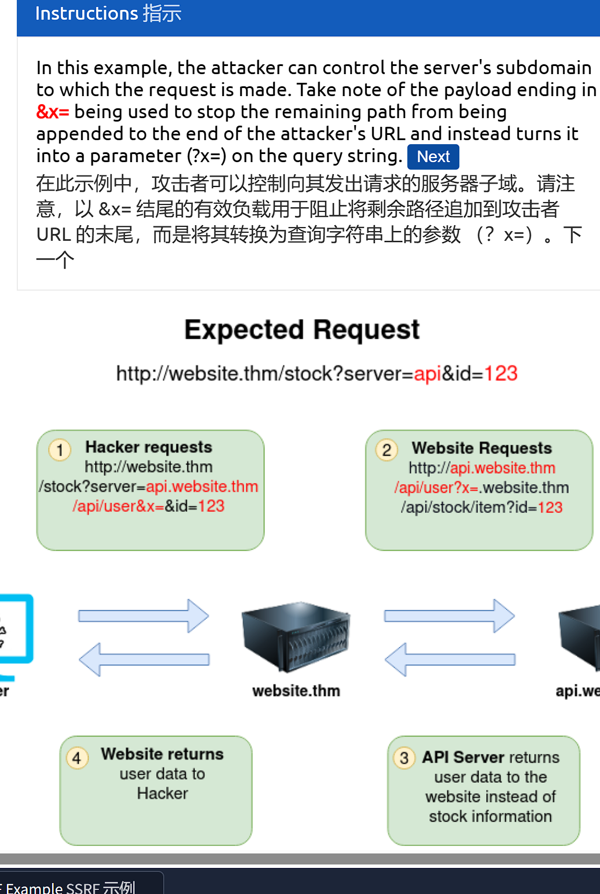

# Web Hacking

浏览器开发者工具

# SSRF漏洞

Server-slide request forgery 服务端请求伪造漏洞

* Regular SSRF 
* Blind SSRF



# SQL注入

## 概念

Structured Query language 结构化查询语言

### SQL基础语句

#### select语句


```SQL
select * from users;  --接收users表中所有列
select username,password from users;    //
select * from users LIMIT 1;   --强制只返回一行数据
select * from users LIMIT n，m;    --强制查询跳过前n个结果，返回m行
select * from users where username='admin'; --匹配固定数据
select * from users where username != 'admin';
select * from users where username='admin' or username='jon';
select * from users where username='admin' and password='p4ssword';

select * from users where username like 'a%'; --指定以a开头的数据
select * from users where username like '%n'; --指定以n结尾的数据
select * from users where username like '%mi%'; --返回包含mi字符的任何行
```

#### UNION语句


```SQL
--将两个表中的结果放入一个表中
SELECT name,address,city,postcode from customers UNION SELECT company,address,city,postcode from suppliers;
```

#### INSERT语句


```SQL
--在表中插入一行新数据
insert into users (username,password) values ('bob','password123');
```

#### UODATE语句


```SQL
--更新表中的一行或多行数据
update users SET username='root',password='pass123' where username='admin';
```

#### delete语句

查询格式与select语句类似


```SQL
delete from users where username='martin';
delete from users;
```

**group_concat()** : 从多个返回的行中获取指定的列

information_schema 数据库：每个用户都可以访问，包含有关用户有权访问的所有数据库和表的信息`information_schema`是MySQL等关系数据库中的一个特殊数据库，它存储了关于数据库的元数据（比如表名、列名等）

1. SCHEMATA: 列出了数据库实例中的所有数据库（schema）信息。
2. TABLES: 提供了关于数据库中所有表的信息，包括表名、表类型、引擎类型、创建时间等。通过此表，可以知道哪个表属于哪个数据库。
3. COLUMNS: 包含了所有表的列信息，如列名、数据类型、是否可空、列的默认值等。
4. VIEWS: 提供了数据库中视图的元数据。
5. STATISTICS: 存储了表索引的相关统计信息。
6. KEY_COLUMN_USAGE: 描述了哪些列被用作外键或唯一键约束。
7. ROUTINES: 列出了存储过程和函数的信息。
8. TRIGGERS: 提供了触发器的详细信息。
9. PARTITIONS: 如果表被分区，此表会提供分区信息。
10. PARAMETERS: 对于存储过程和函数中的参数，此表提供了详细的描述。

### SQL注入

用户提供的数据包含SQL查询语句时，web应用程序的使用SQL的地方转变为SQL注入

请求url：https://website.thm/blog?id=2;--

sql语句：SELECT * from blog where id=2;-- and private=0 LIMIT 1;

<span style="color: #C0ECBC"><mark style="background-color: #C0ECBC">；表示SQL语句结束  --之后内容为注释</mark></span>

### In-Band  SQLi 带内

将数据从数据库提取到同一页面

* Error-Based <u>SQL</u> Injection 基于错误的 SQL 注入

对于轻松获取有关数据库结构的信息最有用，来自数据库的错误消息直接打印到浏览器屏幕。通常可用于枚举整个数据库

* Union-Based <u>SQL</u> Injection 基于联合的 SQL 注入
  利用 SQL UNION 运算符和 SELECT 语句将其他结果返回到页面。此方法是通过 SQL 注入漏洞提取大量数据的最常见方法

### Blind  盲注

### Out-of-Band  带外通信


